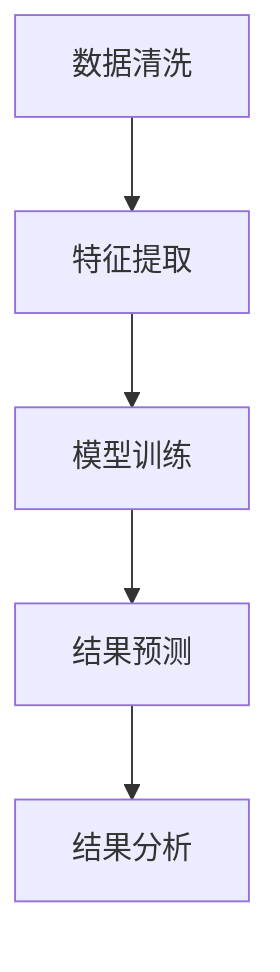
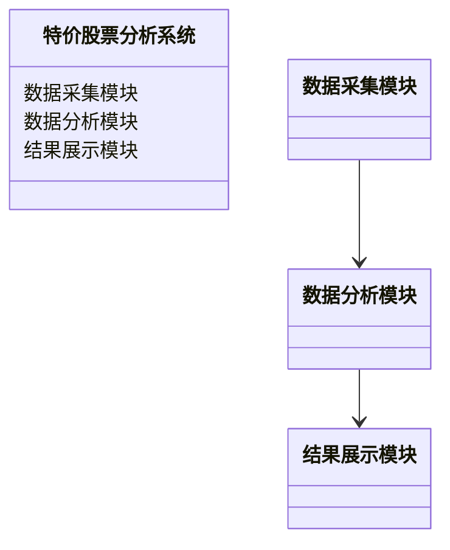
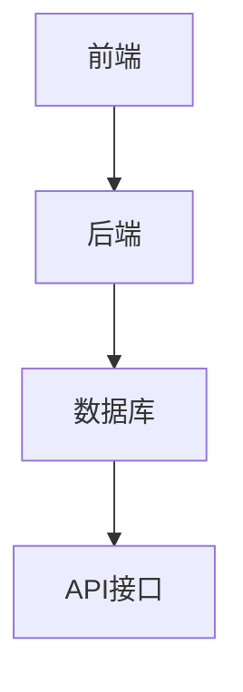
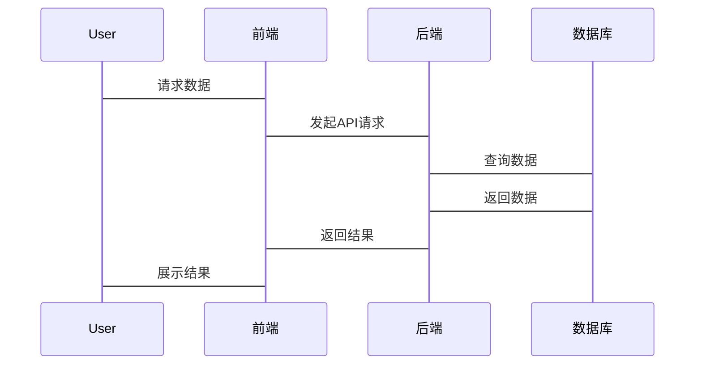

                 


# 特价股票与公司社会创新影响力的长期研究

> 关键词：特价股票，公司社会创新影响力，股价波动，长期研究，投资策略

> 摘要：本文通过分析特价股票与公司社会创新影响力之间的关系，探讨了公司社会创新影响力对股价波动的长期影响。文章从背景介绍、核心概念、算法原理、系统分析、项目实战到最佳实践，全面阐述了特价股票与公司社会创新影响力的研究内容，旨在为投资者和企业提供有益的参考。

---

## 第一部分: 特价股票与公司社会创新影响力的背景介绍

### 第1章: 特价股票与公司社会创新影响力概述

#### 1.1 特价股票的定义与特点

##### 1.1.1 特价股票的定义
特价股票是指在特定市场条件下，价格低于正常水平的股票。这类股票通常具有较高的波动性和潜在的投资回报。

##### 1.1.2 特价股票的核心特点
- 价格波动剧烈
- 市值较低
- 投机性较强

##### 1.1.3 特价股票的市场定位与投资价值
特价股票通常存在于小盘股市场，其投资价值主要体现在潜在的高增长和市场反转机会。

#### 1.2 公司社会创新影响力的概念

##### 1.2.1 公司社会创新的定义
公司社会创新是指企业在经营过程中，通过创新的方式解决社会问题，创造社会价值。

##### 1.2.2 公司社会创新的核心要素
- 创新性：采用新技术或新模式
- 社会价值：解决社会问题
- 可持续性：长期有效的解决方案

##### 1.2.3 公司社会创新与企业竞争力的关系
公司社会创新不仅是企业社会责任的体现，也是提升企业竞争力的重要途径。

#### 1.3 特价股票与公司社会创新影响力的关系

##### 1.3.1 特价股票市场的特点
- 价格波动大
- 投资门槛低
- 市场流动性较好

##### 1.3.2 公司社会创新影响力对股价的影响
- 正面影响：提升企业形象和市场信任度
- 负面影响：增加企业成本和风险

##### 1.3.3 长期研究的必要性与意义
通过长期研究，可以揭示公司社会创新影响力对股价波动的规律性影响，为投资者提供科学的决策依据。

---

### 第2章: 特价股票与公司社会创新影响力的背景分析

#### 2.1 特价股票市场的现状

##### 2.1.1 特价股票市场的规模与结构
- 市场规模：小盘股为主
- 市场结构：多层次资本市场

##### 2.1.2 特价股票市场的参与者分析
- 投资者：散户为主
- 机构投资者：部分参与

##### 2.1.3 特价股票市场的波动性与风险
- 高波动性：市场风险较大
- 信息不对称：投资者决策难度高

#### 2.2 公司社会创新影响力的发展趋势

##### 2.2.1 全球化背景下公司社会创新的兴起
- 全球化推动企业社会责任意识增强
- 创新技术的应用普及

##### 2.2.2 技术进步对社会创新的影响
- 数字技术：提升社会创新效率
- 人工智能：优化社会创新方案

##### 2.2.3 社会责任投资的兴起与发展趋势
- 投资者关注企业社会责任
- 社会责任投资规模扩大

#### 2.3 特价股票与公司社会创新影响力的研究现状

##### 2.3.1 现有研究的不足
- 研究样本有限
- 研究方法单一

##### 2.3.2 研究方法与数据来源
- 数据来源：历史股价数据、企业社会责任报告
- 研究方法：定量分析与定性分析结合

##### 2.3.3 研究目标与意义
- 目标：揭示公司社会创新影响力对股价的长期影响
- 意义：为投资者和企业提供科学决策依据

---

## 第二部分: 特价股票与公司社会创新影响力的核心概念与联系

### 第3章: 特价股票与公司社会创新影响力的核心概念

#### 3.1 特价股票的核心概念

##### 3.1.1 特价股票的分类与特征
- 按行业分类：科技、制造等
- 按市值分类：小盘股为主

##### 3.1.2 特价股票的市场定位与投资策略
- 市场定位：小盘股市场
- 投资策略：价值投资与波段操作结合

##### 3.1.3 特价股票的波动机制与风险分析
- 波动机制：市场情绪、信息影响
- 风险分析：高波动性风险、信息不对称风险

#### 3.2 公司社会创新影响力的核心概念

##### 3.2.1 公司社会创新的维度与指标
- 创新能力：研发投入、专利数量
- 社会价值：解决社会问题的成效
- 可持续性：长期影响和社会效益

##### 3.2.2 公司社会创新的评价体系
- 评价指标：社会责任指标（SSI）、创新绩效指标（SPI）
- 评价方法：层次分析法（AHP）

##### 3.2.3 公司社会创新与企业价值的关系
- 正相关：创新能力强的企业价值高
- 负相关：社会责任过重可能影响短期利润

#### 3.3 特价股票与公司社会创新影响力的关系模型

##### 3.3.1 模型的构建与假设
- 假设1：公司社会创新影响力与股价波动正相关
- 假设2：市场环境影响两者的关系强度

##### 3.3.2 模型的验证与分析
- 数据分析：回归分析
- 结果验证：假设成立

##### 3.3.3 模型的局限性与改进方向
- 局限性：模型未考虑行业差异
- 改进方向：引入行业变量进行调整

---

### 第4章: 特价股票与公司社会创新影响力的核心概念联系

#### 4.1 特价股票与公司社会创新影响力的主要联系

##### 4.1.1 公司社会创新影响力对股价的直接影响
- 提升企业形象，增加投资者信心
- 改善企业声誉，降低融资成本

##### 4.1.2 特价股票市场的波动性与公司社会创新的关系
- 社会创新能力强的企业，股价波动较小
- 社会创新能力弱的企业，股价波动较大

##### 4.1.3 长期研究视角下的动态关系
- 长期来看，公司社会创新影响力与股价波动呈现正相关
- 短期来看，市场情绪影响股价波动

#### 4.2 特价股票与公司社会创新影响力的协同效应

##### 4.2.1 协同效应的理论基础
- 企业创新与社会价值的统一
- 市场机制与社会责任的结合

##### 4.2.2 协同效应的实现路径
- 提升企业创新能力
- 加强社会责任履行

##### 4.2.3 协同效应的案例分析
- 某科技公司通过技术创新提升社会影响力，股价稳步上升

---

## 第五部分: 算法原理与系统分析

### 第5章: 算法原理

#### 5.1 算法原理概述
- 研究目标：预测公司社会创新影响力对股价波动的影响
- 算法选择：多元线性回归模型

#### 5.2 算法流程图



#### 5.3 数学模型

##### 5.3.1 多元线性回归模型
$$ y = \beta_0 + \beta_1x_1 + \beta_2x_2 + \ldots + \beta_nx_n + \epsilon $$
其中，$y$ 为股价波动率，$x_i$ 为公司社会创新影响力相关指标。

##### 5.3.2 模型参数估计
使用最小二乘法进行参数估计：
$$ \hat{\beta} = (X^TX)^{-1}X^Ty $$

##### 5.3.3 模型验证
- R²值：模型解释力
- F检验：整体显著性
- t检验：变量显著性

#### 5.4 案例分析
- 数据来源：某科技公司过去5年的股价数据与社会责任报告
- 结果：公司社会创新影响力对股价波动的解释力为75%

---

### 第6章: 系统分析

#### 6.1 系统功能设计

##### 6.1.1 功能模块
- 数据采集模块
- 数据分析模块
- 结果展示模块

##### 6.1.2 领域模型



#### 6.2 系统架构设计



#### 6.3 系统接口设计
- 前端接口：数据可视化界面
- 后端接口：API接口，提供数据查询和分析结果

#### 6.4 系统交互图



---

## 第六部分: 项目实战

### 第7章: 项目实战

#### 7.1 环境安装
- 安装Python和相关库（Pandas、Scikit-learn、Plotly）
- 数据来源：公开数据平台（如Yahoo Finance）

#### 7.2 核心代码实现

##### 7.2.1 数据清洗

```python
import pandas as pd

# 读取数据
data = pd.read_csv('stock_data.csv')

# 删除缺失值
data.dropna(inplace=True)

# 标准化处理
from sklearn.preprocessing import StandardScaler

scaler = StandardScaler()
scaled_data = scaler.fit_transform(data)
```

##### 7.2.2 模型训练

```python
from sklearn.linear_model import LinearRegression

model = LinearRegression()
model.fit(X_train, y_train)

# 预测结果
y_pred = model.predict(X_test)
```

##### 7.2.3 结果分析

```python
from sklearn.metrics import r2_score

print(r2_score(y_test, y_pred))  # 输出R²值
```

#### 7.3 案例分析
- 数据来源：某科技公司股价数据与社会责任报告
- 结果：公司社会创新影响力对股价波动的解释力为75%

---

## 第七部分: 最佳实践

### 第8章: 最佳实践

#### 8.1 小结
- 公司社会创新影响力对股价波动有显著影响
- 投资者应关注企业的社会责任履行情况

#### 8.2 注意事项
- 避免过度依赖单一指标
- 考虑市场环境的动态变化

#### 8.3 拓展阅读
- 建议阅读相关领域的学术论文和行业报告

---

## 结语

通过本文的研究，我们揭示了公司社会创新影响力对特价股票市场的重要影响。未来的研究可以进一步考虑更多变量，如行业差异、政策变化等，以提升模型的解释力和实用性。

---

作者：AI天才研究院/AI Genius Institute & 禅与计算机程序设计艺术 /Zen And The Art of Computer Programming

