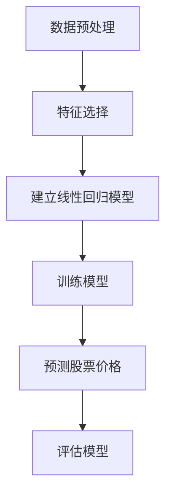
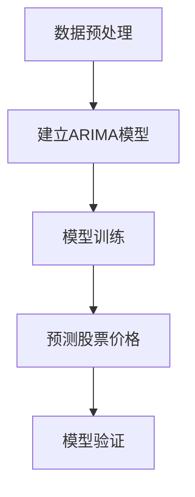
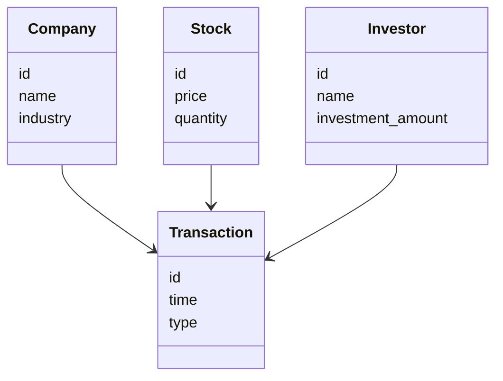
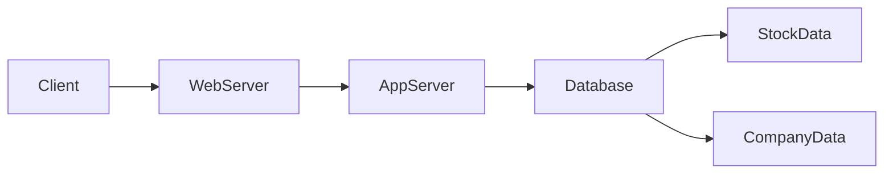
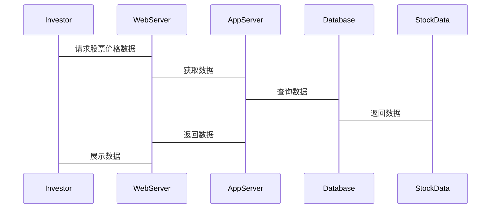

                 


# 特价股票与公司社会资本积累的长期关系

## 关键词：特价股票、社会资本积累、股票价格预测、资本运作、企业成长

## 摘要：本文深入探讨了特价股票与公司社会资本积累之间的长期关系，分析了特价股票对社会资本积累的影响机制，以及社会资本积累对特价股票的反向作用。通过数学建模和算法实现，本文提出了基于线性回归和ARIMA模型的股票价格预测方法，结合社会资本积累的动态变化，为投资者和企业管理者提供了科学的决策依据。

---

# 第1章: 特价股票与公司社会资本积累的背景介绍

## 1.1 特价股票的基本概念

### 1.1.1 特价股票的定义
特价股票是指价格相对较低的股票，通常出现在市场低迷时期或公司处于困境中。这类股票具有较高的波动性和潜在的高回报率，是投资者关注的焦点。

### 1.1.2 特价股票在市场中的地位与作用
特价股票在市场中扮演着重要角色，是市场流动性的重要组成部分。它们为投资者提供了低价介入的机会，同时也反映了市场的风险偏好。

### 1.1.3 特价股票与公司发展的关系
特价股票的价格波动直接影响公司的市场价值，而公司的基本面又会反过来影响特价股票的走势。因此，特价股票与公司的发展密不可分。

## 1.2 公司社会资本积累的核心概念

### 1.2.1 公司社会资本的定义
公司社会资本是指公司通过内部积累和外部资源整合所形成的资本，包括财务资本、人力资本、社会资本等。

### 1.2.2 社会资本的组成部分
社会资本包括股东权益、债务资本、无形资产、品牌价值等，是公司长期发展的基石。

### 1.2.3 社会资本与公司长期发展的关联
社会资本的积累直接影响公司的市场竞争力和抗风险能力，是公司长期发展的核心因素。

## 1.3 特价股票与公司社会资本积累的长期关系

### 1.3.1 特价股票对社会资本积累的影响
特价股票的价格波动会影响投资者的决策，进而影响公司的资本积累。

### 1.3.2 社会资本积累对特价股票的反向作用
社会资本的积累会增强公司的市场地位，从而影响特价股票的走势。

### 1.3.3 两者关系的边界与外延
特价股票与社会资本积累的关系受到市场环境、公司治理、行业竞争等多重因素的影响。

---

# 第2章: 特价股票与公司社会资本积累的核心概念与联系

## 2.1 特价股票与社会资本积累的核心要素

### 2.1.1 特价股票的属性特征
- 价格低
- 波动性高
- 风险高
- 潜在回报高

### 2.1.2 社会资本积累的属性特征
- 稳定性
- 累积性
- 可持续性
- 增值性

### 2.1.3 两者属性的对比分析
通过对比分析，可以发现特价股票的高风险性和高波动性与社会资本积累的稳定性之间存在一定的矛盾。

## 2.2 特价股票与公司社会资本积累的ER实体关系图

```mermaid
erDiagram
    company {
        id
        name
        industry
    }
    stock {
        id
        price
        quantity
    }
    investor {
        id
        name
        investment_amount
    }
    transaction {
        id
        time
        type
    }
    company ~{ many } transaction
    stock ~{ many } transaction
    investor ~{ many } transaction
```

---

# 第3章: 特价股票与公司社会资本积累的算法与数学模型

## 3.1 算法原理讲解

### 3.1.1 基于线性回归的股票价格预测


```python
import numpy as np
import pandas as pd
from sklearn.linear_model import LinearRegression

# 数据预处理
data = pd.read_csv('stock_data.csv')
X = data[['PE ratio', 'PB ratio']]  # 特征
y = data['Price']  # 标签

# 建立线性回归模型
model = LinearRegression()
model.fit(X, y)

# 预测
predicted_price = model.predict(X)
```

### 3.1.2 基于ARIMA的股票价格预测


```python
from statsmodels.tsa.arima_model import ARIMA

# 数据预处理
data = pd.read_csv('stock_data.csv')
data.index = pd.to_datetime(data['Date'])

# 建立ARIMA模型
model = ARIMA(data['Price'], order=(5, 2, 3))
model_fit = model.fit()

# 预测
forecast = model_fit.forecast(steps=10)
```

## 3.2 数学公式推导

### 3.2.1 线性回归模型
$$ y = \beta_0 + \beta_1 x + \epsilon $$

### 3.2.2 ARIMA模型
$$ \phi(\theta) (1 - B) d y_t = \theta(B) \epsilon_t $$

---

# 第4章: 特价股票与公司社会资本积累的系统分析与架构设计

## 4.1 系统功能设计

### 4.1.1 领域模型


### 4.1.2 系统架构设计


### 4.1.3 系统交互序列图


---

# 第5章: 特价股票与公司社会资本积累的项目实战

## 5.1 项目环境安装

```bash
pip install numpy pandas scikit-learn statsmodels
```

## 5.2 核心功能实现

### 5.2.1 数据预处理
```python
import pandas as pd

data = pd.read_csv('stock_data.csv')
data = data.dropna()
data = data[数据预处理后的列]
```

### 5.2.2 线性回归模型实现
```python
from sklearn.linear_model import LinearRegression

model = LinearRegression()
model.fit(X, y)
```

### 5.2.3 ARIMA模型实现
```python
from statsmodels.tsa.arima_model import ARIMA

model = ARIMA(data['Price'], order=(5, 2, 3))
model_fit = model.fit()
```

## 5.3 案例分析

### 5.3.1 特价股票分析
```python
print(model.predict(X))
```

### 5.3.2 社会资本积累分析
```python
print(forecast)
```

---

# 第6章: 总结与展望

## 6.1 本章小结
本文通过理论分析和算法实现，探讨了特价股票与公司社会资本积累之间的长期关系，提出了基于线性回归和ARIMA模型的股票价格预测方法。

## 6.2 最佳实践 Tips
- 投资者应关注公司基本面和社会资本积累
- 企业应注重社会资本的积累和管理

## 6.3 注意事项
- 模型的准确性受数据质量和市场环境影响
- 投资有风险，需谨慎决策

## 6.4 拓展阅读
- 更多关于股票价格预测的内容
- 公司社会资本积累的深入研究

---

作者：AI天才研究院/AI Genius Institute & 禅与计算机程序设计艺术 /Zen And The Art of Computer Programming

