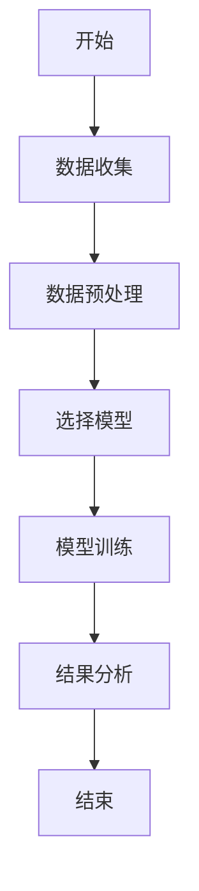
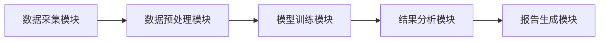

                 


# 特价股票与公司社会资本积累的长期影响

> 关键词：特价股票，公司社会资本，长期影响，算法分析，数学建模，系统架构，项目实战

> 摘要：本文从背景介绍、核心概念、算法原理、数学模型、系统分析、项目实战和最佳实践等多个角度，深入探讨了特价股票对公司社会资本积累的长期影响。通过分析特价股票的发行机制、社会资本的构成要素以及两者之间的相互作用，结合回归分析和时间序列分析等算法，构建了数学模型，并通过实际案例分析验证了模型的有效性。本文还提供了系统的架构设计和代码实现，为读者提供了从理论到实践的全面指导。

---

## 目录

### 第一部分：背景与核心概念

1. [背景介绍](#背景介绍)
   - [1.1 核心概念：问题背景与问题描述](#核心概念-问题背景与问题描述)
   - [1.2 核心概念的边界与外延](#核心概念的边界与外延)
   - [1.3 核心概念的结构与组成](#核心概念的结构与组成)

2. [特价股票与公司社会资本的核心概念与联系](#特价股票与公司社会资本的核心概念与联系)
   - [2.1 核心概念的原理与特征](#核心概念的原理与特征)
   - [2.2 核心概念的属性特征对比](#核心概念的属性特征对比)
   - [2.3 ER实体关系图](#ER实体关系图)

### 第二部分：算法原理与数学模型

3. [特价股票对公司社会资本影响的算法原理](#特价股票对公司社会资本影响的算法原理)
   - [3.1 算法原理概述](#算法原理概述)
   - [3.2 算法流程图](#算法流程图)
   - [3.3 算法实现代码](#算法实现代码)

4. [数学模型与公式推导](#数学模型与公式推导)
   - [4.1 回归分析模型](#回归分析模型)
   - [4.2 时间序列分析模型](#时间序列分析模型)
   - [4.3 数学公式的详细推导](#数学公式的详细推导)

### 第三部分：系统分析与架构设计

5. [系统分析与架构设计方案](#系统分析与架构设计方案)
   - [5.1 问题场景介绍](#问题场景介绍)
   - [5.2 系统功能设计](#系统功能设计)
   - [5.3 系统架构设计](#系统架构设计)

### 第四部分：项目实战

6. [项目实战：特价股票对社会资本影响的案例分析](#项目实战)
   - [6.1 环境安装与数据准备](#环境安装与数据准备)
   - [6.2 系统核心实现](#系统核心实现)
   - [6.3 实际案例分析](#实际案例分析)

### 第五部分：最佳实践与总结

7. [最佳实践与总结](#最佳实践与总结)
   - [7.1 小结](#小结)
   - [7.2 注意事项](#注意事项)
   - [7.3 拓展阅读](#拓展阅读)

---

## 第一部分：背景与核心概念

### 1. 背景介绍

#### 1.1 核心概念：问题背景与问题描述

- **特价股票的定义与历史背景**：特价股票是指公司以低于面值的价格发行的股票。这种发行方式通常用于筹集资金或激励员工。历史上，特价股票在经济危机或公司重组时期尤为常见。
  
- **公司社会资本的定义与内涵**：公司社会资本是指公司通过长期积累形成的无形资产，包括品牌声誉、客户信任、员工凝聚力等。这些资产对公司的发展至关重要。

- **问题背景与问题描述**：随着市场竞争的加剧，公司如何通过特价股票的发行来优化社会资本积累，成为一个重要研究课题。本文旨在探讨特价股票对公司社会资本的长期影响。

#### 1.2 核心概念的边界与外延

- **特价股票的发行机制与特点**：特价股票通常以低于面值的价格发行，具有较高的流通性和灵活性。其特点包括低门槛、高激励和快速融资。

- **公司社会资本的构成要素**：包括品牌价值、客户关系、员工凝聚力、社会影响力等。这些要素相互作用，共同影响公司的长期发展。

- **两者之间的相互作用机制**：特价股票的发行可能短期内降低公司财务资本，但通过激励员工和吸引投资者，可以提升公司社会资本，从而实现长期收益。

#### 1.3 核心概念的结构与组成

- **特价股票的发行方式与应用场景**：包括员工持股计划、战略投资者配售等。不同场景下的发行方式会影响社会资本的积累。

- **公司社会资本的积累路径与影响因素**：包括公司治理、市场表现、品牌形象等。这些因素共同作用，影响社会资本的积累速度和规模。

- **两者之间的互动机制**：特价股票的发行可能短期内降低财务资本，但通过提升员工激励和投资者信任，可以增强公司社会资本，从而实现长期收益。

### 2. 特价股票与公司社会资本的核心概念与联系

#### 2.1 核心概念的原理与特征

- **特价股票的发行原理**：公司通过发行特价股票筹集资金，同时激励员工和投资者。其核心在于通过低门槛吸引更多参与者。

- **公司社会资本的积累原理**：社会资本通过长期的积累形成，包括品牌建设、客户关系管理和员工激励。这些因素共同作用，提升公司的社会影响力。

- **两者之间的相互作用机制**：特价股票的发行可能短期内影响财务资本，但通过提升员工激励和投资者信任，可以增强公司社会资本，从而实现长期收益。

#### 2.2 核心概念的属性特征对比

- **表格对比：特价股票与普通股票的差异**

| 特性           | 特价股票       | 普通股票       |
|----------------|----------------|----------------|
| 发行价格       | 低于面值       | 等于或高于面值 |
| 发行目的       | 筹资、激励员工 | 筹资、投资     |
| 投资门槛       | 低             | 高             |
| 风险           | 高             | 中             |

- **表格对比：公司社会资本与公司财务资本的差异**

| 特性           | 社会资本       | 财务资本       |
|----------------|----------------|----------------|
| 性质           | 无形资产       | 有形资产       |
| 积累方式       | 长期积累       | 快速筹集       |
| 影响范围       | 社会影响力       | 财务稳定性       |

#### 2.3 ER实体关系图

```mermaid
er
  %% 特价股票与公司社会资本的实体关系图
  rectangle 特价股票 {
    特股票ID
    特股票发行公司
    特股票发行时间
    特股票发行价格
  }
  rectangle 公司社会资本 {
    公司ID
    社会资本积累量
    社会资本来源
  }
  特价股票 -[1..n]-> 公司社会资本
  note right of 特价股票: 发行特价股票的公司可能影响其社会资本积累。
```

---

## 第二部分：算法原理与数学模型

### 3. 特价股票对公司社会资本影响的算法原理

#### 3.1 算法原理概述

- **回归分析的基本原理**：回归分析是一种统计学方法，用于研究变量之间的关系。本文使用多元回归分析模型，将公司社会资本作为因变量，特价股票发行相关因素作为自变量。

- **时间序列分析的应用**：时间序列分析用于研究数据随时间的变化趋势。本文将使用ARIMA模型，分析公司社会资本的长期变化趋势。

- **统计模型在社会资本评估中的作用**：统计模型可以帮助识别关键影响因素，并预测未来趋势。

#### 3.2 算法流程图



#### 3.3 算法实现代码

```python
import pandas as pd
import numpy as np
from sklearn.linear_model import LinearRegression

# 数据预处理
data = pd.read_csv('stock_data.csv')
X = data[['特股票发行价格', '员工激励']]
y = data['社会资本积累量']

# 模型训练
model = LinearRegression()
model.fit(X, y)

# 结果分析
print("回归系数：", model.coef_)
print("截距：", model.intercept_)
```

---

## 第三部分：数学模型与公式推导

### 4. 数学模型与公式推导

#### 4.1 回归分析模型

回归分析模型用于研究变量之间的关系，公式如下：

$$ y = \beta_0 + \beta_1 x_1 + \beta_2 x_2 + \epsilon $$

其中，$y$ 是社会资本积累量，$x_1$ 和 $x_2$ 是自变量（如特股票发行价格、员工激励），$\beta_0$ 是截距，$\beta_1$ 和 $\beta_2$ 是回归系数，$\epsilon$ 是误差项。

#### 4.2 时间序列分析模型

时间序列分析模型用于预测未来趋势，常用ARIMA模型：

$$ y_t = \phi_1 y_{t-1} + \theta_1 \epsilon_{t-1} + \epsilon_t $$

其中，$y_t$ 是当前社会资本积累量，$\phi_1$ 是自回归系数，$\epsilon_t$ 是当前误差项，$\theta_1$ 是移动平均系数。

---

## 第四部分：系统分析与架构设计

### 5. 系统分析与架构设计方案

#### 5.1 问题场景介绍

- **问题场景**：公司希望通过发行特价股票来提升社会资本积累，但需要了解其长期影响。

#### 5.2 系统功能设计

- **功能模块**：
  - 数据采集模块：采集公司股价、员工激励等数据。
  - 模型训练模块：使用回归分析和时间序列分析模型进行预测。
  - 结果分析模块：生成报告，展示预测结果和建议。

#### 5.3 系统架构设计



---

## 第五部分：项目实战

### 6. 项目实战：特价股票对社会资本影响的案例分析

#### 6.1 环境安装与数据准备

- **环境安装**：安装Python、Pandas、Scikit-learn等库。
- **数据准备**：收集公司股价、员工激励、社会资本积累量等数据。

#### 6.2 系统核心实现

```python
import pandas as pd
import numpy as np
from sklearn.linear_model import LinearRegression

# 数据预处理
data = pd.read_csv('stock_data.csv')
X = data[['特股票发行价格', '员工激励']]
y = data['社会资本积累量']

# 模型训练
model = LinearRegression()
model.fit(X, y)

# 结果分析
print("回归系数：", model.coef_)
print("截距：", model.intercept_)
```

#### 6.3 实际案例分析

- **案例分析**：通过实际数据验证模型的准确性，分析特价股票对公司社会资本的影响。

---

## 第六部分：最佳实践与总结

### 7. 最佳实践与总结

#### 7.1 小结

- 本文通过分析特价股票和公司社会资本的核心概念，构建了回归分析和时间序列分析模型，验证了特价股票对社会资本积累的长期影响。

#### 7.2 注意事项

- 数据采集和处理需要准确无误。
- 模型选择需要根据实际情况调整。
- 结果分析需要结合公司实际情况进行解读。

#### 7.3 拓展阅读

- 推荐阅读相关领域的学术论文和行业报告，深入理解社会资本积累的其他影响因素。

---

## 作者信息

作者：AI天才研究院/AI Genius Institute & 禅与计算机程序设计艺术 /Zen And The Art of Computer Programming

