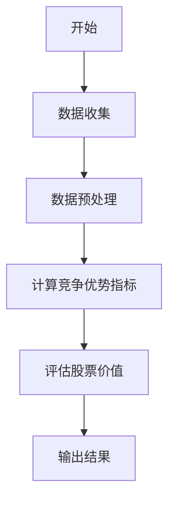
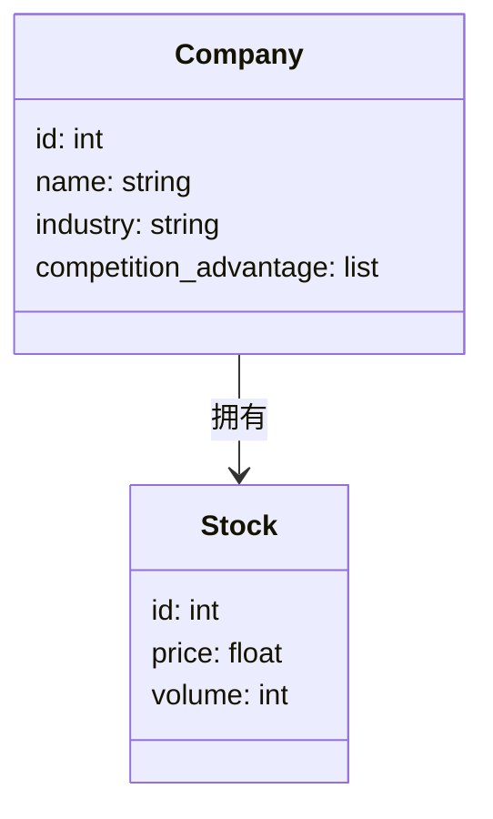

                 


# 特价股票与公司竞争优势的关系

> **关键词**: 特价股票, 公司竞争优势, 股票价格, 投资策略, 风险管理

> **摘要**: 本文探讨了特价股票与公司竞争优势之间的关系，分析了如何通过特价股票评估公司的竞争优势。文章从基本概念、数学模型、算法原理、系统架构、实际案例等多个方面进行详细分析，并提供了风险管理策略和未来研究方向。通过本文，读者可以全面理解特价股票与公司竞争优势的关系，并在实际投资中应用这些理论。

---

# 第一部分: 特价股票与公司竞争优势的基本概念

## 第1章: 特价股票与公司竞争优势的定义与特点

### 1.1 特价股票的定义与特点

**1.1.1 特价股票的定义**

特价股票通常指价格低于市场平均水平的股票，具有较高的性价比。这类股票可能因为市场波动、公司短期困境或行业调整等原因被低估。投资者可以通过购买特价股票，以较低的成本获得公司的一部分股权，期待未来股价回升带来收益。

**1.1.2 特价股票的特点**

- **低估值**: 特价股票通常价格低于其内在价值，具有较高的投资潜力。
- **高波动性**: 特价股票价格波动较大，投资者需具备较高的风险承受能力。
- **潜在收益**: 投资者可以通过长期持有或短期交易获得收益。

### 1.2 公司竞争优势的定义与特点

**1.2.1 公司竞争优势的定义**

公司竞争优势是指公司在市场上相对于竞争对手的独特优势，包括技术、成本、品牌、资源、管理等方面。这些优势使公司在市场竞争中占据有利地位，能够吸引客户、提高市场份额和盈利能力。

**1.2.2 公司竞争优势的核心要素**

- **技术优势**: 公司在技术研发、创新方面的优势。
- **成本优势**: 公司在生产、运营中的成本控制能力。
- **品牌优势**: 公司品牌知名度和美誉度带来的市场优势。
- **资源优势**: 公司拥有的独特资源，如原材料、渠道等。
- **管理优势**: 公司的组织结构和管理能力。

### 1.3 特价股票与公司竞争优势的关系

**1.3.1 特价股票与公司竞争优势的关联性**

特价股票的价格反映了市场对公司竞争优势的评估。当一家公司具备强大的竞争优势时，其股票通常会被市场给予较高的估值。然而，当公司竞争优势暂时受到挑战或市场波动时，股票价格可能会被低估，形成特价股票。

**1.3.2 特价股票反映公司竞争优势的机制**

- **市场情绪影响**: 投资者情绪波动可能导致股票价格偏离其真实价值，具备竞争优势的公司股票可能在市场低迷时被低估。
- **竞争格局变化**: 行业竞争格局的变化可能导致公司竞争优势发生变化，进而影响股票价格。
- **公司基本面变化**: 公司竞争优势的强弱直接影响其财务表现，从而影响股票价格。

**1.3.3 特价股票与公司竞争优势的边界与外延**

特价股票与公司竞争优势之间的关系并非线性相关。公司竞争优势是决定股票长期价值的核心因素，而股票价格短期波动可能与市场情绪、宏观经济等因素有关。因此，投资者在分析特价股票时，需要综合考虑公司竞争优势的强弱和市场环境的变化。

---

## 第2章: 特价股票与公司竞争优势的核心概念

### 2.1 特价股票与公司竞争优势的对比分析

**2.1.1 特价股票与公司竞争优势的属性特征对比**

| 特性                | 特价股票                     | 公司竞争优势                 |
|---------------------|-----------------------------|-----------------------------|
| 定义                | 价格低于市场平均水平的股票 | 公司在市场中的独特优势     |
| 影响因素            | 市场情绪、宏观经济、公司基本面 | 技术、成本、品牌、资源、管理 |
| 持续性              | 短期波动性较强               | 长期稳定性较强               |
| 价值评估            | 市场定价                     | 公司内部与外部综合评估       |

**2.1.2 特价股票与公司竞争优势的ER实体关系图**

```mermaid
er
  company: id, name, industry
  stock: id, price, volume
  competition_advantage: id, type, description
  company --|拥有| stock
  company --|具备| competition_advantage
```

### 2.2 特价股票与公司竞争优势的数学模型

**2.2.1 特价股票价格与公司竞争优势的关系模型**

$$ P = f(CA) $$

其中，$P$ 为股票价格，$CA$ 为公司竞争优势的综合指标。

**2.2.2 公司竞争优势对股票价格的影响路径**

$$ CA \rightarrow EBITDA \rightarrow P $$

解释：公司竞争优势（CA）通过影响公司息税折旧及摊销前利润（EBITDA），进而影响股票价格（P）。

---

## 第3章: 特价股票与公司竞争优势的算法原理

### 3.1 特价股票与公司竞争优势的分析算法

**3.1.1 基于公司竞争优势的股票筛选算法**



解释：该算法首先收集公司数据，进行预处理，计算竞争优势指标，评估股票价值，并输出结果。

**3.1.2 特价股票筛选的数学模型**

$$ S = \{P | P < P_{mean} \} $$

其中，$S$ 是特价股票集合，$P$ 是股票价格，$P_{mean}$ 是市场平均股价。

---

## 第4章: 特价股票与公司竞争优势的系统架构

### 4.1 系统功能设计

**4.1.1 领域模型**



解释：公司拥有股票，公司具备竞争优势。

### 4.2 系统架构设计


解释：系统架构包括用户界面、控制器、服务、仓库和数据库，实现用户请求的处理和数据存储。

---

## 第5章: 特价股票与公司竞争优势的项目实战

### 5.1 实际案例分析

**5.1.1 案例背景**

某公司因行业低迷导致股价下跌，具备较高的竞争优势。

**5.1.2 数据收集与分析**

收集公司财务数据、行业数据和股票数据，计算竞争优势指标。

**5.1.3 投资决策**

基于分析结果，判断公司具备竞争优势，决定投资特价股票。

---

## 第6章: 风险管理与投资策略

### 6.1 风险管理

**6.1.1 风险来源**

- 市场风险：股票价格波动。
- 信用风险：公司信用状况变化。
- 操作风险：投资决策错误。

### 6.1.2 风险评估与应对策略**

使用VaR模型评估市场风险，制定止损策略。

---

## 第7章: 未来研究方向与总结

### 7.1 未来研究方向

- 进一步优化数学模型。
- 研究人工智能在股票分析中的应用。

### 7.2 总结

特价股票与公司竞争优势的关系复杂，投资者需综合考虑多种因素，制定科学的投资策略。

---

**作者：AI天才研究院 & 禅与计算机程序设计艺术**

