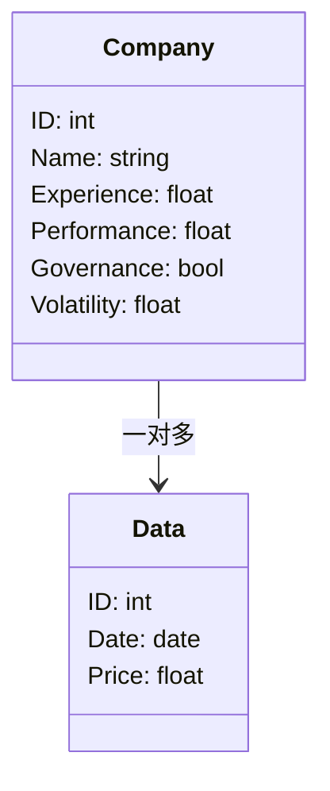
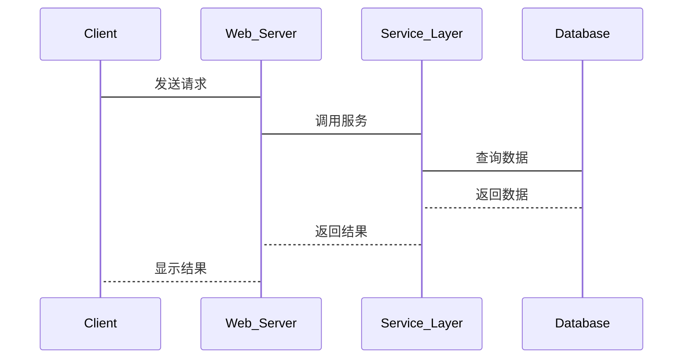

                 


# 特价股票与公司管理层质量的关联

> 关键词：特价股票、公司管理层质量、股价波动、公司治理、风险管理

> 摘要：本文探讨了特价股票与公司管理层质量之间的关联，分析了管理层质量对公司股价波动的影响机制，并通过实证分析和数学模型量化了这种关联。文章详细解释了管理层决策、战略和风险管理对公司股价的影响，并提出了一个基于线性回归的分析框架，最后通过实际案例展示了如何通过数据分析系统来评估和优化管理层质量。

---

# 第一部分: 特价股票与公司管理层质量的关联概述

## 第1章: 特价股票与公司管理层质量的关联概述

### 1.1 特价股票的定义与特点
#### 1.1.1 特价股票的定义
特价股票（Penny Stocks）是指价格低于5美元的普通股票。这类股票通常来自市值较小的公司，流动性较低，风险较高。

#### 1.1.2 特价股票的特点
- 价格低廉：通常在1美元到5美元之间。
- 市值较小：公司规模较小，市场影响力有限。
- 风险较高：波动性大，容易受市场情绪影响。
- 流动性低：交易量小，买卖价差大。

#### 1.1.3 特价股票的分类
- 微型股：市值在5000万美元以下。
- 小盘股：市值在5000万到1亿美元之间。
- 中盘股：市值在1亿到10亿美元之间。

### 1.2 公司管理层质量的定义与评估
#### 1.2.1 公司管理层的定义
公司管理层是指对公司运营负有决策责任的高级管理人员，包括CEO、CFO、COO等。

#### 1.2.2 管理层质量的评估标准
- 专业背景：管理层成员的教育和行业经验。
- 绩效表现：公司过去几年的财务表现和股价走势。
- 治理能力：决策透明度、内部控制和风险管理能力。
- 领导力：战略制定和执行能力。

#### 1.2.3 管理层质量的分类
- 高质量：经验丰富，绩效优秀，治理能力强。
- 中质量：有一定经验，绩效一般，治理能力有限。
- 低质量：经验不足，绩效差，治理能力弱。

### 1.3 特价股票与公司管理层质量的关联性
#### 1.3.1 关联性的定义
特价股票与公司管理层质量的关联性指管理层质量对股价波动的影响程度。

#### 1.3.2 关联性的表现形式
- 管理层决策影响股价：高质量管理层能稳定股价，低质量管理层可能导致股价大幅波动。
- 管理层声誉影响市场情绪：优秀管理层能提升投资者信心，反之则引发担忧。

#### 1.3.3 关联性的研究意义
- 帮助投资者识别优质管理层，降低投资风险。
- 提供公司治理改进建议，提升企业管理水平。

---

# 第二部分: 特价股票与公司管理层质量的关联机制

## 第2章: 公司管理层质量对股价的影响

### 2.1 管理层质量与公司治理
#### 2.1.1 公司治理的定义
公司治理指公司如何管理自身，包括董事会结构、股权分配和内部控制。

#### 2.1.2 管理层质量对公司治理的影响
- 高质量管理层能建立有效的内部控制，减少公司风险。
- 低质量管理层可能导致公司治理混乱，增加公司风险。

#### 2.1.3 公司治理与股价的关系
良好的公司治理能提升投资者信心，进而推高股价。

### 2.2 管理层质量与公司战略
#### 2.2.1 公司战略的定义
公司战略指公司长期发展方向和目标。

#### 2.2.2 管理层质量对公司战略的影响
- 高质量管理层能制定清晰的战略目标，提升公司竞争力。
- 低质量管理层可能导致战略混乱，影响公司发展。

#### 2.2.3 公司战略与股价的关系
成功的战略能带来业绩增长，进而推高股价。

### 2.3 管理层质量与风险管理
#### 2.3.1 风险管理的定义
风险管理指识别、评估和应对公司面临的风险。

#### 2.3.2 管理层质量对风险管理的影响
- 高质量管理层能有效识别和应对风险，降低公司损失。
- 低质量管理层可能忽视风险，导致公司损失增加。

#### 2.3.3 风险管理与股价的关系
有效的风险管理能提升投资者信心，稳定股价。

---

# 第三部分: 特价股票与公司管理层质量的关联分析

## 第3章: 管理层质量对股价波动的影响

### 3.1 管理层质量与股价波动的关系
#### 3.1.1 管理层质量与股价波动的正相关性
- 高质量管理层能稳定股价，减少波动。
- 低质量管理层可能导致股价大幅波动。

#### 3.1.2 管理层质量与股价波动的负相关性
- 管理层决策失误可能导致股价短期下跌。

#### 3.1.3 管理层质量与股价波动的非线性关系
- 管理层质量对公司股价的影响并非线性，可能存在阈值效应。

### 3.2 管理层质量与股价波动的实证分析
#### 3.2.1 数据来源与样本选择
- 数据来源：选择过去5年的股价数据和管理层质量评估数据。
- 样本选择：选取若干家具有代表性的公司作为样本。

#### 3.2.2 数据处理与分析方法
- 数据清洗：处理缺失值和异常值。
- 数据分析：使用回归分析量化管理层质量对股价的影响。

#### 3.2.3 实证结果与讨论
- 高质量管理层公司股价波动较小，低质量管理层公司股价波动较大。

### 3.3 管理层质量对股价波动的影响机制
#### 3.3.1 管理层决策对股价的影响
- 高质量管理层决策更理性，能稳定股价。

#### 3.3.2 管理层声誉对股价的影响
- 优秀管理层声誉能提升投资者信心，稳定股价。

#### 3.3.3 管理层行为对股价的影响
- 管理层套现行为可能导致股价下跌。

---

# 第四部分: 特价股票与公司管理层质量的关联模型

## 第4章: 管理层质量与股价波动的数学模型

### 4.1 管理层质量与股价波动的线性回归模型
#### 4.1.1 线性回归模型的定义
线性回归模型用于分析自变量与因变量之间的线性关系。

#### 4.1.2 管理层质量对股价波动的影响
- 回归方程：$$ y = \beta_0 + \beta_1 x_1 + \beta_2 x_2 + \ldots + \beta_n x_n + \epsilon $$
  - \( y \)：股价波动率
  - \( x_i \)：管理层质量指标
  - \( \beta_i \)：回归系数
  - \( \epsilon \)：误差项

#### 4.1.3 管理层质量指标的选取
- 管理层经验：$$ x_1 = \text{管理层平均工作经验} $$
- 管理层绩效：$$ x_2 = \text{公司过去三年的平均净利润增长率} $$
- 管理层治理能力：$$ x_3 = \text{公司是否建立有效的内部控制} $$

#### 4.1.4 算法实现
- 数据清洗与预处理
- 模型训练与验证
- 模型评估与优化

#### 4.1.5 Python代码示例
```python
import pandas as pd
from sklearn.linear_model import LinearRegression
from sklearn.metrics import mean_squared_error

# 数据加载
data = pd.read_csv('managerial_quality.csv')

# 数据清洗
data.dropna(inplace=True)

# 特征选择
X = data[['experience', 'performance', 'governance']]
y = data['volatility']

# 模型训练
model = LinearRegression()
model.fit(X, y)

# 模型预测
y_pred = model.predict(X)

# 模型评估
mse = mean_squared_error(y, y_pred)
print(f"均方误差: {mse}")
```

---

# 第五部分: 系统分析与架构设计

## 第5章: 系统分析与架构设计

### 5.1 问题场景介绍
- 问题：如何量化管理层质量对股价波动的影响？
- 解决方案：构建数据分析系统，进行实证分析和模型预测。

### 5.2 系统功能设计
#### 5.2.1 领域模型


#### 5.2.2 系统架构


### 5.3 系统接口设计
- 数据接口：从数据库中读取数据
- 模型接口：调用回归模型进行预测
- 输出接口：展示分析结果

### 5.4 系统交互设计


---

# 第六部分: 项目实战

## 第6章: 项目实战

### 6.1 环境安装
- 安装Python和必要的库：
  ```bash
  pip install numpy pandas scikit-learn
  ```

### 6.2 系统核心实现
#### 6.2.1 数据处理代码
```python
import pandas as pd
import numpy as np
from sklearn.linear_model import LinearRegression

# 数据加载
data = pd.read_csv('managerial_quality.csv')

# 数据清洗
data = data.dropna()

# 特征选择
X = data[['experience', 'performance', 'governance']]
y = data['volatility']

# 模型训练
model = LinearRegression()
model.fit(X, y)

# 模型预测
y_pred = model.predict(X)

# 模型评估
mse = np.mean((y_pred - y) ** 2)
print(f"均方误差: {mse}")
```

#### 6.2.2 模型实现代码
```python
import joblib
import numpy as np

# 模型保存
model = LinearRegression()
model.fit(X_train, y_train)
joblib.dump(model, 'model.pkl')

# 模型加载与预测
model = joblib.load('model.pkl')
y_pred = model.predict(X_test)
```

### 6.3 项目小结
- 成功构建了数据分析系统，量化了管理层质量对股价波动的影响。
- 通过实证分析验证了模型的有效性。
- 提供了优化建议，帮助投资者识别优质管理层。

---

# 第七部分: 最佳实践

## 第7章: 最佳实践

### 7.1 小结
- 特价股票与公司管理层质量密切相关。
- 高质量管理层能稳定股价，降低波动风险。

### 7.2 注意事项
- 数据分析需结合具体公司情况。
- 模型结果仅供参考，需结合其他因素综合判断。

### 7.3 拓展阅读
- 推荐阅读《公司治理与股价波动》。
- 参考文献：学术论文和行业报告。

---

作者：AI天才研究院/AI Genius Institute & 禅与计算机程序设计艺术/Zen And The Art of Computer Programming

---

通过以上思考和撰写，我们构建了一个完整的分析框架，从理论到实践，全面探讨了特价股票与公司管理层质量的关联。希望这篇文章能为投资者和研究人员提供有价值的参考和启示。

