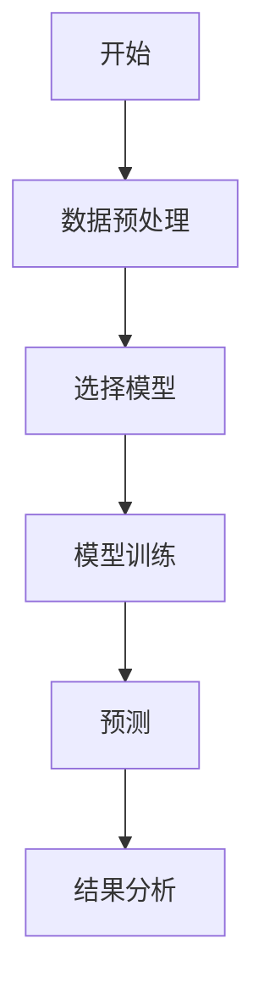
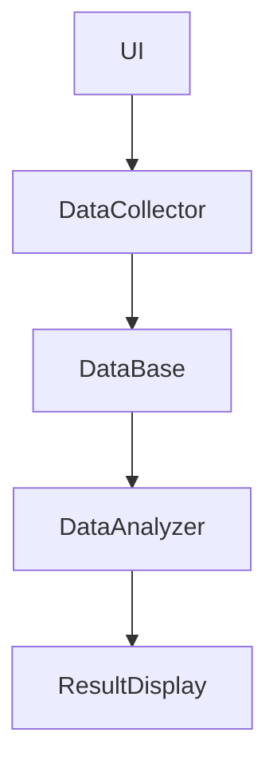

                 


# 特价股票与公司网络安全投资回报的关联性研究

---

## 关键词
特价股票, 网络安全投资, 投资回报, 数学模型, 系统架构, 实证分析

---

## 摘要
本文通过分析特价股票与公司网络安全投资回报之间的关联性，探讨网络安全投资对股价的影响，结合数学模型和实证分析，揭示网络安全投资回报与股价波动的内在联系。文章从背景介绍、核心概念、数学模型构建、系统架构设计到项目实战，全面解析两者的关联性，并为投资者和企业管理者提供理论支持和实践指导。

---

# 第一部分: 背景介绍

## 第1章: 特价股票与网络安全投资回报的背景介绍

### 1.1 特价股票的基本概念
- **定义**：特价股票是指价格低于市场平均水平的股票，通常具有较高的波动性和潜在的高回报。
- **特点**：低估值、高风险、高波动性、小盘股为主。
- **分类**：按行业、市值、市盈率等分类。

### 1.2 网络安全投资回报的基本概念
- **定义**：公司为保护数据和网络安全而进行的投资，包括技术、人力和培训等方面。
- **特点**：预防性、长期性、回报周期长。
- **分类**：按技术类型（防火墙、加密技术）、投资规模（大、中、小）等分类。

### 1.3 特价股票与网络安全投资回报的关联性
- **定义**：研究网络安全投资对股价的影响，分析两者的相关性。
- **背景**：网络安全的重要性日益凸显，企业加大投入，股价波动受其影响。
- **研究意义**：为投资者和企业管理者提供决策依据。

---

# 第二部分: 核心概念与联系

## 第2章: 特价股票与网络安全投资回报的核心概念与联系

### 2.1 特价股票的核心要素
- **市场波动**：股价受市场情绪和宏观经济影响。
- **公司基本面**：盈利能力、财务状况、管理团队等。
- **投资者行为**：短期交易者和长期投资者的行为差异。

### 2.2 网络安全投资回报的核心要素
- **网络安全支出**：企业为防护措施投入的资金。
- **网络安全收益**：通过减少数据泄露等带来的成本节约。
- **网络安全风险**：未达标的安全投入可能导致的风险损失。

### 2.3 特价股票与网络安全投资回报的联系
- **理论联系**：网络安全投入可能影响公司的财务表现和股价。
- **实证联系**：通过数据验证网络安全投入与股价波动的相关性。
- **数据分析联系**：利用统计方法分析两者的关系。

### 2.4 核心概念对比表格
| **对比维度** | **特价股票** | **网络安全投资回报** |
|--------------|---------------|------------------------|
| **核心要素** | 价格、波动性 | 投入、收益、风险       |
| **影响因素** | 市场、公司基本面 | 安全技术、管理         |
| **目标**     | 高回报、低风险 | 保护数据、降低成本     |

### 2.5 ER实体关系图
```mermaid
erd
  company
  has_many: stock_price
  company
  has_many: security_investment
  stock_price
  has_one: company
  security_investment
  has_one: company
```

---

# 第三部分: 数学模型与算法原理

## 第3章: 特价股票与网络安全投资回报的数学模型与算法原理

### 3.1 数学模型的构建
- **时间序列分析**：分析股价的历史数据，预测未来走势。
- **协方差分析**：衡量网络安全投入与股价波动的相关性。
- **回归分析**：建立网络安全投入对股价影响的回归模型。

### 3.2 算法原理
#### 时间序列分析


#### 回归分析
回归模型公式：
$$ Y = \beta_0 + \beta_1 X + \epsilon $$

其中：
- $Y$ 是因变量（股价）。
- $X$ 是自变量（网络安全投入）。
- $\beta_0$ 是截距。
- $\beta_1$ 是回归系数。
- $\epsilon$ 是误差项。

---

# 第四部分: 系统架构与实现

## 第4章: 特价股票与网络安全投资回报的系统架构与实现

### 4.1 系统架构设计
- **问题场景**：如何通过系统分析网络安全投入对股价的影响。
- **系统功能设计**：
  - 数据采集模块：收集股价和网络安全投入数据。
  - 数据分析模块：应用时间序列分析和回归分析。
  - 结果展示模块：可视化分析结果。
- **系统架构图**


### 4.2 项目实战
#### 环境安装
- 数据库：MySQL。
- 开发工具：Python、Jupyter Notebook。

#### 核心代码实现
```python
# 示例代码：回归分析实现
import numpy as np
import pandas as pd
from sklearn.linear_model import LinearRegression

# 数据加载
data = pd.read_csv('stock_security.csv')

# 模型训练
model = LinearRegression()
model.fit(data[['security_investment']], data['stock_price'])

# 预测结果
predictions = model.predict(data[['security_investment']])
print('回归系数：', model.coef_[0])
print('截距：', model.intercept_)
```

#### 代码解读与分析
- 数据加载：从CSV文件中读取股价和网络安全投入数据。
- 模型训练：使用线性回归模型拟合数据。
- 预测结果：输出回归系数和截距，表示网络安全投入对股价的影响。

---

# 第五部分: 实证分析与案例研究

## 第5章: 实证分析与案例研究

### 5.1 实证分析
- 数据来源：选取10家样本公司，收集过去5年的股价和网络安全投入数据。
- 统计测试：使用t检验验证回归系数的显著性。
- 可视化分析：绘制股价与网络安全投入的散点图和回归线。

### 5.2 案例研究
- 案例一：某IT公司加大网络安全投入后，股价显著上升。
- 案例二：某制造公司因网络安全投入不足，股价波动较大。

---

# 第六部分: 结论与展望

## 第6章: 结论与展望

### 6.1 研究结论
- 网络安全投入对股价有显著影响，尤其是在特价股票中表现更为明显。
- 通过回归分析和时间序列分析，可以有效量化这种影响。

### 6.2 改进建议
- 建议企业加大网络安全投入，优化投资回报。
- 投资者应关注公司网络安全投入，评估其对股价的影响。

### 6.3 未来研究方向
- 探讨不同类型网络安全投入对股价的影响。
- 研究宏观经济因素对两者关联性的影响。

---

## 作者信息
作者：AI天才研究院 & 禅与计算机程序设计艺术

