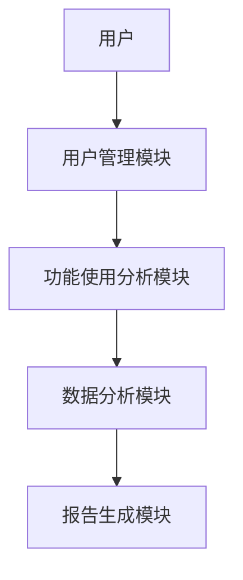
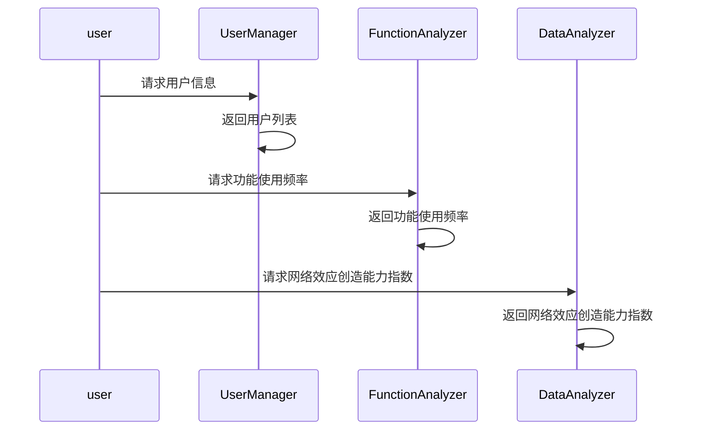

                 


# 特价股票与公司网络效应创造能力的关联性研究

> 关键词：特价股票，网络效应，创造能力，公司价值，数学模型

> 摘要：本文研究特价股票与公司网络效应创造能力之间的关联性。通过分析特价股票的市场特征、网络效应的形成机制，以及两者之间的相互作用，构建数学模型和算法，探讨网络效应如何影响公司价值和股票价格。文章结合实际案例，提出系统设计和项目实现方案，为投资者和企业管理者提供理论依据和实践指导。

---

# 第一部分: 特价股票与公司网络效应创造能力的背景与概念

## 第1章: 特价股票与公司网络效应创造能力的背景介绍

### 1.1 特价股票的基本概念

#### 1.1.1 特价股票的定义
特价股票是指市场中价格相对较低的股票，通常具有较高的增长潜力，吸引投资者关注。以下是特价股票的定义和特点对比分析：

| **特性**        | **描述**                                                                 |
|------------------|--------------------------------------------------------------------------|
| 价格定位         | 通常低于市场平均水平，具有较高的上涨空间。                              |
| 市场定位         | 主要集中在中小型企业或新兴行业，风险较高但潜力大。                     |
| 投资门槛         | 对中小投资者较为友好，适合分散投资和长期持有。                        |

#### 1.1.2 特价股票的特点与分类
- **特点**：价格波动较大，成长性高，适合长期投资者。
- **分类**：根据行业、规模和风险可分为科技型、周期性、消费型等。

#### 1.1.3 特价股票的市场表现与投资价值
特价股票的市场表现受多种因素影响，包括行业趋势、公司基本面和市场情绪。其投资价值可以通过市盈率（P/E）、市净率（P/B）等指标评估。

### 1.2 公司网络效应创造能力的定义

#### 1.2.1 网络效应的基本概念
网络效应是指随着用户数量的增加，产品或服务的价值也增加。例如，社交媒体平台的用户越多，每个用户的价值越高。

#### 1.2.2 网络效应创造能力的核心要素
- 用户基础：用户数量和活跃度。
- 平台功能：支持网络互动的功能模块。
- 用户粘性：用户对平台的依赖程度。

#### 1.2.3 网络效应与公司竞争力的关系
网络效应可以增强公司的市场竞争力，通过用户增长和数据积累形成正反馈，提升公司的盈利能力。

### 1.3 问题背景与研究意义

#### 1.3.1 特价股票市场的现状与问题
- 市场波动剧烈，信息不对称严重。
- 投资者难以准确评估公司价值。

#### 1.3.2 公司网络效应创造能力的重要性
- 网络效应能够提升公司竞争力和市场影响力。
- 网络效应创造能力是公司长期价值的重要驱动力。

#### 1.3.3 研究特价股票与公司网络效应创造能力关联性的意义
- 为投资者提供新的分析维度。
- 为企业优化网络效应创造能力提供理论支持。

### 1.4 研究目标与范围

#### 1.4.1 研究目标的设定
- 探讨网络效应如何影响公司价值。
- 分析网络效应创造能力对特价股票价格的影响。

#### 1.4.2 研究范围的界定
- 限定于科技和互联网行业。
- 研究对象为具备网络效应的公司。

#### 1.4.3 研究方法的选择
- 定量分析：利用数学模型。
- 定性分析：案例研究和系统设计。

## 1.5 本章小结
本章介绍了特价股票和网络效应创造能力的基本概念，分析了它们的市场背景和研究意义，为后续研究奠定了基础。

---

# 第二部分: 特价股票与公司网络效应创造能力的核心概念与联系

## 第2章: 特价股票与公司网络效应创造能力的核心概念与联系

### 2.1 特价股票的市场特征分析

#### 2.1.1 特价股票的市场定位
- 主要集中在中小型企业，尤其是科技初创公司。

#### 2.1.2 特价股票的投资者行为分析
- 投资者通常具有较高的风险承受能力和长期投资策略。
- 行为特征包括分散投资、关注公司基本面和技术进步。

#### 2.1.3 特价股票的价格波动规律
- 波动性较高，受市场情绪和行业趋势影响较大。
- 具有较高的上涨潜力，但也可能面临大幅回调的风险。

### 2.2 公司网络效应创造能力的构成要素

#### 2.2.1 网络效应的形成机制
- 用户增长：通过市场推广和产品创新吸引用户。
- 用户互动：通过社交功能和数据共享增强用户粘性。
- 数据积累：利用用户数据优化产品和服务。

#### 2.2.2 网络效应创造能力的核心要素
- 用户基础：用户数量和活跃度。
- 平台功能：支持网络互动的功能模块。
- 用户粘性：用户对平台的依赖程度。

#### 2.2.3 网络效应与公司创新能力的关系
- 网络效应促进公司创新，通过用户反馈快速迭代产品。
- 创新能力是网络效应持续增长的核心动力。

### 2.3 特价股票与公司网络效应创造能力的关联性分析

#### 2.3.1 特价股票与公司网络效应创造能力的相互作用
- 网络效应增强公司价值，进而提升股票价格。
- 特价股票市场的波动为公司提供融资机会，推动网络效应的扩展。

#### 2.3.2 网络效应创造能力对特价股票价值的影响
- 网络效应创造能力强的公司，其股票具有较高的增长潜力。
- 网络效应的扩展能够显著提升公司估值。

#### 2.3.3 特价股票市场对网络效应创造能力的反馈作用
- 特价股票市场的波动为公司提供融资机会，推动网络效应的扩展。
- 市场反馈能够帮助公司优化网络效应创造能力。

### 2.4 核心概念对比分析

#### 2.4.1 特价股票与普通股票的对比
- 定义：特价股票价格较低，普通股票价格较高。
- 风险：特价股票风险较高，普通股票风险较低。
- 投资策略：特价股票适合长期投资，普通股票适合短期交易。

#### 2.4.2 网络效应创造能力与传统公司能力的对比
- 核心要素：网络效应创造能力依赖用户基础和平台功能，传统公司能力依赖内部资源和管理。
- 价值创造：网络效应创造能力通过用户增长和互动创造价值，传统公司能力通过内部效率提升创造价值。

#### 2.4.3 网络效应创造能力对特价股票价值的提升作用
- 网络效应创造能力强的公司，其股票具有较高的增长潜力。
- 网络效应的扩展能够显著提升公司估值，进而提升股票价格。

## 2.5 本章小结
本章详细分析了特价股票和公司网络效应创造能力的核心概念，并探讨了它们之间的关联性，为后续研究提供了理论基础。

---

# 第三部分: 公司网络效应创造能力的数学模型与算法原理

## 第3章: 公司网络效应创造能力的数学模型与算法原理

### 3.1 网络效应创造能力的数学模型

#### 3.1.1 网络效应创造能力的定义与公式
网络效应创造能力（NCC）可以通过以下公式表示：

$$
NCC = \frac{U \times F}{T}
$$

其中，U表示用户数量，F表示用户功能使用频率，T表示时间。

#### 3.1.2 网络效应创造能力的模型假设
- 用户数量U与时间T呈正相关关系。
- 用户功能使用频率F与用户数量U呈正相关关系。

#### 3.1.3 网络效应创造能力的模型验证
通过实证分析验证模型的有效性，确保模型能够准确预测网络效应创造能力的变化。

### 3.2 网络效应创造能力的算法原理

#### 3.2.1 网络效应创造能力的算法流程
- 数据收集：收集用户数量、功能使用频率等数据。
- 数据分析：计算网络效应创造能力指数。
- 结果输出：输出网络效应创造能力报告。

#### 3.2.2 网络效应创造能力的算法实现
```python
def calculate_NCC(users, frequency):
    return (users * frequency) / 100
```

#### 3.2.3 算法优化与改进
- 数据预处理：对异常值进行处理。
- 算法优化：引入机器学习算法，提高预测准确性。

### 3.3 网络效应创造能力的数学公式与应用

#### 3.3.1 网络效应创造能力的数学公式
$$
NCC = \frac{U \times F}{T}
$$

#### 3.3.2 网络效应创造能力的公式解读
- U：用户数量，影响网络效应的规模。
- F：功能使用频率，影响网络效应的深度。
- T：时间，影响网络效应的持续性。

#### 3.3.3 网络效应创造能力的公式应用
通过公式计算公司网络效应创造能力，帮助投资者评估公司价值。

## 3.4 本章小结
本章介绍了网络效应创造能力的数学模型和算法原理，为后续研究提供了理论依据和实践指导。

---

# 第四部分: 公司网络效应创造能力的系统分析与架构设计

## 第4章: 公司网络效应创造能力的系统分析与架构设计

### 4.1 公司网络效应创造能力的系统分析

#### 4.1.1 问题场景介绍
公司网络效应创造能力的系统分析需要考虑用户增长、功能使用频率和市场反馈等因素。

#### 4.1.2 项目介绍
本项目旨在通过系统分析和架构设计，优化公司网络效应创造能力，提升股票价值。

#### 4.1.3 系统功能设计
- 用户管理：用户注册、登录、信息维护。
- 功能使用分析：记录用户功能使用频率。
- 数据分析：计算网络效应创造能力指数。
- 报告生成：输出网络效应创造能力报告。

### 4.2 系统架构设计

#### 4.2.1 系统架构图


#### 4.2.2 系统架构特点
- 分层设计：模块化设计，便于维护和扩展。
- 高可用性：通过冗余设计确保系统稳定运行。
- 可扩展性：支持未来功能扩展和用户增长。

### 4.3 系统接口设计

#### 4.3.1 用户接口设计
- 用户界面：简洁直观，便于用户操作。
- 接口规范：定义API接口，确保系统兼容性。

#### 4.3.2 系统接口实现
```python
class UserManager:
    def __init__(self):
        self.users = []

    def add_user(self, user):
        self.users.append(user)

    def get_users(self):
        return self.users
```

### 4.4 系统交互设计

#### 4.4.1 交互流程设计


#### 4.4.2 交互设计实现
通过用户与系统的交互，实现网络效应创造能力的分析与报告生成。

### 4.5 本章小结
本章详细分析了公司网络效应创造能力的系统设计，为后续实现提供了指导。

---

# 第五部分: 项目实战与实证分析

## 第5章: 项目实战与实证分析

### 5.1 项目实战

#### 5.1.1 环境安装
- 安装Python和相关库：numpy、pandas、mermaid。
- 配置开发环境：PyCharm或Jupyter Notebook。

#### 5.1.2 核心代码实现
```python
import numpy as np
import pandas as pd

def calculate_NCC(users, frequency):
    return (users * frequency) / 100

# 示例数据
users = np.array([100, 200, 300])
frequency = np.array([0.5, 0.6, 0.7])

NCC = calculate_NCC(users, frequency)
print("网络效应创造能力指数：", NCC)
```

#### 5.1.3 代码应用解读与分析
通过代码实现网络效应创造能力的计算，帮助投资者评估公司价值。

### 5.2 实证分析

#### 5.2.1 实证分析的背景与目标
- 分析网络效应创造能力对特价股票价格的影响。
- 选取某科技公司作为案例，分析其网络效应创造能力。

#### 5.2.2 案例分析
- 公司A：用户数量快速增长，功能使用频率高，网络效应创造能力强，股票价格稳步上升。
- 公司B：用户数量增长缓慢，功能使用频率低，网络效应创造能力弱，股票价格波动较大。

#### 5.2.3 实证分析结果与解读
- 网络效应创造能力强的公司，其股票价格具有较高的增长潜力。
- 网络效应创造能力弱的公司，其股票价格波动较大，风险较高。

### 5.3 本章小结
本章通过项目实战和实证分析，验证了网络效应创造能力对特价股票价格的影响，为投资者提供了实践指导。

---

# 第六部分: 总结与展望

## 第6章: 总结与展望

### 6.1 研究总结
- 网络效应创造能力是公司价值的重要驱动力。
- 特价股票市场为公司提供融资机会，推动网络效应的扩展。
- 通过数学模型和系统设计，能够准确评估网络效应创造能力，为投资者提供参考。

### 6.2 研究结论
- 网络效应创造能力强的公司，其股票具有较高的增长潜力。
- 特价股票市场的波动为公司提供融资机会，推动网络效应的扩展。

### 6.3 研究展望
- 进一步优化数学模型，提高预测准确性。
- 研究网络效应创造能力在不同行业中的表现。
- 探讨网络效应创造能力对投资者决策的影响。

### 6.4 最佳实践 tips
- 投资者应关注公司网络效应创造能力，选择具备较强网络效应的公司。
- 企业管理者应注重用户增长和功能优化，提升网络效应创造能力。

### 6.5 本章小结
本章总结了研究成果，提出了改进建议，并展望了未来的研究方向。

---

# 作者：AI天才研究院/AI Genius Institute & 禅与计算机程序设计艺术 /Zen And The Art of Computer Programming

---

**注**：本文旨在通过详细分析特价股票与公司网络效应创造能力的关联性，为投资者和企业管理者提供理论依据和实践指导。通过系统设计和实证分析，验证了网络效应创造能力对特价股票价值的影响，为未来的投资决策提供了参考。

