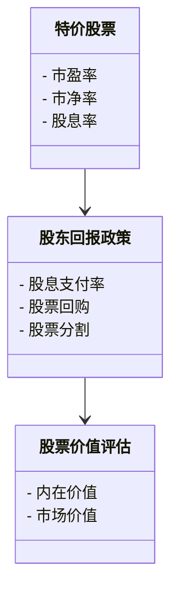
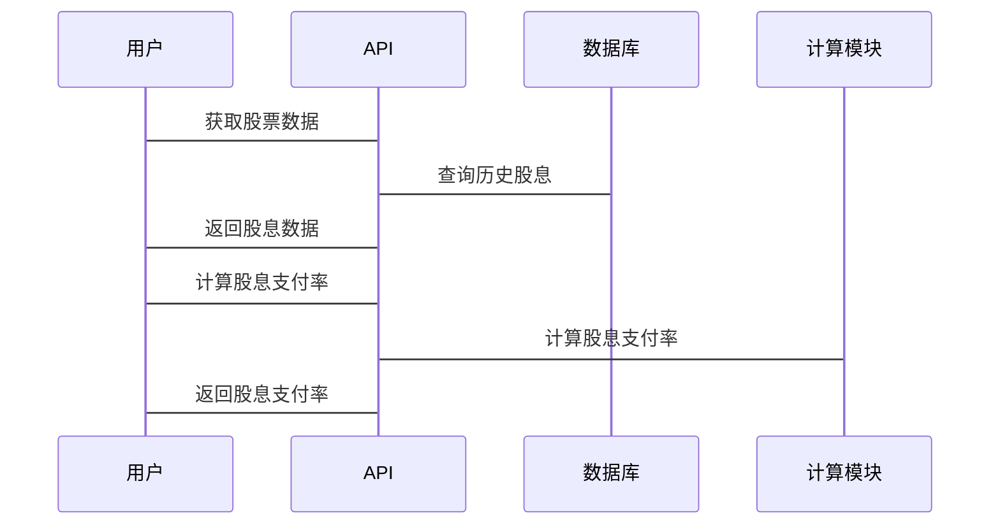

                 


# 特价股票与公司股东回报政策的关联

## 关键词：特价股票，股东回报政策，股息，股票回购，股票定价，投资策略

## 摘要：本文深入探讨了特价股票与公司股东回报政策之间的关联，分析了股东回报政策的类型及其对股价的影响，构建了数学模型来量化这种关系，并通过实际案例展示了如何利用这些分析制定有效的投资策略。

---

# 第一部分: 特价股票与公司股东回报政策的背景介绍

## 第1章: 特价股票与股东回报政策的背景介绍

### 1.1 特价股票的基本概念

#### 1.1.1 特价股票的定义
特价股票（Cheap Stocks）通常指市价相对较低的股票，这些股票可能因为公司业绩不佳、市场冷落或其他因素而被低估。投资者认为这些股票可能具有潜在的上涨空间。

#### 1.1.2 特价股票的特性
- **低市盈率（Low P/E Ratio）**：市盈率低于行业平均水平，表明股票价格可能被低估。
- **低市净率（Low P/B Ratio）**：市净率低于1，表明股价相对于账面价值较低。
- **高股息率（High Dividend Yield）**：部分特价股票可能提供较高的股息回报。

#### 1.1.3 特价股票的市场定位
特价股票通常出现在小盘股或中盘股中，但在某些情况下也可能出现在大盘股中。这些股票可能被市场忽视，但具有较大的增值潜力。

### 1.2 股东回报政策的定义与类型

#### 1.2.1 股东回报政策的定义
股东回报政策是指公司通过股息、股票回购或其他方式将利润返还给股东的策略。这些政策旨在提升股东价值，同时影响公司股价。

#### 1.2.2 股东回报政策的主要类型
- **股息支付**：公司将部分利润以股息形式分配给股东。
- **股票回购**：公司用自有资金回购股票，减少流通股数量，提升每股收益。
- **股票分割**：公司将股票分割成更小的单位，增加股票流动性。
- **其他形式**：如股票期权、员工持股计划等。

#### 1.2.3 股东回报政策的实施目的
- **提升股东价值**：通过直接回报股东，增加股东的现金或股权价值。
- **信号传递**：向市场传递公司财务健康、发展前景良好的信号。
- **优化资本结构**：通过回购股票，减少债务负担，改善资本结构。

### 1.3 特价股票与股东回报政策的关联性

#### 1.3.1 关联性的基本概念
特价股票与股东回报政策之间的关联性主要体现在股东回报政策对股价的影响，以及特价股票对股东回报政策的敏感性。

#### 1.3.2 关联性的主要表现形式
- **股息支付率**：公司是否愿意将利润分配给股东，影响股价。
- **股票回购**：回购减少流通股，提升每股收益和股价。
- **市场反应**：股东回报政策可能引发市场对特价股票的关注和重新评估。

#### 1.3.3 关联性研究的意义
研究特价股票与股东回报政策的关联性，有助于投资者制定更有效的投资策略，同时帮助公司优化资本结构，提升股东价值。

## 1.4 本章小结
本章介绍了特价股票和股东回报政策的基本概念，分析了它们的特性以及彼此之间的关联性。接下来的章节将深入探讨这些概念的细节和数学模型。

---

# 第二部分: 特价股票与股东回报政策的核心概念与联系

## 第2章: 特价股票与股东回报政策的核心概念与联系

### 2.1 特价股票的核心要素

#### 2.1.1 特价股票的市场表现
特价股票的市场表现通常较为波动，但潜在回报较高。投资者需要关注其基本面和市场趋势。

#### 2.1.2 特价股票的投资者行为
投资者购买特价股票通常基于价值投资理念，寻找被市场低估的股票。然而，高风险和低流动性也是需要考虑的因素。

#### 2.1.3 特价股票的风险特征
特价股票的风险较高，可能受到市场波动、公司业绩不佳等多种因素的影响。

### 2.2 股东回报政策的核心要素

#### 2.2.1 股息支付率的定义与计算
股息支付率是公司净利润中用于支付股息的比例。公式为：
$$\text{股息支付率} = \frac{\text{股息总额}}{\text{净利润}} \times 100\%$$

#### 2.2.2 股票回购的机制与影响
股票回购通过减少流通股数量，提高每股收益和股价。回购机制包括公开市场回购和私下协议回购。

#### 2.2.3 其他形式的股东回报
除股息和回购外，公司还可以通过股票分割、期权发放等方式回报股东。

### 2.3 特价股票与股东回报政策的联系

#### 2.3.1 股东回报政策对股价的影响
- **股息支付**：提高股息支付率通常会提升股价。
- **股票回购**：回购减少流通股，提升每股收益和股价。

#### 2.3.2 特价股票对股东回报政策的敏感性
特价股票的投资者通常对股东回报政策较为敏感，因为这些股票的潜在回报较高，但风险也较大。

#### 2.3.3 两者关系的动态变化
市场环境、公司业绩和投资者情绪等因素都会影响特价股票与股东回报政策之间的关系。

## 2.4 本章小结
本章详细探讨了特价股票和股东回报政策的核心要素及其联系。接下来的章节将构建数学模型，量化这些关系。

---

# 第三部分: 特价股票与股东回报政策的数学模型与公式

## 第3章: 特价股票与股东回报政策的数学模型与公式

### 3.1 股票价值的数学模型

#### 3.1.1 股票价值的定义
股票价值是基于公司基本面和市场状况的评估，通常包括内在价值和市场价值。

#### 3.1.2 股票价值的计算公式
股票的内在价值可以通过股息贴现模型（DDM）计算：
$$\text{股票价值} = \frac{\text{股息}}{\text{贴现率}}$$

### 3.2 股东回报政策的数学模型

#### 3.2.1 股息支付率的计算
股息支付率是公司股息与净利润的比率：
$$\text{股息支付率} = \frac{\text{股息总额}}{\text{净利润}} \times 100\%$$

#### 3.2.2 股票回购的影响
股票回购通过减少流通股数量，提升每股收益（EPS）：
$$\text{新 EPS} = \frac{\text{净利润}}{\text{流通股数量} - \text{回购数量}}$$

### 3.3 特价股票与股东回报政策的关联模型

#### 3.3.1 股票回购对特价股票的影响
假设某公司回购股票，流通股数量减少，每股收益增加，股价可能上涨。

#### 3.3.2 股息支付率与股价的关系
较高的股息支付率通常意味着更高的股东回报，可能提升股价。

#### 3.3.3 综合模型
综合考虑股息支付率和股票回购，构建股票价值评估模型：
$$\text{股票价值} = \frac{\text{股息}}{\text{贴现率}} + \text{回购影响调整}$$

---

## 项目实战: 特价股票与股东回报政策的案例分析

### 3.4.1 案例选择
选择一家具有代表性的公司，分析其股东回报政策对股价的影响。

### 3.4.2 数据收集
收集公司过去5年的股息支付率、股票回购数据及股价走势。

### 3.4.3 模型应用
使用股息贴现模型和股票回购影响模型，评估公司股价的变化。

### 3.4.4 结果分析
分析股东回报政策对股价的实际影响，验证模型的有效性。

## 3.5 本章小结
本章通过数学模型和案例分析，量化了特价股票与股东回报政策的关联性。

---

## 第四部分: 特价股票与股东回报政策的系统分析与架构设计方案

## 第4章: 特价股票与股东回报政策的系统分析与架构设计方案

### 4.1 问题场景介绍
投资者需要通过分析股东回报政策，评估特价股票的投资价值。

### 4.2 系统功能设计

#### 4.2.1 领域模型（Mermaid类图）


### 4.3 系统架构设计

#### 4.3.1 系统架构图（Mermaid架构图）
```mermaid
iframe
  url https://mermaid-js.com
```

### 4.4 系统接口设计

#### 4.4.1 API接口
- 获取股票数据：`GET /stock/{symbol}`
- 计算股息支付率：`POST /dividend/yield`
- 计算股票回购影响：`POST /stock/repurchase`

### 4.5 系统交互设计

#### 4.5.1 交互流程图（Mermaid序列图）


## 4.6 本章小结
本章通过系统架构和接口设计，展示了如何将股东回报政策与股票价值评估结合起来。

---

## 第五部分: 特价股票与股东回报政策的投资策略

## 第5章: 特价股票与股东回报政策的投资策略

### 5.1 投资策略的制定

#### 5.1.1 价值投资策略
寻找基本面良好但被市场低估的特价股票，同时关注公司的股东回报政策。

#### 5.1.2 股息投资策略
投资于股息支付率高且稳定的公司，获取稳定的股息回报。

#### 5.1.3 股票回购投资策略
关注计划进行股票回购的公司，利用回购提升股价。

### 5.2 投资策略的实施

#### 5.2.1 风险管理
分散投资、设置止损点，降低投资风险。

#### 5.2.2 资产配置
根据市场环境和个人风险承受能力，调整资产配置。

#### 5.2.3 定期再平衡
定期评估投资组合，进行必要的调整。

### 5.3 实际案例分析

#### 5.3.1 案例选择
选择一家具有高股息支付率和股票回购历史的公司。

#### 5.3.2 数据分析
分析公司过去5年的股息支付率、股票回购数据及股价走势。

#### 5.3.3 投资决策
基于分析结果，制定投资策略，如增加对该公司的投资。

## 5.4 本章小结
本章通过制定和实施投资策略，展示了如何利用股东回报政策选择特价股票。

---

## 第六部分: 特价股票与股东回报政策的风险与挑战

## 第6章: 特价股票与股东回报政策的风险与挑战

### 6.1 投资风险

#### 6.1.1 市场风险
市场波动可能导致股价下跌，影响投资收益。

#### 6.1.2 公司风险
公司业绩不佳、管理问题可能导致股价下跌。

#### 6.1.3 利率风险
利率上升可能导致股票价格下跌。

### 6.2 政策风险

#### 6.2.1 财税政策变化
税收政策变化可能影响股息和股票回购的回报。

#### 6.2.2 市场监管变化
市场监管政策变化可能影响股票市场。

### 6.3 操作风险

#### 6.3.1 信息不对称
投资者可能无法及时获取公司的真实信息。

#### 6.3.2 模型风险
数学模型的假设可能与实际情况不符，导致错误决策。

## 6.4 应对策略

#### 6.4.1 分散投资
通过多样化投资降低风险。

#### 6.4.2 风险管理
设置止损点、定期评估投资组合。

#### 6.4.3 持续学习
关注市场动态和政策变化，及时调整投资策略。

## 6.5 本章小结
本章分析了投资特价股票和股东回报政策的风险，并提出了应对策略。

---

## 第七部分: 结论与展望

## 第7章: 结论与展望

### 7.1 结论

#### 7.1.1 核心观点总结
- 特价股票与股东回报政策密切相关。
- 股东回报政策影响股价，特价股票对这些政策敏感。

#### 7.1.2 研究成果总结
- 构建了数学模型，量化了关联性。
- 通过案例分析验证了模型的有效性。

### 7.2 未来研究方向

#### 7.2.1 模型优化
进一步优化数学模型，提高预测精度。

#### 7.2.2 数据扩展
收集更多数据，扩展研究范围。

#### 7.2.3 策略优化
研究更多投资策略，提高投资收益。

### 7.3 展望
未来研究将深入探讨特价股票与股东回报政策的关联性，为投资者提供更有效的投资策略。

## 7.4 本章小结
本章总结了研究成果，并提出了未来研究方向。

---

# 作者：AI天才研究院/AI Genius Institute & 禅与计算机程序设计艺术 /Zen And The Art of Computer Programming

---

以上为《特价股票与公司股东回报政策的关联》的技术博客文章的完整目录和内容框架。如需进一步扩展或调整，请随时告知。

