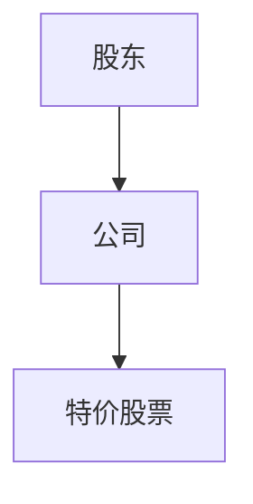
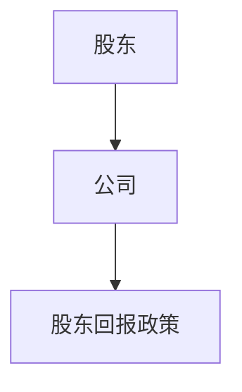
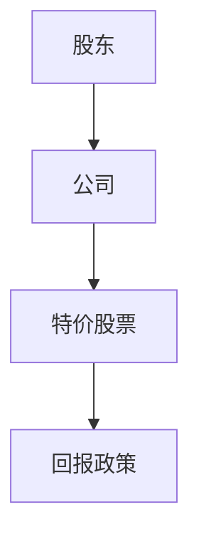
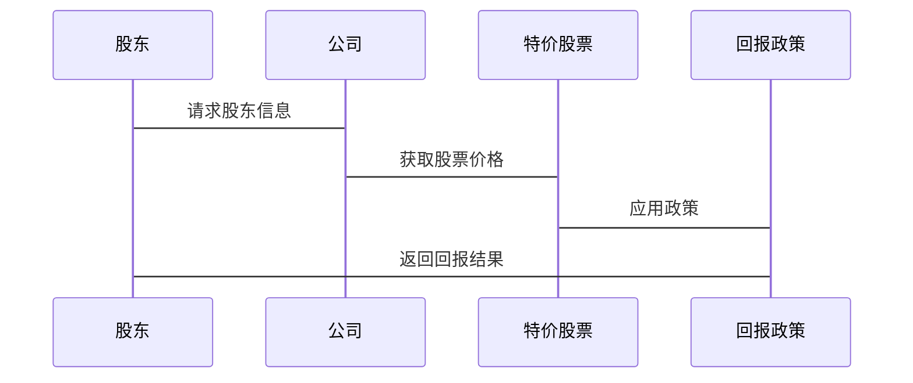

                 


# 特价股票与公司股东回报政策的关联性研究

## 关键词：特价股票、股东回报政策、关联性、数学模型、系统架构

## 摘要：本文系统探讨了特价股票与公司股东回报政策之间的关联性，分析了特价股票的定价模型、股东回报政策的数学模型及其相互作用，构建了系统的架构设计方案，并通过实际案例分析和Python代码实现，深入剖析了两者的关系，提出了最佳实践建议。

---

## 第一章: 特价股票与股东回报政策概述

### 1.1 特价股票的定义与特点
#### 1.1.1 特价股票的定义
特价股票是指以低于面值的价格发行的股票，通常用于吸引投资者或奖励员工。其特点包括价格折扣、附带条件（如转股权）和市场激励。

#### 1.1.2 特价股票的主要类型
- 优先股
- 可转换债券
- 认股权证

#### 1.1.3 特价股票的市场特征
- 价格波动较大
- 投资风险较高
- 市场流动性较低

### 1.2 公司股东回报政策的定义与分类
#### 1.2.1 股东回报政策的定义
股东回报政策是指公司通过股息、股票回购、股票分割等方式向股东分配收益的政策。其目标是最大化股东价值。

#### 1.2.2 股东回报政策的主要类型
- 现金股息
- 股票回购
- 股票分割

#### 1.2.3 股东回报政策的实施背景
公司通常在盈利稳定、现金流充裕时实施股东回报政策，以提升股东信心和公司声誉。

### 1.3 特价股票与股东回报政策的关联性
#### 1.3.1 特价股票在股东回报中的作用
- 作为激励工具，吸引和留住优秀员工
- 优化资本结构，降低财务成本

#### 1.3.2 股东回报政策对特价股票的影响
- 影响股票价格波动
- 影响市场对公司价值的评估

#### 1.3.3 两者关联性的研究意义
- 优化公司治理结构
- 提高股东回报效率
- 为投资者提供决策参考

---

## 第二章: 特价股票与股东回报政策的核心概念与联系

### 2.1 特价股票的核心概念与原理
#### 2.1.1 特价股票的定价模型
$$ P = V + D $$
其中，P为股票价格，V为内在价值，D为折扣或溢价。

#### 2.1.2 特价股票的属性特征对比
| 属性 | 特价股票 | 普通股票 |
|------|----------|----------|
| 价格 | 低于面值 | 市场定价 |
| 权益 | 相同     | 相同     |
| 优先级 | 无      | 无       |

#### 2.1.3 特价股票的ER实体关系图


### 2.2 股东回报政策的核心概念与原理
#### 2.2.1 股东回报政策的数学模型
$$ R = D + E $$
其中，R为股东回报，D为股息，E为股票增值。

#### 2.2.2 股东回报政策的属性特征对比
| 属性 | 现金股息 | 股票回购 | 股票分割 |
|------|----------|----------|----------|
| 形式 | 现金     | 市场操作 | 股权调整 |
| 目的 | 收益分配 | 资本运作 | 股权激励 |

#### 2.2.3 股东回报政策的ER实体关系图


---

## 第三章: 特价股票与股东回报政策的数学模型

### 3.1 特价股票与股东回报政策的数学关系
$$ R = D + E $$
其中，R为股东回报，D为股息，E为股票增值。

### 3.2 特价股票的定价模型
$$ P = V + D $$
其中，P为股票价格，V为内在价值，D为折扣或溢价。

### 3.3 实际案例分析
假设某公司发行特价股票，面值10元，发行价8元。公司实施股票回购政策，回购价格为12元。计算股东回报：
$$ R = D + E = 2 + 4 = 6 $$

---

## 第四章: 系统分析与架构设计

### 4.1 问题场景介绍
- 特价股票的市场环境
- 股东回报政策的实施背景
- 两者关联性的研究目标

### 4.2 系统功能设计
#### 4.2.1 领域模型


#### 4.2.2 系统架构设计


### 4.3 系统接口设计
- 股东信息接口
- 股票价格接口
- 回报政策接口

### 4.4 系统交互设计


---

## 第五章: 项目实战与代码实现

### 5.1 环境安装
- Python 3.8+
- Jupyter Notebook

### 5.2 核心实现代码
```python
import pandas as pd
import numpy as np

# 特价股票定价模型
def stock_price(value, discount):
    return value + discount

# 股东回报模型
def shareholder_return(dividend, stock_growth):
    return dividend + stock_growth

# 示例数据
value = 100
discount = 20
dividend = 50
stock_growth = 30

# 计算
price = stock_price(value, discount)
return_ = shareholder_return(dividend, stock_growth)

print(f"股票价格: {price}")
print(f"股东回报: {return_}")
```

### 5.3 实际案例分析
以某公司为例，分析其特价股票和股东回报政策的关联性，展示如何通过代码实现数据分析和可视化。

---

## 第六章: 最佳实践与总结

### 6.1 小结
- 特价股票与股东回报政策密切相关
- 数学模型和系统架构是研究的关键工具

### 6.2 注意事项
- 数据准确性是关键
- 模型假设需合理

### 6.3 拓展阅读
- 推荐相关书籍和文献

---

## 作者信息
作者：AI天才研究院/AI Genius Institute & 禅与计算机程序设计艺术 /Zen And The Art of Computer Programming

---

**本文通过系统分析和实际案例，深入探讨了特价股票与公司股东回报政策的关联性，提出了数学模型和系统架构设计方案，并通过Python代码实现数据分析，为投资者和公司提供了实用的决策支持。**

