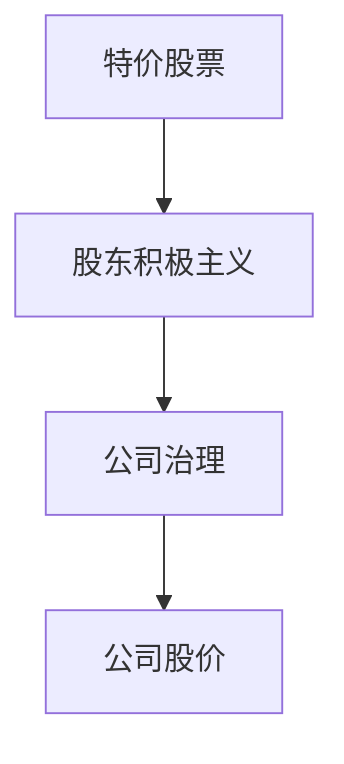
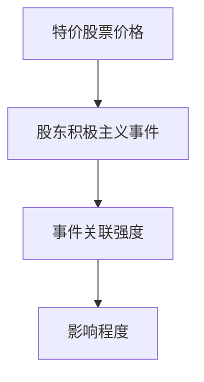
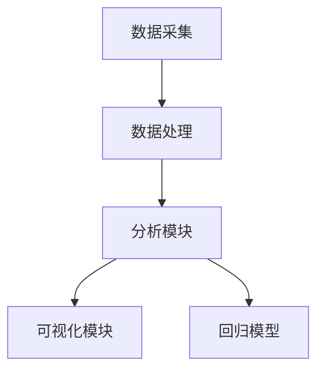
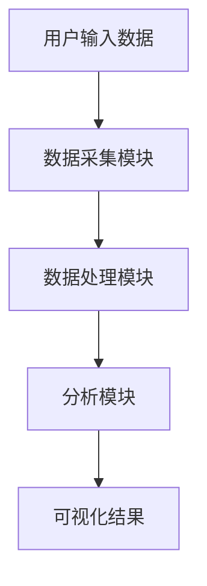

                 


# 特价股票与公司股东积极主义的关联性研究

> 关键词：特价股票、公司股东积极主义、关联性、量化分析、投资策略

> 摘要：本文深入探讨了特价股票与公司股东积极主义之间的关联性，从定义、背景、核心概念、算法原理、数学模型、系统架构到项目实战，结合理论分析和实际案例，系统性地研究了两者的相互影响。通过量化分析的方法，本文提出了基于事件关联分析和回归分析的数学模型，构建了系统功能和架构设计，并通过具体案例分析验证了模型的有效性。最后，本文总结了研究发现，并提出了未来研究的方向和实践中的注意事项。

---

## 第一部分：特价股票与公司股东积极主义的背景与概念

### 第1章：特价股票与公司股东积极主义的概述

#### 1.1 特价股票的定义与特征

##### 1.1.1 特价股票的定义
特价股票是指市场价格低于面值的股票。这类股票通常出现在公司财务状况不佳、市场信心不足或市场流动性不足的情况下。特价股票的特性使其成为投资者关注的焦点，尤其是在市场波动剧烈时。

##### 1.1.2 特价股票的类型
- **优先股**：拥有优先分红和优先清偿权的股票。
- **普通股**：代表公司所有权的常见股票类型。
- **低价股**：市场价格相对较低的股票，通常来自小盘股或财务状况不佳的公司。

##### 1.1.3 特价股票的市场表现与风险
特价股票的波动性较高，投资者可能面临较高的市场风险和流动性风险。然而，特价股票也存在较高的潜在收益，尤其是在公司基本面改善的情况下。

#### 1.2 公司股东积极主义的定义与特征

##### 1.2.1 股东积极主义的定义
股东积极主义是指股东通过收购、代理权争夺、董事会参与等方式，积极参与公司治理，以实现自身利益最大化的行为。

##### 1.2.2 股东积极主义的主要表现形式
- **收购与并购**：通过收购公司控制权，改变公司战略和管理层。
- **代理权争夺**：通过赢得股东大会，获得董事会席位。
- **股东诉讼**：针对公司管理层或董事会提起诉讼，以维护股东权益。

##### 1.2.3 股东积极主义的动机与目标
股东积极主义的动机主要包括追求投资回报、避免代理成本和实现控制权。其目标通常包括提高公司效率、增加股东价值和改善公司治理。

#### 1.3 特价股票与股东积极主义的关联性背景

##### 1.3.1 特价股票市场的现状与问题
当前，特价股票市场存在流动性不足、信息不对称和市场波动性高等问题。这些问题使得投资者在决策时面临较大的不确定性。

##### 1.3.2 股东积极主义的兴起与发展趋势
随着投资者对回报要求的提高和公司治理意识的增强，股东积极主义在全球范围内逐渐兴起。尤其是在机构投资者和大型基金的推动下，股东积极主义成为公司治理的重要手段。

##### 1.3.3 特价股票与股东积极主义的初步关联
特价股票的低价特性和高波动性为股东积极主义提供了低成本的切入点。同时，股东积极主义的介入可能改变公司基本面，进而影响股票价格。

---

### 第2章：特价股票与公司股东积极主义的核心概念

#### 2.1 特价股票的核心概念

##### 2.1.1 特价股票的形成机制
特价股票的形成通常与公司财务状况恶化、市场流动性不足或投资者情绪低落有关。这些因素共同作用，导致股票价格低于面值。

##### 2.1.2 特价股票的市场影响
特价股票的存在可能影响市场的整体稳定性，尤其是在市场出现系统性风险时。然而，特价股票也可能为投资者提供低价介入的机会。

##### 2.1.3 特价股票的投资者行为分析
投资者在面对特价股票时，通常表现出较高的风险偏好和短期行为。他们可能通过高频交易或短期套利来获利。

#### 2.2 公司股东积极主义的核心概念

##### 2.2.1 股东积极主义的理论基础
股东积极主义的理论基础主要包括代理理论、利益相关者理论和效率市场假说。代理理论强调股东对管理层的监督和控制，利益相关者理论则关注公司各利益相关者的权益平衡。

##### 2.2.2 股东积极主义的实施路径
- **收购与并购**：通过收购公司控制权，改变公司治理结构。
- **代理权争夺**：通过赢得股东大会，获得董事会席位。
- **股东诉讼**：通过法律手段，迫使公司改善治理结构。

##### 2.2.3 股东积极主义的法律与伦理考量
股东积极主义的实施需要遵循相关法律法规，并注意其对其他利益相关者的影响。伦理上，股东积极主义应平衡自身利益与公司和社会整体利益。

#### 2.3 特价股票与股东积极主义的关联性分析

##### 2.3.1 特价股票与股东积极主义的属性对比
| 特性 | 特价股票 | 股东积极主义 |
|------|----------|--------------|
| 目标 | 获取超额收益 | 改善公司治理 |
| 风险 | 市场波动高 | 法律和财务风险 |
| 影响 | 可能改变公司股价 | 可能影响公司战略 |

##### 2.3.2 特价股票与股东积极主义的实体关系图


---

## 第三部分：算法原理与数学模型

### 第3章：算法原理与数学模型

#### 3.1 特价股票与股东积极主义的关联性分析方法

##### 3.1.1 事件关联分析
事件关联分析是一种通过分析事件之间的关联性，判断两者是否相关的方法。在本文中，我们将特价股票的价格波动与股东积极主义事件（如代理权争夺）进行关联性分析。

##### 3.1.2 回归分析
回归分析是一种统计学方法，用于分析变量之间的关系。通过建立回归模型，我们可以量化股东积极主义对特价股票价格的影响程度。

##### 3.1.3 事件关联分析的流程图


#### 3.2 数学模型与公式

##### 3.2.1 事件关联强度公式
$$ \text{关联强度} = \frac{\text{事件发生频率}}{\text{总样本数}} $$

##### 3.2.2 回归模型公式
$$ \text{股价变化} = \beta_0 + \beta_1 \times \text{股东积极主义指标} + \epsilon $$

##### 3.2.3 事件关联分析的代码实现
```python
import pandas as pd
from sklearn.linear_model import LinearRegression

# 数据加载
data = pd.read_csv('stock_data.csv')

# 定义股东积极主义指标
data['股东积极主义指标'] = data['股东积极主义事件'].apply(lambda x: 1 if x == '发生' else 0)

# 建立回归模型
model = LinearRegression()
model.fit(data[['股东积极主义指标']], data['股价变化'])

# 输出系数
print('回归系数:', model.coef_)
```

---

## 第四部分：系统分析与架构设计

### 第4章：系统分析与架构设计

#### 4.1 问题场景介绍
本文构建了一个量化分析系统，用于研究特价股票与股东积极主义之间的关联性。系统需要处理大量股票数据和股东积极主义事件数据，并通过算法模型进行分析。

#### 4.2 系统功能设计
- 数据采集模块：采集股票价格和股东积极主义事件数据。
- 数据处理模块：清洗和预处理数据。
- 分析模块：使用事件关联分析和回归分析进行关联性分析。
- 可视化模块：将分析结果以图表形式展示。

#### 4.3 系统架构设计


#### 4.4 系统接口设计
- 数据接口：提供API用于数据的输入和输出。
- 分析接口：提供API用于事件关联分析和回归分析。

#### 4.5 系统交互流程图


---

## 第五部分：项目实战

### 第5章：项目实战

#### 5.1 环境安装
- 安装Python和相关库（Pandas、Scikit-learn）。
- 数据源：获取特价股票数据和股东积极主义事件数据。

#### 5.2 核心代码实现
```python
import pandas as pd
from sklearn.linear_model import LinearRegression
import matplotlib.pyplot as plt

# 数据加载
data = pd.read_csv('stock_data.csv')

# 数据预处理
data['股东积极主义指标'] = data['股东积极主义事件'].apply(lambda x: 1 if x == '发生' else 0)

# 建立回归模型
model = LinearRegression()
model.fit(data[['股东积极主义指标']], data['股价变化'])

# 可视化
plt.scatter(data['股东积极主义指标'], data['股价变化'])
plt.plot(data['股东积极主义指标'], model.predict(data[['股东积极主义指标']]), color='red')
plt.xlabel('股东积极主义指标')
plt.ylabel('股价变化')
plt.show()
```

#### 5.3 案例分析与解读
通过具体案例分析，验证模型的有效性。例如，分析某公司股价在股东积极主义事件发生后的变化情况。

#### 5.4 项目小结
总结项目实施过程中的经验教训，提出改进建议。

---

## 第六部分：总结与建议

### 第6章：总结与建议

#### 6.1 研究结论
通过本文的研究，我们得出结论：股东积极主义对特价股票的价格具有显著影响。具体表现为，股东积极主义事件的发生往往伴随着股价的显著波动。

#### 6.2 未来研究方向
- 进一步研究股东积极主义的长期影响。
- 探讨不同类型股东积极主义对股票价格的不同影响。

#### 6.3 投资者建议
投资者在面对特价股票时，应充分考虑股东积极主义的可能性，并结合市场环境和公司基本面进行决策。

---

## 作者：AI天才研究院/AI Genius Institute & 禅与计算机程序设计艺术 /Zen And The Art of Computer Programming

---

### 文章总结
本文系统性地研究了特价股票与公司股东积极主义的关联性，从理论分析到实际案例，结合量化分析的方法，构建了完整的分析框架。通过本文的研究，读者可以更好地理解两者的相互影响，并在实际投资中做出更明智的决策。

