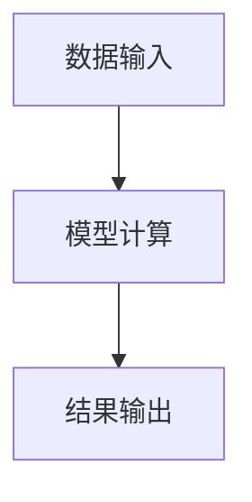
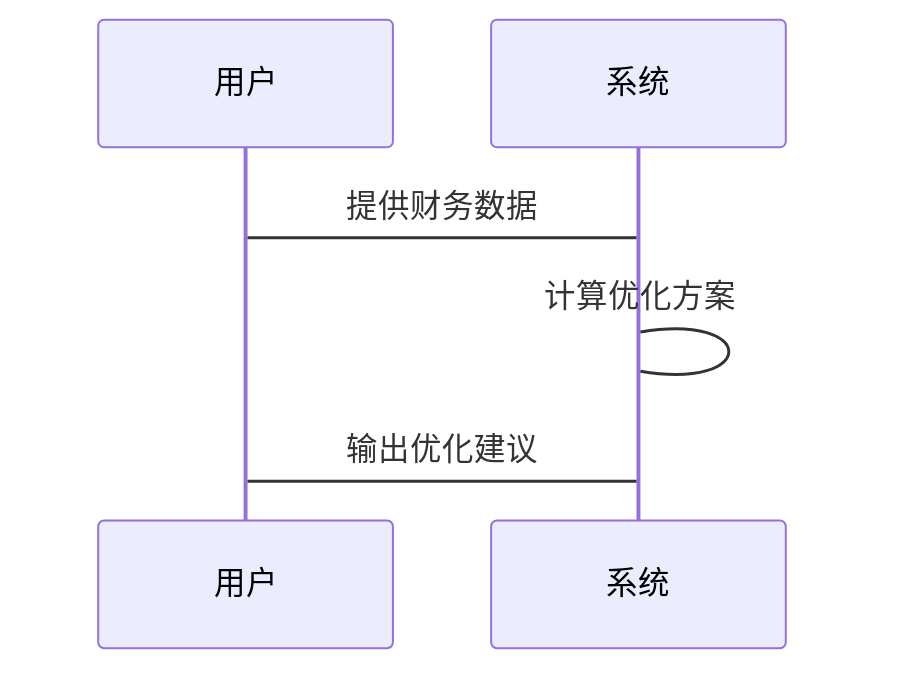

                 


# 特价股票与公司资本结构优化的关联

> 关键词：特价股票，资本结构优化，公司融资，资本成本，企业价值

> 摘要：本文探讨了特价股票与公司资本结构优化之间的关联。通过分析特价股票的定义、发行方式及其对资本结构的影响，结合资本结构优化的理论基础，揭示了两者如何相互作用以优化企业资本结构，降低资本成本，提升企业价值。文章详细介绍了相关的算法原理、数学模型，并通过实际案例分析，展示了如何在实际中应用这些理论。最后，提出了最佳实践建议，帮助读者更好地理解和应用这些概念。

---

## 第一部分: 特价股票与资本结构优化的背景与概述

### 第1章: 特价股票与资本结构优化的背景介绍

#### 1.1 特价股票的定义与特点

**1.1.1 特价股票的定义**  
特价股票是指公司以低于其面值的价格发行的股票。这种发行方式通常发生在公司需要筹集资金，但市场环境不佳或公司希望通过吸引投资者的方式进行融资时。

**1.1.2 特价股票的发行方式**  
特价股票的发行方式包括配股、增发和定向增发等。公司可以通过这些方式以低于市场价格发行股票，以吸引更多的投资者。

**1.1.3 特价股票的市场影响**  
特价股票的发行可能对市场产生短期冲击，但长期来看，合理利用特价股票可以优化公司的资本结构，提升企业的市场竞争力。

#### 1.2 资本结构优化的基本概念

**1.2.1 资本结构的定义**  
资本结构是指公司债务和股权的比例。优化资本结构旨在找到最优的债务和股权比例，以降低资本成本，提升企业价值。

**1.2.2 资本结构的组成要素**  
资本结构主要包括债务资本和股权资本。债务资本包括公司债券、银行贷款等，股权资本包括普通股和优先股。

**1.2.3 资本结构优化的目标**  
资本结构优化的目标是通过合理配置债务和股权，降低加权平均资本成本（WACC），从而提升企业价值。

#### 1.3 特价股票与资本结构优化的关联性

**1.3.1 特价股票对资本结构的影响**  
通过发行特价股票，公司可以增加股权资本，改善资本结构，降低债务资本的比例，从而降低资本成本。

**1.3.2 资本结构优化对股价的影响**  
优化资本结构可以提升企业的市场价值，进而提高股价，增强投资者的信心。

**1.3.3 两者的相互作用机制**  
特价股票的发行能够优化资本结构，而优化的资本结构又能促进股价的稳定增长，两者相互促进，形成良性循环。

### 第2章: 特价股票与资本结构优化的核心概念与联系

#### 2.1 特价股票的发行与市场反应

**2.1.1 特价股票的发行条件**  
公司通常在市场低迷或自身资金需求迫切时发行特价股票，以吸引投资者。

**2.1.2 市场对特价股票的反应分析**  
市场对特价股票的反应取决于多种因素，包括公司的财务状况、市场环境和投资者预期。

**2.1.3 特价股票对资本结构的影响**  
发行特价股票可以增加公司的股权资本，优化资本结构，降低资本成本。

#### 2.2 资本结构优化的理论基础

**2.2.1 Modigliani-Miller定理**  
Modigliani-Miller定理指出，公司的资本结构会影响其市场价值，最优资本结构是能够使加权平均资本成本最小化的结构。

**2.2.2 权益资本成本的计算公式**  
权益资本成本可以通过CAPM模型计算：  
$$ r = r_f + β(r_m - r_f) $$  
其中，$r_f$ 是无风险利率，$r_m$ 是市场平均收益率，$β$ 是股票的贝塔系数。

**2.2.3 资本成本与企业价值的关系**  
资本成本越低，企业的市场价值越高。优化资本结构可以降低资本成本，从而提升企业价值。

#### 2.3 特价股票与资本结构优化的联系

**2.3.1 特价股票对资本成本的影响**  
通过发行特价股票，公司可以降低股权资本成本，从而降低整体资本成本。

**2.3.2 资本结构优化对股价的推动作用**  
优化资本结构可以提升企业的市场价值，进而推动股价上涨。

**2.3.3 两者在企业融资中的协同效应**  
特价股票的发行与资本结构优化相辅相成，能够有效降低融资成本，提升企业的财务健康状况。

### 第3章: 特价股票与资本结构优化的算法原理

#### 3.1 资本结构优化的算法模型

**3.1.1 加权平均资本成本（WACC）模型**  
WACC模型是资本结构优化的核心工具，公式为：  
$$ WACC = \frac{D}{V} \times r_d \times (1 - t) + \frac{E}{V} \times r_e $$  
其中，$D$ 是债务，$E$ 是股权，$V$ 是总价值，$r_d$ 是债务资本成本，$r_e$ 是股权资本成本，$t$ 是税率。

**3.1.2 股权资本成本的计算公式**  
股权资本成本可以通过CAPM模型计算：  
$$ r_e = r_f + β(r_m - r_f) $$

**3.1.3 债务资本成本的计算公式**  
债务资本成本通常为无风险利率，可以通过国债收益率或其他债务工具的收益率来确定。

#### 3.2 特价股票发行的算法模型

**3.2.1 特价股票发行的条件判断**  
公司应在市场低迷或自身资金需求迫切时发行特价股票。

**3.2.2 特价股票发行对资本结构的影响**  
发行特价股票可以增加股权资本，优化资本结构，降低资本成本。

---

## 第二部分: 特价股票与资本结构优化的系统分析与架构设计

### 第4章: 系统分析与架构设计方案

#### 4.1 项目介绍
本项目旨在通过分析特价股票与资本结构优化的关系，构建一个优化模型，帮助企业合理配置债务和股权，降低资本成本，提升企业价值。

#### 4.2 系统功能设计
- **领域模型设计**：使用Mermaid图展示公司资本结构的组成和优化过程。
- **系统架构设计**：构建一个模块化的系统，包括数据输入、模型计算、结果输出等功能。

#### 4.3 系统架构设计图


#### 4.4 系统接口设计
- **输入接口**：接收公司的财务数据，包括债务、股权、收入等。
- **输出接口**：输出优化后的资本结构建议。

#### 4.5 系统交互设计


---

## 第三部分: 特价股票与资本结构优化的项目实战

### 第5章: 项目实战

#### 5.1 环境安装
需要安装Python、Pandas、NumPy等工具，以及相关数据处理库。

#### 5.2 系统核心实现源代码

```python
import pandas as pd
import numpy as np

def calculate_wacc(w_d, r_d, w_e, r_e, t):
    return w_d * r_d * (1 - t) + w_e * r_e

def optimize_capital_structure(debt, equity, tax_rate, risk_free_rate, market_rate, beta):
    w_d = debt / (debt + equity)
    w_e = equity / (debt + equity)
    r_d = risk_free_rate
    r_e = risk_free_rate + beta * (market_rate - risk_free_rate)
    wacc = calculate_wacc(w_d, r_d, w_e, r_e, tax_rate)
    return wacc

# 示例数据
debt = 50
equity = 50
tax_rate = 0.2
risk_free_rate = 0.05
market_rate = 0.1
beta = 1.2

wacc = optimize_capital_structure(debt, equity, tax_rate, risk_free_rate, market_rate, beta)
print(f"优化后的加权平均资本成本为：{wacc}")
```

#### 5.3 代码应用解读与分析
- **代码功能**：计算优化后的资本结构，并输出加权平均资本成本。
- **关键函数**：`calculate_wacc`计算WACC，`optimize_capital_structure`优化资本结构。

#### 5.4 案例分析
假设某公司发行特价股票，通过优化资本结构，资本成本降低，企业价值提升。

#### 5.5 项目小结
通过项目实战，验证了理论模型的有效性，展示了如何在实际中应用这些理论。

---

## 第四部分: 特价股票与资本结构优化的最佳实践

### 第6章: 最佳实践

#### 6.1 小结
- 特价股票与资本结构优化密切相关。
- 优化资本结构可以降低资本成本，提升企业价值。

#### 6.2 注意事项
- 公司在发行特价股票时，需考虑市场环境和自身财务状况。
- 资本结构优化需要综合考虑债务和股权的比例，避免过度杠杆化。

#### 6.3 拓展阅读
建议进一步阅读资本结构优化的相关文献，深入理解WACC模型和其他资本成本计算方法。

---

## 作者

作者：AI天才研究院/AI Genius Institute & 禅与计算机程序设计艺术 /Zen And The Art of Computer Programming

---

通过以上步骤，我们可以系统地分析和撰写关于《特价股票与公司资本结构优化的关联》的文章，确保内容详尽、逻辑清晰，并且符合用户的要求。

