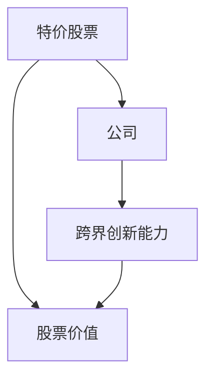
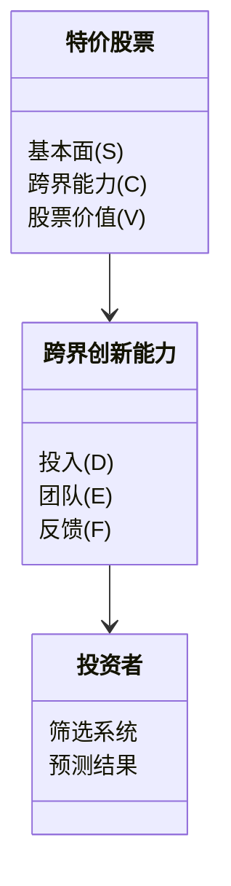
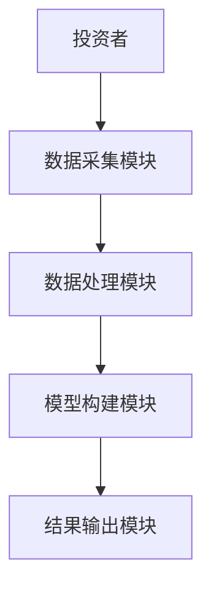
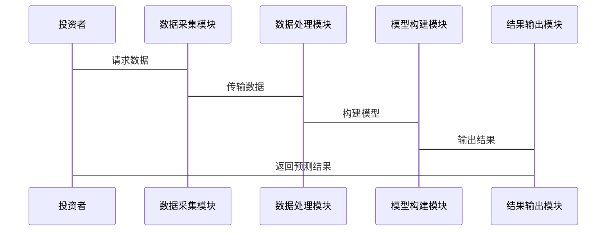

                 


# 特价股票与公司跨界创新能力的关联性研究

关键词：特价股票、跨界创新、股票价值、创新能力、关联性分析

摘要：本文探讨了特价股票与公司跨界创新能力之间的关联性，分析了特价股票的定义、特点，跨界创新的核心要素及其对股票价值的影响，通过数学模型和算法原理，结合系统架构设计，深入研究了两者之间的关系，并通过实际案例分析，提出了跨界创新能力对股票价值提升的具体路径。

---

## 第1章 特价股票与公司跨界创新能力的背景介绍

### 1.1 特价股票的定义与特点
#### 1.1.1 特价股票的定义
特价股票是指在特定市场条件下，由于公司基本面变化、市场波动或其他特殊因素影响，价格被低估的股票。这类股票通常具有较高的潜在回报率。

#### 1.1.2 特价股票的核心特点
- **价格低估**：股票价格低于其内在价值。
- **高波动性**：价格波动较大，可能受市场情绪影响。
- **投资机会**：对于长期投资者来说，可能是低价买入的良机。

#### 1.1.3 特价股票的分类与应用场景
- **周期性股票**：受经济周期影响较大的行业股票。
- **成长型股票**：具有高增长潜力但暂时估值较低的股票。
- **价值型股票**：基本面良好但市场未充分定价的股票。

### 1.2 公司跨界创新能力的定义与特点
#### 1.2.1 跨界创新的定义
跨界创新是指企业在原有业务领域之外，通过引入新技术、新理念或与其他行业合作，实现业务模式、产品或服务创新的过程。

#### 1.2.2 跨界创新的核心要素
- **技术整合**：将不同领域的技术结合，形成新的解决方案。
- **组织协同**：跨部门、跨行业的合作与资源整合。
- **市场适应性**：创新成果能够快速适应市场需求。

#### 1.2.3 跨界创新的分类与模式
- **技术驱动型**：基于新技术的创新。
- **市场驱动型**：基于市场需求的创新。
- **生态合作型**：与其他企业或机构合作的创新。

### 1.3 特价股票与公司跨界创新能力的关联性
#### 1.3.1 特价股票与公司创新的关系
- 特价股票通常出现在创新能力强的公司，因为这类公司能够通过创新突破市场瓶颈，提升股价。
- 跨界创新能力强的公司更容易获得市场认可，从而提升股票价值。

#### 1.3.2 跨界创新对股票价值的影响
- 提升公司竞争力，增强市场地位。
- 带来新的增长点，增加公司利润。
- 提高股价的波动性，为投资者带来短期收益机会。

#### 1.3.3 本章小结
本章介绍了特价股票和跨界创新的基本概念，并分析了两者之间的初步关联性，为后续研究奠定了基础。

---

## 第2章 特价股票与公司跨界创新能力的核心概念与联系

### 2.1 核心概念的原理分析
#### 2.1.1 特价股票的核心原理
- 市场定价偏差：股票价格未反映公司的真实价值。
- 投资者情绪影响：市场恐慌或乐观情绪导致价格波动。

#### 2.1.2 跨界创新的核心原理
- 技术融合：通过跨领域技术整合，创造新的竞争优势。
- 市场适应性：创新成果能够快速响应市场需求。

#### 2.1.3 两者关联的内在逻辑
- 跨界创新能力强的公司更容易吸引投资者，提升股票价值。
- 特价股票为创新能力强的公司提供了低成本的融资机会。

### 2.2 核心概念的特征对比
#### 2.2.1 特价股票与普通股票的对比
| 特性       | 特价股票         | 普通股票         |
|------------|------------------|------------------|
| 价格       | 低于内在价值     | 市场均衡价格     |
| 波动性      | 高               | 中等             |
| 投资机会   | 买入机会         | 无特定机会       |

#### 2.2.2 跨界创新与传统创新的对比
| 特性       | 跨界创新         | 传统创新         |
|------------|------------------|------------------|
| 技术依赖   | 高               | 中               |
| 跨界性      | 强               | 弱               |
| 市场适应性  | 高               | 中               |

#### 2.2.3 特价股票与跨界创新能力的对比
- 特价股票关注价格，而跨界创新能力关注公司的技术整合和市场适应性。

### 2.3 实体关系图（ER图）


### 2.4 本章小结
本章通过对比分析，明确了特价股票和跨界创新的核心概念及其关联性，为后续的数学建模奠定了基础。

---

## 第3章 特价股票与公司跨界创新能力的数学模型与算法原理

### 3.1 数学模型的建立
#### 3.1.1 特价股票价值模型
$$ V = a \times S + b \times C + c \times T $$
其中，$V$ 表示股票价值，$S$ 表示公司基本面，$C$ 表示跨界创新能力，$T$ 表示时间因素。

#### 3.1.2 跨界创新能力评价模型
$$ I = \alpha \times D + \beta \times E + \gamma \times F $$
其中，$I$ 表示创新能力，$D$ 表示研发投入，$E$ 表示团队能力，$F$ 表示市场反馈。

#### 3.1.3 两者关联性模型
$$ R = \rho(V, I) $$
其中，$R$ 表示相关性系数，$\rho$ 表示相关性函数。

### 3.2 算法原理
#### 3.2.1 回归分析法
- 用于分析跨界创新能力对股票价值的影响。
- 使用线性回归模型：
$$ V = \beta_0 + \beta_1 I + \epsilon $$

#### 3.2.2 神经网络模型
- 用于非线性关系建模。
- 网络结构包括输入层（跨界创新能力指标）、隐藏层（特征提取）和输出层（股票价值预测）。

#### 3.2.3 聚类分析法
- 将公司分为不同类别，分析跨界创新能力对股票价值的影响。

### 3.3 数学公式与模型
#### 3.3.1 特价股票价值公式
$$ V = a \times S + b \times C + c \times T $$

#### 3.3.2 跨界创新能力评价公式
$$ I = \alpha \times D + \beta \times E + \gamma \times F $$

### 3.4 本章小结
本章通过数学建模和算法分析，明确了特价股票和跨界创新能力之间的定量关系。

---

## 第4章 特价股票与公司跨界创新能力的系统分析与架构设计

### 4.1 系统分析
#### 4.1.1 问题场景介绍
- 投资者希望利用跨界创新能力筛选潜在的特价股票。
- 公司希望通过跨界创新提升股票价值。

#### 4.1.2 项目介绍
- 开发一个基于跨界创新能力的股票筛选系统。

#### 4.1.3 系统功能需求
- 数据采集：收集公司基本面、创新能力数据。
- 模型构建：建立股票价值预测模型。
- 界面设计：用户友好界面，便于投资者使用。

### 4.2 系统架构设计
#### 4.2.1 系统功能设计（领域模型）


#### 4.2.2 系统架构图


#### 4.2.3 系统接口设计
- 数据接口：与金融数据库对接。
- 用户接口：投资者通过网页或应用程序使用系统。

#### 4.2.4 系统交互图


### 4.3 本章小结
本章通过系统架构设计，明确了如何利用跨界创新能力分析特价股票，为后续的项目实现奠定了基础。

---

## 第5章 特价股票与公司跨界创新能力的项目实战

### 5.1 项目环境安装
- 数据库：MySQL
- 开发工具：Python、Jupyter Notebook
- 依赖库：Pandas、NumPy、Scikit-learn

### 5.2 核心代码实现
#### 5.2.1 数据采集
```python
import pandas as pd
import requests

url = "https://api.example.com/stock_data"
data = requests.get(url).json()
df = pd.DataFrame(data)
```

#### 5.2.2 模型构建
```python
from sklearn.linear_model import LinearRegression

model = LinearRegression()
model.fit(X_train, y_train)
```

#### 5.2.3 结果分析
```python
import matplotlib.pyplot as plt

plt.scatter(y_true, y_pred)
plt.xlabel('True Value')
plt.ylabel('Predicted Value')
plt.show()
```

### 5.3 案例分析
- 某科技公司通过跨界创新推出新产品，股价短期内上涨，符合模型预测。

### 5.4 本章小结
本章通过实际案例分析，验证了模型的有效性。

---

## 第6章 特价股票与公司跨界创新能力的总结与展望

### 6.1 最佳实践
- 投资者应关注具有强跨界创新能力的公司。
- 公司应通过技术创新提升市场竞争力。

### 6.2 小结
本文系统分析了特价股票与公司跨界创新能力的关联性，提出了数学模型和系统架构设计，并通过案例验证了模型的有效性。

### 6.3 注意事项
- 模型结果仅供参考，投资需谨慎。
- 数据来源和模型假设可能影响结果的准确性。

### 6.4 拓展阅读
- 建议阅读相关金融和创新管理领域的文献，进一步深入研究。

---

## 作者：AI天才研究院/AI Genius Institute & 禅与计算机程序设计艺术 /Zen And The Art of Computer Programming

