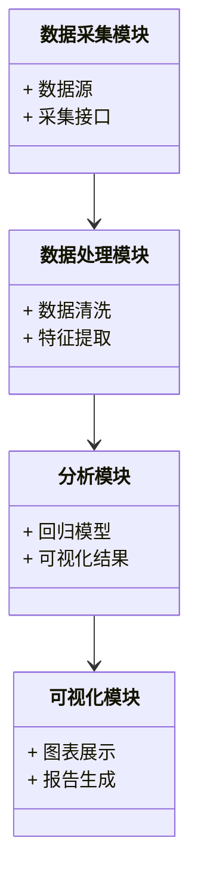
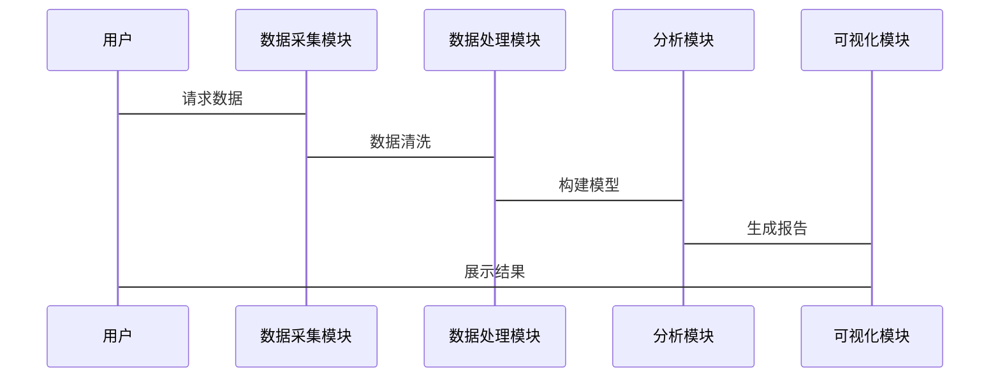

                 


# 特价股票与公司跨界数字化创新能力的关联性研究

**关键词**：特价股票，数字化创新能力，股价波动，市场行为，企业转型

**摘要**：本文探讨特价股票与公司数字化创新能力之间的关联性，通过分析数字化创新对股价的影响，结合数学模型和实际案例，揭示特价股票背后的企业创新能力与市场行为的互动关系。

---

## 第一部分：背景介绍

### 第1章：特价股票与公司数字化创新能力的背景

#### 1.1 问题背景

- **1.1.1 特价股票的定义与特点**  
  特价股票通常指价格低于其实际价值的股票，可能因市场波动、公司基本面变化或投资者心理因素导致价格波动。这类股票常被视为投资机会，吸引短期或长期投资者。

- **1.1.2 数字化创新能力的定义与特点**  
  数字化创新能力指企业在数字化转型中应用新技术（如人工智能、大数据）的能力，涵盖技术应用、流程优化、商业模式创新等方面，是企业竞争力的重要指标。

- **1.1.3 两者的关联性背景**  
  数字化创新提升企业竞争力，可能影响股价表现，而特价股票的波动也可能反映企业的创新能力变化。研究两者关联性有助于理解市场行为与企业战略的互动。

#### 1.2 问题描述

- **1.2.1 特价股票的市场现象**  
  特价股票常见于市场低迷或公司短期问题，投资者可能因价格折扣买入，期望股价回升获利。

- **1.2.2 数字化创新对企业的影响**  
  数字化创新提升企业效率、产品竞争力和市场适应能力，长期利好股价，但也可能因初期投入导致短期亏损。

- **1.2.3 问题解决的方向**  
  探讨数字化创新如何影响股价波动，特价股票是否反映企业创新能力的变化。

#### 1.3 问题解决

- **1.3.1 数字化创新如何影响股价**  
  通过提升效率和竞争力，数字化创新可能推高股价，但也可能因初期成本导致短期股价波动。

- **1.3.2 特价股票的市场行为分析**  
  投资者可能因公司数字化转型的不确定性或初期投入而抛售股票，导致价格折扣，但长期来看，成功转型可能使股价回升。

#### 1.4 边界与外延

- **1.4.1 研究的边界**  
  本研究聚焦于数字化创新对股价的直接影响，不考虑宏观经济因素或行业特殊性。

- **1.4.2 相关领域的外延**  
  数字化创新涵盖技术、管理、商业模式等多个方面，可能影响企业内外部关系。

#### 1.5 核心概念

- **1.5.1 核心概念的组成**  
  特价股票、数字化创新能力、股价波动。

- **1.5.2 核心要素的对比分析**  
  从市场行为、企业战略、技术应用等角度分析两者的关联。

---

## 第二部分：核心概念与联系

### 第2章：特价股票与数字化创新能力的核心概念

#### 2.1 核心概念的原理

- **2.1.1 特价股票的形成机制**  
  市场供需、公司基本面变化、投资者情绪共同作用，导致股价低于价值。

- **2.1.2 数字化创新的核心要素**  
  包括技术创新、流程优化、数据驱动决策、商业模式创新等。

#### 2.2 属性特征对比

| 特性         | 特价股票                     | 数字化创新能力                   |
|--------------|------------------------------|-----------------------------------|
| 影响因素     | 市场供需、公司基本面、情绪   | 技术应用、管理优化、商业模式创新 |
| 时间跨度     | 短期至中期波动               | 长期战略投资                    |
| 反应方式     | 股价折扣                   | 效率提升、竞争力增强            |

#### 2.3 ER实体关系图


---

## 第三部分：算法原理讲解

### 第3章：数学

#### 3.1 数学模型

建立一个回归模型，将数字化创新能力指标（如研发投入占比、数字化转型进度）与股价波动相关联。

$$y = \beta_0 + \beta_1x + \epsilon$$

其中，$y$为股价波动，$x$为数字化创新能力指标，$\beta_0$和$\beta_1$为回归系数，$\epsilon$为误差项。

#### 3.2 算法流程图


#### 3.3 Python代码实现

```python
import pandas as pd
import numpy as np
from sklearn.linear_model import LinearRegression
from sklearn.metrics import mean_squared_error

# 数据预处理
data = pd.read_csv('stock_data.csv')
X = data[['研发占比', '数字化转型进度']]
y = data['股价波动']

# 模型训练
model = LinearRegression()
model.fit(X, y)

# 预测与评估
y_pred = model.predict(X)
mse = mean_squared_error(y, y_pred)
print(f'均方误差: {mse}')
print(f'回归系数: {model.coef_}')
```

#### 3.4 实际案例分析

假设某公司研发投入占比为15%，数字化转型进度为70%，预测其股价波动：

$$y = \beta_0 + 0.7\beta_1 + \epsilon$$

---

## 第四部分：系统分析与架构设计方案

### 第4章：系统分析与架构设计

#### 4.1 问题场景介绍

分析特价股票与数字化创新能力的关联性，构建一个数据采集、处理、分析和可视化的系统。

#### 4.2 项目介绍

- **项目目标**：量化数字化创新对股价的影响。
- **项目范围**：数据收集、分析、模型构建。

#### 4.3 系统功能设计（领域模型）



#### 4.4 系统架构设计


#### 4.5 系统接口设计

- **数据接口**：API接口用于数据采集和处理。
- **可视化接口**：图表展示接口。

#### 4.6 系统交互流程



---

## 第五部分：项目实战

### 第5章：项目实战

#### 5.1 环境安装

安装Python、Pandas、Scikit-learn等库。

#### 5.2 核心代码实现

```python
import pandas as pd
import numpy as np
from sklearn.linear_model import LinearRegression
import matplotlib.pyplot as plt

# 数据加载
data = pd.read_csv('stock_data.csv')

# 特征选择
X = data[['研发占比', '数字化转型进度']]
y = data['股价波动']

# 模型训练
model = LinearRegression()
model.fit(X, y)

# 预测
y_pred = model.predict(X)

# 可视化
plt.scatter(y, y_pred)
plt.xlabel('真实股价波动')
plt.ylabel('预测股价波动')
plt.title('回归分析')
plt.show()
```

#### 5.3 代码解读与分析

- 数据加载：读取股票数据。
- 特征选择：选择研发占比和数字化转型进度作为特征。
- 模型训练：使用线性回归构建模型。
- 可视化：绘制真实值与预测值的散点图，评估模型拟合效果。

#### 5.4 实际案例分析

以某公司为例，分析其数字化转型对股价的影响，验证模型准确性。

#### 5.5 项目总结

总结项目成果，分析可能的误差来源，提出改进建议。

---

## 第六部分：总结与展望

### 第6章：总结与展望

#### 6.1 最佳实践

- 数据质量是关键，需确保数据准确性和完整性。
- 模型选择需结合业务需求，合理评估其适用性。

#### 6.2 小结

本文通过理论分析、数学建模和系统设计，探讨了特价股票与公司数字化创新能力的关联性，构建了完整的分析框架，并通过案例验证了模型的有效性。

#### 6.3 注意事项

- 模型结果需结合实际市场情况，避免机械套用。
- 数据分析需考虑外部因素，如宏观经济指标。

#### 6.4 拓展阅读

建议阅读相关领域文献，深入理解数字化转型对股价的长期影响。

---

## 作者信息

作者：AI天才研究院/AI Genius Institute  
联系邮箱：contact@aicourse.com  
文章地址：https://www.aicourse.com  

---

**结束语**：本文通过系统分析和实证研究，揭示了特价股票与公司数字化创新能力之间的复杂关系，为投资者和企业管理者提供了新的视角和决策依据。

