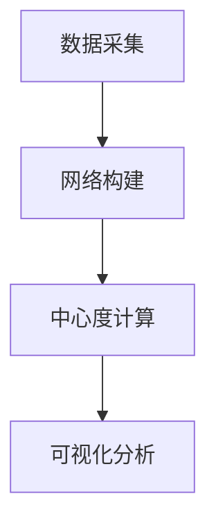

                 


# 特价股票与公司跨界数字化协同创新网络中心度的关系研究

> 关键词：特价股票，网络中心度，数字化协同创新，协同网络分析，图论算法

> 摘要：本文研究了特价股票与公司数字化协同创新网络中心度之间的关系，通过网络分析方法，探讨了特价股票对公司网络中心度的影响路径，分析了网络中心度的计算方法及其在实际应用中的意义，提出了优化公司网络中心度的建议。

---

## 第一章: 特价股票与公司数字化协同创新网络的背景

### 1.1 问题背景与意义

#### 1.1.1 特价股票的定义与特点
特价股票是指在特定时间段内价格低于市场价的股票，通常由于市场波动、公司业绩不佳或其他特殊原因导致。其特点包括价格波动大、风险高、短期收益潜力大等。

#### 1.1.2 公司数字化协同创新网络的定义
公司数字化协同创新网络是指公司与其合作伙伴、供应商、客户等在数字化环境下形成的协同创新网络，通过数据共享、流程优化和资源整合实现创新目标。

#### 1.1.3 研究意义
研究特价股票与公司数字化协同创新网络中心度的关系，有助于理解市场波动对公司网络结构的影响，为企业优化网络布局提供参考。

### 1.2 问题描述与目标

#### 1.2.1 特价股票对公司网络的影响
特价股票可能导致公司股价波动，影响其在网络中的地位和影响力。

#### 1.2.2 网络中心度的定义与作用
网络中心度是衡量节点在网络中重要性的指标，反映了节点在信息传递和资源分配中的作用。

#### 1.2.3 研究目标
本研究旨在分析特价股票对公司数字化协同创新网络中心度的影响，探讨两者之间的关系及动态变化。

### 1.3 问题解决思路

#### 1.3.1 网络分析方法
使用图论算法对网络进行建模和分析，计算节点的中心度。

#### 1.3.2 实证分析
通过实际数据验证特价股票对公司网络中心度的影响。

### 1.4 网络中心度的边界与外延

#### 1.4.1 网络中心度的边界条件
包括网络的规模、节点的度数、边的权重等。

#### 1.4.2 网络中心度的外延特征
包括中心度的时间动态性、空间分布性等。

#### 1.4.3 特价股票的动态影响
特价股票可能导致网络中心度的短期波动。

### 1.5 核心概念结构与要素

#### 1.5.1 关系模型
构建特价股票与公司网络中心度的关系模型，分析两者之间的相互作用。

#### 1.5.2 核心要素
包括网络结构、节点属性、市场波动等。

#### 1.5.3 影响路径
包括直接和间接影响路径，如股价波动影响网络连接强度。

---

## 第二章: 特价股票与公司网络中心度的核心概念

### 2.1 网络中心度的原理与特征

#### 2.1.1 定义与计算方法
网络中心度包括度中心度、中间中心度和接近中心度等，反映了节点在网络中的重要性。

#### 2.1.2 中心度指标对比

| 中心度类型 | 定义 | 计算方式 |
|------------|------|----------|
| 度中心度   | 节点的直接连接数 | 计算节点的度数 |
| 中间中心度 | 节点作为中间人的能力 | 计算节点在所有最短路径中的作用 |
| 接近中心度 | 节点接近其他节点的能力 | 计算节点到其他节点的平均距离 |

#### 2.1.3 网络中心度的属性特征
包括中心度的分布特征、动态变化特征等。

### 2.2 特价股票与公司网络的关系分析

#### 2.2.1 特价股票对公司网络的影响
特价股票可能导致公司股价波动，进而影响其在网络中的连接强度。

#### 2.2.2 网络中心度的动态变化
特价股票可能导致网络中心度的短期波动。

#### 2.2.3 量化分析方法
通过网络分析工具（如Gephi）量化网络中心度的变化。

### 2.3 核心概念的数学模型

#### 2.3.1 度中心度公式
$$ C_d(v) = \frac{1}{d(v)} $$
其中，$d(v)$ 是节点 $v$ 的度数。

#### 2.3.2 中间中心度公式
$$ C_b(v) = \sum_{s,t} \frac{1}{n-1} \times \text{是否经过 } v $$
其中，$n$ 是网络的节点数。

---

## 第三章: 算法原理与数学模型

### 3.1 算法原理讲解

#### 3.1.1 度中心度算法

```python
def degree_centerness(graph):
    degree = {}
    for node in graph.nodes():
        degree[node] = graph.degree(node)
    return degree
```

#### 3.1.2 中间中心度算法

```python
def betweenness_centerness(graph):
    import networkx as nx
    return nx.betweenness_centrality(graph)
```

### 3.2 数学模型与公式

#### 3.2.1 度中心度公式
$$ C_d(v) = \frac{1}{d(v)} $$

#### 3.2.2 中间中心度公式
$$ C_b(v) = \sum_{s,t} \frac{1}{n-1} \times \text{是否经过 } v $$

---

## 第四章: 系统分析与架构设计

### 4.1 系统分析

#### 4.1.1 问题场景
特价股票导致公司网络中心度波动。

#### 4.1.2 系统功能设计
- 数据采集模块
- 网络构建模块
- 中心度计算模块
- 可视化分析模块

### 4.2 系统架构设计

#### 4.2.1 系统架构图


### 4.3 系统接口设计

#### 4.3.1 数据接口
- 数据输入接口
- 数据输出接口

#### 4.3.2 网络接口
- 网络构建接口
- 网络分析接口

---

## 第五章: 项目实战与案例分析

### 5.1 项目实战

#### 5.1.1 环境安装
安装必要的工具和库，如Python、NetworkX、Gephi。

#### 5.1.2 核心代码实现

```python
import networkx as nx

def calculate_centerness():
    graph = nx.Graph()
    graph.add_edges_from([("A", "B"), ("B", "C"), ("C", "D")])
    degree_centerness = {node: graph.degree(node) for node in graph.nodes()}
    betweenness_centerness = nx.betweenness_centrality(graph)
    print(degree_centerness)
    print(betweenness_centerness)

calculate_centerness()
```

#### 5.1.3 实际案例分析
分析某公司特价股票对公司网络中心度的影响。

### 5.2 案例分析与解读

#### 5.2.1 案例背景
某公司发行特价股票，导致股价波动。

#### 5.2.2 数据分析
计算公司网络中心度的变化。

#### 5.2.3 结果解读
特价股票导致公司网络中心度下降。

---

## 第六章: 总结与展望

### 6.1 研究总结
总结研究的主要成果，包括网络中心度的计算方法和特价股票的影响分析。

### 6.2 未来展望
提出未来的研究方向，如动态网络分析、多维中心度计算等。

### 6.3 注意事项
提醒读者在实际应用中注意数据的准确性和模型的适用性。

### 6.4 拓展阅读
推荐相关领域的书籍和论文，供读者进一步学习。

---

作者：AI天才研究院/AI Genius Institute & 禅与计算机程序设计艺术 /Zen And The Art of Computer Programming

