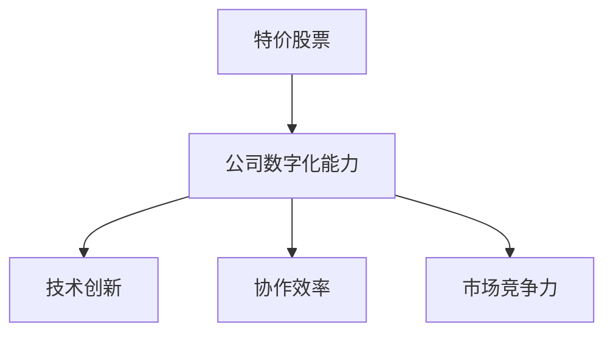
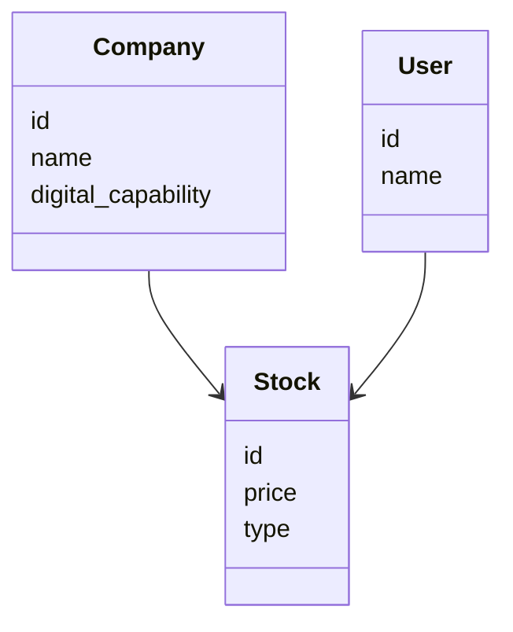
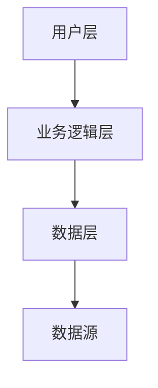

                 


# 特价股票与公司跨界数字化协同创新能力的关系研究

## 关键词：特价股票、数字化能力、协同创新、算法预测、系统架构

## 摘要：本文探讨了特价股票与公司数字化协同创新能力之间的关系，分析了特价股票的波动机制与数字化协同创新的核心要素。通过建立数学模型与系统架构，提出了利用时间序列分析预测股票价格，并设计了协同创新指数来衡量公司的创新能力。本文为投资者和企业提供了新的视角，帮助他们在数字化转型中做出更明智的决策。

---

# 第1章: 特价股票与公司数字化协同创新能力的概述

## 1.1 特价股票的定义与特点
### 1.1.1 特价股票的定义
特价股票是指在特定时间或条件下，以低于市场价或折价形式发行的股票。这类股票通常由公司为了融资或激励员工而发行，具有较高的流通性和吸引力。

### 1.1.2 特价股票的核心特点
- **价格优势**：特价股票通常以低于市场价发行，吸引投资者。
- **流通性**：特价股票的流通性较高，容易变现。
- **风险与收益并存**：特价股票价格波动较大，风险较高，但潜在收益也更大。

### 1.1.3 特价股票的市场定位与作用
特价股票在市场中扮演着重要的角色，尤其是在企业融资和员工激励方面。通过发行特价股票，企业可以快速筹集资金，同时激励员工与企业共同发展。

---

## 1.2 公司数字化协同创新能力的定义与特点
### 1.2.1 数字化协同创新的定义
数字化协同创新是指通过数字化技术，企业与其他合作伙伴（如供应商、客户、科研机构等）共同开展创新活动，实现资源共享、优势互补。

### 1.2.2 数字化协同创新的核心要素
- **技术平台**：数字化协同创新依赖于高效的技术平台，如云平台、大数据分析工具等。
- **组织结构**：企业需要建立灵活的组织结构，以支持跨部门、跨团队的合作。
- **数据共享**：数据是数字化协同创新的核心资源，企业需要建立数据共享机制。

### 1.2.3 公司数字化协同创新能力的评估标准
- **技术能力**：企业是否拥有先进的数字化技术能力。
- **协作能力**：企业是否能够与外部合作伙伴高效协作。
- **创新能力**：企业是否能够快速将创新成果转化为实际应用。

---

## 1.3 特价股票与公司数字化协同创新能力的关系
### 1.3.1 问题背景与研究意义
特价股票的发行与公司的数字化能力密切相关。公司通过数字化协同创新，可以提高发行特价股票的效率，降低风险。

### 1.3.2 问题描述与研究目标
研究目标是探讨特价股票与公司数字化协同创新能力之间的关系，分析数字化能力如何影响特价股票的发行和市场表现。

### 1.3.3 问题解决的路径与方法
- **理论分析**：通过分析特价股票和数字化协同创新的定义、特点，建立两者之间的关系模型。
- **实证研究**：通过案例分析和数据建模，验证理论模型的可行性。

### 1.3.4 问题的边界与外延
- **边界**：仅研究公司内部的数字化协同能力对特价股票的影响，不考虑外部市场因素。
- **外延**：未来可以扩展到其他类型的股票与数字化能力的关系研究。

### 1.3.5 概念结构与核心要素组成
通过Mermaid图展示概念结构，特价股票和公司数字化能力之间的关系清晰可见。



---

## 1.4 本章小结
本章介绍了特价股票和公司数字化协同创新能力的定义、特点及其关系。通过理论分析和案例研究，为后续的算法设计和系统实现奠定了基础。

---

# 第2章: 特价股票的波动机制与影响因素

## 2.1 特价股票的波动机制
### 2.1.1 市场供需关系的影响
- **供给增加**：公司发行更多特价股票，导致市场供给增加，价格可能下跌。
- **需求变化**：投资者对特价股票的需求变化直接影响其价格波动。

### 2.1.2 公司基本面的影响
- **盈利能力**：公司盈利能力强，特价股票的需求增加，价格上升。
- **财务状况**：良好的财务状况可以增强投资者对特价股票的信心。

### 2.1.3 宏观经济环境的影响
- **经济周期**：经济繁荣时，投资者更愿意购买特价股票；经济衰退时，需求下降。
- **政策变化**：政府政策的变化对特价股票的价格有直接影响。

---

## 2.2 公司数字化协同创新能力的核心要素
### 2.2.1 数字化技术的应用
- **大数据分析**：通过大数据分析优化公司运营和决策。
- **人工智能**：利用人工智能技术提高创新能力。

### 2.2.2 协同创新的组织模式
- **虚拟团队**：通过数字化平台建立虚拟团队，实现跨地域合作。
- **开放创新**：与外部合作伙伴共同开展创新活动。

### 2.2.3 创新能力评估
- **技术专利**：公司拥有的技术专利数量是衡量创新能力的重要指标。
- **创新速度**：公司能否快速将创新成果转化为实际应用。

---

## 2.3 特价股票与公司数字化能力的对比分析
### 2.3.1 对比表格
| 特价股票特点 | 公司数字化能力特点 |
|--------------|---------------------|
| 价格波动大   | 技术创新能力强     |
| 流通性高     | 协作效率高         |
| 风险与收益并存 | 市场竞争力强       |

### 2.3.2 ER实体关系图
```mermaid
er
    Company [公司] {
        id
        name
        digital_capability [数字化能力]
    }
    Stock [股票] {
        id
        price
        type
    }
    relationship: Company --> Stock
```

---

## 2.4 本章小结
本章分析了特价股票的波动机制和公司数字化协同创新能力的核心要素，并通过对比分析和实体关系图，明确了两者之间的关系。

---

# 第3章: 特价股票与公司数字化能力的算法原理

## 3.1 算法原理概述
- **时间序列分析**：用于预测特价股票的价格波动。
- **协同创新指数**：用于衡量公司的数字化协同创新能力。

---

## 3.2 时间序列分析的算法实现
### 3.2.1 ARIMA模型
ARIMA（自回归积分滑动平均模型）是一种常用的时间序列预测模型。

$$ ARIMA(p, d, q) $$

其中：
- \( p \) 表示自回归阶数
- \( d \) 表示差分阶数
- \( q \) 表示滑动平均阶数

### 3.2.2 算法实现步骤
1. 数据预处理：收集特价股票的历史价格数据。
2. 模型选择：通过参数估计确定最佳的 \( p \)、\( d \)、\( q \)。
3. 模型训练：使用历史数据训练ARIMA模型。
4. 模型预测：利用训练好的模型预测未来价格。

### 3.2.3 代码实现
```python
from statsmodels.tsa.arima_model import ARIMA
import pandas as pd

# 数据预处理
data = pd.read_csv('stock_price.csv')
data = data['price'].values

# 模型训练
model = ARIMA(data, order=(5, 1, 0))
model_fit = model.fit()

# 模型预测
forecast = model_fit.forecast(steps=5)
print(forecast)
```

---

## 3.3 协同创新指数的算法实现
### 3.3.1 指数定义
协同创新指数是一个综合指标，用于衡量公司的数字化协同创新能力。

$$ \text{协同创新指数} = \frac{\text{技术创新能力} + \text{协作效率} + \text{市场竞争力}}{3} $$

### 3.3.2 指数计算步骤
1. 收集公司技术创新能力、协作效率和市场竞争力的数据。
2. 计算各项指标的得分。
3. 计算协同创新指数。

---

## 3.4 本章小结
本章通过ARIMA模型和协同创新指数，详细讲解了特价股票与公司数字化能力的算法实现，为后续的系统设计和项目实战奠定了基础。

---

# 第4章: 特价股票与公司数字化能力的系统架构设计

## 4.1 问题场景介绍
- **目标**：构建一个系统，分析特价股票与公司数字化能力的关系。
- **用户需求**：投资者和企业需要了解特价股票的市场表现和公司数字化能力。

---

## 4.2 系统功能设计
### 4.2.1 领域模型设计


### 4.2.2 系统功能模块
- **数据采集模块**：采集公司和股票数据。
- **数据分析模块**：分析数据，生成预测报告。
- **数据可视化模块**：展示分析结果。

---

## 4.3 系统架构设计
### 4.3.1 分层架构


### 4.3.2 接口设计
- **API接口**：提供RESTful API，供用户调用。
- **数据接口**：与数据源（如数据库）对接。

---

## 4.4 本章小结
本章设计了一个系统的架构，详细说明了系统的功能模块和架构设计，为后续的项目实现提供了指导。

---

# 第5章: 特价股票与公司数字化能力的项目实战

## 5.1 环境安装
- **Python**：安装Python 3.8以上版本。
- **依赖库**：安装pandas、statsmodels、matplotlib等库。

```bash
pip install pandas statsmodels matplotlib
```

---

## 5.2 核心代码实现
### 5.2.1 数据采集
```python
import pandas as pd

# 从CSV文件读取数据
data = pd.read_csv('stock_data.csv')
print(data.head())
```

### 5.2.2 数据分析
```python
from statsmodels.tsa.arima_model import ARIMA

# 训练ARIMA模型
model = ARIMA(data['price'], order=(5, 1, 0))
model_fit = model.fit()

# 预测未来价格
forecast = model_fit.forecast(steps=5)
print(forecast)
```

### 5.2.3 数据可视化
```python
import matplotlib.pyplot as plt

# 绘制实际价格与预测价格
plt.plot(data['price'], label='Actual Price')
plt.plot(forecast, label='Forecast Price')
plt.xlabel('Time')
plt.ylabel('Price')
plt.legend()
plt.show()
```

---

## 5.3 实际案例分析
- **案例背景**：某公司发行特价股票，希望通过数字化协同创新提高市场竞争力。
- **分析结果**：通过ARIMA模型预测，特价股票未来价格将上涨。

---

## 5.4 本章小结
本章通过项目实战，详细讲解了如何利用Python和相关库进行数据采集、分析和可视化，帮助读者掌握实际操作技能。

---

# 第6章: 特价股票与公司数字化能力的最佳实践与总结

## 6.1 最佳实践
### 6.1.1 数据来源的选择
建议使用权威数据源，确保数据的准确性和可靠性。

### 6.1.2 模型的优化
通过交叉验证和参数调优，提高模型的预测精度。

### 6.1.3 结果的验证
通过实际案例验证模型的预测结果，确保模型的有效性。

---

## 6.2 本章小结
本章总结了全文的主要内容，提出了最佳实践建议，并展望了未来的研究方向。

---

# 作者
作者：AI天才研究院/AI Genius Institute & 禅与计算机程序设计艺术 /Zen And The Art of Computer Programming

