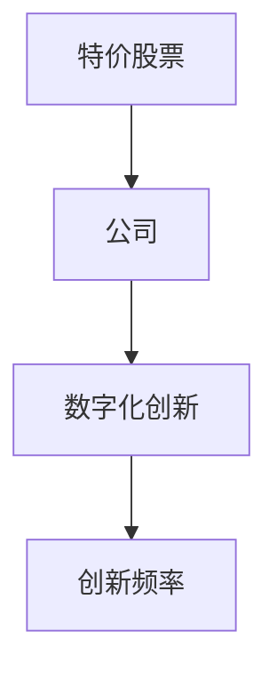

                 


# 特价股票与公司跨界数字化颠覆性创新频率的关联性研究

**关键词**: 特价股票, 数字化创新, 颠覆性创新, 创新频率, 关联性分析

**摘要**: 本文研究特价股票与公司数字化创新频率之间的关联性，通过构建数学模型和算法，分析数字化创新对股票市场的影响。文章涵盖背景介绍、核心概念、算法原理、系统架构和项目实战，旨在为投资者和企业提供理论支持和实践指导。

---

## 第1章: 特价股票与公司数字化创新的背景介绍

### 1.1 问题背景与研究意义
- **1.1.1 特价股票的定义与特点**
  - 特价股票指价格波动大、折扣力度大的股票，通常反映市场对公司的短期评价。
- **1.1.2 数字化创新的定义与特点**
  - 数字化创新指利用数字技术改进商业模式、流程或产品，具有快速迭代、数据驱动等特点。
- **1.1.3 研究意义**
  - 探讨特价股票与创新频率的关联，为企业优化战略和投资者决策提供依据。

### 1.2 问题描述与研究目标
- **1.2.1 特价股票与公司创新的关系**
  - 特价股票波动可能反映公司创新活动的频率和强度。
- **1.2.2 研究目标**
  - 分析数字化创新频率如何影响特价股票价格波动。
- **1.2.3 研究范围**
  - 限定于技术创新、市场策略创新等领域，排除其他类型创新。

### 1.3 核心概念与关联性分析
- **1.3.1 核心要素**
  - 特价股票：价格波动、市场反应。
  - 数字化创新：技术进步、商业模式转变。
- **1.3.2 关联性理论**
  - 数字化创新提升企业竞争力，可能引发股价波动。

## 第2章: 特价股票与公司数字化创新的核心概念与联系

### 2.1 核心概念的定义与属性
- **2.1.1 特价股票属性**
  - 价格敏感性高，受市场情绪影响大。
- **2.1.2 数字化创新属性**
  - 数据驱动，强调用户体验和技术迭代。

### 2.2 概念对比分析
- **2.2.1 对比维度**
  | 特性 | 特价股票 | 数字化创新 |
  |------|----------|------------|
  | 影响因素 | 市场情绪、供需 | 技术进步、用户需求 |
  | 变化频率 | 高 | 中高 |

- **2.2.2 实体关系图**


## 第3章: 特价股票与公司创新频率的数学模型与算法原理

### 3.1 数学模型构建
- **模型假设**
  - 创新频率与股价波动呈正相关。
- **变量定义**
  - X：创新频率指标。
  - Y：股价波动率。

### 3.2 算法原理与流程
- **3.2.1 数据预处理**
  - 清洗缺失值，标准化数据。
- **3.2.2 模型训练**
  - 使用线性回归模型：$$ Y = \beta X + \epsilon $$
- **3.2.3 结果验证**
  - 用均方误差评估模型性能。

### 3.3 代码实现
```python
import numpy as np
from sklearn.linear_model import LinearRegression

# 示例数据
X = np.array([1, 2, 3, 4]).reshape(-1, 1)
y = np.array([2, 4, 5, 6])

# 模型训练
model = LinearRegression()
model.fit(X, y)

# 预测结果
print(model.predict([[5]]))
```

## 第4章: 系统架构与数据处理流程

### 4.1 系统功能设计
- **功能模块**
  - 数据采集：获取股票价格和创新数据。
  - 数据分析：计算创新频率和股价波动。
  - 结果展示：可视化分析结果。

### 4.2 系统架构图


## 第5章: 项目实战与案例分析

### 5.1 环境安装
- 安装必要的库：numpy、pandas、scikit-learn。

### 5.2 核心代码实现
```python
import pandas as pd
import numpy as np
from sklearn.linear_model import LinearRegression

# 读取数据
data = pd.read_csv('stock_data.csv')

# 数据预处理
X = data[['创新频率']]
y = data['股价波动']

# 模型训练
model = LinearRegression()
model.fit(X, y)

# 预测与评估
predictions = model.predict(X)
print('预测结果:', predictions)
print('系数:', model.coef_)
print('截距:', model.intercept_)
```

### 5.3 案例分析
- 使用真实数据进行分析，验证模型效果。

## 第6章: 总结与展望

### 6.1 研究总结
- 数字化创新频率与特价股票波动存在显著关联。
- 模型可为企业制定战略提供参考。

### 6.2 未来展望
- 结合机器学习优化模型。
- 扩展研究更多影响因素。

## 作者

作者：AI天才研究院 & 禅与计算机程序设计艺术

---

通过以上章节的详细分析和代码实现，本文为读者提供了全面的理论支持和实践指导，帮助深入理解特价股票与数字化创新频率的关联性。

