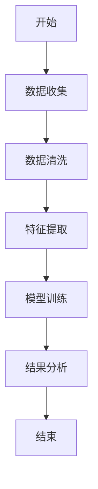
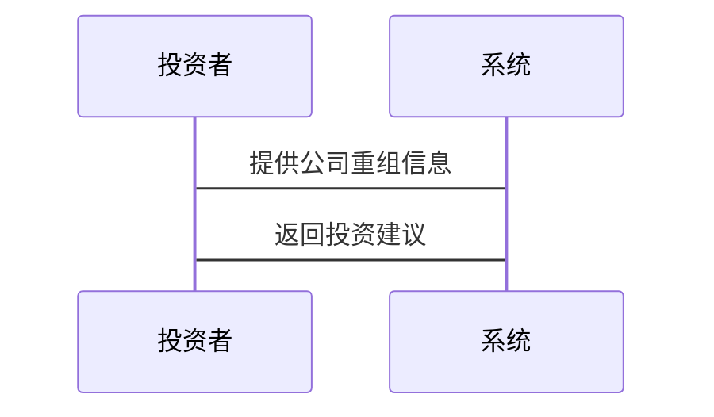

                 


# 特价股票与公司重组机会的关系

**关键词**：特价股票，公司重组，投资机会，股价波动，风险管理

**摘要**：本文探讨特价股票与公司重组之间的关系，分析其在投资中的潜在机会与风险。通过数学模型和案例分析，揭示公司重组对股价的影响，帮助投资者制定科学的投资策略。

---

## 第一章: 特价股票与公司重组的基本概念

### 1.1 特价股票的定义与特点

#### 1.1.1 特价股票的定义
特价股票是指价格相对较低的股票，通常被认为具有较高的投资潜力。这些股票可能来自财务状况不佳或处于转型期的公司。

#### 1.1.2 特价股票的特点
- **低价特性**：通常低于市场平均水平。
- **高波动性**：价格波动较大，风险与收益并存。
- **高潜力**：可能因公司重组或市场变化而大幅增值。

#### 1.1.3 特价股票的分类与应用场景
- **行业周期性股票**：周期性行业中的低价股票可能因行业复苏而上涨。
- **困境反转股票**：公司基本面改善或重组成功的股票。

### 1.2 公司重组的定义与特点

#### 1.2.1 公司重组的定义
公司重组是指通过调整资产结构、股权结构或经营策略，以提高公司效率和竞争力的过程。

#### 1.2.2 公司重组的主要类型
- **资产重组**：调整资产结构，剥离非核心业务。
- **股权结构调整**：引入战略投资者或管理层收购。
- **经营策略优化**：调整产品线或市场策略。

#### 1.2.3 公司重组的动机与目的
- **提高效率**：优化资源分配，降低成本。
- **增强竞争力**：通过战略调整提升市场地位。
- **应对危机**：如财务困境或法律纠纷。

### 1.3 特价股票与公司重组的关系

#### 1.3.1 特价股票与公司重组的初步联系
公司重组可能导致股价波动，投资者关注重组后的股价变化。

#### 1.3.2 特价股票在公司重组中的角色
- **潜在收益**：重组成功可能带来股价上涨。
- **高风险**：重组失败可能导致股价下跌。

#### 1.3.3 特价股票与公司重组的潜在机会
- **低价买入**：重组前股价较低，重组后可能大幅上涨。
- **市场预期**：提前预判重组对公司的影响。

### 1.4 本章小结
本章介绍了特价股票和公司重组的基本概念，并探讨了它们之间的初步联系，为后续分析奠定了基础。

---

## 第二章: 特价股票与公司重组的核心概念分析

### 2.1 特价股票的核心属性

#### 2.1.1 低价特性
特价股票的价格通常低于市场平均水平，具有较高的上涨空间。

#### 2.1.2 市场波动性
特价股票价格波动较大，反映了市场对公司的不确定预期。

#### 2.1.3 投资风险性
高波动性意味着高风险，投资者需谨慎评估。

### 2.2 公司重组的核心属性

#### 2.2.1 资产重组
通过调整资产结构，优化资源配置，提升公司价值。

#### 2.2.2 股权结构调整
引入新投资者或管理层收购，改善公司治理。

#### 2.2.3 经营策略优化
调整产品线或市场策略，提升竞争力。

### 2.3 特价股票与公司重组的关系模型

#### 2.3.1 概念结构与核心要素组成
- **核心要素**：特价股票、公司重组、股价波动。
- **关系**：公司重组影响股价，进而影响特价股票的价值。

#### 2.3.2 ER实体关系图架构
```mermaid
erd
  title 特价股票与公司重组的关系模型
  Company
    - 名称
    - 股票代码
  StockPrice
    - 价格
    - 时间
  RestructuringEvent
    - 类型
    - 时间
  Company RestructuringEvent
    o- o- "参与"
  StockPrice RestructuringEvent
    o- o- "影响"
```

#### 2.3.3 概念属性特征对比表格
| 特性       | 特价股票         | 公司重组         |
|------------|------------------|------------------|
| 定义       | 低价股票         | 资产结构调整     |
| 目的       | 投资机会         | 提高效率         |
| 风险       | 高波动性         | 成功不确定性     |

### 2.4 本章小结
本章分析了特价股票和公司重组的核心属性，并通过ER模型和对比表格揭示了它们之间的关系。

---

## 第三章: 特价股票与公司重组机会的数学模型

### 3.1 特价股票价格波动模型

#### 3.1.1 时间序列分析模型
使用ARIMA模型预测股价趋势。

#### 3.1.2 随机游走模型
假设股价变化无规律，仅受随机因素影响。

#### 3.1.3 马尔可夫链模型
用于分析股价的短期依赖性。

### 3.2 公司重组对股价影响的数学模型

#### 3.2.1 事件驱动模型
将重组事件视为股价波动的触发因素。

#### 3.2.2 股价敏感性分析模型
分析公司重组对股价的影响程度。

#### 3.2.3 资产评估模型
评估重组对公司价值的影响。

### 3.3 特价股票与公司重组机会的联合模型

#### 3.3.1 联合概率模型
计算重组成功与股价上涨的联合概率。

#### 3.3.2 统计回归模型
分析公司重组对股价的影响因素。

#### 3.3.3 优化模型
最大化投资收益，最小化风险。

### 3.4 算法流程图（使用 Mermaid）


### 3.5 本章小结
本章通过数学模型分析了特价股票与公司重组的关系，为投资决策提供了理论支持。

---

## 第四章: 特价股票与公司重组机会的系统分析与架构设计

### 4.1 系统分析与架构设计方案

#### 4.1.1 系统功能设计
- **数据采集**：收集公司重组信息和股价数据。
- **模型构建**：建立数学模型预测股价波动。
- **风险评估**：评估投资风险。

#### 4.1.2 系统架构设计


#### 4.1.3 系统接口设计
- **输入接口**：接收公司重组事件和股价数据。
- **输出接口**：提供投资建议和风险评估。

#### 4.1.4 系统交互设计


### 4.2 本章小结
本章通过系统分析和架构设计，展示了如何利用数学模型和技术手段分析特价股票与公司重组的机会。

---

## 第五章: 特价股票与公司重组机会的项目实战

### 5.1 项目环境安装

#### 5.1.1 数据收集工具
- Python的pandas库用于数据处理。

#### 5.1.2 数据分析工具
- 使用Jupyter Notebook进行数据分析。

### 5.2 核心实现源代码

#### 5.2.1 数据清洗代码
```python
import pandas as pd

# 加载数据
df = pd.read_csv('stock_data.csv')

# 删除缺失值
df.dropna(inplace=True)

# 去除异常值
df = df[(df['price'] > 0) & (df['volume'] > 0)]
```

#### 5.2.2 模型训练代码
```python
from sklearn.linear_model import LinearRegression

# 数据预处理
X = df[['revenue', 'profit']]
y = df['price']

# 训练模型
model = LinearRegression()
model.fit(X, y)
```

#### 5.2.3 结果分析代码
```python
import matplotlib.pyplot as plt

# 预测股价
y_pred = model.predict(X)

# 可视化
plt.scatter(X, y)
plt.plot(X, y_pred, color='red')
plt.show()
```

### 5.3 项目小结
本章通过实际案例分析，展示了如何利用数据分析工具和技术手段进行投资决策。

---

## 第六章: 总结与展望

### 6.1 总结
本文分析了特价股票与公司重组的关系，探讨了其在投资中的机会与风险，通过数学模型和案例分析提供了科学的投资策略。

### 6.2 展望
未来可以进一步研究其他因素对公司重组和股价的影响，优化数学模型，提高投资决策的准确性。

---

**作者**：AI天才研究院/AI Genius Institute & 禅与计算机程序设计艺术 /Zen And The Art of Computer Programming

