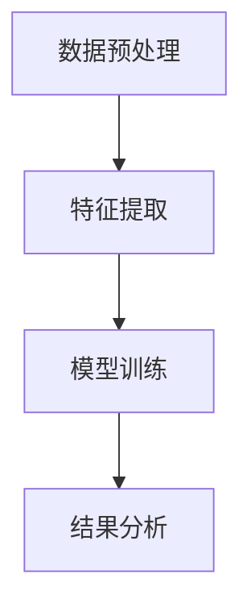
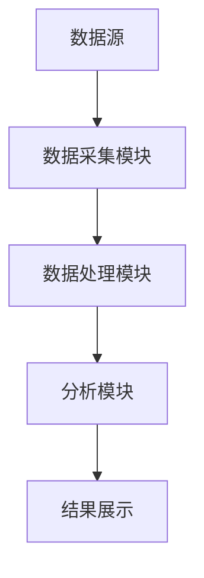
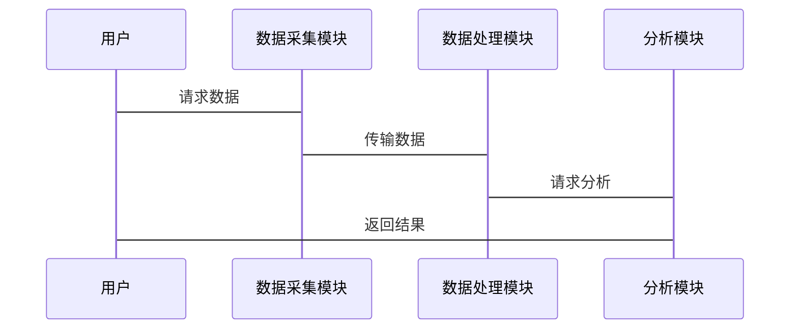

                 


# 特价股票与公司长期创新能力的相关性分析

## 关键词
特价股票，长期创新能力，相关性分析，股价波动，公司创新，投资策略

## 摘要
本文深入探讨了特价股票与公司长期创新能力之间的相关性，分析了影响股价波动的关键因素，提出了评估公司创新能力和制定投资策略的方法。通过数学模型和实证分析，揭示了两者之间的复杂关系，为投资者提供了科学的决策依据。

---

# 特价股票与公司长期创新能力的相关性分析

## 第1章: 特价股票与公司长期创新能力的背景介绍

### 1.1 特价股票的定义与特征
#### 1.1.1 特价股票的定义
特价股票指的是价格低于市场平均值的股票，通常被视为潜在的投资机会。其价格波动较大，具有较高的风险和回报潜力。

#### 1.1.2 特价股票的特征
- 价格低廉：股价低于行业平均水平。
- 高波动性：容易受到市场情绪和消息的影响。
- 市场关注度低：通常属于中小型企业或处于困境中的公司。

#### 1.1.3 特价股票的分类
根据公司规模和行业，特价股票可分为成长型、价值型和周期性股票。

### 1.2 公司长期创新能力的定义与构成
#### 1.2.1 长期创新能力的定义
长期创新能力是指公司在未来持续创新、适应市场变化的能力，包括技术、产品、管理和战略创新。

#### 1.2.2 长期创新能力的构成要素
- 技术创新：研发投入、专利数量。
- 产品创新：新产品推出频率。
- 管理创新：组织结构优化、流程改进。
- 战略创新：市场拓展、业务模式创新。

#### 1.2.3 长期创新能力的评估指标
- 研发投入占比。
- 专利申请数量。
- 产品更新周期。
- 市场扩展速度。

### 1.3 特价股票与公司长期创新能力的相关性研究背景
#### 1.3.1 研究背景
近年来，股市波动加剧，投资者关注如何通过技术创新评估公司长期价值。

#### 1.3.2 研究问题
特价股票的公司是否具备长期创新能力？创新能力如何影响股价？

#### 1.3.3 研究目标与意义
目标是分析创新能力对股价的影响，意义在于帮助投资者制定科学的投资策略。

---

## 第2章: 特价股票与公司长期创新能力的核心概念与联系

### 2.1 特价股票与公司长期创新能力的关系分析
#### 2.1.1 特价股票对创新能力的影响机制
低股价可能反映公司困境，但创新能力是股价回升的关键因素。

#### 2.1.2 长期创新能力对股价的影响路径
创新能力强的公司，股价表现更优，投资者更愿意投资。

#### 2.1.3 两者关系的理论模型
建立一个包含公司创新指标和股价的回归模型。

### 2.2 特价股票与公司长期创新能力的影响因素
#### 2.2.1 公司内部因素
研发投入、管理效率、创新能力是关键。

#### 2.2.2 市场外部因素
行业趋势、经济环境、政策变化影响股价。

#### 2.2.3 行业环境因素
行业竞争程度和技术创新需求影响公司创新能力。

### 2.3 特价股票与公司长期创新能力的实证分析框架
#### 2.3.1 数据来源与处理
使用公开数据，清洗和预处理数据。

#### 2.3.2 模型构建
构建回归模型，分析创新能力对股价的影响。

#### 2.3.3 分析方法
使用多元回归分析，评估各因素的重要性。

---

## 第3章: 特价股票与公司长期创新能力的相关性分析方法

### 3.1 相关性分析的数学模型
#### 3.1.1 相关性系数的计算公式
$$r = \frac{n\sum xy - \sum x \sum y}{\sqrt{n\sum x^2 - (\sum x)^2} \sqrt{n\sum y^2 - (\sum y)^2}}$$

#### 3.1.2 回归分析模型
建立线性回归模型：
$$y = \beta_0 + \beta_1x + \epsilon$$

#### 3.1.3 结构方程模型
通过结构方程模型分析潜变量之间的关系。

### 3.2 相关性分析的算法原理
#### 3.2.1 线性回归分析流程图


#### 3.2.2 结构方程模型的实现代码
```python
import statsmodels.api as sm
from statsmodels.sphreg import GLM
import pandas as pd

# 加载数据
data = pd.read_csv('data.csv')

# 定义模型
model = GLM.from_formula('y ~ x1 + x2 + x3', data)

# 拟合模型
result = model.fit()

# 查看结果
print(result.summary())
```

---

## 第4章: 特价股票与公司长期创新能力的系统分析与架构设计

### 4.1 问题场景介绍
分析特价股票公司的创新能力，预测股价走势。

### 4.2 系统功能设计
设计一个数据分析系统，包括数据采集、处理和分析模块。

### 4.3 系统架构设计


### 4.4 系统接口设计
定义接口，实现数据采集和分析模块的交互。

### 4.5 系统交互序列图


---

## 第5章: 特价股票与公司长期创新能力的项目实战

### 5.1 环境安装
安装Python、Pandas、Statsmodels等库。

### 5.2 系统核心实现源代码
```python
import pandas as pd
import numpy as np
from sklearn.linear_model import LinearRegression
from sklearn.metrics import r2_score

# 数据加载
data = pd.read_csv('stock_data.csv')

# 数据预处理
X = data[['R&D', 'Patents', 'Market']]
y = data['Stock_Price']

# 模型训练
model = LinearRegression()
model.fit(X, y)

# 模型预测
y_pred = model.predict(X)
print('R-squared:', r2_score(y, y_pred))
```

### 5.3 代码应用解读与分析
解读代码功能，分析模型结果，评估创新能力对股价的影响。

### 5.4 实际案例分析
分析某公司数据，展示如何通过模型预测股价走势。

### 5.5 项目小结
总结项目成果，提出改进建议。

---

## 第6章: 特价股票与公司长期创新能力的相关性分析总结

### 6.1 最佳实践 Tips
- 关注公司创新能力。
- 结合市场因素制定投资策略。

### 6.2 小结
总结全文，强调创新能力对股价的重要影响。

### 6.3 注意事项
提醒投资者注意风险，避免盲目跟风。

### 6.4 拓展阅读
推荐相关书籍和论文，鼓励深入研究。

---

## 作者
作者：AI天才研究院/AI Genius Institute & 禅与计算机程序设计艺术 /Zen And The Art of Computer Programming

