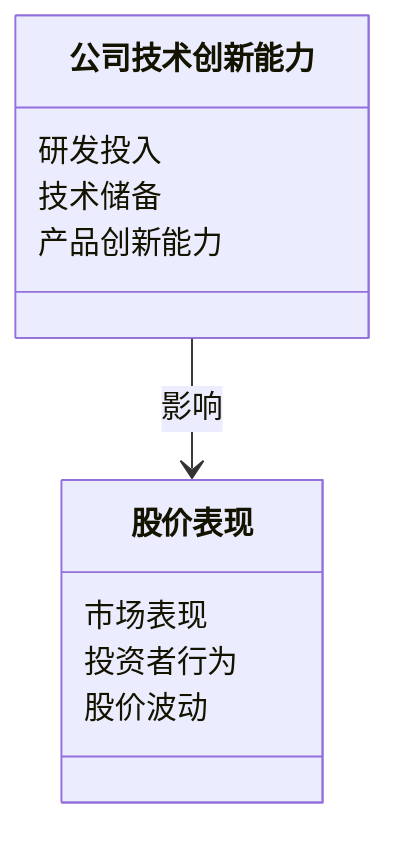
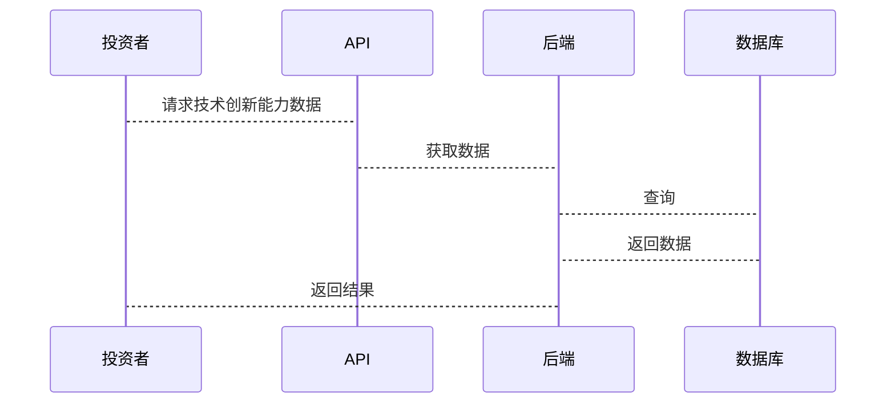

                 

# 特价股票与公司长期技术创新能力的相关性分析

> 关键词：特价股票，技术创新能力，股价波动，相关性分析，投资策略

> 摘要：本文探讨了特价股票与公司技术创新能力之间的相关性。通过定义和分析特价股票及技术创新能力的核心概念，研究技术创新能力如何影响公司业绩和股价，进而影响特价股票的出现。文章结合实证分析和案例研究，构建了技术创新能力对股价影响的系统模型，并提出了投资策略建议。

---

## 第1章: 特价股票概述

### 1.1 特价股票的定义与分类

#### 1.1.1 特价股票的定义
特价股票是指价格低于面值的股票，通常被视为具有投资潜力。其价格波动较大，但潜在回报也较高。特价股票可分为优先股和普通股，其中优先股通常有固定的股息率，普通股则更具风险和不确定性。

#### 1.1.2 特价股票的分类
- 按行业分类：科技、制造、金融等行业的特价股票表现不同。
- 按市场阶段分类：牛市和熊市中的特价股票行为各异。
- 按公司规模分类：小盘股、中盘股和大盘股的特价股票特点不同。

#### 1.1.3 特价股票的特点与优势
- 价格低，投资门槛低。
- 潜在高回报，适合长期投资者。
- 市场波动大，风险较高。

### 1.2 公司技术创新能力的内涵

#### 1.2.1 技术创新的定义
技术创新是公司通过研发新技术、新产品或改进现有技术以提升竞争力的过程。技术创新能力是公司核心竞争力的重要组成部分。

#### 1.2.2 技术创新的核心要素
- 研发投入：包括资金、人力和时间。
- 技术储备：公司拥有的专利、技术储备和研发团队。
- 创新文化：公司内部鼓励创新的氛围和制度。

#### 1.2.3 技术创新与公司竞争力的关系
技术创新是公司保持竞争优势的关键，技术创新能力强的公司通常能更快响应市场变化，推出新产品，占据市场主导地位。

### 1.3 特价股票与技术创新能力相关性研究的意义

#### 1.3.1 研究背景与动机
随着科技发展，技术创新在企业中的作用越来越重要。研究技术创新能力对股价的影响，有助于投资者识别潜在投资机会。

#### 1.3.2 研究目标与范围
本文旨在分析技术创新能力对股价的影响，特别是对特价股票的影响。研究范围涵盖技术创新能力的量化、股价波动分析及两者相关性模型的构建。

#### 1.3.3 研究方法与框架
采用定量分析和定性分析相结合的方法，结合案例研究和实证分析，构建技术创新能力对股价影响的系统模型。

---

## 第2章: 特价股票与技术创新能力的核心概念

### 2.1 特价股票的核心属性

#### 2.1.1 特价股票的市场表现
- 市场表现受多种因素影响，包括宏观经济环境、行业趋势和公司基本面。
- 技术创新能力强的公司，其股票更可能成为特价股票，因为市场对其未来增长潜力有信心，但短期可能因资金链问题或市场波动导致股价下跌。

#### 2.1.2 特价股票的投资者行为
- 投资者通常寻求高风险高回报，对技术创新能力强的公司股票兴趣较大。
- 投资者行为受市场情绪和公司新闻的影响，技术创新能力的 announcements 可能引发股价波动。

#### 2.1.3 特价股票的风险与机会
- 风险：市场波动、公司基本面变化、行业竞争等。
- 机会：技术创新能力强的公司可能因新产品或技术突破而股价回升。

### 2.2 技术创新能力的核心要素

#### 2.2.1 技术研发能力
- 研发投入强度：研发支出占营收的比例。
- 研发团队实力：拥有高素质的研发人员。
- 技术储备：专利数量和质量。

#### 2.2.2 产品创新能力
- 新产品推出速度：公司能否快速响应市场需求。
- 产品生命周期管理：延长产品生命周期，保持市场竞争力。
- 产品差异化：独特的产品设计和技术优势。

#### 2.2.3 技术储备与前瞻性
- 技术储备：公司在技术上的积累，应对未来市场变化。
- 技术前瞻性：公司在新兴技术领域的布局，如人工智能、区块链等。

### 2.3 特价股票与技术创新能力的对比分析

#### 2.3.1 核心概念属性对比
| 属性       | 特价股票                     | 技术创新能力             |
|------------|------------------------------|--------------------------|
| 核心目标   | 投资者获取高回报             | 提升公司竞争力           |
| 变动因素   | 市场情绪、公司业绩           | 研发投入、技术储备       |
| 影响因素   | 宏观经济、行业趋势           | 技术创新、市场需求       |

#### 2.3.2 概念结构与核心要素组成
- 特价股票：市场表现、投资者行为、风险与机会。
- 技术创新能力：研发能力、产品能力、技术储备。

#### 2.3.3 相关性分析框架
通过构建技术创新能力指标体系，分析其对股价的影响，进而研究其与特价股票的相关性。

---

## 第3章: 技术创新能力对股价的影响机制

### 3.1 技术创新能力与公司业绩的关系

#### 3.1.1 技术创新对业绩的促进作用
技术创新能力强的公司，通常能提高生产效率，降低成本，提升利润率。

#### 3.1.2 技术创新与公司利润率的关系
技术创新通过提高产品附加值和降低成本，直接提升公司利润率。

#### 3.1.3 技术创新对市场竞争力的影响
技术创新使公司在市场竞争中占据优势，扩大市场份额，提升收入。

### 3.2 技术创新能力对股价波动的影响

#### 3.2.1 技术创新与股价波动的关联性
技术创新能力强的公司，其股价波动较大，但长期趋势向好。

#### 3.2.2 技术创新对股价的正面影响
- 提升市场地位，吸引投资者。
- 技术突破引发股价上涨。

#### 3.2.3 技术创新对股价的负面影响
- 技术研发失败导致股价下跌。
- 市场对技术创新的预期过高，导致股价回调。

---

## 第4章: 技术创新能力对股价影响的系统分析

### 4.1 系统功能设计

#### 4.1.1 领域模型

#### 4.1.2 系统架构

#### 4.1.3 交互序列

---

## 第5章: 实证分析与案例研究

### 5.1 样本公司选择

#### 5.1.1 样本公司筛选
选择科技行业内的公司，如苹果、谷歌、微软等。

#### 5.1.2 数据收集与处理
收集公司技术创新能力指标（研发投入、专利数量）和股价数据。

#### 5.1.3 数据分析方法
使用回归分析模型，构建技术创新能力对股价影响的模型。

### 5.2 案例分析

#### 5.2.1 案例1：苹果公司
- 技术创新能力：持续推出创新产品，专利数量领先。
- 股价表现：股价长期上涨，技术创新能力是重要因素。

#### 5.2.2 案例2：某新兴科技公司
- 技术创新能力：研发投入较低，但产品创新速度快。
- 股价表现：股价波动大，短期内成为特价股票，长期表现取决于技术创新能力的持续性。

---

## 第6章: 技术创新能力对股价影响的系统模型

### 6.1 系统模型构建

#### 6.1.1 模型构建
构建技术创新能力指标体系，包括研发投入、专利数量、产品创新能力等。

#### 6.1.2 模型验证
通过实证分析验证模型的有效性，调整参数以提高预测精度。

### 6.2 模型应用

#### 6.2.1 投资策略建议
基于模型结果，投资者可以关注技术创新能力强的公司，尤其是在市场低迷时投资特价股票。

#### 6.2.2 风险管理
监控技术创新能力指标，及时调整投资组合，降低风险。

---

## 第7章: 结论与建议

### 7.1 研究结论

技术创新能力是影响股价的重要因素，技术创新能力强的公司更可能成为特价股票，但需关注市场环境和公司基本面。

### 7.2 投资策略建议

投资者应综合考虑技术创新能力和市场环境，制定长期投资策略。

### 7.3 未来研究方向

进一步研究技术创新能力的动态变化及其对股价的长期影响，探索更多影响因素。

---

## 作者信息

作者：AI天才研究院/AI Genius Institute & 禅与计算机程序设计艺术 /Zen And The Art of Computer Programming

