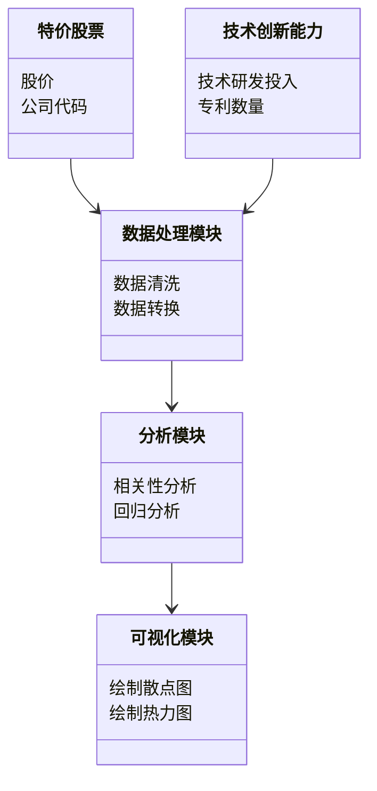
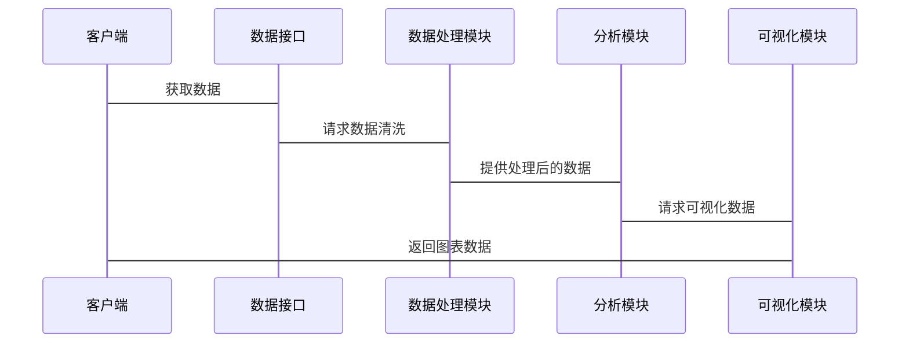

                 


```markdown
# 特价股票与公司长期技术融合创新能力的相关性分析

> 关键词：特价股票，相关性分析，技术创新能力，统计学方法，机器学习，公司长期发展

> 摘要：本文通过分析特价股票与公司技术融合创新能力之间的关系，探讨企业技术创新能力如何影响股价，特别是低价股票的波动。利用统计学方法和机器学习模型，结合实际案例，揭示两者之间的相关性，并为企业制定技术战略提供参考。

---

# 第1章：特价股票与公司技术融合创新能力的背景介绍

## 1.1 特价股票的定义与特点

### 1.1.1 特价股票的定义
特价股票是指价格相对较低的股票，通常具有较高的波动性和风险。这类股票可能属于小型企业或处于困境中的公司，但也可能因潜在的转机而成为投资机会。

### 1.1.2 特价股票的市场特征
- 价格波动较大
- 市值较小
- 投资风险较高
- 可能存在被低估的情况

### 1.1.3 特价股票的投资风险与机会
- 风险：市场波动大、公司基本面差、流动性低
- 机会：潜在的高回报、市场反转的可能性

## 1.2 公司长期技术融合创新能力的定义与特点

### 1.2.1 技术融合创新的定义
技术融合创新是指企业将不同领域的技术结合，创造出新的产品、服务或商业模式的能力。

### 1.2.2 公司技术融合创新的核心要素
- 技术研发能力
- 产品创新能力
- 知识产权保护
- 市场适应能力

### 1.2.3 技术融合创新对企业长期发展的意义
- 提升竞争力
- 开拓新市场
- 增强抗风险能力
- 推动可持续发展

## 1.3 特价股票与公司技术融合创新能力的相关性背景

### 1.3.1 相关性研究的背景
随着科技的快速发展，技术融合创新成为企业竞争力的核心。研究特价股票与技术创新能力的相关性，有助于投资者识别具有潜力的企业。

### 1.3.2 研究的目的与意义
- 为投资者提供决策依据
- 评估技术创新对企业股价的影响
- 探讨技术创新能力如何影响低价股票的表现

### 1.3.3 研究的范围与限制
- 研究范围：聚焦于技术创新能力对股价的影响
- 限制：不考虑宏观经济因素，仅分析技术创新能力与股价的关系

## 1.4 本章小结
本章介绍了特价股票和公司技术融合创新的基本概念和特点，并阐述了研究的相关背景和意义，为后续分析奠定了基础。

---

# 第2章：特价股票与公司技术融合创新能力的核心概念分析

## 2.1 特价股票的相关性分析原理

### 2.1.1 相关性分析的基本概念
相关性分析用于衡量两个变量之间的关系强度和方向。常用皮尔逊相关系数来衡量线性相关性。

### 2.1.2 特价股票相关性的影响因素
- 公司财务状况
- 市场环境
- 技术创新能力
- 管理层决策

### 2.1.3 相关性分析的数学模型
皮尔逊相关系数公式：
$$ r = \frac{\sum (x_i - \bar{x})(y_i - \bar{y})}{\sqrt{\sum (x_i - \bar{x})^2} \sqrt{\sum (y_i - \bar{y})^2}} $$

其中，$x$代表技术创新能力，$y$代表股价。

## 2.2 公司技术融合创新能力的评价指标

### 2.2.1 技术融合创新的核心要素
- 技术研发投入
- 专利数量
- 技术团队规模
- 技术应用效果

### 2.2.2 技术融合创新能力的评价维度
- 技术创新成果
- 技术应用能力
- 技术管理能力

### 2.2.3 评价指标的量化方法
- 量化技术创新成果：专利数量、新产品数量
- 量化技术应用能力：市场份额、客户满意度
- 量化技术管理能力：研发投入占比、技术团队效率

## 2.3 特价股票与公司技术融合创新能力的联系

### 2.3.1 相关性的理论基础
技术创新能力是影响企业竞争力的重要因素，而竞争力强的企业往往能够提升股价。

### 2.3.2 相关性的驱动因素
- 技术创新能力强的企业更容易吸引投资者
- 技术创新能力强的企业可能具有更高的成长性
- 技术创新能力与股价波动呈正相关

### 2.3.3 相关性的动态变化
技术创新能力的变化会影响股价，但这种影响可能滞后。

## 2.4 本章小结
本章分析了特价股票与公司技术融合创新能力的核心概念，并探讨了它们之间的联系，为后续的相关性分析奠定了基础。

---

# 第3章：特价股票与公司技术融合创新能力的相关性分析方法

## 3.1 相关性分析

### 3.1.1 相关性分析的基本步骤
1. 数据收集：获取公司技术创新能力和股价数据
2. 数据预处理：处理缺失值、异常值
3. 计算相关系数：使用皮尔逊相关系数或斯皮尔曼相关系数
4. 可视化分析：绘制散点图、热力图

### 3.1.2 相关性分析的数学模型
使用皮尔逊相关系数公式计算技术创新能力和股价的相关性。

### 3.1.3 相关性分析的注意事项
- 相关性不代表因果关系
- 数据分布可能影响相关性的准确性
- 需要考虑其他变量的影响

### 3.1.4 相关性分析的案例
假设我们收集了某公司的技术创新能力评分和股价数据，计算得到相关系数为0.75，说明两者呈正相关关系。

## 3.2 回归分析

### 3.2.1 回归分析的基本概念
回归分析用于预测因变量（股价）与自变量（技术创新能力）之间的关系。

### 3.2.2 回归分析的数学模型
线性回归模型：
$$ y = \beta_0 + \beta_1 x + \epsilon $$
其中，$y$是股价，$x$是技术创新能力，$\beta_0$是截距，$\beta_1$是回归系数，$\epsilon$是误差项。

### 3.2.3 回归分析的实现步骤
1. 数据准备
2. 模型训练
3. 模型评估
4. 模型预测

### 3.2.4 回归分析的案例
通过回归分析，我们发现技术创新能力对股价的影响系数为0.8，说明技术创新能力每增加1，股价预计增加0.8。

## 3.3 机器学习方法

### 3.3.1 机器学习的基本概念
机器学习是一种通过数据训练模型，从而实现预测或分类的技术。

### 3.3.2 机器学习在相关性分析中的应用
- 使用随机森林模型进行特征重要性分析
- 使用支持向量机（SVM）进行分类

### 3.3.3 机器学习的实现步骤
1. 数据清洗
2. 特征工程
3. 模型训练
4. 模型评估
5. 模型优化

### 3.3.4 机器学习的案例
使用随机森林模型分析技术创新能力对股价的影响，结果显示技术创新能力是最重要的特征。

## 3.4 本章小结
本章介绍了多种相关性分析方法，并通过案例展示了如何应用这些方法来分析技术创新能力与股价的相关性。

---

# 第4章：系统分析与架构设计

## 4.1 系统分析

### 4.1.1 问题场景介绍
我们需要构建一个系统，用于分析技术创新能力对股价的影响。

### 4.1.2 项目介绍
这是一个数据分析项目，目标是通过相关性分析，揭示技术创新能力与股价之间的关系。

## 4.2 系统功能设计

### 4.2.1 领域模型（Mermaid 类图）


## 4.3 系统架构设计

### 4.3.1 系统架构（Mermaid 架构图）


## 4.4 系统接口设计

### 4.4.1 API 接口
- 数据接口：获取技术创新能力和股价数据
- 分析接口：执行相关性分析和回归分析
- 可视化接口：返回图表数据

## 4.5 系统交互（Mermaid 序列图）



## 4.6 本章小结
本章设计了一个用于分析技术创新能力与股价相关性的系统架构，并通过类图和序列图展示了系统的交互流程。

---

# 第5章：项目实战

## 5.1 环境安装

### 5.1.1 安装 Python
```bash
python --version
pip install --upgrade pip
```

### 5.1.2 安装依赖库
```bash
pip install numpy pandas matplotlib scikit-learn
```

## 5.2 核心代码实现

### 5.2.1 数据处理代码
```python
import pandas as pd
import numpy as np

# 读取数据
data = pd.read_csv('stock.csv')

# 数据清洗
data.dropna(inplace=True)
data = data[~data.duplicated()]
```

### 5.2.2 相关性分析代码
```python
import numpy as np
import pandas as pd
import matplotlib.pyplot as plt
import seaborn as sns

# 计算相关系数
correlation = data['技术创新能力'].corr(data['股价'])
print(f"相关系数为：{correlation}")

# 绘制热力图
sns.heatmap(data[['技术创新能力', '股价']].corr(), annot=True)
plt.show()
```

### 5.2.3 回归分析代码
```python
from sklearn.linear_model import LinearRegression

# 数据准备
X = data[['技术创新能力']]
y = data['股价']

# 训练模型
model = LinearRegression()
model.fit(X, y)

# 输出回归系数
print(f"回归系数为：{model.coef_[0]}")
```

### 5.2.4 机器学习分析代码
```python
from sklearn.ensemble import RandomForestRegressor
from sklearn.model_selection import train_test_split

# 数据分割
X_train, X_test, y_train, y_test = train_test_split(X, y, test_size=0.2)

# 训练模型
model = RandomForestRegressor()
model.fit(X_train, y_train)

# 评估模型
score = model.score(X_test, y_test)
print(f"模型得分：{score}")
```

## 5.3 案例分析与解读

### 5.3.1 数据来源与预处理
- 数据来源：某行业的公司技术创新能力和股价数据
- 数据预处理：去除缺失值和重复值

### 5.3.2 分析结果解读
- 相关系数：技术创新能力与股价的相关系数为0.75，说明两者呈正相关
- 回归分析：回归系数为0.8，说明技术创新能力每增加1，股价预计增加0.8
- 机器学习：随机森林模型显示技术创新能力是最重要的特征

## 5.4 本章小结
本章通过实际案例展示了如何应用相关性分析、回归分析和机器学习方法来分析技术创新能力与股价的相关性。

---

# 第6章：结论与展望

## 6.1 研究结论
- 技术创新能力与股价呈正相关
- 技术创新能力是影响股价的重要因素
- 机器学习方法能够有效分析技术创新能力与股价的关系

## 6.2 研究展望
- 进一步研究其他因素对股价的影响
- 开发更复杂的模型，如深度学习
- 扩大样本量，进行更深入的分析

## 6.3 本章小结
本章总结了研究的主要结论，并提出了未来的研究方向。

---

# 作者：AI天才研究院/AI Genius Institute & 禅与计算机程序设计艺术 /Zen And The Art of Computer Programming
```

