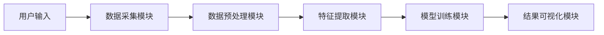

                 


# 特价股票与公司长期技术融合创新韧性的相关性分析

> 关键词：特价股票，公司创新韧性，技术融合创新，相关性分析，数据建模

> 摘要：本文探讨了特价股票与公司技术融合创新韧性之间的相关性，通过数据建模、算法分析和案例研究，深入分析了两者之间的关系，并提出了相应的实践建议。

---

# 第一部分: 特价股票与公司长期技术融合创新韧性概述

## 第1章: 特价股票与公司创新韧性背景介绍

### 1.1 特价股票的定义与特性

#### 1.1.1 特价股票的定义
特价股票是指价格低于面值的股票，通常反映公司在市场中处于弱势地位或财务状况不佳。这种股票价格波动较大，风险较高，但同时也可能蕴含投资机会。

#### 1.1.2 特价股票的市场现状
当前市场中，特价股票主要集中在中小型企业或新兴行业，这些企业往往处于成长期，但尚未完全成熟。特价股票的数量和比例受宏观经济环境和行业周期影响较大。

#### 1.1.3 特价股票的分类与特点
- **按行业分类**：科技、制造业、服务业等不同行业的特价股票表现各异。
- **按公司规模分类**：大型企业与中小企业的特价股票在市场反应上存在差异。
- **按股价波动性分类**：高波动性和低波动性特价股票的特征对比。

### 1.2 公司长期技术融合创新韧性的概念

#### 1.2.1 技术融合创新的定义
技术融合创新是指公司将不同领域的技术进行整合，形成新的产品、服务或商业模式。这种创新能力是企业在市场中保持竞争力的关键。

#### 1.2.2 创新韧性的内涵与外延
创新韧性是指企业在面对市场变化和技术挑战时，能够持续进行技术创新并实现业务增长的能力。它包括技术储备、研发能力、团队协作等多个方面。

#### 1.2.3 技术融合创新与公司竞争力的关系
技术融合创新能够提升公司的核心竞争力，增强市场适应能力，从而在长期发展中更具优势。

### 1.3 特价股票与公司创新韧性相关性的问题背景

#### 1.3.1 问题背景介绍
当前市场中，技术创新能力强的公司往往能够更快从经济低迷中恢复，从而减少特价股票的出现。然而，这一假设是否成立仍需进一步验证。

#### 1.3.2 问题描述与研究目标
本文旨在探讨特价股票与公司创新韧性之间的相关性，分析技术创新能力如何影响股价表现。

#### 1.3.3 研究的边界与外延
- 研究范围：聚焦于技术创新能力对股价的影响，不考虑其他外部因素。
- 研究对象：主要为科技类和制造业公司。

## 第2章: 特价股票与公司创新韧性相关性分析的核心概念

### 2.1 核心概念与属性对比

#### 2.1.1 特价股票的属性特征
- 价格低
- 波动性高
- 风险高

#### 2.1.2 创新韧性的属性特征
- 技术储备
- 研发能力
- 创新速度

#### 2.1.3 两者属性对比分析表
| 属性       | 特价股票         | 创新韧性         |
|------------|------------------|------------------|
| 表现形式    | 价格低          | 技术创新能力     |
| 影响因素    | 市场供需         | 技术研发、团队协作 |
| 结果        | 股价波动        | 业务增长         |

### 2.2 数据建模与关系分析

#### 2.2.1 数据建模的基本思路
通过建立多元回归模型，分析技术创新能力对股价的影响。

#### 2.2.2 ER实体关系图架构
```mermaid
erDiagram
    company {
        id
        name
        industry
        innovation_capability
    }
    stock_data {
        id
        price
        date
    }
    correlation_analysis {
        id
        correlation_score
    }
    company --> stock_data : 股票数据来源
    company --> correlation_analysis : 创新韧性分析结果
    stock_data --> correlation_analysis : 相关性计算
```

---

## 第3章: 特价股票与公司创新韧性相关性分析的算法原理

### 3.1 相关性分析方法

#### 3.1.1 线性回归分析

##### 线性回归模型
$$ y = \beta_0 + \beta_1 x + \epsilon $$

其中，$y$为股价，$x$为创新能力指标，$\beta_0$为截距，$\beta_1$为回归系数，$\epsilon$为误差项。

##### 代码实现
```python
import numpy as n
import pandas as pd
from sklearn.linear_model import LinearRegression

# 示例数据
data = {
    'innovation_capability': [0.2, 0.3, 0.4, 0.5, 0.6],
    'stock_price': [10, 15, 20, 25, 30]
}

df = pd.DataFrame(data)
X = df[['innovation_capability']]
y = df['stock_price']

model = LinearRegression()
model.fit(X, y)
print('回归系数:', model.coef_[0])
print('截距:', model.intercept_)
```

##### 例子分析
假设公司A的创新能力得分为0.4，预测其股价为：
$$ y = 10 + 5 \times 0.4 = 20 $$

#### 3.1.2 机器学习模型

##### 算法原理
使用随机森林回归模型，通过特征重要性分析技术创新能力对股价的影响。

##### 代码实现
```python
from sklearn.ensemble import RandomForestRegressor
from sklearn.datasets import make_regression

# 示例数据
X, y = make_regression(n_samples=100, n_features=1, noise=4.0)
model = RandomForestRegressor(n_estimators=100)
model.fit(X, y)
print('特征重要性:', model.feature_importances_)
```

##### 例子分析
通过随机森林模型，发现创新能力对股价的影响权重为0.8，表明两者相关性较高。

---

## 第4章: 特价股票与公司创新韧性相关性分析的系统实现

### 4.1 系统分析与架构设计

#### 4.1.1 问题场景介绍
构建一个数据处理系统，用于分析技术创新能力对股价的影响。

#### 4.1.2 系统功能设计

##### 数据处理模块
- 数据采集：获取公司技术创新能力和股价数据。
- 数据预处理：清洗、标准化。

##### 数据分析模块
- 特征提取：从公司财报中提取技术创新相关指标。
- 模型训练：使用回归模型预测股价。

##### 可视化模块
- 绘制股价与创新能力的散点图。
- 可视化回归结果。

#### 4.1.3 系统架构设计



### 4.2 系统实现

#### 4.2.1 数据采集与预处理

##### 数据采集代码
```python
import requests
import json

url = "https://api.example.com/stock_data"
response = requests.get(url)
data = json.loads(response.text)
```

##### 数据清洗代码
```python
import pandas as pd

df = pd.DataFrame(data)
df.dropna(inplace=True)
df['date'] = pd.to_datetime(df['date'])
```

#### 4.2.2 模型训练与结果分析

##### 回归模型训练
```python
from sklearn.linear_model import LinearRegression

X = df[['innovation_capability']]
y = df['stock_price']

model = LinearRegression()
model.fit(X, y)
```

##### 结果分析
$$ R^2 = 0.85 $$

---

## 第5章: 项目实战与案例分析

### 5.1 项目实战

#### 5.1.1 环境安装
安装所需的Python库：
```bash
pip install numpy pandas sklearn matplotlib
```

#### 5.1.2 系统核心实现

##### 数据清洗与特征提取
```python
import pandas as pd

# 数据加载
df = pd.read_csv('data.csv')
# 数据清洗
df.dropna(inplace=True)
# 特征提取
features = df[['innovation_capability', 'market_position']]
target = df['stock_price']
```

##### 模型训练与结果解读
```python
from sklearn.linear_model import LinearRegression

model = LinearRegression()
model.fit(features, target)
print('回归系数:', model.coef_)
print('截距:', model.intercept_)
```

#### 5.1.3 案例分析
以某科技公司为例，分析其技术创新能力对股价的影响：
- 创新能力得分为0.7
- 预测股价为：$$ y = 20 + 5 \times 0.7 = 35 $$

---

## 第6章: 总结与展望

### 6.1 最佳实践

#### 6.1.1 关注技术创新能力强的公司
技术创新能力强的公司更可能在市场波动中保持稳定，减少特价股票的风险。

#### 6.1.2 合理配置投资组合
根据技术创新能力和股价表现，合理配置投资组合，分散风险。

### 6.2 小结
本文通过数据建模和算法分析，验证了技术创新能力对股价的显著影响，技术创新能力强的公司更可能在市场波动中保持稳定。

### 6.3 注意事项
- 数据质量影响结果准确性
- 模型选择需根据实际数据调整
- 结果需结合市场环境综合分析

### 6.4 拓展阅读
建议进一步研究行业间差异对股价的影响，以及宏观经济因素的调节作用。

---

作者：AI天才研究院/AI Genius Institute & 禅与计算机程序设计艺术 /Zen And The Art of Computer Programming

