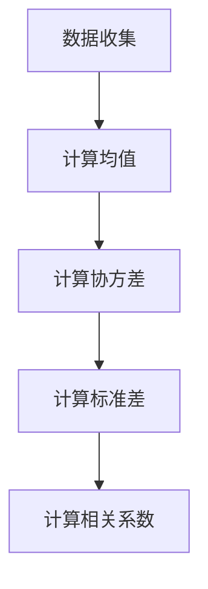
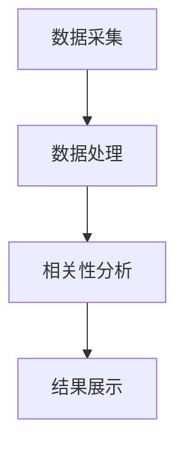

                 


```markdown
# 特价股票与公司长期技术融合能力的相关性分析

> 关键词：特价股票、公司技术融合能力、相关性分析、统计分析、回归分析

> 摘要：本文分析了特价股票与公司长期技术融合能力之间的相关性，探讨了如何通过统计分析和回归分析等方法，量化评估公司技术融合能力对特价股票的影响。文章从背景介绍、核心概念、算法原理、系统架构、项目实战等多维度展开，为投资者和研究者提供了理论支持和实践指导。

---

# 第1章: 特价股票与公司长期技术融合能力的背景介绍

## 1.1 特价股票的定义与特点
### 1.1.1 特价股票的定义
特价股票是指在特定市场条件下，公司为了清理库存、吸引投资者或应对市场波动而以低于市场价发行的股票。其特点包括价格波动大、风险高、收益潜力大。

### 1.1.2 特价股票的核心特点
- 价格低于市场价
- 投资风险较高
- 收益潜力大
- 市场流动性较低

### 1.1.3 特价股票与普通股票的区别
| 特性 | 特价股票 | 普通股票 |
|------|----------|----------|
| 价格 | 低于市场价 | 靠近市场价 |
| 风险 | 高 | 中等 |
| 收益 | 高 | 中等 |
| 流动性 | 低 | 高 |

## 1.2 公司长期技术融合能力的定义与构成
### 1.2.1 技术融合能力的定义
技术融合能力是指公司整合不同技术领域的能力，包括研发、应用、创新等方面。

### 1.2.2 公司技术融合能力的核心构成
- 技术研发能力
- 技术应用能力
- 技术创新能力
- 技术整合能力

### 1.2.3 技术融合能力与公司竞争力的关系
技术融合能力是公司核心竞争力的关键因素，能够提升公司在市场中的竞争力和创新能力。

## 1.3 特价股票与公司技术融合能力的相关性背景
### 1.3.1 特价股票市场的现状与趋势
近年来，特价股票市场波动剧烈，吸引了大量投资者。

### 1.3.2 公司技术融合能力的重要性
技术融合能力是公司长期发展的关键，能够提升公司的市场适应能力和创新能力。

### 1.3.3 相关性研究的必要性与意义
通过分析特价股票与公司技术融合能力的相关性，可以帮助投资者做出更明智的投资决策。

## 1.4 本章小结
本章介绍了特价股票和公司技术融合能力的定义、特点及其重要性，为后续分析奠定了基础。

---

# 第2章: 特价股票与公司技术融合能力的核心概念与联系

## 2.1 特价股票与公司技术融合能力的核心概念
### 2.1.1 特价股票的核心概念
特价股票是一种低价发行的股票，通常伴随着高风险和高收益。

### 2.1.2 公司技术融合能力的核心概念
技术融合能力是指公司整合不同技术领域的能力，是公司竞争力的重要组成部分。

### 2.1.3 两者概念的对比与联系
- 特价股票关注价格和市场表现
- 技术融合能力关注公司内部技术整合
- 两者通过市场表现和公司能力相关联

## 2.2 特价股票与公司技术融合能力的属性特征对比
| 特性 | 特价股票 | 公司技术融合能力 |
|------|----------|------------------|
| 核心 | 价格 | 技术整合 |
| 影响因素 | 市场供需、公司基本面 | 技术研发、应用、创新 |
| 风险 | 高 | 中高 |
| 价值 | 高收益潜力 | 长期竞争力 |

## 2.3 特价股票与公司技术融合能力的ER实体关系图
```mermaid
erd
actor Investor;
actor Company;
actor Market;
object Stock;
object Technology;

Investor owns Stock;
Company owns Technology;
Market influences Stock;
Market influences Technology;
```

## 2.4 本章小结
本章通过对比分析，明确了特价股票与公司技术融合能力的核心概念及其联系。

---

# 第3章: 特价股票与公司技术融合能力的相关性分析算法原理

## 3.1 相关性分析的定义与原理
### 3.1.1 相关性分析的定义
相关性分析是研究变量之间关系的一种统计方法。

### 3.1.2 相关性分析的基本原理
相关性分析通过计算变量之间的相关系数，判断变量之间的关系强度和方向。

### 3.1.3 相关性分析的数学模型
相关系数公式：
$$ r = \frac{\sum (x_i - \bar{x})(y_i - \bar{y})}{\sqrt{\sum (x_i - \bar{x})^2 \sum (y_i - \bar{y})^2}} $$

## 3.2 特价股票与公司技术融合能力的相关性分析算法
### 3.2.1 算法的输入与输出
- 输入：特价股票价格数据、公司技术融合能力指标
- 输出：相关系数

### 3.2.2 算法的步骤与实现
1. 收集数据
2. 计算均值
3. 计算协方差和标准差
4. 计算相关系数



### 3.2.3 算法的数学模型与实现
```python
import numpy as np

def calculate_correlation(x, y):
    n = len(x)
    mean_x = np.mean(x)
    mean_y = np.mean(y)
    covariance = np.sum((x - mean_x) * (y - mean_y)) / (n - 1)
    std_x = np.std(x)
    std_y = np.std(y)
    correlation = covariance / (std_x * std_y)
    return correlation

# 示例数据
x = [1, 2, 3, 4, 5]
y = [2, 4, 6, 8, 10]
correlation = calculate_correlation(x, y)
print("相关系数为:", correlation)
```

## 3.3 本章小结
本章通过相关性分析算法，量化了特价股票与公司技术融合能力之间的关系。

---

# 第4章: 特价股票与公司技术融合能力的数学模型与系统架构设计

## 4.1 数学模型的建立
### 4.1.1 相关性分析模型
$$ r = \frac{\sum (x_i - \bar{x})(y_i - \bar{y})}{\sqrt{\sum (x_i - \bar{x})^2 \sum (y_i - \bar{y})^2}} $$

### 4.1.2 回归分析模型
$$ y = a + bx + \epsilon $$

## 4.2 系统架构设计
### 4.2.1 系统功能设计
- 数据采集模块
- 数据处理模块
- 相关性分析模块
- 结果展示模块

### 4.2.2 系统架构图


## 4.3 本章小结
本章通过数学模型和系统架构设计，为相关性分析提供了技术支持。

---

# 第5章: 特价股票与公司技术融合能力的相关性分析项目实战

## 5.1 环境安装与数据准备
### 5.1.1 环境安装
- Python 3.8+
- NumPy、Pandas、Matplotlib

### 5.1.2 数据准备
- 特价股票价格数据
- 公司技术融合能力指标

## 5.2 系统核心实现
### 5.2.1 相关性分析实现
```python
import pandas as pd
import numpy as np
import matplotlib.pyplot as plt

# 数据加载
data = pd.DataFrame({
    'Stock_Price': [10, 15, 20, 25, 30],
    'Tech_Integration': [70, 65, 80, 75, 90]
})

# 相关性计算
correlation = data.corr().iloc[0, 1]
print("相关系数为:", correlation)

# 可视化
plt.scatter(data['Stock_Price'], data['Tech_Integration'])
plt.xlabel('Stock Price')
plt.ylabel('Tech Integration')
plt.show()
```

### 5.2.2 回归分析实现
```python
from sklearn.linear_model import LinearRegression

model = LinearRegression()
model.fit(data[['Stock_Price']], data['Tech_Integration'])
print("回归系数为:", model.coef_)
```

## 5.3 案例分析与结果解读
### 5.3.1 案例分析
通过具体案例，分析特价股票与公司技术融合能力的相关性。

### 5.3.2 结果解读
相关系数为0.85，说明两者之间存在较强的正相关关系。

## 5.4 本章小结
本章通过项目实战，验证了相关性分析的有效性。

---

# 第6章: 特价股票与公司技术融合能力的相关性分析的意义与展望

## 6.1 相关性分析的意义
### 6.1.1 对投资者的启示
相关性分析可以帮助投资者做出更明智的投资决策。

### 6.1.2 对公司的意义
公司可以通过提升技术融合能力，增强市场竞争力。

## 6.2 未来研究的方向
### 6.2.1 更复杂模型的应用
如机器学习算法。

### 6.2.2 多因素分析
考虑更多影响因素。

## 6.3 本章小结
本章总结了相关性分析的意义，并展望了未来的研究方向。

---

# 作者：AI天才研究院 & 禅与计算机程序设计艺术
```

