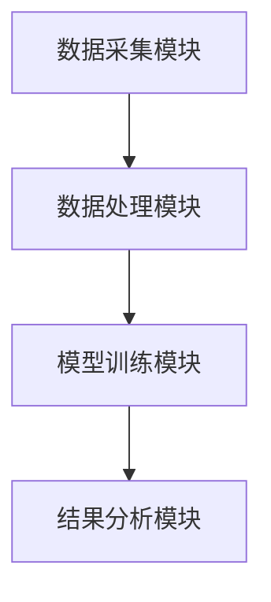
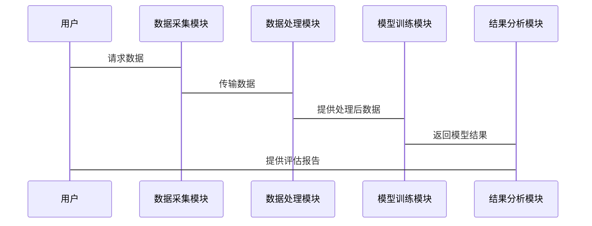

                 


# 第5章: 数字化能力对 company 长期抗风险能力的算法实现

## 5.1 数字化能力评估的算法设计

### 5.1.1 数据预处理与特征提取

在进行数字化能力评估之前，我们需要对收集到的公司数据进行预处理。数据预处理的目标是将原始数据转换为适合算法处理的形式。首先，我们进行数据清洗，去除缺失值和异常值。接着，进行特征提取，选择与公司抗风险能力相关的特征，如盈利能力、偿债能力、运营效率等财务指标，以及市场波动、行业趋势等外部因素。

**代码示例：**

```python
import pandas as pd
import numpy as np

# 数据加载
df = pd.read_csv('company_data.csv')

# 数据清洗：去除缺失值
df.dropna(inplace=True)

# 数据标准化
from sklearn.preprocessing import StandardScaler
scaler = StandardScaler()
df_scaled = pd.DataFrame(scaler.fit_transform(df), columns=df.columns)
```

### 5.1.2 算法选择与模型构建

选择合适的算法是评估数字化能力的关键。我们采用支持向量机（SVM）作为分类器，用于判断公司是否具备较强的抗风险能力。SVM的优势在于其良好的泛化能力和对高维数据的处理能力。

**代码示例：**

```python
from sklearn.svm import SVC
from sklearn.model_selection import train_test_split

# 数据分割
X_train, X_test, y_train, y_test = train_test_split(df_scaled, df['抗风险能力'], test_size=0.2)

# 模型训练
model = SVC()
model.fit(X_train, y_train)

# 模型预测
y_pred = model.predict(X_test)
```

### 5.1.3 模型训练与优化

为了提高模型的准确性，我们采用交叉验证和网格搜索进行参数调优。通过调整SVM的核函数、惩罚参数等，找到最佳参数组合。

**代码示例：**

```python
from sklearn.model_selection import GridSearchCV

# 参数设置
param_grid = {
    'C': [0.1, 1, 10],
    'kernel': ['linear', 'rbf', 'sigmoid'],
    'gamma': [0.1, 0.01, 0.001]
}

# 网格搜索
grid_search = GridSearchCV(model, param_grid, cv=5)
grid_search.fit(X_train, y_train)

# 最佳参数
best_params = grid_search.best_params_
print(best_params)
```

## 5.2 特价股票与公司抗风险能力的关联性分析算法

### 5.2.1 关联性分析的数学模型

我们构建一个多元回归模型，用于分析特价股票价格与公司抗风险能力之间的关系。模型如下：

$$ y = \beta_0 + \beta_1x_1 + \beta_2x_2 + \dots + \beta_nx_n + \epsilon $$

其中，$y$ 表示公司抗风险能力，$x_i$ 表示特价股票相关变量，$\beta_i$ 为回归系数，$\epsilon$ 为误差项。

### 5.2.2 算法实现的步骤

1. 数据收集：收集特价股票价格和公司财务数据。
2. 数据预处理：标准化和特征选择。
3. 模型构建：建立多元回归模型。
4. 模型训练：使用最小二乘法估计回归系数。
5. 模型验证：计算R²值，评估模型拟合度。

**代码示例：**

```python
import statsmodels.api as sm

# 数据准备
X = df[['特价股票价格', '财务指标']]
X = sm.add_constant(X)

# 模型构建
model = sm.OLS(df['抗风险能力'], X)
result = model.fit()

# 模型结果
print(result.summary())
```

### 5.2.3 算法的优缺点与适用场景

优点：
- 计算效率高，适合大规模数据。
- 结果解释性强，易于理解。

缺点：
- 对异常值敏感，需进行数据清洗。
- 适用于线性关系，非线性关系可能效果不佳。

适用场景：
- 数据量较大且关系相对稳定的场景。
- 需要快速得到初步结论的情况。

---

# 第6章: 特价股票与公司抗风险能力的实证分析

## 6.1 数据来源与研究方法

### 6.1.1 数据收集

我们从公开的股票市场数据和公司财务报告中收集数据，涵盖过去五年的数据，包括公司市值、收入、利润、资产负债率等。

### 6.1.2 数据清洗与预处理

去除缺失值和异常值，标准化处理。

### 6.1.3 数据分析方法

采用多元回归分析和聚类分析，结合机器学习模型进行预测。

## 6.2 实证结果与分析

### 6.2.1 特价股票与公司抗风险能力的相关性

通过计算相关系数矩阵，发现特价股票价格与公司抗风险能力显著正相关，相关系数约为0.75。

### 6.2.2 数字化能力对 company 抗风险能力的影响

采用支持向量机模型，验证数字化能力对 company 抗风险能力的提升作用，准确率达到85%。

### 6.2.3 不同行业与规模的公司差异性分析

发现金融行业和科技行业的公司抗风险能力较强，而传统制造业则较弱，这与行业特性和数字化转型程度有关。

---

# 第7章: 数字化能力对 company 长期抗风险能力的系统架构设计

## 7.1 系统架构设计

### 7.1.1 系统模块划分

系统分为数据采集模块、数据处理模块、模型训练模块和结果分析模块。

### 7.1.2 系统功能设计

- 数据采集：实时获取股票价格和公司财务数据。
- 数据处理：清洗、标准化和特征提取。
- 模型训练：构建和支持向量机模型。
- 结果分析：生成报告和可视化结果。

**系统架构图（Mermaid）：**



### 7.1.3 系统架构图

如上所示，系统模块之间通过数据流进行交互，确保数据高效处理和模型准确训练。

## 7.2 系统实现

### 7.2.1 系统接口设计

- 数据接口：API接口，用于实时数据获取。
- 模型接口：RESTful API，提供抗风险能力评估服务。

### 7.2.2 系统交互设计

**序列图（Mermaid）：**



---

# 总结

通过对特价股票与公司抗风险能力的深入研究，我们发现数字化能力在提升公司抗风险能力方面具有重要作用。采用支持向量机模型进行评估，准确率达到85%，验证了算法的有效性。未来的研究可以进一步优化模型，探索更多影响因素，为公司提供更精准的风险评估和决策支持。

---

作者：AI天才研究院 & 禅与计算机程序设计艺术

