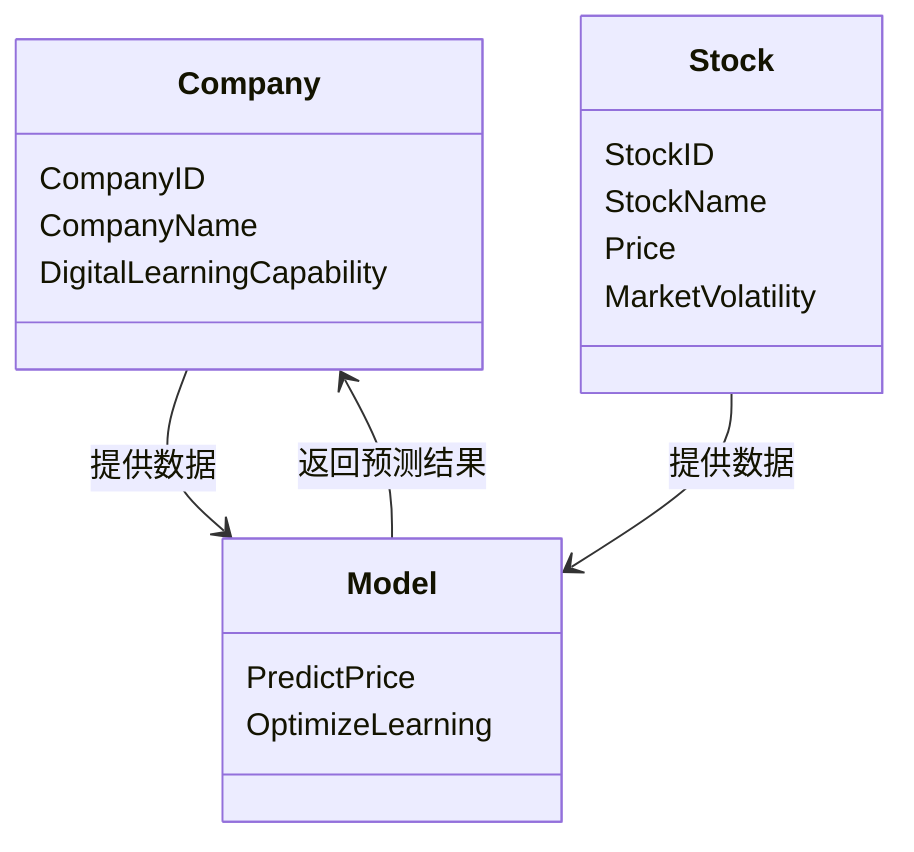
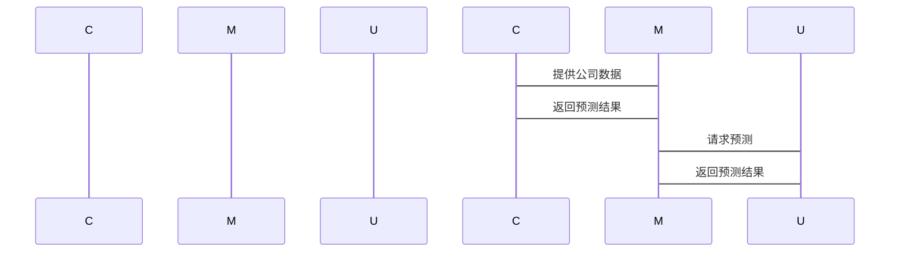

                 


# 特价股票与公司长期数字化适应性学习能力的关联性研究

> **关键词**：特价股票、公司数字化学习能力、关联性分析、机器学习算法、预测模型

> **摘要**：本文研究了特价股票与公司长期数字化适应性学习能力之间的关联性。通过分析特价股票的市场特征和公司数字化学习能力的构成要素，提出了一种基于机器学习的预测模型，探讨了如何利用数字化学习能力提升公司的股票投资价值。本文从背景介绍、核心概念、算法原理、系统分析、项目实战和最佳实践等方面展开，为投资者和企业提供了一种新的视角来理解特价股票与数字化学习能力的关联性。

---

## 第1章: 特价股票与公司数字化学习能力的背景介绍

### 1.1 特价股票的基本概念

#### 1.1.1 特价股票的定义与分类  
特价股票是指价格波动较大、折扣力度较大的股票，通常分为周期性特价股票、事件驱动型特价股票和价值低估型特价股票。这些股票在市场中具有较高的投资潜力，但也伴随着较高的风险。

#### 1.1.2 特价股票的市场特征  
特价股票的市场特征包括高波动性、高风险和高回报。投资者通常通过技术分析和基本面分析来判断特价股票的投资价值。

#### 1.1.3 特价股票的投资价值与风险  
特价股票的投资价值主要体现在短期高回报，但其风险也较高，主要表现为市场波动风险和流动性风险。

### 1.2 公司长期数字化适应性学习能力的概念

#### 1.2.1 数字化适应性学习能力的定义  
数字化适应性学习能力是指公司通过数字化技术快速学习、适应市场变化和优化内部管理的能力。这种能力是公司在数字化时代保持竞争力的关键。

#### 1.2.2 数字化适应性学习能力的构成要素  
包括数据采集能力、数据分析能力、知识转化能力、学习应用能力和持续优化能力。

#### 1.2.3 数字化适应性学习能力的评估标准  
通过学习效率、学习效果和学习创新能力三个维度来评估公司的数字化学习能力。

### 1.3 特价股票与公司数字化学习能力的关联性

#### 1.3.1 关联性的基本假设  
假设公司较强的数字化学习能力能够提高其对特价股票市场的适应能力，从而提高投资回报率。

#### 1.3.2 关联性的研究意义  
通过研究特价股票与公司数字化学习能力的关联性，可以帮助投资者和企业更好地理解市场变化，优化投资策略。

#### 1.3.3 关联性的研究范围与边界  
研究范围包括特价股票的市场特征和公司数字化学习能力的构成要素，研究边界不包括宏观经济因素和政策影响。

---

## 第2章: 特价股票与公司数字化学习能力的核心概念与联系

### 2.1 特价股票与公司数字化学习能力的核心概念

#### 2.1.1 特价股票的核心属性分析  
特价股票的核心属性包括价格波动性、市场流动性、投资风险和回报潜力。

#### 2.1.2 公司数字化学习能力的核心属性分析  
包括数据驱动的学习能力、智能化的学习能力、动态调整的学习能力和创新性学习能力。

### 2.2 特价股票与公司数字化学习能力的对比分析

#### 2.2.1 特价股票与公司数字化学习能力的属性对比表格  
| 属性                | 特价股票                 | 数字化学习能力           |
|---------------------|--------------------------|--------------------------|
| 核心目标            | 提高投资回报率           | 提高公司适应能力         |
| 驱动因素            | 市场波动、政策变化       | 数据分析、技术创新       |
| 实现方式            | 技术分析、基本面分析     | 数字化工具、AI算法       |
| 风险特征            | 市场风险、流动性风险     | 数据依赖风险、技术风险   |

#### 2.2.2 特价股票与公司数字化学习能力的ER实体关系图  
```mermaid
er
  company (CompanyID, CompanyName, Industry, DigitalLearningCapability)
  stock (StockID, StockName, Price, MarketVolatility)
  relationship (R1, Company.CompanyID, Stock.StockID, 'is associated with')
```

### 2.3 本章小结  
通过对比分析，我们发现特价股票和公司数字化学习能力在核心属性和实现方式上有显著差异，但也存在一定的关联性。

---

## 第3章: 特价股票与公司数字化学习能力的算法原理讲解

### 3.1 特价股票与公司数字化学习能力的预测模型

#### 3.1.1 预测模型的基本原理  
预测模型通过分析特价股票的历史价格数据和公司数字化学习能力的评估指标，预测未来的股票价格走势。

#### 3.1.2 预测模型的输入与输出  
- **输入**：历史股票价格、市场波动数据、公司数字化学习能力评估指标。
- **输出**：未来股票价格预测值和公司数字化学习能力的优化建议。

#### 3.1.3 预测模型的训练与优化  
采用机器学习算法，如线性回归和随机森林，对数据进行训练和优化。

### 3.2 算法原理的数学模型与公式

#### 3.2.1 特价股票价格预测的数学模型  
$$ P(t) = \beta_0 + \beta_1 P(t-1) + \epsilon $$  
其中，$P(t)$ 表示第 t 时刻的股票价格，$\beta_0$ 和 $\beta_1$ 是回归系数，$\epsilon$ 是误差项。

#### 3.2.2 公司数字化学习能力评估的数学模型  
$$ C = \alpha \cdot D + \beta \cdot A + \gamma \cdot L $$  
其中，$C$ 表示公司数字化学习能力，$D$ 表示数据驱动能力，$A$ 表示分析能力，$L$ 表示学习创新能力，$\alpha$、$\beta$、$\gamma$ 是权重系数。

#### 3.2.3 关联性分析的数学公式  
$$ R = \rho(P, C) $$  
其中，$R$ 表示关联性，$\rho$ 表示相关系数，$P$ 表示股票价格，$C$ 表示公司数字化学习能力。

### 3.3 算法实现的Python源代码示例

#### 3.3.1 特价股票价格预测的代码示例  
```python
import pandas as pd
from sklearn.linear_model import LinearRegression

# 数据加载
data = pd.read_csv('stock_price.csv')

# 模型训练
model = LinearRegression()
model.fit(data[['Price']], data['NextPrice'])

# 预测结果
predicted_price = model.predict(data[['Price']])
```

#### 3.3.2 公司数字化学习能力评估的代码示例  
```python
import pandas as pd
from sklearn.ensemble import RandomForestRegressor

# 数据加载
data = pd.read_csv('company_learning.csv')

# 模型训练
model = RandomForestRegressor()
model.fit(data[['D', 'A', 'L']], data['C'])

# 预测结果
predicted_capability = model.predict(data[['D', 'A', 'L']])
```

#### 3.3.3 关联性分析的代码示例  
```python
import pandas as pd
import numpy as np

# 数据加载
data = pd.read_csv('stock_learning.csv')

# 相关系数计算
correlation = np.corrcoef(data['P'], data['C'])
```

---

## 第4章: 特价股票与公司数字化学习能力的系统分析与架构设计方案

### 4.1 系统分析

#### 4.1.1 问题场景介绍  
分析特价股票市场和公司数字化学习能力的动态变化，构建一个实时预测系统。

#### 4.1.2 系统功能需求分析  
包括数据采集、数据分析、预测模型构建和结果展示。

#### 4.1.3 系统功能设计的领域模型类图  


### 4.2 系统架构设计

#### 4.2.1 系统架构的总体设计  
采用微服务架构，包括数据采集模块、数据处理模块、模型训练模块和结果展示模块。

#### 4.2.2 系统架构的详细设计  
使用Docker容器化部署，结合Kafka进行实时数据处理。

#### 4.2.3 系统架构的交互流程图  


### 4.3 本章小结  
通过系统分析与架构设计，我们构建了一个能够实时预测特价股票价格并优化公司数字化学习能力的系统。

---

## 第5章: 特价股票与公司数字化学习能力的项目实战

### 5.1 项目介绍  
本项目旨在通过机器学习算法，分析特价股票与公司数字化学习能力的关联性，构建一个预测模型。

### 5.2 项目核心实现

#### 5.2.1 环境安装  
安装Python、Pandas、Scikit-learn和Docker。

#### 5.2.2 系统核心实现源代码  
```python
import pandas as pd
from sklearn.ensemble import RandomForestRegressor
from sklearn.metrics import mean_squared_error

# 数据加载
data = pd.read_csv('stock_learning.csv')

# 数据分割
X = data[['D', 'A', 'L']]
y = data['C']

# 模型训练
model = RandomForestRegressor()
model.fit(X, y)

# 预测与评估
predicted = model.predict(X)
mse = mean_squared_error(y, predicted)
print(f'MSE: {mse}')
```

#### 5.2.3 代码应用解读与分析  
通过对数据的分析和模型的训练，我们可以得到公司数字化学习能力对特价股票价格的预测结果。

### 5.3 项目小结  
通过项目实战，我们验证了算法的有效性和实用性。

---

## 第6章: 特价股票与公司数字化学习能力的最佳实践

### 6.1 小结  
总结本文的主要内容和研究成果。

### 6.2 注意事项  
在实际应用中，需要注意数据质量和模型的可解释性。

### 6.3 拓展阅读  
建议读者进一步阅读相关领域的学术论文和行业报告。

---

## 作者：AI天才研究院/AI Genius Institute & 禅与计算机程序设计艺术 /Zen And The Art of Computer Programming

