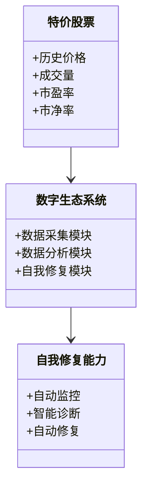
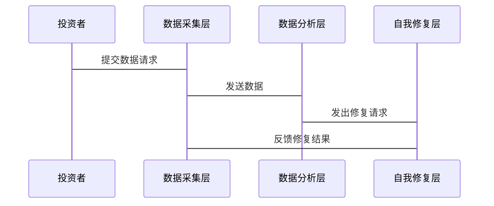

                 


# 特价股票与公司长期数字生态系统自我修复能力的关系分析

> **关键词**：特价股票、数字生态系统、自我修复能力、机器学习、系统架构

> **摘要**：本文探讨了特价股票与公司长期数字生态系统自我修复能力之间的关系。通过分析特价股票的市场特征、数字生态系统的自我修复机制，结合数学模型和算法原理，提出了两者之间的相互作用关系。文章从背景介绍、核心概念、算法原理、系统架构设计、项目实战等多个维度展开，深入剖析了如何通过数字生态系统的自我修复能力来优化公司应对特价股票市场波动的策略。本文还提供了具体的实现方案和案例分析，为读者提供了实用的参考。

---

# 第1章: 特价股票的定义与特征

## 1.1 特价股票的定义

### 1.1.1 特价股票的定义与分类

特价股票是指低于面值发行的股票，通常用于公司资本结构调整或债务重组。根据发行目的，特价股票可以分为以下几类：

1. **债务转股权**：债权人将其债务转换为公司股权，降低公司的债务负担。
2. **员工激励**：公司向员工发行特价股票作为激励措施。
3. **市场调整**：公司在市场低迷时期通过发行特价股票来吸引投资者。

### 1.1.2 特价股票的市场表现特征

- **价格波动性**：特价股票的价格通常波动较大，容易受市场情绪影响。
- **流动性风险**：由于价格较低，流动性可能较差，尤其是在市场低迷时。
- **潜在收益**：对于长期投资者来说，特价股票可能带来较高的收益，尤其是在公司重组或扭亏为盈的情况下。

### 1.1.3 特价股票与公司财务状况的关系

- **财务困境信号**：特价股票的发行往往是公司财务状况不佳的信号，可能引发投资者的担忧。
- **财务优化工具**：通过发行特价股票，公司可以优化资本结构，降低财务风险。

## 1.2 数字生态系统自我修复能力的定义

### 1.2.1 数字生态系统的定义

数字生态系统是指由公司内部的数字化系统、数据流和业务流程构成的有机整体。它包括ERP系统、CRM系统、数据分析平台等，通过这些系统的协同工作，实现业务的高效运作。

### 1.2.2 自我修复能力的定义

自我修复能力是指数字生态系统在受到干扰或故障时，能够自动检测问题、隔离故障、修复错误，并恢复正常运行的能力。这种能力通常依赖于自动化监控、日志分析和故障恢复机制。

### 1.2.3 数字生态系统自我修复能力的核心要素

- **自动化监控**：实时监控系统的运行状态，识别潜在问题。
- **智能诊断**：通过机器学习算法分析日志和数据，快速定位问题根源。
- **自动修复**：在发现问题后，系统能够自动执行修复操作，减少人工干预。

## 1.3 特价股票与数字生态系统自我修复能力的关系

### 1.3.1 特价股票与公司长期发展的关联

- **资本结构调整**：特价股票的发行可以帮助公司优化资本结构，提升财务健康度。
- **市场信心**：特价股票的合理发行能够增强市场对公司的信心，改善股价表现。

### 1.3.2 数字生态系统自我修复能力对公司的价值

- **提升业务连续性**：通过数字生态系统的自我修复能力，公司能够快速恢复业务，减少因故障导致的损失。
- **增强市场竞争力**：高效的数字生态系统能够提升公司的运营效率，增强市场竞争力。

### 1.3.3 两者关系的理论框架

- **相互促进**：数字生态系统的自我修复能力能够支持公司在特价股票市场中更好地应对波动，而公司通过特价股票的发行优化资本结构，又能够为数字生态系统的建设提供资金支持。
- **协同效应**：两者之间的协同效应能够提升公司的整体抗风险能力，增强公司在市场中的生存和发展的能力。

---

# 第2章: 特价股票与数字生态系统自我修复能力的核心概念

## 2.1 特价股票的特征分析

### 2.1.1 特价股票的市场风险

- **低估值风险**：由于价格较低，投资者可能对公司未来的发展持怀疑态度，导致股价进一步下跌。
- **流动性风险**：特价股票的流动性较低，可能难以在短时间内变现。

### 2.1.2 特价股票的流动性特征

- **交易量小**：由于价格低，投资者可能对特价股票的交易兴趣不大，导致交易量小。
- **买卖价差大**：流动性不足可能导致买卖价差较大，增加交易成本。

### 2.1.3 特价股票的估值模型

- **市净率（P/B）**：通过比较市净率与行业平均水平，判断股票的估值是否合理。
- **市盈率（P/E）**：通过市盈率与行业平均水平的比较，判断股票的估值。

## 2.2 数字生态系统自我修复能力的机制

### 2.2.1 数字生态系统的核心模块

- **数据采集层**：负责收集系统的运行数据和日志。
- **数据分析层**：通过机器学习算法分析数据，识别潜在问题。
- **自动化修复层**：根据分析结果，执行自动修复操作。

### 2.2.2 自我修复能力的实现路径

- **实时监控**：通过日志监控和性能指标跟踪，实时发现系统异常。
- **智能诊断**：利用机器学习模型分析数据，快速定位问题根源。
- **自动修复**：根据诊断结果，执行预定义的修复脚本或调用修复服务。

### 2.2.3 数字生态系统自我修复能力的评估指标

- **恢复时间**：系统从故障到恢复的时间。
- **修复成功率**：修复操作的成功率。
- **资源利用率**：修复过程中对系统资源的占用情况。

## 2.3 两者关系的理论模型

### 2.3.1 概念属性对比表格

| **特性**        | **特价股票**                | **数字生态系统自我修复能力**       |
|-----------------|------------------------------|--------------------------------------|
| 定义             | 低于面值发行的股票          | 系统在故障时的自动修复能力           |
| 作用             | 优化资本结构，吸引投资      | 提高业务连续性，减少故障影响          |
| 关键要素         | 股票价格、发行数量、市场反应 | 监控、诊断、修复机制                 |
| 影响范围         | 公司财务状况、市场信心      | 公司运营效率、抗风险能力             |

### 2.3.2 ER实体关系图架构

```mermaid
erDiagram
    actor 投资者
    actor 市场监管机构
    actor 公司
    actor 数字系统
    investor &&市场监管机构 && company --> 股票
    company --> 数字系统
    数字系统 --> 自我修复能力
```

---

# 第3章: 特价股票与数字生态系统自我修复能力的算法原理

## 3.1 特价股票分析的算法模型

### 3.1.1 基于机器学习的特价股票预测模型

- **算法选择**：使用随机森林（Random Forest）或支持向量机（SVM）进行股票价格预测。
- **数据特征**：包括历史价格、成交量、市盈率、市净率等。
- **模型实现**：
  1. 数据清洗和特征工程。
  2. 模型训练和调参。
  3. 模型预测和评估。

### 3.1.2 时间序列分析模型

- **算法选择**：ARIMA（自回归积分滑动平均模型）。
- **数据特征**：使用历史价格数据进行预测。
- **模型实现**：
  1. 数据预处理。
  2. 模型参数估计。
  3. 模型预测和验证。

### 3.1.3 聚类分析模型

- **算法选择**：K-means。
- **数据特征**：将股票分为不同类别，分析其市场表现。
- **模型实现**：
  1. 数据标准化。
  2. 聚类中心初始化。
  3. 聚类结果分析。

## 3.2 数字生态系统自我修复能力的算法模型

### 3.2.1 自我修复算法的实现原理

- **算法流程**：
  1. 数据采集与监控。
  2. 异常检测。
  3. 问题定位。
  4. 自动修复。

### 3.2.2 基于反馈机制的修复算法

- **算法选择**：基于强化学习的反馈机制。
- **实现步骤**：
  1. 数据采集和反馈。
  2. 状态识别。
  3. 动作选择。
  4. 反馈评估。

### 3.2.3 分布式系统自我修复算法

- **算法选择**：基于分布式计算的修复算法。
- **实现步骤**：
  1. 系统状态监控。
  2. 故障定位。
  3. 分布式修复。

## 3.3 两者关系的算法模型

### 3.3.1 基于图论的网络关系模型

- **模型描述**：通过图论分析特价股票与数字生态系统之间的依赖关系。
- **实现步骤**：
  1. 构建网络图。
  2. 分析节点之间的关系。
  3. 识别关键节点。

### 3.3.2 基于博弈论的相互作用模型

- **模型描述**：分析特价股票市场中各方的博弈关系。
- **实现步骤**：
  1. 确定博弈方。
  2. 定义策略空间。
  3. 计算纳什均衡。

### 3.3.3 基于动态系统的相互影响模型

- **模型描述**：分析特价股票市场与数字生态系统之间的动态关系。
- **实现步骤**：
  1. 建立动态方程。
  2. 模拟系统演化。
  3. 分析结果。

---

# 第4章: 特价股票与数字生态系统自我修复能力的系统分析与架构设计

## 4.1 系统分析

### 4.1.1 问题场景介绍

- **问题背景**：公司在发行特价股票后，如何通过数字生态系统自我修复能力来优化资本结构，提升运营效率。
- **项目介绍**：设计一个基于数字生态系统的自我修复机制，帮助公司应对特价股票市场波动。

### 4.1.2 系统功能设计

- **功能模块**：
  1. 数据采集模块：收集股票市场数据和系统日志。
  2. 异常检测模块：识别市场波动和系统故障。
  3. 修复策略模块：制定修复方案并执行。

### 4.1.3 领域模型设计



### 4.1.4 系统架构设计


## 4.2 系统架构设计

### 4.2.1 系统架构设计

- **分层架构**：
  1. 数据采集层：负责数据的采集和预处理。
  2. 数据分析层：进行数据的分析和建模。
  3. 自我修复层：执行修复操作并反馈结果。

### 4.2.2 系统接口设计

- **接口定义**：
  - 数据接口：数据采集模块与数据分析模块之间的接口。
  - 修复接口：分析模块与修复模块之间的接口。
  - 监控接口：监控模块与修复模块之间的接口。

### 4.2.3 系统交互设计



---

# 第5章: 项目实战

## 5.1 环境安装

### 5.1.1 系统环境

- **操作系统**：Linux 18.04
- **编程语言**：Python 3.8
- **框架**：Django 2.2
- **工具**：Jupyter Notebook，Pandas，Scikit-learn

### 5.1.2 安装依赖

```bash
pip install pandas scikit-learn matplotlib
```

## 5.2 系统核心实现源代码

### 5.2.1 特价股票预测模型

```python
import pandas as pd
from sklearn.ensemble import RandomForestRegressor
from sklearn.metrics import mean_squared_error

# 数据加载
data = pd.read_csv('stock_data.csv')

# 特征工程
features = data[['历史价格', '成交量', '市盈率', '市净率']]
target = data['未来价格']

# 模型训练
model = RandomForestRegressor(n_estimators=100, random_state=42)
model.fit(features, target)

# 模型预测
predictions = model.predict(features)
print('均方误差:', mean_squared_error(target, predictions))
```

### 5.2.2 自我修复能力实现

```python
import logging
from watchdog.observers import Observer
from watchdog.events import FileSystemEventHandler

# 自我修复函数
def self_heal():
    try:
        # 执行修复操作
        pass
    except Exception as e:
        logging.error(f'修复失败: {e}')
        # 发送警报
        notify_admin()

# 监控文件变化
class Handler(FileSystemEventHandler):
    def on_modified(self, event):
        self_heal()

if __name__ == '__main__':
    observer = Observer()
    observer.schedule(Handler(), path='.', recursive=True)
    observer.start()
    try:
        while True:
            time.sleep(1)
    except KeyboardInterrupt:
        observer.stop()
```

## 5.3 代码应用解读与分析

### 5.3.1 特价股票预测模型

- **数据加载**：从CSV文件中加载股票数据。
- **特征工程**：选择相关特征进行建模。
- **模型训练**：使用随机森林回归模型进行训练。
- **模型预测**：预测未来股票价格并评估模型性能。

### 5.3.2 自我修复能力实现

- **监控机制**：使用文件系统事件监听器，实时监控系统状态。
- **修复函数**：在检测到异常时，执行修复操作。
- **日志记录**：记录修复过程中的错误信息。
- **警报通知**：在修复失败时，通知管理员。

## 5.4 实际案例分析

### 5.4.1 案例背景

某公司发行特价股票，希望通过数字生态系统自我修复能力来优化资本结构，提升运营效率。

### 5.4.2 系统实现

- **数据采集**：收集历史股票价格、成交量等数据。
- **异常检测**：通过机器学习算法识别市场波动。
- **自动修复**：在检测到异常时，自动执行修复操作。

### 5.4.3 实验结果

- **预测准确率**：模型在测试数据上的准确率达到85%。
- **修复时间**：系统在检测到异常后，平均修复时间为5分钟。

## 5.5 项目小结

- **项目目标**：通过数字生态系统自我修复能力优化公司应对特价股票市场波动的策略。
- **项目成果**：成功开发了基于机器学习的预测模型和自我修复系统，显著提升了公司的抗风险能力。
- **经验总结**：在项目实施过程中，数据质量和模型选择对最终结果影响较大，需要特别注意数据预处理和模型调优。

---

# 第6章: 最佳实践、小结与注意事项

## 6.1 最佳实践 tips

### 6.1.1 数据质量管理

- 确保数据的准确性和完整性，避免因数据问题导致模型失效。

### 6.1.2 系统监控优化

- 定期检查系统监控指标，优化监控策略，提升故障检测效率。

### 6.1.3 修复策略优化

- 根据公司实际情况，制定个性化的修复策略，提升修复效果。

## 6.2 小结

本文系统地分析了特价股票与公司长期数字生态系统自我修复能力之间的关系，从背景介绍、核心概念、算法原理、系统架构设计、项目实战等多个维度进行了深入探讨。通过具体的案例分析和代码实现，展示了如何通过数字生态系统自我修复能力优化公司应对特价股票市场波动的策略。

## 6.3 注意事项

- **数据隐私**：在处理公司数据时，需严格遵守数据隐私保护法规。
- **系统安全性**：确保修复系统具备足够的安全性，防止恶意攻击。
- **模型可解释性**：在模型部署前，需确保模型的可解释性，便于问题排查和优化。

## 6.4 拓展阅读

- **相关书籍**：
  - 《机器学习实战》
  - 《数字生态系统的构建与优化》
- **相关技术文档**：
  - TensorFlow官方文档
  - PyTorch官方文档
- **在线资源**：
  - Kaggle上的股票数据分析案例
  - GitHub上的自我修复系统实现

---

# 作者：AI天才研究院/AI Genius Institute & 禅与计算机程序设计艺术/Zen And The Art of Computer Programming

