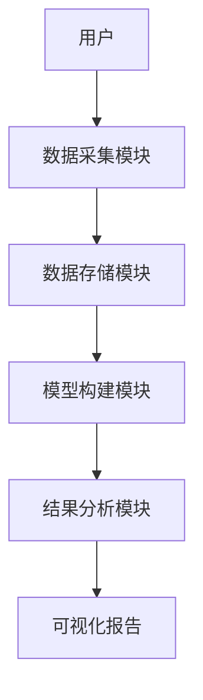

                 


# 特价股票与公司长期气候适应能力的关系分析

> 关键词：特价股票、公司气候适应能力、气候变化影响、投资价值、风险评估

> 摘要：本文探讨了特价股票与公司长期气候适应能力之间的关系，分析了气候变化对公司价值的影响，构建了评估模型，并提出了投资策略。

---

# 第一部分: 特价股票与公司气候适应能力的背景介绍

## 第1章: 特价股票的基本概念

### 1.1 特价股票的定义与分类

#### 1.1.1 特价股票的定义
特价股票是指价格被市场低估的股票，通常具有较高的波动性和潜在的投资回报。它们可能因市场波动、公司困境或其他外部因素而价格下降。

#### 1.1.2 特价股票的分类
- 周期性特价股票：受经济周期影响较大的股票，如能源和制造行业。
- 价值型特价股票：市盈率或市净率低于行业平均水平的股票。
- 小盘股特价股票：市值较小的公司股票，波动性较大。

#### 1.1.3 特价股票的投资价值
投资者通常寻找基本面良好但价格被低估的公司，长期持有以获得超额收益。

---

## 第2章: 公司长期气候适应能力的定义与维度

### 2.1 公司气候适应能力的定义
公司气候适应能力是指企业在面对气候变化时，调整战略、运营和风险管理的能力，以确保长期的可持续发展。

### 2.2 公司气候适应能力的核心维度
- 气候风险暴露度：企业对气候变化的敏感性。
- 气候应对策略：企业采取的减少碳排放和适应气候变化的措施。
- 气候适应能力的可测量性：企业适应能力的量化指标。

### 2.3 公司气候适应能力的评估指标
- 碳排放强度
- 可再生能源使用比例
- 气候相关风险管理框架

---

## 第3章: 特价股票与公司气候适应能力的关系背景

### 3.1 特价股票市场的波动性特征
特价股票价格波动大，投资者需考虑市场情绪和基本面因素。

### 3.2 气候变化对企业的潜在影响
气候变化可能导致供应链中断、法规变化和市场需求变化，影响企业利润和股价。

### 3.3 气候适应能力与企业价值的关系
企业具备较强的气候适应能力，能更好地应对气候变化带来的风险，提升长期投资价值。

---

# 第二部分: 特价股票与公司气候适应能力的核心概念与联系

## 第4章: 特价股票与公司气候适应能力的核心概念

### 4.1 特价股票的核心属性

#### 4.1.1 价格波动性
特价股票价格波动大，可能因市场情绪或突发事件快速变化。

#### 4.1.2 市场流动性
流动性较低的股票波动性较大，影响投资者进出市场的能力。

#### 4.1.3 投资风险性
高风险的特价股票可能带来高回报，但也可能面临较大的损失风险。

### 4.2 公司气候适应能力的核心属性

#### 4.2.1 气候风险暴露度
企业对气候变化的敏感性，如地理位置、行业特性等因素。

#### 4.2.2 气候应对策略
企业采取的具体措施，如减少碳排放、采用可持续材料等。

#### 4.2.3 气候适应能力的可测量性
通过量化指标评估企业的适应能力，如碳排放减少比例、水资源管理效率等。

## 第5章: 特价股票与公司气候适应能力的对比分析

### 5.1 特价股票与公司气候适应能力的属性对比

| 属性                | 特价股票                | 公司气候适应能力                |
|---------------------|------------------------|---------------------------------|
| 价格波动性          | 高                    | 与企业气候策略相关             |
| 市场流动性          | 低或中                | 与企业对气候变化的响应速度相关 |
| 投资风险性          | 高                    | 与企业对气候变化的适应能力相关 |

### 5.2 特价股票与公司气候适应能力的ER实体关系图

```mermaid
erDiagram
    company {
        id
        name
        industry
        climate_strategy
        climate_risk
    }
    stock {
        id
        ticker
        price
        volatility
        liquidity
    }
    company -- stock : 影响
```

---

# 第三部分: 特价股票与公司气候适应能力的算法与系统设计

## 第6章: 基于气候适应能力的特价股票评估模型

### 6.1 模型目标
评估公司气候适应能力对特价股票价值的影响。

### 6.2 数据来源
- 公司财务数据
- 气候相关指标
- 市场数据

### 6.3 算法原理

#### 6.3.1 线性回归模型
$$ y = \beta_0 + \beta_1 x_1 + \beta_2 x_2 + \epsilon $$
其中，$y$为股票收益，$x_1$为气候适应能力指数，$x_2$为市场因素。

#### 6.3.2 机器学习模型
使用随机森林回归模型预测股票收益。

### 6.4 算法实现步骤

1. 数据清洗与预处理。
2. 特征提取：选取气候适应能力和市场相关特征。
3. 模型训练：训练线性回归或随机森林模型。
4. 模型评估：计算准确率和调整参数。

---

## 第7章: 系统分析与架构设计

### 7.1 系统功能设计

#### 7.1.1 数据采集模块
从公开数据源获取公司和股票数据。

#### 7.1.2 模型构建模块
实现气候适应能力评估和股票价值预测。

#### 7.1.3 结果分析模块
生成可视化报告和投资建议。

### 7.2 系统架构设计



---

## 第8章: 项目实战

### 8.1 环境安装
- Python 3.8+
- 数据处理库（Pandas、NumPy）
- 机器学习库（Scikit-learn、RandomForestRegressor）

### 8.2 核心代码实现

```python
import pandas as pd
from sklearn.ensemble import RandomForestRegressor
from sklearn.metrics import mean_squared_error

# 数据加载
data = pd.read_csv('stock_data.csv')

# 特征工程
features = ['climate_strategy', 'market_volatility']
target = 'stock_return'

# 模型训练
model = RandomForestRegressor(n_estimators=100)
model.fit(data[features], data[target])

# 模型预测
predicted = model.predict(data[features])
print('均方误差:', mean_squared_error(data[target], predicted))
```

### 8.3 案例分析
分析一家能源公司的数据，评估其气候适应能力对股票价值的影响。

### 8.4 结果解读
模型预测结果与实际数据对比，评估模型准确性。

---

## 第9章: 总结与展望

### 9.1 最佳实践 tips
- 投资者应关注公司气候适应能力，选择具备较强适应能力的特价股票。
- 定期更新模型，适应市场变化。

### 9.2 小结
本文构建了评估模型，展示了如何利用气候适应能力分析影响特价股票价值。

### 9.3 注意事项
- 模型结果仅供参考，需结合市场情况。
- 数据质量和模型选择影响结果准确性。

### 9.4 拓展阅读
推荐相关书籍和文章，深入学习气候金融和股票分析。

---

# 作者：AI天才研究院 & 禅与计算机程序设计艺术

本文由AI天才研究院和禅与计算机程序设计艺术联合撰写，转载请注明出处。

