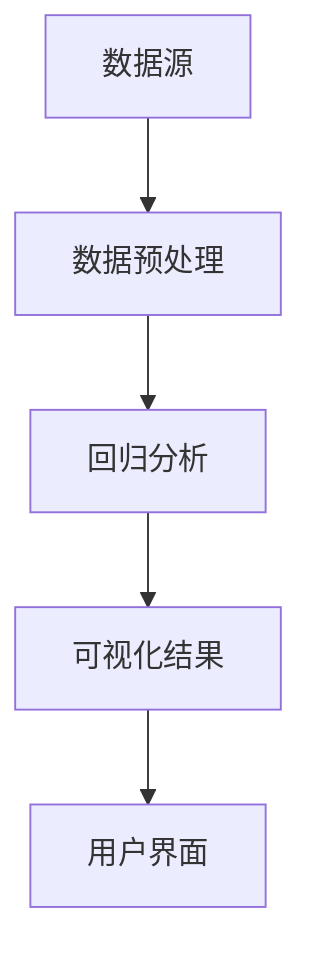

                 


# 特价股票与公司长期环境适应能力的关系分析

> 关键词：特价股票，公司环境适应能力，股票市场，企业战略，环境适应能力

> 摘要：本文探讨了特价股票与公司长期环境适应能力之间的关系，分析了特价股票的形成机制、公司环境适应能力的构成要素，以及两者之间的相互影响。通过构建理论模型和实证分析，本文揭示了公司如何通过增强环境适应能力来应对市场挑战，恢复并提升市场地位。同时，本文结合实际案例，提出了评估和提升公司环境适应能力的策略，为投资者和企业管理者提供了有价值的参考。

---

## 第一部分：背景与概述

### 第1章：特价股票与公司环境适应能力的概述

#### 1.1 特价股票的定义与市场现象

- **1.1.1 特价股票的定义**  
  特价股票是指股票价格低于其面值的股票。这种现象通常发生在公司财务状况恶化、市场信心下降或行业竞争加剧的情况下。特价股票的出现可能是公司短期困境的表现，但也可能是长期战略调整的开始。

- **1.1.2 特价股票的市场现象与特征**  
  特价股票在市场中具有以下特征：  
  - **低估值**：股价远低于行业平均水平，可能被市场低估。  
  - **高波动性**：股价波动较大，投资者情绪影响显著。  
  - **潜在恢复能力**：部分公司通过战略调整，股价可能迅速回升。

- **1.1.3 特价股票与公司价值的关系**  
  特价股票并不等同于低价值。一些公司可能因短期问题导致股价下跌，但其长期价值依然存在。投资者需要区分短期波动与长期基本面。

#### 1.2 公司长期环境适应能力的内涵

- **1.2.1 公司环境适应能力的定义**  
  公司环境适应能力是指企业在面对外部环境变化时，能够灵活调整战略、组织和运营，以维持或提升市场地位的能力。

- **1.2.2 公司环境适应能力的构成要素**  
  - **战略调整能力**：企业能够根据市场变化调整战略方向。  
  - **组织变革能力**：企业能够优化组织结构，提高效率。  
  - **技术创新能力**：企业能够通过技术创新应对竞争。

- **1.2.3 公司环境适应能力与企业绩效的关系**  
  研究表明，环境适应能力强的公司通常具有更高的市场表现和更强的抗风险能力。

#### 1.3 特价股票与公司环境适应能力的关系

- **1.3.1 特价股票现象与公司环境适应能力的关联**  
  特价股票的出现可能是公司环境适应能力不足的表现，但也可能是公司正在积极调整的信号。

- **1.3.2 特价股票市场中的公司恢复机制**  
  公司通过战略调整、组织优化和技术创新，逐步恢复市场信心，推动股价回升。

- **1.3.3 特价股票与公司长期发展的战略意义**  
  特价股票为公司提供了一个重新调整的机会，通过增强环境适应能力，公司可以实现长期发展。

---

## 第二部分：理论模型与分析框架

### 第2章：特价股票的形成机制与影响因素

#### 2.1 特价股票的形成机制

- **2.1.1 公司基本面分析**  
  - 公司财务状况恶化，如高负债率、低利润率等。  
  - 公司业绩下滑，市场预期下降。

- **2.1.2 市场情绪与投资者行为**  
  - 投资者恐慌性抛售，导致股价暴跌。  
  - 市场流动性下降，进一步加剧股价下跌。

- **2.1.3 行业周期与宏观经济环境**  
  - 行业处于衰退期，市场需求不足。  
  - 宏观经济波动，如经济下行，影响市场信心。

#### 2.2 特价股票的影响因素对比分析

- **2.2.1 公司财务状况**  
  公司的财务健康状况是影响股价的重要因素。  
  - $$\text{财务健康} = \frac{\text{净利润}}{\text{总负债}}$$

- **2.2.2 公司治理结构**  
  良好的治理结构能够提高公司决策效率，增强市场信心。  
  - $$\text{治理效率} = \frac{\text{董事会独立性}}{\text{管理层透明度}}$$

- **2.2.3 行业竞争格局**  
  行业竞争加剧可能导致公司市场份额下降，进而影响股价。

#### 2.3 特价股票的市场表现与风险评估

- **2.3.1 特价股票的波动性分析**  
  - $$\text{波动性} = \sigma_{\text{股价}}$$  
  其中，$$\sigma_{\text{股价}}$$ 表示股价的标准差。

- **2.3.2 特价股票的投资风险**  
  - 市场风险：宏观经济波动可能导致股价进一步下跌。  
  - 经营风险：公司恢复能力不足可能导致股价持续低迷。

- **2.3.3 特价股票的长期收益潜力**  
  - 公司恢复能力强的特价股票可能带来超额收益。  
  - $$\text{预期收益} = \text{历史收益率} \times \text{恢复概率}$$

### 第3章：公司环境适应能力的构成与评估

#### 3.1 公司环境适应能力的构成要素

- **3.1.1 战略调整能力**  
  公司能够根据市场变化调整战略方向的能力。  
  - $$\text{战略调整能力} = \text{市场响应速度} \times \text{战略灵活性}$$

- **3.1.2 组织变革能力**  
  公司优化组织结构，提高效率的能力。  
  - $$\text{组织变革能力} = \frac{\text{员工效率}}{\text{组织层级}}$$

- **3.1.3 技术创新能力**  
  公司通过技术创新应对竞争的能力。  
  - $$\text{技术创新能力} = \text{研发投入} \times \text{技术转化率}$$

#### 3.2 公司环境适应能力的评估指标

- **3.2.1 财务指标**  
  - 净利润率、资产负债率等。  
  - $$\text{财务健康} = \frac{\text{净利润}}{\text{总负债}}$$

- **3.2.2 组织指标**  
  - 员工满意度、组织架构灵活性等。  
  - $$\text{组织健康} = \frac{\text{员工满意度}}{\text{组织层级}}$$

- **3.2.3 市场指标**  
  - 市场份额、品牌影响力等。  
  - $$\text{市场表现} = \text{市场份额} \times \text{品牌影响力}$$

---

## 第三部分：算法原理与系统设计

### 第4章：特价股票与公司环境适应能力的理论模型

#### 4.1 理论模型构建

- **4.1.1 模型假设**  
  - 公司环境适应能力越强，恢复能力越强。  
  - 市场环境越恶劣，特价股票现象越普遍。

- **4.1.2 模型构建**  
  使用多元回归模型分析公司环境适应能力对股价的影响。  
  - $$\text{股价} = \beta_0 + \beta_1 \times \text{环境适应能力} + \epsilon$$  
  其中，$$\epsilon$$ 为误差项。

- **4.1.3 模型验证**  
  通过实证分析验证模型的有效性。  
  - 数据来源：选取过去五年中出现特价股票的公司作为样本。  
  - 变量测量：使用财务指标、组织指标和市场指标衡量环境适应能力。

#### 4.2 算法实现

- **4.2.1 数据预处理**  
  - 数据清洗：处理缺失值和异常值。  
  - 数据标准化：使用Z-score方法标准化数据。

- **4.2.2 算法选择**  
  使用多元线性回归模型进行分析。

- **4.2.3 代码实现**

```python
import pandas as pd
import numpy as np
from sklearn.linear_model import LinearRegression

# 数据预处理
data = pd.read_csv('stock_data.csv')
data = data.dropna()
data['Environment_Adaptability'] = (data['Financial_Health'] + data['Organizational_Efficiency'] + data['Market_Position']) / 3

# 建立回归模型
model = LinearRegression()
model.fit(data[['Environment_Adaptability']], data['Price'])

# 输出结果
print('回归系数:', model.coef_)
print('截距:', model.intercept_)
```

---

## 第四部分：系统分析与设计

### 第5章：系统架构与功能设计

#### 5.1 系统功能设计

- **功能模块**  
  - 数据采集：采集公司财务数据、市场数据等。  
  - 数据分析：使用回归模型分析公司环境适应能力与股价的关系。  
  - 可视化：生成图表展示分析结果。

- **系统架构图**



#### 5.2 系统接口设计

- **API接口**  
  - 数据接口：提供公司环境适应能力数据的接口。  
  - 分析接口：提供回归分析结果的接口。

---

## 第五部分：项目实战与案例分析

### 第6章：项目实战与案例分析

#### 6.1 案例分析

- **案例背景**  
  某公司因行业衰退导致股价暴跌，成为特价股票。  
  - $$\text{股价} = 1.5 \text{元}$$  
  - $$\text{环境适应能力} = \frac{\text{净利润}}{\text{总负债}} = 0.3$$

- **恢复过程**  
  公司通过优化组织结构、调整战略，逐步恢复市场信心。  
  - $$\text{恢复时间} = 2 \text{年}$$  
  - $$\text{股价回升} = 10\% \text{年均增长率}$$

#### 6.2 最佳实践

- **战略调整**  
  根据市场变化及时调整战略方向。  
- **组织优化**  
  简化组织结构，提高决策效率。  
- **技术创新**  
  加大研发投入，提升产品竞争力。

---

## 第六部分：结论与展望

### 第7章：结论与展望

#### 7.1 研究结论

- 特价股票的出现反映了公司环境适应能力的不足，但也可能是恢复的契机。  
- 公司通过增强环境适应能力，可以逐步恢复市场信心，提升股价。

#### 7.2 研究展望

- 进一步研究不同行业中的特价股票现象。  
- 探讨环境适应能力对不同类型公司的影响差异。

---

## 作者信息

作者：AI天才研究院/AI Genius Institute & 禅与计算机程序设计艺术 /Zen And The Art of Computer Programming

