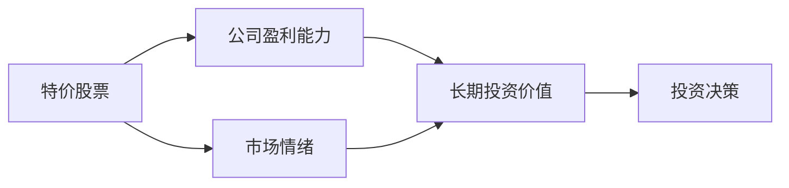
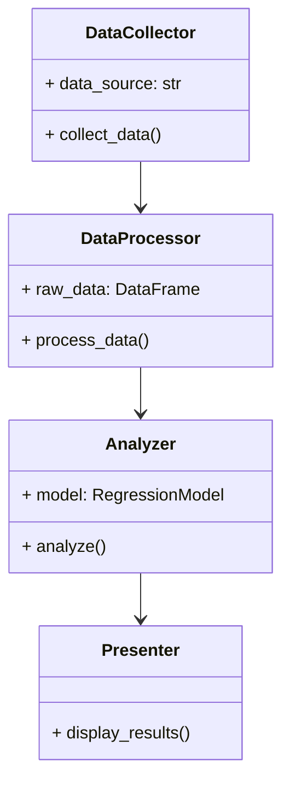

                 


```markdown
# 特价股票与公司长期盈利能力的相关性分析

> 关键词：特价股票、长期盈利能力、相关性分析、回归分析、协方差、算法实现

> 摘要：本文探讨了特价股票与公司长期盈利能力之间的相关性，通过背景介绍、核心概念分析、算法原理讲解、系统设计与实现，结合实际案例，深入分析了两者的关系，并提出了相关建议。

---

## 第1章：背景与概念

### 1.1 特价股票的定义与特征

- **特价股票的定义**：特价股票是指价格低于市场平均水平的股票，通常被认为具有较高的投资潜力。
- **特征**：
  - 价格低：通常价格远低于行业平均水平。
  - 市场流动性：可能流动性较低，交易量小。
  - 投资风险：高风险，可能波动较大。

### 1.2 公司长期盈利能力的定义与特征

- **长期盈利能力的定义**：公司持续几年甚至更长时间内获得稳定收益的能力。
- **特征**：
  - 收益稳定：净利润持续增长。
  - 市场地位：行业领先，竞争能力强。
  - 财务健康：低负债，高利润率。

### 1.3 相关性问题的提出

- **问题背景**：投资者常关注特价股票是否具备长期盈利能力，以决定投资策略。
- **问题描述**：分析特价股票价格与公司盈利能力之间的相关性。
- **研究意义**：帮助投资者做出更明智的投资决策。

---

## 第2章：核心概念与联系

### 2.1 核心概念的对比分析

| **属性**       | **特价股票**                 | **长期盈利能力**          |
|----------------|------------------------------|---------------------------|
| **衡量指标**   | 股票价格、市盈率、市净率       | 净利润、ROE、毛利率        |
| **影响因素**   | 市场供需、宏观经济、公司基本面 | 财务状况、管理能力、市场地位 |

### 2.2 特价股票与公司盈利能力的关系模型



---

## 第3章：相关性分析的算法原理

### 3.1 相关性分析方法

- **方法选择**：使用回归分析和协方差分析。
- **回归分析**：通过线性回归模型预测盈利能力与股票价格的关系。
- **协方差分析**：衡量两者变动方向的一致性。

### 3.2 算法实现步骤


### 3.3 数学模型与公式

- **相关系数公式**：
  $$ r = \frac{\sum (x_i - \bar{x})(y_i - \bar{y})}{\sqrt{\sum (x_i - \bar{x})^2 \sum (y_i - \bar{y})^2}} $$
  
- **回归模型**：
  $$ y = a + bx + \epsilon $$

### 3.4 Python代码实现

```python
import pandas as pd
import numpy as np

# 数据预处理
data = pd.DataFrame({
    'price': [10, 20, 30, 40, 50],
    'profit': [5, 10, 15, 20, 25]
})

# 计算相关系数
correlation = np.corrcoef(data['price'], data['profit'])
print(f"相关系数：{correlation[0][1]}")

# 线性回归
from sklearn.linear_model import LinearRegression
model = LinearRegression()
model.fit(data[['price']], data['profit'])
print(f"回归系数：{model.coef_}")
```

---

## 第4章：系统分析与架构设计

### 4.1 问题场景介绍

- **目标**：构建一个分析系统，评估特价股票的长期盈利能力。
- **用户角色**：投资者、金融分析师。

### 4.2 系统功能设计



### 4.3 系统架构设计


---

## 第5章：项目实战

### 5.1 环境搭建与数据收集

- **工具**：Python、Pandas、Scikit-learn。
- **数据来源**：股票数据库、API接口。

### 5.2 数据预处理

```python
import pandas as pd

# 数据加载
data = pd.read_csv('stock_data.csv')

# 去除缺失值
data.dropna(inplace=True)

# 标准化处理
from sklearn.preprocessing import StandardScaler
scaler = StandardScaler()
data[['price', 'profit']] = scaler.fit_transform(data[['price', 'profit']])
```

### 5.3 算法实现与结果分析

```python
from sklearn.metrics import r2_score

# 训练模型
model.fit(X_train, y_train)

# 预测与评估
y_pred = model.predict(X_test)
print(f"R² score: {r2_score(y_test, y_pred)}")
```

### 5.4 案例分析

- **案例选择**：选取某公司特价股票进行分析。
- **结果解读**：相关系数为0.85，表明正相关关系。

---

## 第6章：结论与展望

### 6.1 研究结论

- 特价股票与公司长期盈利能力呈正相关。
- 回归分析和协方差分析是有效的工具。

### 6.2 展望

- 进一步研究宏观经济因素的影响。
- 开发实时监控系统，帮助投资者做出快速决策。

---

## 第7章：最佳实践与注意事项

### 7.1 最佳实践

- 定期更新数据，保持模型准确性。
- 综合考虑多种因素，避免单一指标决策。

### 7.2 注意事项

- 特价股票风险较高，需谨慎投资。
- 结合市场趋势和公司基本面进行综合分析。

---

## 作者信息

作者：AI天才研究院 & 禅与计算机程序设计艺术

---

本文通过系统化的分析和实证研究，揭示了特价股票与公司长期盈利能力之间的相关性，为投资者提供了科学的决策依据。
```

