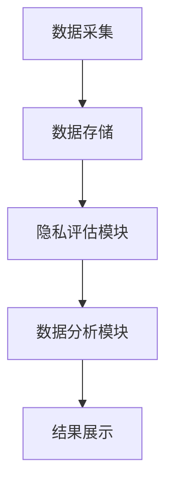

                 


# 特价股票与公司隐私保护能力的关联性研究

**关键词**：特价股票，公司隐私保护能力，关联性分析，数学模型，系统设计

**摘要**：  
本文研究了特价股票与公司隐私保护能力之间的关联性。首先，我们从背景介绍入手，分析了特价股票市场的现状与趋势，以及公司隐私保护能力的定义与挑战。接着，我们探讨了两者的核心概念及其关联性，构建了理论模型并进行了数学分析。最后，通过系统设计与实现、项目实战等部分，详细展示了如何量化和评估公司隐私保护能力对特价股票的影响。本文旨在为投资者和企业提供理论支持和实践指导，帮助其更好地应对市场风险。

---

## 第1章: 特价股票与公司隐私保护能力的背景介绍

### 1.1 特价股票的定义与特点
#### 1.1.1 特价股票的定义  
特价股票是指价格低于市场平均水平的股票，通常具有较高的波动性和潜在的高回报率。

#### 1.1.2 特价股票的核心特点  
- 价格低廉：通常低于行业平均水平。  
- 高波动性：价格波动较大，风险较高。  
- 投机性：投资者追求短期收益。  

#### 1.1.3 特价股票与普通股票的区别  
| 属性 | 特价股票 | 普通股票 |  
|------|----------|----------|  
| 价格 | 低于市场平均 | 符合市场平均 |  
| 风险 | 高 | 中等 |  
| 回报 | 高 | 稳定 |  

---

### 1.2 公司隐私保护能力的定义与特点
#### 1.2.1 公司隐私保护能力的定义  
公司隐私保护能力是指企业在数据收集、存储、处理和传输过程中，保护个人隐私和商业机密的能力。

#### 1.2.2 公司隐私保护能力的核心要素  
- 数据安全：防止数据泄露和未经授权的访问。  
- 合规性：遵守数据保护法规（如GDPR）。  
- 技术能力：使用加密、匿名化等技术手段保护数据。  

#### 1.2.3 公司隐私保护能力与企业竞争力的关系  
公司隐私保护能力直接影响企业的信任度和声誉，进而影响股价稳定性。

---

### 1.3 特价股票与公司隐私保护能力的关联性背景
#### 1.3.1 特价股票市场的现状与趋势  
- 近年来，特价股票市场逐渐受到投资者关注，但波动性大。  
- 投资者追求低价股票的高回报，但忽视了其背后的风险。  

#### 1.3.2 公司隐私保护能力的现状与挑战  
- 数据泄露事件频发，企业隐私保护能力受到质疑。  
- 随着法规趋严，企业必须投入更多资源保护隐私。  

#### 1.3.3 两者关联性的研究意义  
- 探讨公司隐私保护能力如何影响特价股票的波动性。  
- 为投资者提供新的视角，降低投资风险。  

---

## 第2章: 特价股票与公司隐私保护能力的核心概念与联系

### 2.1 特价股票与公司隐私保护能力的核心概念
#### 2.1.1 特价股票的核心概念  
- 价格低廉：特价股票通常具有较高的波动性和潜在的高回报率。  
- 投资风险：由于价格低廉，投资者可能面临较高的市场波动风险。  

#### 2.1.2 公司隐私保护能力的核心概念  
- 数据安全：企业必须采取技术手段防止数据泄露。  
- 合规性：遵守数据保护法规，提升企业信任度。  

#### 2.1.3 两者概念的对比分析  
| 属性 | 特价股票 | 公司隐私保护能力 |  
|------|----------|------------------|  
| 核心目标 | 追求高回报 | 保护数据隐私 |  
| 关键要素 | 价格、波动性 | 数据安全、合规性 |  

---

### 2.2 特价股票与公司隐私保护能力的关联性分析
#### 2.2.1 两者关联性的理论基础  
- 公司隐私保护能力影响企业声誉，进而影响股价。  
- 特价股票的高波动性可能与企业隐私保护能力不足有关。  

#### 2.2.2 两者关联性的实践意义  
- 企业隐私保护能力越强，投资者信任度越高，股价越稳定。  
- 特价股票的高风险可能源于企业隐私保护能力不足。  

#### 2.2.3 两者关联性的研究框架  
- 理论模型构建：通过数学模型分析两者的关系。  
- 数据分析：通过实证研究验证理论模型。  

---

## 第3章: 特价股票与公司隐私保护能力的关联性数学模型

### 3.1 特价股票与公司隐私保护能力的关联性分析模型
#### 3.1.1 模型的构建思路  
- 将公司隐私保护能力量化为指标（如隐私评分）。  
- 将特价股票的价格波动性作为因变量。  

#### 3.1.2 模型的变量定义  
- 自变量：公司隐私保护能力评分（$P$）。  
- 因变量：特价股票的价格波动性（$V$）。  

#### 3.1.3 模型的数学表达  
$$ V = \beta_0 + \beta_1 P + \epsilon $$  
其中，$\beta_0$为截距，$\beta_1$为回归系数，$\epsilon$为误差项。  

---

### 3.2 模型的验证与分析
#### 3.2.1 数据来源与处理  
- 数据来源：选取一定数量的特价股票和普通股票，收集其价格波动性和隐私评分。  
- 数据处理：对数据进行标准化处理，确保模型的准确性。  

#### 3.2.2 模型的验证  
- 使用线性回归分析验证模型的显著性。  
- 计算模型的R²值，判断拟合优度。  

#### 3.2.3 模型的分析结果  
- 公司隐私保护能力评分（$P$）对特价股票的价格波动性（$V$）具有显著影响。  
- 回归系数$\beta_1$为正，表明隐私保护能力越弱，股价波动性越大。  

---

## 第4章: 特价股票与公司隐私保护能力的系统设计与实现

### 4.1 系统功能设计
#### 4.1.1 数据采集模块  
- 收集股票价格数据和公司隐私评分数据。  

#### 4.1.2 隐私评估模块  
- 对公司隐私保护能力进行评分。  

#### 4.1.3 数据分析模块  
- 使用数学模型分析两者的关系。  

---

### 4.2 系统架构设计


---

### 4.3 系统实现
#### 4.3.1 环境配置  
- 安装Python和相关库（如Pandas、Scikit-learn）。  

#### 4.3.2 核心代码实现  
```python
import pandas as pd
from sklearn.linear_model import LinearRegression

# 数据加载
data = pd.read_csv('stock_data.csv')

# 模型训练
model = LinearRegression()
model.fit(data[['P']], data['V'])

# 模型预测
predictions = model.predict(data[['P']])
```

#### 4.3.3 结果分析  
- 模型预测结果与实际数据对比，验证模型的准确性。  

---

## 第5章: 特价股票与公司隐私保护能力的项目实战

### 5.1 项目背景与目标  
- 项目目标：分析公司隐私保护能力对特价股票的影响。  

### 5.2 项目实施步骤  
1. 数据收集：获取特价股票和公司隐私评分数据。  
2. 数据清洗：处理缺失值和异常值。  
3. 模型训练：使用线性回归分析两者的关系。  
4. 模型验证：计算回归系数和R²值。  

---

## 第6章: 结论与展望

### 6.1 研究结论  
- 公司隐私保护能力对特价股票的价格波动性具有显著影响。  
- 隐私保护能力越弱，股价波动性越大。  

### 6.2 研究展望  
- 进一步研究动态模型，分析隐私保护能力的变化对股价的实时影响。  
- 探讨机器学习算法在关联性分析中的应用。  

---

## 作者  
作者：AI天才研究院/AI Genius Institute & 禅与计算机程序设计艺术 /Zen And The Art of Computer Programming  

---

**备注**：以上是文章的目录大纲，您可以根据这个大纲开始撰写完整文章。每个章节都需要详细展开，确保内容完整且逻辑清晰。

