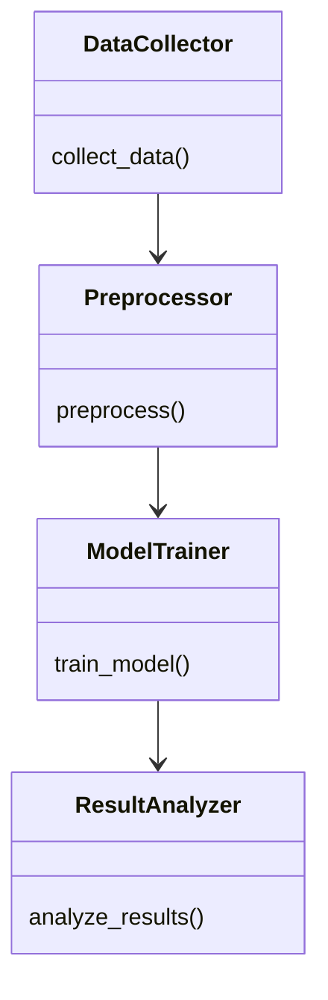

                 


# 特价股票与公司隐藏资产价值发现的方法

> 关键词：特价股票、隐藏资产、价值发现、投资策略、数据分析、机器学习

> 摘要：本文深入探讨了如何通过数据分析和机器学习方法发现特价股票及公司隐藏资产的价值。文章首先介绍了特价股票和隐藏资产的基本概念，然后从核心概念、算法原理、系统架构、项目实战等多方面进行了详细分析，最后总结了投资中的注意事项及未来研究方向。

---

## 第一部分：特价股票与公司隐藏资产的背景与概述

### 1.1 特价股票的定义与特征

#### 1.1.1 特价股票的定义
特价股票是指市场价格显著低于其内在价值的股票。这些股票通常被市场低估，具有较大的上涨潜力。

#### 1.1.2 特价股票的分类
1. **周期性股票**：受经济周期影响较大的行业股票，如制造业和能源行业。
2. **成长型股票**：未来增长潜力大，但当前市盈率较低。
3. **价值型股票**：市场价格远低于其账面价值的股票。

#### 1.1.3 特价股票的市场表现
- 市场波动时，特价股票往往表现不佳，但长期来看，其价值回归的可能性较大。

### 1.2 公司隐藏资产的定义与类型

#### 1.2.1 隐藏资产的定义
隐藏资产是指公司账面上未记录或未完全反映的资产，可能被市场忽视或低估。

#### 1.2.2 隐藏资产的分类
1. **无形资产**：专利、商标、品牌价值等。
2. **未记录的土地和资源**：公司拥有的未完全评估的土地或矿产资源。
3. **应收账款**：未完全反映的应收款或债权。

#### 1.2.3 隐藏资产对股价的影响
- 隐藏资产的发现会增加公司价值，从而推高股价。

### 1.3 特价股票与隐藏资产的关系

#### 1.3.1 隐藏资产如何影响股价
- 隐藏资产的发现通常会提升市场对公司价值的评估，从而推高股价。

#### 1.3.2 特价股票与隐藏资产的关联
- 特价股票往往存在于隐藏资产未被发现的公司中，一旦隐藏资产被挖掘，股价可能迅速回升。

#### 1.3.3 投资机会分析
- 投资者可以通过分析公司财务报表和行业趋势，寻找隐藏资产丰富的公司，从而发现特价股票。

---

## 第二部分：核心概念与分析方法

### 2.1 特价股票的识别方法

#### 2.1.1 基本面分析法
- 通过分析公司财务报表，评估其内在价值。

#### 2.1.2 技术分析法
- 使用K线图、均线等技术指标，判断股票的买卖信号。

#### 2.1.3 综合评估法
- 结合基本面和技术分析，综合评估股票的投资价值。

### 2.2 隐藏资产的发现方法

#### 2.2.1 财务报表分析法
- 通过分析资产负债表、利润表等，寻找未记录的资产。

#### 2.2.2 行业分析法
- 研究行业趋势，寻找可能隐藏资产的公司。

#### 2.2.3 竞争对手比较法
- 将公司与行业竞争对手进行比较，寻找差异。

### 2.3 综合分析方法

#### 2.3.1 数据收集与处理
- 收集公司财务数据、行业信息等，进行清洗和预处理。

#### 2.3.2 指标分析
- 使用市盈率、市净率等指标，评估股票的内在价值。

---

## 第三部分：算法原理与数学模型

### 3.1 数据预处理

```python
import pandas as pd
import numpy as np

# 示例数据加载
data = pd.read_csv('stock_data.csv')

# 数据清洗
data.dropna()
data = data.replace([np.inf, -np.inf], np.nan).dropna()
```

### 3.2 特征提取

```python
# 计算市盈率
data['PE'] = data['Price'] / data['Earnings']
# 计算市净率
data['PB'] = data['Price'] / data['Book Value']
```

### 3.3 模型训练

```python
from sklearn.linear_model import LinearRegression
from sklearn.model_selection import train_test_split

# 训练数据集
X = data[['PE', 'PB']]
y = data['Target']

X_train, X_test, y_train, y_test = train_test_split(X, y, test_size=0.2)

# 训练模型
model = LinearRegression()
model.fit(X_train, y_train)
```

### 3.4 数学模型

股票价值评估公式：
$$ V = \alpha \times P/E + \beta \times P/B $$

---

## 第四部分：系统分析与架构设计

### 4.1 系统功能设计



### 4.2 系统架构设计


---

## 第五部分：项目实战与案例分析

### 5.1 环境配置

```bash
pip install pandas numpy scikit-learn
```

### 5.2 核心实现

```python
import pandas as pd
from sklearn.linear_model import LinearRegression

# 加载数据
data = pd.read_csv('stock_data.csv')

# 特征提取
X = data[['PE', 'PB']]
y = data['Target']

# 划分数据集
X_train, X_test, y_train, y_test = train_test_split(X, y, test_size=0.2)

# 训练模型
model = LinearRegression()
model.fit(X_train, y_train)

# 预测结果
predictions = model.predict(X_test)
print('预测结果:', predictions)
```

---

## 第六部分：风险与最佳实践

### 6.1 投资中的注意事项
1. **市场风险**：市场波动可能影响股票价格。
2. **数据准确性**：确保数据来源可靠。
3. **模型局限性**：模型预测结果仅供参考。

### 6.2 最佳实践 tips
- 定期更新模型，适应市场变化。
- 结合多种方法进行分析，降低风险。

---

## 第七部分：总结与展望

本文详细介绍了如何通过数据分析和机器学习方法发现特价股票及公司隐藏资产的价值。从背景介绍、核心概念、算法原理到系统设计和项目实战，为投资者提供了全面的指导。未来，可以通过引入更多数据源和改进模型算法，进一步提升价值发现的准确性。

---

作者：AI天才研究院/AI Genius Institute & 禅与计算机程序设计艺术 /Zen And The Art of Computer Programming

