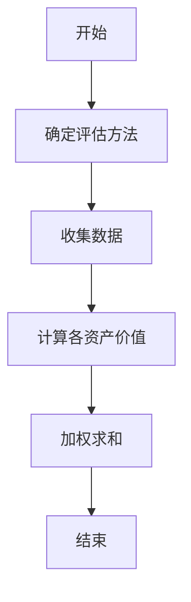

                 

# 特价股票与公司隐藏资产的价值发现

> **关键词**：特价股票、隐藏资产、价值发现、投资策略、财务分析、风险管理

> **摘要**：  
> 本文深入探讨了特价股票与公司隐藏资产的价值发现方法，结合实际案例分析，详细讲解了如何通过财务分析、非财务信息挖掘和数学模型构建，发现隐藏资产的价值，并制定有效的投资策略。文章还讨论了相关风险及管理措施，为投资者提供了系统化的参考框架。

---

## 第1章: 特价股票与公司隐藏资产概述

### 1.1 特价股票的定义与特征

#### 1.1.1 特价股票的定义
特价股票是指在特定市场条件下，价格远低于其内在价值的股票。这类股票通常被市场低估，具有较大的增值潜力。

#### 1.1.2 特价股票的市场特征
- **价格波动性**：特价股票的价格受市场情绪影响较大，波动性显著。
- **市场关注度低**：由于市场对这些股票的关注度较低，导致其价格被低估。
- **潜在价值**：这些股票往往隐藏着未被市场发现的价值，如公司隐藏资产或潜在的业绩反转。

#### 1.1.3 特价股票的投资价值
- 投资者可以通过挖掘隐藏资产，发现特价股票的潜在价值。
- 在市场反转时，特价股票往往能带来超额收益。

---

### 1.2 公司隐藏资产的概念与分类

#### 1.2.1 隐藏资产的定义
隐藏资产是指公司财务报表中未明确列示，但实际存在的资产。这些资产可能未被充分披露或被市场忽视。

#### 1.2.2 隐藏资产的分类
- **无形资产**：如专利、商标、客户关系等。
- **潜在资产**：如未开发的土地、储备的原材料。
- **或其他权益**：如期权、认股权等。

#### 1.2.3 隐藏资产的识别方法
- **财务报表分析**：通过审查资产负债表、利润表等，寻找未列示的资产。
- **行业对标分析**：比较同行业公司的资产结构，找出差异。
- **管理层访谈**：通过与公司高管沟通，了解潜在资产的存在。

---

### 1.3 特价股票与公司隐藏资产的关系

#### 1.3.1 特价股票与公司隐藏资产的关联
- 特价股票的价格往往低于其实际价值，而公司隐藏资产是其价值的重要组成部分。
- 挖掘隐藏资产可以帮助投资者发现特价股票的潜在价值。

#### 1.3.2 隐藏资产对股价的影响
- 隐藏资产的存在通常未被市场充分反映，可能导致股价低估。
- 当隐藏资产被市场发现后，股价往往会出现显著回升。

#### 1.3.3 投资者如何利用隐藏资产发现投资机会
- 通过分析公司财务报表和行业对标，识别隐藏资产。
- 结合市场情绪和技术分析，判断特价股票的投资价值。

---

## 第2章: 公司隐藏资产的评估与分析

### 2.1 财务报表分析法

#### 2.1.1 财务报表分析的基本方法
- **资产负债表分析**：识别未列示的资产。
- **利润表分析**：评估公司盈利能力与资产利用效率。
- **现金流分析**：了解公司现金流量与资产的关系。

#### 2.1.2 隐藏资产在财务报表中的识别
- **资产结构异常**：某些资产项目比例显著低于行业平均水平。
- **资产增长与收入增长不匹配**：资产增长快于收入增长，可能存在未列示资产。
- **资产周转率低**：资产周转率低于行业平均水平，可能表明存在未充分利用的资产。

#### 2.1.3 财务指标与隐藏资产的关系
- **资产回报率（ROA）**：ROA低可能表明资产利用效率低下，可能存在隐藏资产。
- **净资产收益率（ROE）**：ROE低可能表明资产质量不高，可能存在隐藏负债。

---

### 2.2 非财务信息分析法

#### 2.2.1 公司治理结构分析
- **董事会构成**：董事会成员的背景和经验可能影响资产管理和披露。
- **管理层稳定性**：管理层频繁变动可能影响资产的管理和披露。

#### 2.2.2 管理层行为分析
- **管理层的决策风格**：激进的管理层可能隐藏资产或负债。
- **管理层的透明度**：管理层是否愿意公开更多信息，影响隐藏资产的识别。

#### 2.2.3 行业环境分析
- **行业周期**：行业处于低谷时，公司可能隐藏资产以应对短期压力。
- **竞争格局**：行业竞争激烈时，隐藏资产可能被忽视。

---

### 2.3 隐藏资产对股价的影响

#### 2.3.1 隐藏资产的市场反应
- 当隐藏资产被市场发现时，股价通常会迅速上涨。
- 市场对隐藏资产的反应程度取决于资产的价值和公司的信息披露。

#### 2.3.2 股价波动与隐藏资产的关系
- 隐藏资产的存在可能导致股价的异常波动。
- 市场情绪和技术分析可以帮助识别隐藏资产对股价的影响。

#### 2.3.3 投资者如何利用隐藏资产信息进行决策
- 结合财务分析和市场情绪，制定投资策略。
- 通过技术分析，判断买入和卖出的最佳时机。

---

## 第3章: 特价股票的特征与识别

### 3.1 特价股票的市场特征

#### 3.1.1 特价股票的价格波动
- 特价股票的价格通常波动较大，受市场情绪影响显著。
- 价格波动可以通过技术分析进行预测和判断。

#### 3.1.2 特价股票的市场情绪
- 市场情绪分析可以帮助识别特价股票的投资机会。
- 通过分析市场情绪，判断股票的买卖信号。

#### 3.1.3 特价股票的技术分析
- 技术分析是识别特价股票的重要方法，包括K线图、均线、成交量分析等。

---

### 3.2 特价股票的识别方法

#### 3.2.1 市场情绪分析法
- 通过分析市场情绪，识别特价股票的投资机会。
- 市场情绪分析可以通过新闻、社交媒体等途径进行。

#### 3.2.2 股价波动分析法
- 通过分析股价波动，识别特价股票的投资机会。
- 波动率分析可以帮助判断股票的风险和收益。

#### 3.2.3 财务指标分析法
- 通过分析财务指标，识别特价股票的投资机会。
- 重点关注ROE、ROA、毛利率等指标。

---

### 3.3 特价股票的投资机会

#### 3.3.1 特价股票的投资策略
- **价值投资策略**：寻找被市场低估的股票。
- **趋势投资策略**：跟随市场趋势进行投资。
- **事件驱动策略**：利用公司事件进行投资。

#### 3.3.2 特价股票的风险与收益
- **风险**：市场波动、公司业绩不佳、政策风险等。
- **收益**：市场反转时的超额收益。

#### 3.3.3 特价股票的长期与短期投资机会
- **长期投资**：寻找具有持续增长潜力的公司。
- **短期投资**：利用市场波动进行短期交易。

---

## 第4章: 公司隐藏资产的价值评估模型

### 4.1 隐藏资产价值评估的基本方法

#### 4.1.1 市场法
- 通过比较同行业公司，评估隐藏资产的价值。
- 适用于无形资产的评估。

#### 4.1.2 收益法
- 通过预测未来现金流，评估隐藏资产的价值。
- 适用于有形资产的评估。

#### 4.1.3 成本法
- 通过估算重置成本，评估隐藏资产的价值。
- 适用于固定资产的评估。

---

### 4.2 隐藏资产价值评估的数学模型

#### 4.2.1 隐藏资产价值评估的公式
$$ V = \sum_{i=1}^{n} w_i \times v_i $$
其中，\( V \) 是隐藏资产的总价值，\( w_i \) 是各资产的权重，\( v_i \) 是各资产的评估价值。

#### 4.2.2 隐藏资产价值评估的流程图

---

## 第5章: 特价股票与公司隐藏资产的价值发现模型

### 5.1 特价股票的价值发现模型

#### 5.1.1 价值发现模型的构建
- 通过分析公司财务数据和市场数据，构建价值发现模型。
- 模型包括财务指标、市场指标和技术指标。

#### 5.1.2 价值发现模型的应用
- 通过模型筛选出具有潜在价值的特价股票。
- 结合市场情绪和技术分析，制定投资策略。

---

### 5.2 价值发现模型的数学表达

$$ P = \alpha \times V + \beta \times M + \gamma \times T $$
其中，\( P \) 是股票的内在价值，\( V \) 是公司价值，\( M \) 是市场指标，\( T \) 是技术指标，\( \alpha \)、\( \beta \)、\( \gamma \) 是各指标的权重。

---

## 第6章: 投资策略与风险管理

### 6.1 投资策略

#### 6.1.1 价值投资策略
- 长期持有具有低估价值的股票。
- 重点关注公司的基本面和隐藏资产。

#### 6.1.2 技术投资策略
- 通过技术分析，寻找买入和卖出的最佳时机。
- 结合市场情绪，制定投资策略。

---

### 6.2 风险管理

#### 6.2.1 风险识别
- 市场风险：市场波动可能导致股价下跌。
- 信用风险：公司业绩不佳可能导致股价下跌。
- 政策风险：政策变化可能影响股价。

#### 6.2.2 风险管理策略
- **分散投资**：通过投资多种股票分散风险。
- **止损策略**：设定止损点，避免重大损失。
- **定期评估**：定期评估投资组合，调整策略。

---

## 第7章: 实战案例分析

### 7.1 案例背景

#### 7.1.1 公司简介
- 公司名称：XYZ公司
- 所属行业：科技
- 主要业务：软件开发

#### 7.1.2 财务数据
- 资产负债表：资产总额100亿元，负债总额60亿元，股东权益40亿元。
- 利润表：营业收入50亿元，净利润10亿元。
- 现金流表：经营活动现金流净额15亿元，投资活动现金流净额-10亿元，筹资活动现金流净额5亿元。

---

### 7.2 隐藏资产的识别

#### 7.2.1 财务分析
- 资产负债表分析：资产总额100亿元，其中无形资产仅列示5亿元，可能存在隐藏资产。
- 利润表分析：净利润10亿元，销售毛利率50%，高于行业平均水平，可能存在隐藏资产。

#### 7.2.2 非财务分析
- 行业环境：科技行业竞争激烈，公司可能隐藏技术专利。
- 管理层访谈：公司高管提到正在开发一项重要专利，未在财务报表中列示。

---

### 7.3 投资决策

#### 7.3.1 价值评估
- 隐藏资产价值：通过市场法和收益法，评估该专利价值约为2亿元。
- 股票内在价值：使用价值评估模型，计算出股票的内在价值为30元/股。

#### 7.3.2 投资策略
- 买入价格：当前股价为20元/股，低于内在价值，具有投资价值。
- 投资建议：建议买入并长期持有。

---

## 第8章: 总结与展望

### 8.1 总结
- 特价股票与公司隐藏资产的价值发现需要结合财务分析、非财务信息挖掘和数学模型构建。
- 投资者应注重风险管理，制定合理的投资策略。

### 8.2 展望
- 未来研究可以进一步探索人工智能在价值发现中的应用。
- 结合大数据分析，提高隐藏资产识别的准确性和效率。

---

## 作者：AI天才研究院/AI Genius Institute & 禅与计算机程序设计艺术 /Zen And The Art of Computer Programming

---

### **附录**

#### 附录A: 常用财务指标表

| 指标名称         | 计算公式                          |
|------------------|----------------------------------|
| 资产回报率（ROA） | 净利润 / 平均总资产                |
| 净资产收益率（ROE） | 净利润 / 平均股东权益              |
| 毛利率           | （营业收入 - 营业成本） / 营业收入 * 100% |
| 资产周转率       | 营业收入 / 平均总资产                |

---

#### 附录B: 投资工具推荐

- **财务分析工具**：Excel、Python（Pandas、NumPy）。
- **技术分析工具**：MetaTrader、TradingView。
- **风险管理工具**：RiskMetrics、Value-at-Risk（VaR）。

---

通过本文的系统化分析，投资者可以更好地发现特价股票与公司隐藏资产的价值，制定科学的投资策略，并在实际操作中规避风险，实现稳健投资。

