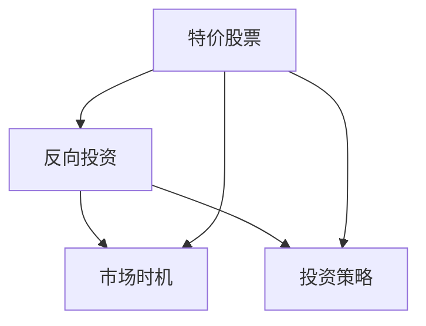
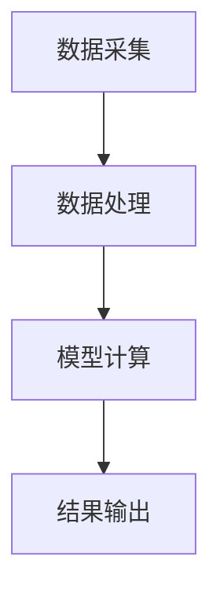

                 


# 特价股票与反向投资策略的异同

> 关键词：特价股票、反向投资、投资策略、市场时机、数学模型、系统架构

> 摘要：本文深入探讨了特价股票与反向投资策略的异同，分析了它们的核心概念、数学模型、系统架构及实际应用。通过对比，揭示了两者在投资决策中的优缺点及应用场景。

---

## 第一部分：特价股票与反向投资的背景与基础

### 第1章：特价股票的概念与特点

#### 1.1 特价股票的定义
- **1.1.1 什么是特价股票**  
  特价股票是指市场价格低于其内在价值的股票，通常被视为被市场低估的投资机会。  

- **1.1.2 特价股票的核心特征**  
  - 市场价格与内在价值的差距  
  - 通常出现在市场恐慌或低估时期  
  - 具备较高的安全边际  

- **1.1.3 特价股票的分类与应用场景**  
  - 按行业分类：金融、科技、制造业等  
  - 按市值分类：小盘股、中盘股、大盘股  
  - 应用场景：长期投资、价值投资  

#### 1.2 特价股票与市场的关系
- **市场波动对特价股票的影响**  
  - 市场恐慌时，特价股票更易出现  
  - 市场复苏时，特价股票价值回归  

- **投资者心理与特价股票**  
  - 投资者情绪对股价的影响  
  - 理性投资者如何识别特价股票  

---

### 第2章：反向投资策略的定义与特点

#### 2.1 反向投资的定义
- **2.1.1 什么是反向投资**  
  反向投资是指在市场乐观时卖出，市场恐慌时买入的投资策略。  

- **2.1.2 反向投资的核心理念**  
  - 市场情绪与投资机会的关系  
  - 在市场低点买入，在市场高点卖出  

- **2.1.3 反向投资与传统投资的区别**  
  - 投资时机：反向投资注重逆市场操作  
  - 风险承受：反向投资强调在市场恐慌时加仓  

#### 2.2 反向投资的优缺点
- **优点**  
  - 低位买入，高位卖出，收益潜力大  
  - 适合长期投资者  

- **缺点**  
  - 对市场情绪的判断要求高  
  - 短期波动可能影响收益  

---

## 第二部分：特价股票与反向投资的核心概念对比

### 第3章：特价股票与反向投资的异同点分析

#### 3.1 对比维度
- **市场时机**  
  - 特价股票：寻找低估的市场时机  
  - 反向投资：逆市场情绪操作  

- **投资者心理**  
  - 特价股票：需要理性判断  
  - 反向投资：需要逆向思维  

- **风险与收益**  
  - 特价股票：高收益伴随高风险  
  - 反向投资：收益相对稳定  

#### 3.2 对比表格
| 对比维度        | 特价股票                          | 反向投资                          |
|-----------------|----------------------------------|----------------------------------|
| 投资时机        | 价格低估时                        | 市场恐慌时                        |
| 风险承受        | 较高                              | 较低                              |
| 投资策略        | 寻找低估股票                      | 逆市场操作                        |
| 收益潜力        | 高                                | 稳定                              |

#### 3.3 实体关系图（Mermaid）



---

### 第4章：特价股票与反向投资的数学模型与公式

#### 4.1 特价股票的定价模型
- **市盈率模型**  
  $$ PE = \frac{Price}{Earnings} $$  
  - PE值越低，股票可能越便宜  

- **市净率模型**  
  $$ PB = \frac{Price}{Book\ Value} $$  
  - PB值越低，股票可能越被低估  

- **股息率模型**  
  $$ Dividend\ Yield = \frac{Dividend}{Price} $$  
  - 高股息率可能意味着股票被低估  

#### 4.2 反向投资的决策模型
- **市场情绪指数**  
  $$ Market\ Sentiment = \frac{Buy\ Volume - Sell\ Volume}{Total\ Volume} $$  
  - 情绪为负时，适合反向投资  

- **市场估值指标**  
  $$ Value\ Ratio = \frac{Market\ Value}{Book\ Value} $$  
  - 低于1时，市场可能被低估  

---

## 第三部分：系统分析与架构设计

### 第5章：投资决策模型的系统架构

#### 5.1 系统功能需求
- 数据采集模块  
  - 收集市场数据（股票价格、市盈率等）  
  - 分析市场情绪  

- 模型计算模块  
  - 计算特价股票指标  
  - 计算反向投资指标  

#### 5.2 系统架构图（Mermaid）



#### 5.3 系统接口设计
- 数据输入接口  
  - 市场数据接口  
  - 用户输入接口  

- 数据输出接口  
  - 投资建议接口  
  - 数据可视化接口  

---

## 第四部分：项目实战与案例分析

### 第6章：项目实战

#### 6.1 环境安装
- 安装Python与相关库（Pandas、NumPy、Matplotlib）  
- 数据源：Yahoo Finance API  

#### 6.2 核心代码实现
```python
import pandas as pd
import numpy as np

# 数据采集
data = pd.read_csv('stock_data.csv')

# 特价股票筛选
data['PE'] = data['Price'] / data['Earnings']
data['PB'] = data['Price'] / data['Book Value']

# 反向投资信号
data['Market Sentiment'] = (data['Buy Volume'] - data['Sell Volume']) / data['Total Volume']

# 筛选特价股票
cheap_stocks = data[data['PE'] < data['PE'].mean()]
```

#### 6.3 案例分析
- 案例1：2020年新冠疫情后的市场  
  - 特价股票：航空、零售等行业  
  - 反向投资：恐慌时买入，市场复苏时卖出  

- 案例2：2023年科技股回调  
  - 特价股票：市盈率低于行业平均水平的科技股  
  - 反向投资：市场恐慌时加仓  

---

## 第五部分：总结与展望

### 第7章：总结

#### 7.1 核心观点回顾
- 特价股票与反向投资的异同点  
- 数学模型与系统架构的应用  

#### 7.2 投资策略的选择
- 根据市场环境选择策略  
- 结合多因素分析  

#### 7.3 注意事项
- 风险控制  
- 信息获取的及时性  

---

## 第六部分：最佳实践 Tips

### 第8章：投资技巧与注意事项

#### 8.1 最佳实践
- 定期复盘投资策略  
- 结合技术分析与基本面分析  

#### 8.2 小结
- 特价股票与反向投资各有优劣，合理搭配使用可以提升投资收益  

---

## 作者：AI天才研究院/AI Genius Institute & 禅与计算机程序设计艺术 /Zen And The Art of Computer Programming

