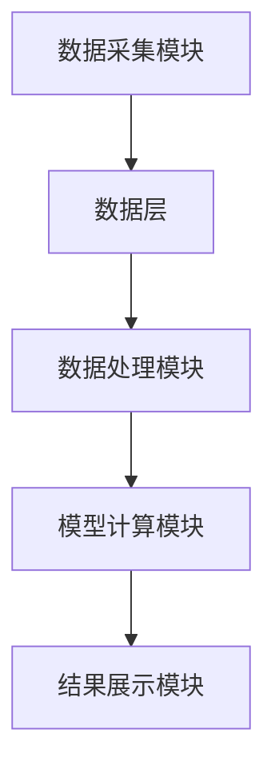

                 


# 特价股票与股息投资策略的结合

**关键词**：特价股票、股息投资策略、股票估值、股息收益率、投资组合优化

**摘要**：本文探讨了如何将特价股票和股息投资策略相结合，以优化投资回报。首先，我们介绍了特价股票和股息投资的基本概念和优势。接着，我们分析了两者的结合策略，包括如何选择适合的股票以及数学模型的应用。然后，我们设计了系统架构，并通过项目实战展示了策略的应用。最后，我们总结了最佳实践和注意事项。

---

# 第1章 特价股票与股息投资策略概述

## 1.1 特价股票的基本概念

### 1.1.1 特价股票的定义

特价股票是指市场价格低于其内在价值的股票。通常，这类股票被认为被市场低估，具有较大的增值潜力。投资者可以通过分析公司的财务状况、行业地位和未来发展前景来判断一只股票是否为特价股票。

### 1.1.2 特价股票的分类与特点

1. **按行业分类**：不同行业的股票有不同的估值标准，例如科技股和周期性股票。
2. **按估值指标分类**：市盈率（P/E）低于行业平均水平，市净率（P/B）低于行业平均水平。
3. **特点**：低估值、高潜在回报、风险较低。

### 1.1.3 特价股票的投资价值分析

1. **低估值带来的安全边际**：市场价格低于内在价值，减少了投资的风险。
2. **长期增值潜力**：随着市场对低估股票的重新估值，股价可能上涨。
3. **分散投资风险**：通过投资多个特价股票，可以分散行业和个股的风险。

## 1.2 股息投资策略的基本概念

### 1.2.1 股息投资的定义

股息投资是指投资那些能够稳定派发股息的公司股票，通过持续获得股息收入来实现财富积累。股息收益率是衡量股息投资收益的重要指标。

### 1.2.2 股息投资的分类与特点

1. **按股息支付率分类**：高股息支付率、中股息支付率、低股息支付率。
2. **按行业分类**：成熟行业（如公用事业、金融行业）的公司通常股息支付率较高。
3. **特点**：稳定收益、抗跌性较强、适合长期投资。

### 1.2.3 股息投资的收益来源分析

1. **股息收入**：定期获得股息，增加现金流。
2. **资本增值**：股息收益率高的股票通常具有较大的增值潜力。
3. **抗跌性**：在市场下跌时，高股息股票通常表现较为稳定。

## 1.3 特价股票与股息投资策略的结合

### 1.3.1 特价股票与股息投资的结合背景

在当前市场环境下，投资者需要在追求资本增值的同时，也需要稳定的股息收入。特价股票的低估值和高潜力与股息投资的稳定收益相结合，为投资者提供了更优的投资选择。

### 1.3.2 特价股票与股息投资结合的优势

1. **双重收益**：既有股价上涨的资本收益，又有稳定的股息收入。
2. **风险分散**：通过选择具有高股息收益率的特价股票，投资者可以降低投资风险。
3. **长期回报**：结合了低估值和高股息收益率的股票，通常具有较高的长期回报潜力。

### 1.3.3 特价股票与股息投资结合的潜在风险

1. **市场波动风险**：特价股票的估值修复可能需要较长时间，期间市场波动可能带来损失。
2. **公司基本面风险**：部分特价股票可能由于公司基本面恶化，导致股息支付能力下降。
3. **流动性风险**：部分特价股票流动性较低，可能导致买卖价差较大。

## 1.4 本章小结

本章介绍了特价股票和股息投资的基本概念和特点，并探讨了两者结合的优势和潜在风险。通过结合特价股票的低估值和股息投资的稳定收益，投资者可以在追求资本增值的同时，获得稳定的股息收入。

---

# 第2章 特价股票与股息投资的核心概念

## 2.1 特价股票的核心概念

### 2.1.1 特价股票的估值方法

#### 2.1.1.1 市盈率模型

市盈率（P/E）= 股价 / 每股净利润（EPS）

市盈率模型用于评估股票的相对估值。如果一只股票的市盈率低于行业平均水平，说明该股票可能被低估。

#### 2.1.1.2 市净率模型

市净率（P/B）= 股价 / 每股净资产（BPS）

市净率模型适用于评估资产密集型行业（如银行、房地产）的股票。如果一只股票的市净率低于行业平均水平，说明该股票可能被低估。

#### 2.1.1.3 现金流折现模型

现金流折现模型（DCF）通过将公司未来现金流折现，计算其内在价值。如果市场价格低于DCF估值，则该股票可能被低估。

### 2.1.2 特价股票的市场分析

1. **行业分析**：分析行业的竞争格局、增长潜力和周期性。
2. **宏观经济分析**：分析宏观经济环境对行业和公司的影响。
3. **公司分析**：分析公司的财务状况、盈利能力、管理团队等。

### 2.1.3 特价股票的财务指标分析

1. **市盈率（P/E）**：评估股票的相对估值。
2. **市净率（P/B）**：评估股票相对于账面价值的高低。
3. **股息收益率**：评估股息收入的高低。

## 2.2 股息投资的核心概念

### 2.2.1 股息率的计算方法

股息率 = 每股股息（Dividend per share） / 股价（Price per share）

股息率高的股票通常具有较高的股息收入，但也可能面临较高的风险。

### 2.2.2 股息支付率的分析

股息支付率 = 股息 / 净利润

股息支付率高的公司通常具有较强的盈利能力，但也可能面临较高的财务杠杆。

### 2.2.3 股息投资的稳定性分析

1. **股息支付能力**：分析公司是否能够持续支付股息。
2. **行业稳定性**：分析行业是否稳定，例如公用事业、金融行业通常较稳定。
3. **公司财务状况**：分析公司是否有足够的现金流支持股息支付。

## 2.3 特价股票与股息投资的结合模型

### 2.3.1 特价股票与股息投资的结合模型概述

结合模型旨在筛选出既具有低估值（特价股票）又具有高股息收益率的股票。

### 2.3.2 模型的输入变量与输出变量

#### 输入变量：
1. 市盈率（P/E）
2. 市净率（P/B）
3. 股息率
4. 股息支付率
5. 公司财务状况（如净利润、现金流）

#### 输出变量：
1. 适合投资的股票列表
2. 投资组合建议

### 2.3.3 模型的假设条件与限制

1. 假设市场有效，存在低估的股票。
2. 假设股息支付率稳定。
3. 限制：不考虑宏观经济的重大变化。

## 2.4 本章小结

本章详细介绍了特价股票和股息投资的核心概念，包括估值方法、市场分析和财务指标分析。通过结合模型，我们可以筛选出既具有低估值又具有高股息收益率的股票，从而实现双重收益。

---

# 第3章 特价股票与股息投资的数学模型与算法

## 3.1 特价股票估值模型

### 3.1.1 市盈率模型

$$ P = \frac{E}{P/E_{target}} $$

其中，E是每股净利润，P/E_{target}是目标市盈率。

### 3.1.2 市净率模型

$$ P = \frac{B}{P/B_{target}} $$

其中，B是每股净资产，P/B_{target}是目标市净率。

### 3.1.3 现金流折现模型

$$ V = \sum_{t=1}^{n} \frac{CF_t}{(1+r)^t} + \frac{TV}{(1+r)^n} $$

其中，CF_t是第t年的现金流，r是折现率，TV是终值。

## 3.2 股息投资模型

### 3.2.1 股息率计算模型

$$ \text{股息率} = \frac{\text{每股股息}}{\text{股价}} $$

### 3.2.2 股息支付率分析模型

$$ \text{股息支付率} = \frac{\text{股息}}{\text{净利润}} $$

## 3.3 特价股票与股息投资结合的算法

### 3.3.1 算法原理

1. 筛选市盈率低于行业平均水平的股票。
2. 筛选市净率低于行业平均水平的股票。
3. 筛选股息率高于行业平均水平的股票。
4. 筛选股息支付率稳定的股票。

### 3.3.2 算法步骤

1. 收集数据：收集目标行业股票的市盈率、市净率、股息率、股息支付率等数据。
2. 筛选股票：根据上述模型筛选出符合标准的股票。
3. 排序：根据综合指标（如市盈率、市净率、股息率）对股票进行排序。
4. 组合投资：根据风险偏好选择适合的股票组合。

### 3.3.3 算法实现的Python代码示例

```python
import pandas as pd

# 假设data为股票数据，包含市盈率（P_E）、市净率（P_B）、股息率（div_yield）、股息支付率（div_payout）

# 筛选条件：P_E < 行业平均P_E，P_B < 行业平均P_B，div_yield > 行业平均div_yield，div_payout稳定
selected_stocks = data[(data['P_E'] < data['行业平均P_E']) &
                        (data['P_B'] < data['行业平均P_B']) &
                        (data['div_yield'] > data['行业平均div_yield'])]

# 根据综合指标排序
selected_stocks['综合得分'] = selected_stocks['P_E'] + selected_stocks['P_B'] + selected_stocks['div_yield']
selected_stocks = selected_stocks.sort_values('综合得分')
```

## 3.4 本章小结

本章详细介绍了特价股票和股息投资的数学模型与算法，包括市盈率模型、市净率模型、现金流折现模型，以及股息率和股息支付率的计算方法。通过这些模型，我们可以筛选出符合标准的股票，并构建投资组合。

---

# 第4章 特价股票与股息投资的系统架构设计

## 4.1 系统功能设计

### 4.1.1 数据采集模块

1. 收集目标行业股票的基本数据，包括市盈率、市净率、股息率、股息支付率等。
2. 数据来源：公开的财务报表、金融数据平台。

### 4.1.2 数据处理模块

1. 对数据进行清洗和标准化处理。
2. 计算各项指标，如市盈率、市净率、股息率等。

### 4.1.3 模型计算模块

1. 根据模型筛选出符合标准的股票。
2. 对股票进行排序和评分。

### 4.1.4 结果展示模块

1. 展示筛选出的股票列表。
2. 展示综合评分和投资建议。

## 4.2 系统架构设计

### 4.2.1 分层架构设计

- **数据层**：数据采集、存储。
- **业务逻辑层**：数据处理、模型计算。
- **用户界面层**：结果展示。

### 4.2.2 模块之间的交互关系

- 数据采集模块向数据层提供数据。
- 数据处理模块从数据层获取数据并进行处理。
- 模型计算模块从数据处理模块获取数据并进行计算。
- 结果展示模块从模型计算模块获取结果并展示。

### 4.2.3 系统架构的Mermaid图



## 4.3 本章小结

本章设计了特价股票与股息投资策略的系统架构，包括数据采集、数据处理、模型计算和结果展示四个模块。通过分层架构设计，确保系统的模块化和可扩展性。

---

# 第5章 特价股票与股息投资的项目实战

## 5.1 环境安装

1. **工具安装**：安装Python、Pandas、Matplotlib等工具。
2. **数据来源**：获取目标行业股票的数据，如通过Yahoo Finance API。

## 5.2 系统核心实现源代码

```python
import pandas as pd
import requests
import json

# 数据采集模块
def get_stock_data(tickers):
    data = []
    for ticker in tickers:
        url = f'https://api.finance.yahoo.com/stock/v2/gcm?lang=zh_CN&region=CN&symbol={ticker}'
        response = requests.get(url)
        data.append(json.loads(response.text))
    return data

# 数据处理模块
def process_data(data):
    df = pd.DataFrame(data)
    df['P_E'] = df['市盈率']
    df['P_B'] = df['市净率']
    df['div_yield'] = df['股息率']
    return df

# 模型计算模块
def select_stocks(df):
    industry_avg_pe = df['行业平均市盈率']
    industry_avg_pb = df['行业平均市净率']
    industry_avg_div = df['行业平均股息率']
    selected = df[(df['P_E'] < industry_avg_pe) &
                   (df['P_B'] < industry_avg_pb) &
                   (df['div_yield'] > industry_avg_div)]
    return selected

# 结果展示模块
def display_results(selected):
    print("筛选出的股票：")
    print(selected['股票代码'])
    print("综合评分：")
    print(selected['综合得分'])
```

## 5.3 代码应用解读与分析

1. **数据采集模块**：通过API获取股票的基本数据。
2. **数据处理模块**：将数据转换为DataFrame格式，并计算各项指标。
3. **模型计算模块**：根据筛选条件筛选出符合标准的股票。
4. **结果展示模块**：展示筛选出的股票列表和综合评分。

## 5.4 实际案例分析

假设我们选择金融行业作为目标行业，筛选出市盈率低于行业平均水平、市净率低于行业平均水平、股息率高于行业平均水平的股票。

## 5.5 项目小结

通过项目实战，我们展示了如何将特价股票与股息投资策略相结合，并通过系统实现筛选出适合投资的股票。

---

# 第6章 特价股票与股息投资的最佳实践

## 6.1 投资策略建议

1. **分散投资**：选择多个行业的股票，分散风险。
2. **定期调整**：根据市场变化和公司基本面，定期调整投资组合。
3. **长期投资**：股息投资适合长期持有，避免频繁交易。

## 6.2 注意事项

1. **风险控制**：设置止损点，避免重大损失。
2. **关注公司基本面**：定期分析公司的财务状况和行业前景。
3. **税务规划**：了解税法，合理规划股息收入的税务负担。

## 6.3 拓展阅读

1. 《股市长线投资》：彼得·林奇
2. 《价值投资实战入门》：约翰·聂夫

## 6.4 本章小结

本章总结了特价股票与股息投资策略的最佳实践，包括投资策略建议、注意事项和拓展阅读。

---

# 作者：AI天才研究院 & 禅与计算机程序设计艺术

通过本文，我们详细探讨了特价股票与股息投资策略的结合，从理论到实践，为投资者提供了系统的指导和建议。希望本文能够帮助读者在投资中实现更高的回报。

---

