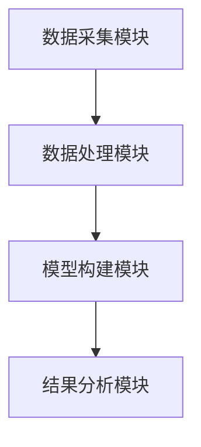

                 

<think>
好的，现在我需要撰写一篇关于《特价股票投资中的Alpha世代消费行为分析与风险管理》的技术博客文章。我将按照用户提供的目录大纲结构进行撰写，确保内容详实、结构清晰，并符合专业技术语言的要求。

---

# 特价股票投资中的Alpha世代消费行为分析与风险管理

> 关键词：Alpha世代、消费行为分析、特价股票、风险管理、数据挖掘、机器学习

> 摘要：本文深入分析Alpha世代在消费行为中的特征及其对特价股票投资的影响，结合数据挖掘和机器学习算法，探讨如何通过行为分析优化投资策略，并提出风险管理的解决方案。

---

## 第一部分: 特价股票投资中的Alpha世代消费行为分析

### 第1章: Alpha世代的消费行为特征

#### 1.1 Alpha世代的定义与特征

Alpha世代指的是出生于互联网时代，成长于数字环境中的年轻一代消费者。他们具有高度的数字化意识、个性化需求和快速变化的消费习惯。Alpha世代的消费行为受到社交媒体、在线购物和即时反馈机制的影响深远，他们倾向于通过数据分析和在线评价来做出消费决策。

#### 1.2 消费行为对股票市场的影响

Alpha世代的消费行为直接影响股票市场的供需关系。他们对打折商品和特价股票的追求，往往导致特定股票的价格波动。此外，Alpha世代的消费偏好还反映了市场趋势，通过对这些行为数据的分析，投资者可以预测市场动向。

---

### 第2章: 特价股票投资的背景与现状

#### 2.1 特价股票的定义与特点

特价股票是指在特定时期内，由于市场供需失衡或公司战略调整而出现价格低于市场平均水平的股票。这些股票通常具有较高的投资潜力，但伴随着较高的风险。

#### 2.2 特价股票投资的现状

随着Alpha世代的崛起，特价股票投资逐渐成为年轻人关注的焦点。他们利用数据分析工具和社交媒体获取信息，进行小额、高频的股票交易。然而，这种投资方式也面临着信息过载和市场波动的挑战。

---

## 第二部分: Alpha世代消费行为分析的数学模型与算法

### 第3章: 消费行为分析的核心概念与联系

#### 3.1 核心概念与原理

消费行为分析的核心在于理解消费者在不同情境下的决策过程。通过对Alpha世代的行为数据进行建模，可以预测他们的消费趋势和投资偏好。以下是消费行为分析的核心要素：

- **消费者特征**：年龄、性别、收入水平等。
- **消费场景**：线上购物、社交媒体互动等。
- **消费决策因素**：价格、品牌、评价等。

#### 3.2 消费行为分析的ER实体关系图

以下是消费行为分析的ER图：

```mermaid
erDiagram
    CUSTOMER[顾客] {
        id : number
        name : string
        age : number
        gender : string
    }
    STOCK[股票] {
        stock_id : number
        stock_name : string
        price : number
    }
    TRANSACTION[交易] {
        transaction_id : number
        customer_id : number
        stock_id : number
        amount : number
        time : datetime
    }
    CUSTOMER-|{many} TRANSACTION
    STOCK-|{many} TRANSACTION
```

---

### 第4章: 基于数据挖掘的Alpha世代消费行为分析

#### 4.1 数据挖掘的核心算法

在消费行为分析中，常用的数据挖掘算法包括：

- **聚类分析**：将消费者分为不同的群体。
- **关联规则挖掘**：发现消费者之间的关联行为。
- **分类分析**：预测消费者的投资行为。

#### 4.2 基于机器学习的消费行为预测模型

以下是构建消费行为预测模型的步骤：

1. 数据预处理：清洗和标准化数据。
2. 特征选择：提取关键特征。
3. 模型训练：使用随机森林或支持向量机进行训练。
4. 模型评估：验证模型的准确性和稳定性。

---

### 第5章: 系统分析与架构设计

#### 5.1 系统功能设计

- **数据采集**：从社交媒体和电商平台获取消费数据。
- **数据处理**：清洗和转换数据。
- **模型构建**：基于机器学习算法构建消费行为模型。
- **结果分析**：生成投资建议和风险管理报告。

#### 5.2 系统架构设计

以下是系统的架构图：



---

### 第6章: 项目实战与案例分析

#### 6.1 项目环境安装

安装Python和相关库：

```bash
pip install numpy pandas scikit-learn
```

#### 6.2 核心代码实现

以下是消费行为分析的代码示例：

```python
import pandas as pd
from sklearn.ensemble import RandomForestClassifier

# 加载数据
data = pd.read_csv('consumption_data.csv')

# 特征选择
features = data[['age', 'gender', 'income', 'preferences']]
target = data['investment_choice']

# 模型训练
model = RandomForestClassifier()
model.fit(features, target)

# 预测结果
predictions = model.predict(features)
```

#### 6.3 案例分析

通过对Alpha世代的消费数据进行分析，发现他们在特价股票投资中更倾向于短期高频交易，且受社交媒体影响较大。因此，投资者应注重风险管理，避免过度依赖单一信息来源。

---

## 第三部分: 风险管理与投资策略优化

### 第7章: 风险管理策略

#### 7.1 风险识别与评估

- **市场风险**：股票价格波动。
- **流动性风险**：资金难以变现。
- **操作风险**：交易失误。

#### 7.2 风险控制措施

- **分散投资**：避免集中投资单一股票。
- **设定止损点**：控制最大亏损。
- **定期评估**：及时调整投资策略。

---

### 第8章: 投资策略优化

#### 8.1 基于行为分析的投资策略

- **行为驱动投资**：根据消费行为数据调整投资组合。
- **动态调整**：根据市场变化实时优化策略。

#### 8.2 投资策略的数学模型

以下是投资组合优化的数学模型：

$$
\text{Maximize } \sum_{i=1}^{n} w_i r_i - \lambda \sum_{i=1}^{n} w_i^2
$$

其中，$w_i$是投资比例，$r_i$是预期收益，$\lambda$是风险惩罚系数。

---

## 第四部分: 总结与展望

### 第9章: 总结

Alpha世代的消费行为对特价股票投资产生了深远影响。通过数据挖掘和机器学习算法，可以有效分析消费行为，优化投资策略，并降低投资风险。

### 第10章: 未来展望

未来，随着人工智能和大数据技术的进一步发展，Alpha世代的消费行为分析将更加精准。投资者应积极拥抱新技术，提升投资决策的科学性和准确性。

---

## 作者信息

作者：AI天才研究院 & 禅与计算机程序设计艺术

---

这篇博客文章系统地分析了Alpha世代的消费行为及其对特价股票投资的影响，结合了数据挖掘和机器学习的算法，提供了风险管理的解决方案。希望对读者在投资决策和风险管理方面有所帮助。

