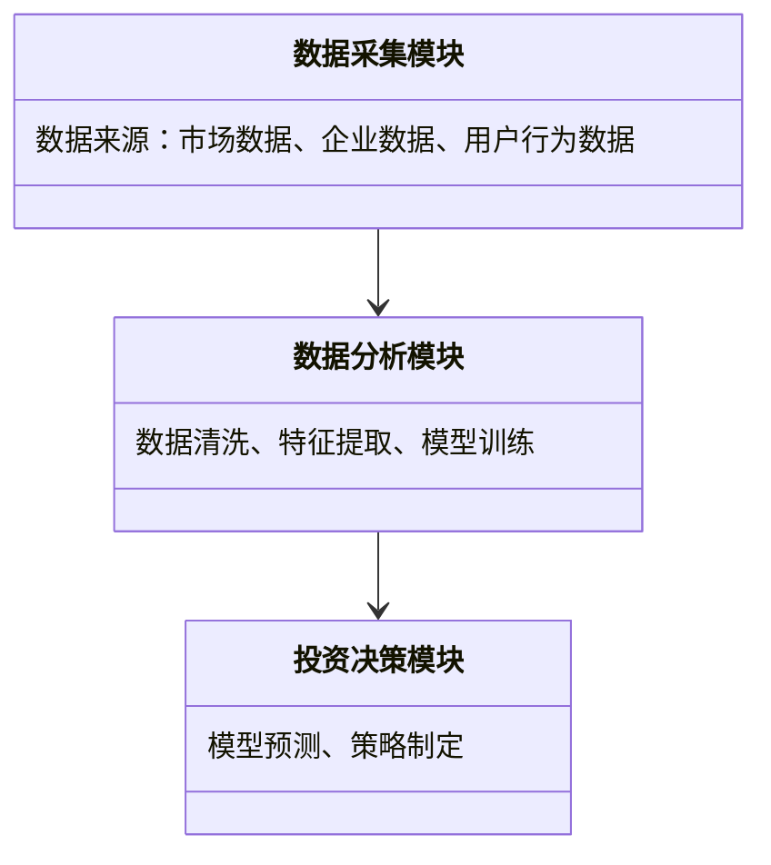
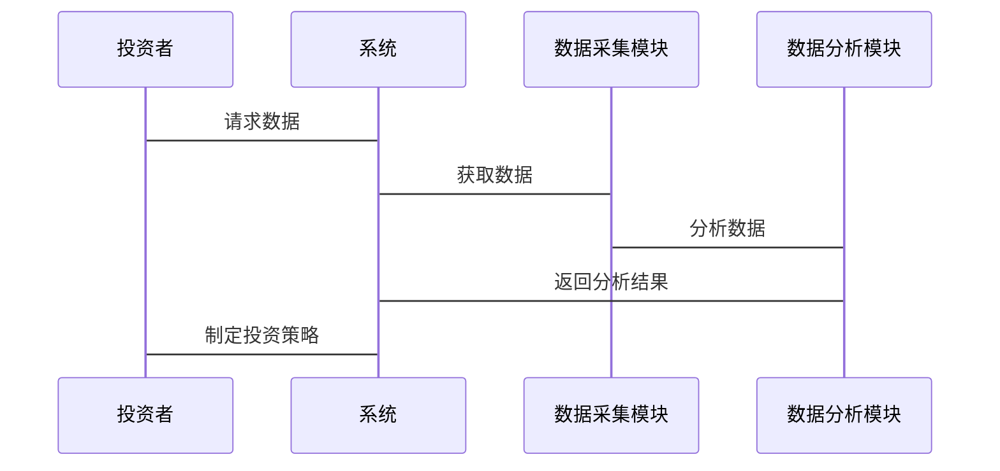

                 


# 特价股票投资中的产业互联网价值链分析方法

## 关键词：特价股票，产业互联网，价值链分析，数据挖掘，投资策略

## 摘要：本文系统地探讨了在产业互联网背景下，特价股票投资的价值链分析方法。通过深入分析产业互联网的核心要素与价值链结构，结合数据挖掘和人工智能算法，提出了一套优化投资决策的分析框架。文章从背景与概述出发，详细讲解了产业互联网价值链的核心概念、分析方法、系统设计与项目实战，为投资者提供了科学的决策支持。

---

## 第一部分: 特价股票投资与产业互联网概述

### 第1章: 特价股票投资与产业互联网的背景

#### 1.1 特价股票投资的定义与特点
##### 1.1.1 特价股票的定义
特价股票是指价格远低于其内在价值的股票。这类股票通常因市场波动、行业周期性或公司短期困境而被低估，为投资者提供了潜在的获利机会。

##### 1.1.2 特价股票投资的核心特点
- **低估值**：股票价格显著低于其实际价值。
- **高潜力**：潜在的上涨空间较大。
- **周期性**：通常与经济周期或行业周期密切相关。

##### 1.1.3 特价股票投资的边界与外延
- **边界**：仅限于低估值股票，不包括高价成长股。
- **外延**：涉及行业分析、公司基本面评估等多个维度。

#### 1.2 产业互联网的定义与特点
##### 1.2.1 产业互联网的定义
产业互联网是互联网技术与传统产业深度融合的产物，通过数字化手段优化传统产业的生产、运营和管理。

##### 1.2.2 产业互联网的核心特点
- **数据驱动**：以数据为核心，推动业务决策。
- **智能化**：利用人工智能技术优化流程。
- **平台化**：构建开放的生态平台，连接产业链各方。

#### 1.3 特价股票投资与产业互联网的结合
##### 1.3.1 产业互联网对股票投资的影响
- 提供了更丰富的数据来源。
- 优化了投资决策的效率和准确性。

##### 1.3.2 特价股票投资中的产业互联网应用
- 通过产业互联网获取行业数据，分析公司基本面。
- 利用大数据技术筛选潜在的特价股票。

##### 1.3.3 产业互联网价值链的核心要素
- 数据采集：获取企业运营数据。
- 数据分析：挖掘数据价值。
- 投资决策：基于分析结果制定策略。

#### 1.4 本章小结
本章介绍了特价股票投资和产业互联网的基本概念，并分析了两者结合的可能性与价值。

---

## 第二部分: 产业互联网价值链分析方法

### 第2章: 产业互联网价值链的核心概念

#### 2.1 产业互联网价值链的结构与组成
##### 2.1.1 价值链的定义
价值链是指从原材料采购到最终产品交付的全过程中，企业创造价值的系列活动。

##### 2.1.2 产业互联网价值链的组成要素
- **上游**：原材料供应商、技术服务商。
- **中游**：制造企业、物流企业。
- **下游**：分销商、消费者。

##### 2.1.3 价值链各环节之间的关系
$$ \text{价值传递方向：上游→中游→下游} $$

#### 2.2 产业互联网价值链的属性特征对比
##### 2.2.1 价值传递效率
| 特性       | 传统价值链       | 产业互联网价值链     |
|------------|------------------|--------------------|
| 效率       | 较低             | 高                 |
| 成本       | 高               | 低                 |

##### 2.2.2 成本结构
| 特性       | 传统价值链       | 产业互联网价值链     |
|------------|------------------|--------------------|
| 成本类型   | 线下固定成本     | 线上可变成本         |
| 成本控制   | 困难             | 较易                |

##### 2.2.3 价值创造方式
| 特性       | 传统价值链       | 产业互联网价值链     |
|------------|------------------|--------------------|
| 创造方式   | 线下实体操作     | 线上数据驱动         |
| 创新速度   | 较慢             | 较快                |

#### 2.3 产业互联网价值链的ER实体关系图
```mermaid
erDiagram
    actor 投资者
    actor 企业
    actor 第三方平台
    database 价值链数据
    database 市场数据
    database 用户行为数据
    投资者 --> 价值链数据: 查询
    企业 --> 价值链数据: 提供
    第三方平台 --> 价值链数据: 分析
```

#### 2.4 本章小结
本章分析了产业互联网价值链的结构与特征，为后续分析奠定了基础。

---

## 第三部分: 产业互联网价值链的分析方法

### 第3章: 产业互联网价值链的分析方法

#### 3.1 数据采集与处理
##### 3.1.1 数据来源
- **市场数据**：股票价格、成交量等。
- **企业数据**：财务报表、生产数据。
- **用户行为数据**：投资者行为、市场情绪。

##### 3.1.2 数据清洗与预处理
- **去重**：去除重复数据。
- **缺失值处理**：填补或删除缺失值。
- **标准化**：统一数据格式。

##### 3.1.3 数据特征提取
- **关键指标**：市盈率、市净率等。

#### 3.2 数据分析与特征工程
##### 3.2.1 数据分析方法
- **描述性分析**：总结数据分布。
- **预测性分析**：预测股票价格。

##### 3.2.2 数据特征工程
- **特征选择**：选择重要特征。
- **特征工程**：构建新特征。

#### 3.3 投资策略模型
##### 3.3.1 模型选择
- **线性回归**：预测股票价格。
- **随机森林**：分类问题。

##### 3.3.2 模型训练与优化
- **训练数据**：分割训练集和测试集。
- **优化参数**：调整模型参数。

#### 3.4 项目实战
##### 3.4.1 环境配置
- **Python版本**：3.8及以上。
- **依赖库**：pandas、numpy、scikit-learn。

##### 3.4.2 核心代码实现
```python
import pandas as pd
from sklearn.ensemble import RandomForestClassifier
from sklearn.metrics import accuracy_score

# 数据加载
data = pd.read_csv('stock_data.csv')

# 特征选择
features = ['市盈率', '市净率', '营收增长率']
target = '是否特价股票'

# 数据分割
X = data[features]
y = data[target]

# 模型训练
model = RandomForestClassifier()
model.fit(X, y)

# 模型预测
predictions = model.predict(X)

# 模型评估
accuracy = accuracy_score(y, predictions)
print(f'准确率: {accuracy}')
```

##### 3.4.3 代码解读与分析
- **数据加载**：读取股票数据。
- **特征选择**：选择市盈率、市净率等关键指标。
- **模型训练**：使用随机森林分类器训练模型。
- **模型预测与评估**：预测结果并评估准确率。

#### 3.5 本章小结
本章通过数据分析与特征工程，构建了投资策略模型，并通过实战案例验证了模型的有效性。

---

## 第四部分: 产业互联网价值链的系统架构设计

### 第4章: 产业互联网价值链的系统架构设计

#### 4.1 项目介绍
- **项目名称**：产业互联网价值链分析系统。
- **项目目标**：优化股票投资决策。

#### 4.2 系统功能设计
##### 4.2.1 领域模型


##### 4.2.2 系统架构设计


##### 4.2.3 系统接口设计
- **API接口**：提供数据接口、模型接口。

##### 4.2.4 系统交互设计


#### 4.3 本章小结
本章通过系统架构设计，展示了如何构建一个完整的产业互联网价值链分析系统。

---

## 第五部分: 项目实战与总结

### 第5章: 项目实战

#### 5.1 环境安装
- **Python版本**：3.8及以上。
- **依赖库**：pandas、numpy、scikit-learn。

#### 5.2 核心代码实现
```python
import pandas as pd
from sklearn.ensemble import RandomForestClassifier
from sklearn.metrics import accuracy_score

# 数据加载
data = pd.read_csv('stock_data.csv')

# 特征选择
features = ['市盈率', '市净率', '营收增长率']
target = '是否特价股票'

# 数据分割
X = data[features]
y = data[target]

# 模型训练
model = RandomForestClassifier()
model.fit(X, y)

# 模型预测
predictions = model.predict(X)

# 模型评估
accuracy = accuracy_score(y, predictions)
print(f'准确率: {accuracy}')
```

#### 5.3 代码解读与分析
- **数据加载**：读取股票数据。
- **特征选择**：选择市盈率、市净率等关键指标。
- **模型训练**：使用随机森林分类器训练模型。
- **模型预测与评估**：预测结果并评估准确率。

#### 5.4 案例分析与详细解读
- **案例分析**：通过具体案例展示模型的应用。
- **详细解读**：分析模型结果，提出投资建议。

#### 5.5 本章小结
本章通过实际案例，展示了如何利用产业互联网技术优化股票投资决策。

---

## 第六部分: 总结与展望

### 第6章: 总结与展望

#### 6.1 本章总结
- **总结内容**：回顾全文，总结核心观点。
- **主要结论**：强调产业互联网技术在股票投资中的重要性。

#### 6.2 未来展望
- **技术进步**：人工智能在投资中的应用。
- **行业趋势**：产业互联网的未来发展。

#### 6.3 本章小结
本章总结了全文，并展望了未来的研究方向。

---

## 作者：AI天才研究院/AI Genius Institute & 禅与计算机程序设计艺术 /Zen And The Art of Computer Programming

---

这篇文章系统地探讨了特价股票投资中的产业互联网价值链分析方法，通过理论分析与实战案例相结合，为投资者提供了科学的决策支持。

