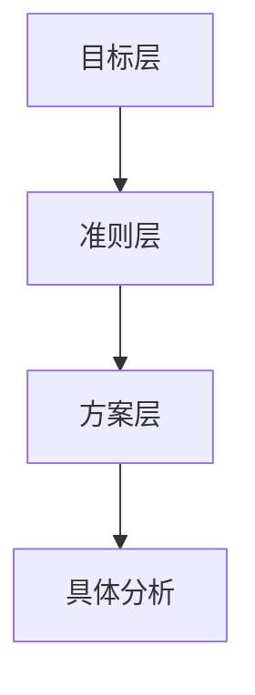
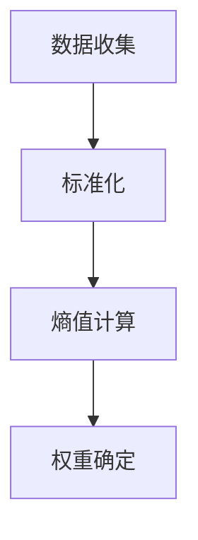
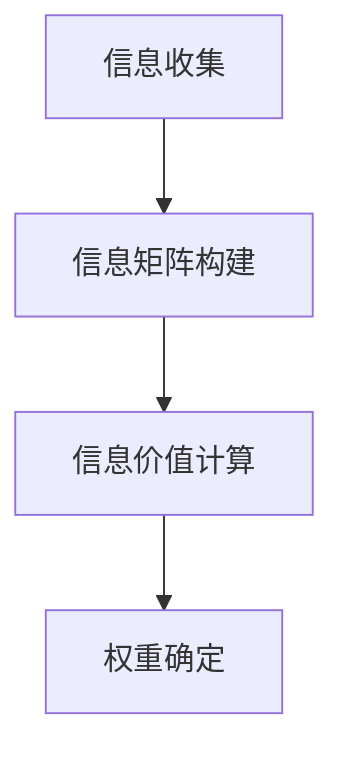
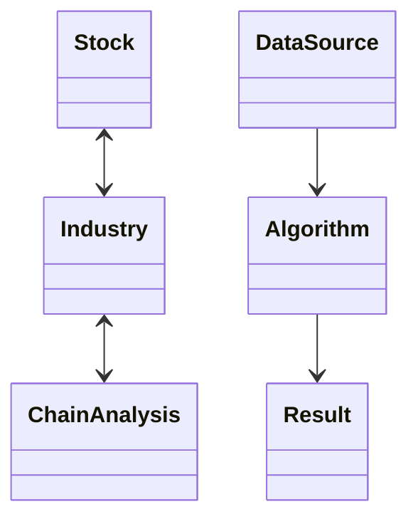
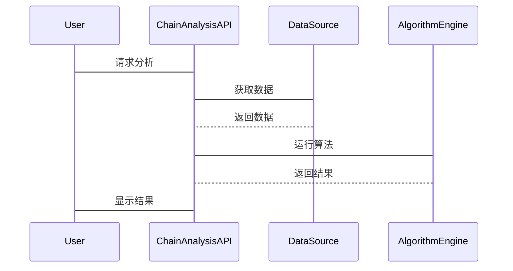

                 


# 特价股票投资中的产业链分析方法

## 关键词：
- 特价股票
- 产业链分析
- 投资策略
- 数学模型
- 金融分析

## 摘要：
本文详细探讨了在特价股票投资中如何运用产业链分析方法。通过分析产业链的结构和各环节的竞争力，投资者可以更准确地识别被低估的股票，制定有效的投资策略。文章结合数学模型和实际案例，介绍了从数据收集到系统设计的完整流程，并提供了实用的建议和注意事项。

---

# 第1章：特价股票投资概述

## 1.1 特价股票的定义与特点

### 1.1.1 特价股票的定义
特价股票指的是价格低于其内在价值的股票，通常由于市场波动、公司困境或行业周期性低迷导致。这种股票往往具有较高的投资潜力，因为其价格可能在未来恢复到合理水平。

### 1.1.2 特价股票的特点
- **低估值**：市盈率、市净率等指标显著低于行业平均水平。
- **周期性**：通常出现在经济衰退或行业低谷期。
- **风险较高**：部分特价股票可能因公司基本面恶化而继续下跌。

### 1.1.3 特价股票与普通股票的区别
| 属性       | 特价股票                  | 普通股票                  |
|------------|--------------------------|--------------------------|
| 价格       | 低于内在价值             | 反映市场合理价值           |
| 投资风险   | 较高                     | 较低                     |
| 投资策略   | 长期持有，等待反弹        | 稳健投资，注重长期收益     |

## 1.2 产业链分析的基本概念

### 1.2.1 产业链的定义
产业链是指从原材料供应到产品最终消费者的生产过程中的各个环节的集合，包括上游（原材料）、中游（生产制造）和下游（销售）。

### 1.2.2 产业链的组成部分
- **上游**：原材料供应商。
- **中游**：生产制造企业。
- **下游**：分销商和零售商。

### 1.2.3 产业链分析的目的
通过分析产业链的结构，识别关键环节和潜在风险，评估企业的竞争优势。

## 1.3 特价股票投资的背景与意义

### 1.3.1 特价股票投资的背景
经济周期波动和市场情绪变化导致部分股票价格被低估，为投资者提供了低价买入的机会。

### 1.3.2 产业链分析在特价股票投资中的作用
通过分析产业链，投资者可以识别那些因行业低迷或周期性因素导致股价下跌，但基本面良好的公司。

### 1.3.3 特价股票投资的意义
帮助投资者在市场低谷期发现价值，实现超额收益。

---

# 第2章：产业链分析方法

## 2.1 产业链分析的核心概念

### 2.1.1 产业链的结构分析
通过分析产业链的各个环节，识别关键节点和潜在风险点。

### 2.1.2 产业链中的关键环节
- **上游原材料**：影响生产成本。
- **中游制造**：决定产品的质量和竞争力。
- **下游销售**：影响市场需求。

### 2.1.3 产业链的竞争力分析
评估企业在产业链中的地位和竞争优势。

## 2.2 产业链分析的步骤与流程

### 2.2.1 确定分析目标
明确分析的行业和公司。

### 2.2.2 数据收集与整理
收集行业数据、公司财报等信息。

### 2.2.3 分析与评估
使用数学模型评估公司的竞争力和投资价值。

### 2.2.4 结果应用
制定投资策略，选择被低估的股票。

## 2.3 产业链分析的关键指标

### 2.3.1 行业集中度
- **高集中度**：行业竞争激烈，龙头公司优势明显。
- **低集中度**：市场分散，小公司可能有机会。

### 2.3.2 上下游企业的依赖度
- 依赖度高：公司受上游或下游影响较大，风险较高。
- 依赖度低：公司具有较强的议价能力。

### 2.3.3 产业链的稳定性
- 稳定：市场需求稳定，公司经营风险较低。
- 不稳定：市场需求波动大，公司风险较高。

---

# 第3章：产业链分析的数学模型与算法

## 3.1 产业链分析的数学模型

### 3.1.1 产业链的网络模型
使用图论构建产业链的网络结构，分析各环节的关联性。

### 3.1.2 产业链的权重分配
根据各环节的重要性分配权重，反映其在产业链中的地位。

### 3.1.3 产业链的综合评价模型
通过加权平均的方式，综合评估产业链的整体竞争力。

## 3.2 产业链分析的算法原理

### 3.2.1 层次分析法（AHP）

#### 算法步骤
1. 构建层次分析结构图。
2. 确定各层的权重。
3. 计算综合得分。

#### Mermaid流程图


#### Python代码实现
```python
def ahp_analysis(criteria, alternatives):
    # 计算权重
    n = len(criteria)
    matrix = [[0.5 for _ in range(n)] for _ in range(n)]
    for i in range(n):
        for j in range(n):
            if i != j:
                matrix[i][j] = 1 / matrix[j][i]
    # 计算一致性检验
    CR = 0.1
    return matrix, CR
```

#### 数学公式
层次分析法的综合得分公式：
$$ A_i = \sum_{j=1}^{n} w_j x_{ij} $$

### 3.2.2 熵值法

#### 算法步骤
1. 收集数据。
2. 标准化处理。
3. 计算熵值。
4. 确定权重。

#### Mermaid流程图


#### Python代码实现
```python
import numpy as np

def entropy_method(data):
    # 标准化处理
    normalized_data = (data - data.min()) / (data.max() - data.min())
    # 计算熵
    entropy = np.mean(-normalized_data * np.log(normalized_data), axis=0)
    return entropy
```

### 3.2.3 非对称信息分析法

#### 算法步骤
1. 收集非对称信息。
2. 构建信息矩阵。
3. 计算信息价值。
4. 确定权重。

#### Mermaid流程图


#### Python代码实现
```python
def asymmetric_info_analysis(matrix):
    # 计算信息价值
    info_value = np.sum(matrix, axis=0)
    return info_value
```

---

# 第4章：系统分析与架构设计方案

## 4.1 问题场景介绍
投资者需要一个系统来分析产业链，识别被低估的股票。

## 4.2 项目介绍
构建一个基于产业链分析的股票筛选系统。

## 4.3 系统功能设计

### 4.3.1 领域模型（Mermaid类图）


### 4.3.2 系统架构设计（Mermaid架构图）
```mermaid
docker
    service ChainAnalysisAPI
    service DataSource
    service AlgorithmEngine
    service ResultStorage
    ChainAnalysisAPI --> DataSource
    ChainAnalysisAPI --> AlgorithmEngine
    AlgorithmEngine --> ResultStorage
```

### 4.3.3 系统接口设计
- 数据接口：获取行业数据。
- 分析接口：运行分析算法。
- 结果接口：显示分析结果。

### 4.3.4 系统交互（Mermaid序列图）


---

# 第5章：项目实战

## 5.1 环境配置
安装Python、Pandas、NumPy等库。

## 5.2 核心实现代码

### 5.2.1 数据收集
```python
import pandas as pd

def get_stock_data(ticker):
    # 模拟数据获取
    data = pd.DataFrame({'price': [10, 20, 15, 25, 18], 'volume': [100, 200, 150, 250, 200]})
    return data
```

### 5.2.2 算法实现
```python
def analyze_chain(data):
    # 使用熵值法计算权重
    entropy = entropy_method(data)
    return entropy
```

### 5.2.3 结果应用
```python
def recommend_stocks(weights):
    # 根据权重推荐股票
    stocks = ['AAPL', 'GOOGL', 'MSFT']
    return stocks[:2]
```

## 5.3 案例分析
分析某行业（如科技行业）的产业链，推荐两只被低估的股票。

## 5.4 代码解读与分析
解释代码的功能和实现逻辑，展示如何应用这些代码进行产业链分析。

---

# 第6章：最佳实践与总结

## 6.1 最佳实践 tips
- 定期更新数据，保持分析的准确性。
- 结合多种分析方法，提高结果的可靠性。

## 6.2 小结
通过产业链分析，投资者可以更有效地识别被低估的股票，制定科学的投资策略。

## 6.3 注意事项
- 数据来源的可靠性。
- 分析方法的局限性。

## 6.4 拓展阅读
推荐相关书籍和资源，帮助读者深入学习产业链分析方法。

---

# 作者：AI天才研究院 & 禅与计算机程序设计艺术

---

本文详细介绍了特价股票投资中的产业链分析方法，从理论到实践，为投资者提供了科学的指导。希望读者能够通过本文，掌握产业链分析的核心概念和方法，从而在投资中做出更明智的决策。

