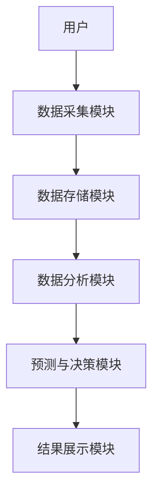

                 


# 特价股票投资中的人工智能辅助决策系统

> 关键词：人工智能、股票投资、算法、系统架构、数据驱动、风险管理

> 摘要：本文介绍了一种基于人工智能的特价股票投资辅助决策系统，探讨了其核心概念、算法原理、系统架构及实际应用，旨在为投资者提供科学的决策支持。

---

## 第一部分: 特价股票投资与人工智能的结合

### 第1章: 特价股票投资的基本概念

#### 1.1 特价股票的定义
特价股票通常指价格低于其内在价值的股票，具有较高的投资潜力。投资者通过分析市场波动、公司基本面等信息，寻找被低估的投资机会。

#### 1.2 人工智能在金融领域的应用背景
人工智能在金融领域的应用日益广泛，特别是在数据处理、模式识别和预测分析方面表现出色。其高效处理大量数据的能力使其成为股票投资的重要工具。

#### 1.3 人工智能辅助决策系统的功能
该系统通过分析历史数据、预测价格走势、识别投资机会，帮助投资者做出更明智的决策，降低投资风险。

---

## 第二部分: 核心概念与联系

### 第2章: 特价股票投资中的核心概念

#### 2.1 数据特征提取
通过分析股票的历史价格、成交量等数据，提取有用的特征，如趋势、波动性等，为模型提供输入。

#### 2.2 模型选择与优化
选择合适的算法（如回归、神经网络）并优化参数，以提高预测精度和稳定性。

#### 2.3 风险管理与收益优化
通过模型评估投资风险，制定风险控制策略，优化投资组合，平衡风险与收益。

### 第3章: 人工智能算法的数学模型

#### 3.1 线性回归模型
用于预测股票价格的趋势，公式为：
$$ y = \beta_0 + \beta_1x + \epsilon $$
其中，$y$是预测价格，$x$是自变量（如时间），$\beta_0$和$\beta_1$是回归系数。

#### 3.2 神经网络模型
用于复杂模式识别，结构包括输入层、隐藏层和输出层，公式为：
$$ y = f(Wx + b) $$
其中，$W$是权重矩阵，$b$是偏置向量，$f$是激活函数。

---

## 第三部分: 系统分析与架构设计

### 第4章: 系统功能设计

#### 4.1 数据采集模块
从多个数据源（如Yahoo Finance）获取实时股票数据，进行清洗和预处理。

#### 4.2 数据分析模块
使用时间序列分析等方法，提取特征并训练模型。

#### 4.3 预测与决策模块
基于训练好的模型，预测股票价格，并生成投资建议。

### 第5章: 系统架构设计

#### 5.1 系统架构图


---

## 第四部分: 项目实战

### 第6章: 环境安装与配置

#### 6.1 安装Python和必要的库
安装Python 3.8及以上版本，并使用pip安装numpy、pandas、sklearn、keras等库。

#### 6.2 数据获取与预处理
从Yahoo Finance获取股票数据，清洗数据并处理缺失值。

### 第7章: 系统核心实现

#### 7.1 线性回归实现
```python
from sklearn.linear_model import LinearRegression
import numpy as np

# 示例数据
X = np.array([1, 2, 3, 4]).reshape(-1, 1)
y = np.array([2, 3, 5, 6])

# 训练模型
model = LinearRegression()
model.fit(X, y)

# 预测
print(model.predict([[5]]))
```

#### 7.2 神经网络实现
```python
from keras.models import Sequential
from keras.layers import Dense

# 示例数据
X = np.array([[1], [2], [3], [4]])
y = np.array([2, 3, 5, 6])

# 构建模型
model = Sequential()
model.add(Dense(64, activation='relu', input_dim=1))
model.add(Dense(1))
model.compile(optimizer='adam', loss='mean_squared_error')

# 训练
model.fit(X, y, epochs=100, batch_size=1)

# 预测
print(model.predict([[5]]))
```

---

## 第五部分: 最佳实践与小结

### 第8章: 实战经验总结

#### 8.1 算法选择的注意事项
根据数据类型和问题需求选择合适的算法，避免过度拟合。

#### 8.2 系统优化建议
定期更新数据和模型，提高系统的鲁棒性和预测精度。

#### 8.3 风险管理的重要性
合理控制仓位和风险，确保投资的可持续性。

---

## 作者

作者：AI天才研究院/AI Genius Institute & 禅与计算机程序设计艺术 /Zen And The Art of Computer Programming

