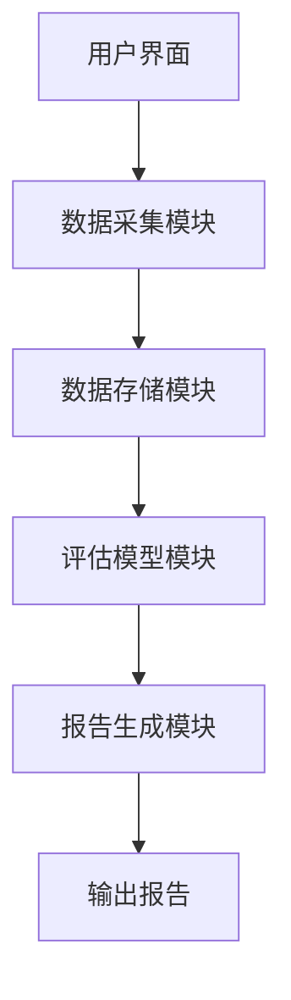
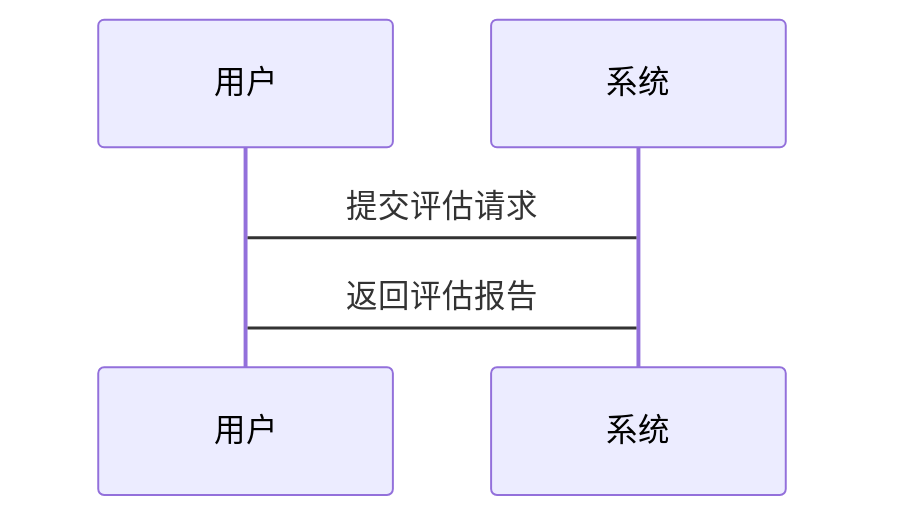

                 


# 特价股票投资中的企业元宇宙伦理与责任评估因素考量

**关键词：** 特价股票投资、企业元宇宙、伦理评估、责任评估、投资决策

**摘要：**  
在当前快速发展的科技环境下，特价股票投资与企业元宇宙的结合日益紧密。本文从特价股票投资的基本概念出发，深入探讨企业元宇宙的技术基础及其对投资决策的影响。同时，重点分析在投资过程中需要考虑的伦理与责任评估因素，为企业投资者提供系统的评估框架和方法。通过结合实际案例和系统设计，本文旨在帮助投资者在追求收益的同时，确保投资行为的道德合规性。

---

## 正文

### 第一章：特价股票投资的背景与概念

#### 1.1 特价股票投资的定义与特点
- **特价股票的定义**：特价股票是指价格被市场低估，但具有潜在价值的股票。投资者通常寻找这些股票，期望其价格回升带来收益。
- **特点**：
  - 价格低于市场公允价值。
  - 具有较高的成长潜力。
  - 常见于市场周期性低谷或企业暂时困境时期。
- **投资动机**：
  - 追求低价反转机会。
  - 利用市场波动套利。

#### 1.2 企业元宇宙的基本概念
- **元宇宙的定义**：元宇宙是一个虚拟的三维空间，通过AR/VR技术与现实世界相连，提供沉浸式体验。
- **技术基础**：
  - 区块链：确保数据安全与去中心化。
  - AR/VR：构建虚拟环境。
  - 人工智能：优化用户体验。
- **企业的应用场景**：
  - 虚拟营销：通过虚拟展示提升品牌影响力。
  - 虚拟资产：持有虚拟货币或NFT，增加资产多样性。
  - 虚拟协作：远程团队协作，提升效率。

#### 1.3 伦理与责任评估的重要性
- **投资中的伦理问题**：
  - 避免操纵市场：确保交易公平，不进行内幕交易。
  - 保护投资者利益：防止欺诈行为，确保信息透明。
- **责任评估的定义**：
  - 责任评估是衡量企业对其行为可能产生的社会影响和法律后果的能力。
  - 包括环境责任、社会责任等方面。
- **伦理与责任评估的相互作用**：
  - 伦理评估确保投资行为的道德合规性。
  - 责任评估衡量企业的社会影响，帮助投资者选择更可持续的企业。

### 第二章：企业元宇宙的技术基础与投资影响

#### 2.1 元宇宙技术对企业投资的影响
- **技术基础对企业的影响**：
  - 提升企业竞争力：通过技术创新降低运营成本，提高效率。
  - 增强用户体验：提供沉浸式体验，增强客户粘性。
- **投资影响**：
  - 投资者需要评估企业是否具备元宇宙相关技术的开发能力。
  - 元宇宙技术可能改变企业的估值模型，投资者需要重新评估企业的未来收益。

#### 2.2 企业元宇宙与投资决策的关系
- **企业元宇宙对投资决策的影响**：
  - 提供新的投资机会：企业元宇宙相关技术和服务需求增加，投资者可以关注相关企业。
  - 改变传统估值方法：企业元宇宙带来的虚拟资产价值可能无法用传统财务指标衡量。
- **投资者的应对策略**：
  - 加强对元宇宙技术的理解，提升技术分析能力。
  - 考虑企业的长期发展潜力，而不仅仅是短期收益。

### 第三章：伦理与责任评估的理论框架

#### 3.1 伦理评估的核心原则
- **公平性**：确保投资行为不损害其他投资者的利益。
- **透明性**：要求企业提供真实、准确的信息。
- **可持续性**：关注企业的长期社会责任，避免短期行为。

#### 3.2 责任评估的维度
- **环境责任**：企业是否在环保方面有所作为。
- **社会责任**：企业是否积极履行社会责任，如公益捐赠、员工福利等。
- **治理责任**：企业内部治理是否规范，是否存在利益输送等不正当行为。

#### 3.3 伦理与责任评估的相互作用
- **伦理评估为责任评估提供道德基础**：企业在追求利润的同时，必须遵守道德规范。
- **责任评估为伦理评估提供实践依据**：通过具体的责任表现，评估企业的伦理行为是否符合社会期望。

### 第四章：企业元宇宙中的伦理与责任评估因素

#### 4.1 元宇宙技术的伦理挑战
- **数据隐私**：元宇宙需要收集大量用户数据，如何保护用户隐私成为挑战。
- **虚拟身份管理**：如何确保虚拟身份的合法性和安全性。
- **内容审核**：元宇宙中的内容是否健康，如何避免不良信息的传播。

#### 4.2 投资中的责任评估
- **企业行为的社会影响**：评估企业的行为是否会对社会造成负面影响。
- **企业治理结构**：评估企业的治理结构是否完善，是否存在滥用职权的情况。
- **企业社会责任报告**：要求企业提供详细的 CSR（Corporate Social Responsibility）报告，评估其社会责任履行情况。

#### 4.3 伦理与责任评估的系统性框架
- **评估指标体系**：
  - 数据隐私保护能力。
  - 用户权益保障措施。
  - 内容审核机制。
- **评估流程**：
  - 收集企业数据。
  - 分析企业行为。
  - 评估企业责任表现。
  - 出具评估报告。

### 第五章：系统设计与实现

#### 5.1 系统功能设计
- **数据采集模块**：收集企业的元宇宙相关数据，如技术应用、用户反馈等。
- **评估模型模块**：利用机器学习算法构建评估模型，预测企业的责任表现。
- **报告生成模块**：根据评估结果生成详细的评估报告，供投资者参考。

#### 5.2 系统架构设计


#### 5.3 系统接口设计
- **API接口**：提供RESTful API，方便第三方调用评估结果。
- **数据接口**：与企业数据源对接，获取实时数据。

#### 5.4 系统交互流程


### 第六章：项目实战与案例分析

#### 6.1 项目环境安装
- **安装Python**：确保Python 3.8以上版本已安装。
- **安装依赖库**：如numpy、pandas、scikit-learn等。

#### 6.2 核心代码实现
```python
import numpy as np
import pandas as pd
from sklearn.linear_model import LinearRegression

# 数据预处理
data = pd.read_csv('enterprise_data.csv')
X = data[['revenue', 'profit', 'growth']]
y = data['stock_price']

# 模型训练
model = LinearRegression()
model.fit(X, y)

# 评估报告生成
predictions = model.predict(X)
report = pd.DataFrame({'实际股价': y, '预测股价': predictions})
report.to_csv('assessment_report.csv', index=False)
```

#### 6.3 案例分析
- **案例背景**：某科技企业在元宇宙领域的技术应用和市场表现。
- **评估过程**：利用上述模型评估企业的责任表现，生成评估报告。
- **结果分析**：根据评估结果，投资者做出是否投资的决策。

#### 6.4 项目小结
- **经验总结**：系统性评估框架的重要性。
- **注意事项**：模型的准确性和数据的及时性。

### 第七章：最佳实践与总结

#### 7.1 最佳实践 tips
- **持续学习**：关注元宇宙技术的最新发展。
- **风险管理**：制定完善的风险控制策略。
- **合规性检查**：确保投资行为符合相关法律法规。

#### 7.2 小结
本文通过系统性分析，为企业投资者提供了在特价股票投资中考虑企业元宇宙伦理与责任评估因素的框架和方法。

#### 7.3 注意事项
- **数据质量**：确保数据来源可靠。
- **模型优化**：根据实际情况不断优化评估模型。

#### 7.4 拓展阅读
- 推荐书籍：《投资学基础》、《元宇宙经济》。
- 推荐博客：行业专家的技术博客。

---

**作者：AI天才研究院/AI Genius Institute & 禅与计算机程序设计艺术/Zen And The Art of Computer Programming**

