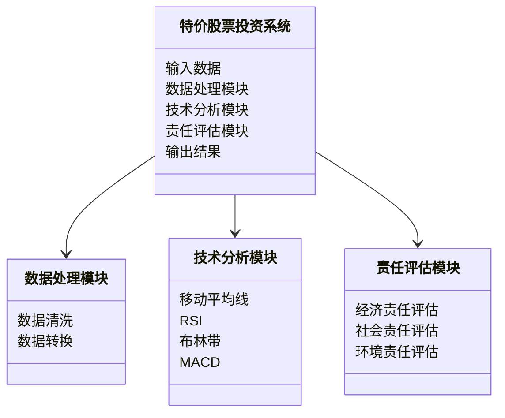
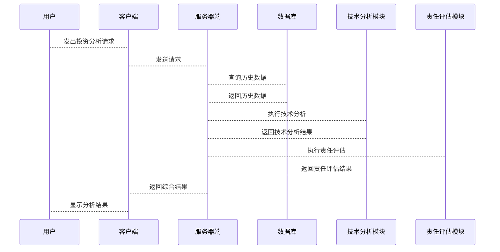

                 


# 特价股票投资中的企业数字伦理与责任评估因素考量

## 关键词：特价股票投资、企业数字伦理、责任评估、技术分析、量化投资

## 摘要：本文探讨了在特价股票投资中，企业数字伦理与责任评估的重要性。通过分析技术分析算法、量化投资模型、系统架构设计等核心内容，本文为投资者提供了一套结合伦理与责任的股票投资策略。

---

# 第1章: 特价股票投资的背景与概念

## 1.1 特价股票投资的定义与特点

### 1.1.1 特价股票的定义

特价股票是指价格低于其内在价值，具有较大上涨潜力的股票。通常，这类股票可能暂时被市场低估，或公司面临短期挑战，但具备长期增长潜力。

$$
\text{内在价值} = \frac{\text{未来现金流的现值}}{\text{折现率}}
$$

### 1.1.2 特价股票投资的特点

1. **低估值**：股票价格远低于行业平均水平或历史平均水平。
2. **高潜力**：公司基本面良好，具备长期增长潜力。
3. **逆向投资**：在市场恐慌时买入，市场乐观时卖出。

### 1.1.3 特价股票投资的市场环境

- **市场周期**：股市周期性波动为特价股票投资提供机会。
- **行业动态**：行业结构调整、技术革新等影响股票价格。
- **宏观经济**：经济周期、货币政策等影响市场整体表现。

---

## 1.2 企业数字伦理的定义与原则

### 1.2.1 数字伦理的核心概念

数字伦理是指在数字化环境下，企业和个人在决策和行为中应遵循的道德准则。包括数据隐私、算法公平性、社会责任等方面。

### 1.2.2 企业数字伦理的原则

1. **数据隐私**：保护用户数据不被滥用。
2. **算法公平性**：避免算法偏见，确保决策公正。
3. **社会责任**：企业应承担对社会和环境的责任。

### 1.2.3 数字伦理对企业投资的影响

- **声誉风险**：违反伦理可能导致企业声誉受损。
- **合规风险**：不合规的决策可能引发法律问题。
- **长期价值**：遵循伦理原则有助于企业长期发展。

---

## 1.3 责任评估因素的定义与分类

### 1.3.1 责任评估的定义

责任评估是指对企业在经济、社会、环境等方面的影响进行全面评估，以确定其责任履行情况。

### 1.3.2 责任评估的主要因素

1. **经济责任**：企业对股东、员工的经济责任。
2. **社会责任**：企业对社会、环境的责任。
3. **治理责任**：企业内部治理的责任。

### 1.3.3 责任评估与企业投资的关系

- **投资决策**：责任评估影响投资者对企业价值的判断。
- **风险管理**：责任问题可能导致投资损失。
- **长期回报**：负责任的企业更有可能实现可持续增长。

---

## 1.4 本章小结

本章介绍了特价股票投资的基本概念、企业数字伦理的核心原则以及责任评估的主要因素。这些概念为后续分析奠定了基础。

---

# 第2章: 企业数字伦理与责任评估的核心要素

## 2.1 数字伦理的核心要素

### 2.1.1 企业数字行为的道德标准

企业应遵循数据隐私、算法公平性等道德标准。

### 2.1.2 数字化决策的伦理框架

- **数据收集**：确保数据收集的合法性。
- **数据使用**：避免数据滥用。
- **算法决策**：确保算法的透明性和公平性。

### 2.1.3 数字伦理与企业责任的关联

数字伦理是企业履行社会责任的重要组成部分。

---

## 2.2 责任评估的核心要素

### 2.2.1 责任评估的主要维度

- **经济维度**：企业盈利能力、财务健康状况。
- **社会维度**：企业对社会的贡献、员工福利。
- **环境维度**：企业对环境的影响、可持续发展措施。

### 2.2.2 责任评估的指标体系

1. **经济指标**：ROE（净资产收益率）、净利润率。
2. **社会指标**：员工满意度、社会责任支出。
3. **环境指标**：碳排放量、资源利用率。

### 2.2.3 责任评估的实施方法

- **定量分析**：通过指标体系进行量化评估。
- **定性分析**：通过案例分析进行定性判断。
- **综合评估**：结合定量和定性分析。

---

## 2.3 数字伦理与责任评估的对比分析

### 2.3.1 数字伦理与责任评估的异同点

| **方面** | **数字伦理** | **责任评估** |
|----------|--------------|--------------|
| 内容     | 数据隐私、算法公平性 | 经济责任、社会责任、治理责任 |
| 方法     | 伦理框架、行为规范 | 指标体系、案例分析 |
| 目标     | 企业合规、道德提升 | 企业责任履行、可持续发展 |

### 2.3.2 数字伦理对责任评估的影响

数字伦理是责任评估的重要组成部分，尤其是数据隐私和算法公平性方面。

### 2.3.3 责任评估对数字伦理的促进作用

责任评估促使企业关注数字伦理问题，提升企业的道德水平。

---

## 2.4 本章小结

本章分析了数字伦理和责任评估的核心要素及其异同点，强调了两者之间的相互作用。

---

# 第3章: 特价股票投资中的技术分析算法

## 3.1 技术分析的核心算法

### 3.1.1 移动平均线（Moving Average）

$$
\text{MA}_n = \frac{1}{n} \sum_{i=1}^{n} P_i
$$

其中，$P_i$ 表示第i天的收盘价，$n$ 表示天数。

### 3.1.2 相对强弱指数（RSI）

$$
\text{RSI} = \frac{100}{1 + \frac{\text{平均上涨幅度}}{\text{平均下跌幅度}}}
$$

### 3.1.3 布林带（Bollinger Bands）

$$
\text{中轨} = \text{MA}_n(S)
$$

$$
\text{上轨} = \text{MA}_n(S) + k \times \text{STD}_n(S)
$$

$$
\text{下轨} = \text{MA}_n(S) - k \times \text{STD}_n(S)
$$

其中，$S$ 表示收盘价序列，$\text{MA}_n(S)$ 表示S的n日移动平均线，$\text{STD}_n(S)$ 表示S的n日标准差，$k$ 通常取2。

### 3.1.4 麦克劳格指标（MACD）

$$
\text{MACD} = \text{EMA}_{12} - \text{EMA}_{26}
$$

$$
\text{MACD} \text{信号线} = \text{EMA}_{9}(\text{MACD})
$$

---

## 3.2 量化投资模型

### 3.2.1 回归分析

$$
Y = \beta X + \epsilon
$$

其中，$Y$ 是目标变量，$X$ 是自变量，$\beta$ 是回归系数，$\epsilon$ 是误差项。

### 3.2.2 时间序列分析

$$
\text{ARIMA}(p, d, q)
$$

其中，$p$ 是自回归阶数，$d$ 是差分阶数，$q$ 是移动平均阶数。

### 3.2.3 风险调整后的收益评估

$$
\text{夏普比率} = \frac{\text{超额收益}}{\text{收益的标准差}}
$$

---

## 3.3 数字伦理对技术分析的影响

### 3.3.1 数据隐私

在技术分析中，确保数据来源合法、合规。

### 3.3.2 算法公平性

避免算法偏见，确保分析结果的公正性。

### 3.3.3 责任评估

结合责任评估结果，调整技术分析策略。

---

## 3.4 本章小结

本章介绍了技术分析的核心算法和量化投资模型，并探讨了数字伦理对技术分析的影响。

---

# 第4章: 投资系统的架构设计

## 4.1 系统功能设计

### 4.1.1 领域模型（Mermaid 类图）



## 4.2 系统架构设计（Mermaid 架构图）

```mermaid
container 客户端 {
    接收用户请求
    显示分析结果
}

container 服务器端 {
    处理用户请求
    执行数据处理
    执行技术分析
    执行责任评估
    返回结果
}

component 数据库 {
    存储历史数据
    存储分析结果
}

客户端 --> 服务器端
服务器端 --> 数据库
```

## 4.3 系统接口设计

### 4.3.1 API 接口

- **输入接口**：接收股票数据、市场数据。
- **输出接口**：返回技术分析结果、责任评估结果。

### 4.3.2 数据接口

- **数据清洗接口**：处理脏数据。
- **数据转换接口**：转换数据格式。

---

## 4.4 系统交互设计（Mermaid 序列图）



---

## 4.5 本章小结

本章通过架构设计、接口设计和交互设计，展示了如何构建一个综合考虑技术分析和责任评估的股票投资系统。

---

# 第5章: 项目实战与案例分析

## 5.1 项目环境安装

### 5.1.1 安装 Python

```bash
# 在终端中运行以下命令
python --version
pip install --upgrade pip
```

### 5.1.2 安装依赖库

```bash
pip install numpy pandas matplotlib scikit-learn
```

---

## 5.2 核心代码实现

### 5.2.1 数据处理代码

```python
import pandas as pd
import numpy as np

# 数据清洗
def data_cleaning(data):
    data.dropna(inplace=True)
    data = data[~data.isin([np.nan, np.inf, -np.inf]).any(axis=1)]
    return data

# 数据转换
def data_transformation(data):
    data['归一化'] = (data - data.min()) / (data.max() - data.min())
    return data
```

### 5.2.2 技术分析代码

```python
import matplotlib.pyplot as plt

def calculate_ma(data, window):
    return data.rolling(window).mean()

def calculate_rsi(data, window):
    diff = data.diff()
    up = diff.where(diff > 0, 0)
    down = diff.where(diff < 0, 0)
    rs = up.rolling(window).mean() / down.rolling(window).mean()
    return 100 - 100 / (1 + rs)

def plot_charts(data, ma_window, rsi_window):
    plt.figure(figsize=(12, 6))
    plt.subplot(2, 1, 1)
    data['收盘价'].plot(label='Close')
    ma = calculate_ma(data['收盘价'], ma_window)
    ma.plot(label=f'MA_{ma_window}')
    plt.legend()
    plt.subplot(2, 1, 2)
    rsi = calculate_rsi(data['收盘价'], rsi_window)
    rsi.plot(label='RSI')
    plt.legend()
    plt.show()
```

### 5.2.3 责任评估代码

```python
def responsibility_assessment(data):
    # 经济责任评估
    economic_score = data['ROE'].mean()
    # 社会责任评估
    social_score = data['员工满意度'].mean()
    # 环境责任评估
    environmental_score = data['碳排放'].mean()
    return {'经济责任': economic_score, '社会责任': social_score, '环境责任': environmental_score}
```

---

## 5.3 案例分析

### 5.3.1 数据来源

假设我们选取某科技公司过去5年的股票数据，包括收盘价、成交量、ROE、员工满意度、碳排放等指标。

### 5.3.2 技术分析结果

```python
data = pd.read_csv('stock_data.csv')
plot_charts(data, ma_window=20, rsi_window=14)
```

### 5.3.3 责任评估结果

```python
assessment = responsibility_assessment(data)
print(assessment)
```

---

## 5.4 本章小结

本章通过实际项目实战，展示了如何在Python环境中实现特价股票投资的技术分析和责任评估。

---

# 第6章: 总结与展望

## 6.1 最佳实践 tips

1. **数据来源**：确保数据来源合法、合规。
2. **算法选择**：根据具体情况选择合适的算法。
3. **责任评估**：综合考虑经济、社会、环境责任。
4. **持续学习**：关注市场变化和技术进步。

## 6.2 小结

本文从背景、概念、算法、系统架构、项目实战等方面，全面探讨了特价股票投资中的企业数字伦理与责任评估因素考量。

## 6.3 注意事项

1. **数据风险**：数据质量和完整性影响分析结果。
2. **算法局限**：技术分析模型存在局限性。
3. **责任评估**：定性分析主观性强。

## 6.4 拓展阅读

1. 《量化投资入门》
2. 《企业数字伦理与社会责任》
3. 《算法交易与统计套利》

---

# 作者：AI天才研究院/AI Genius Institute & 禅与计算机程序设计艺术 /Zen And The Art of Computer Programming

---

# THE END

