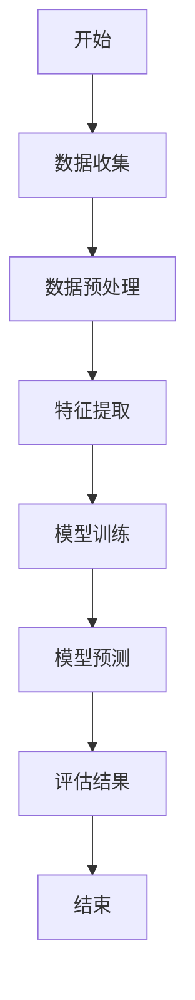
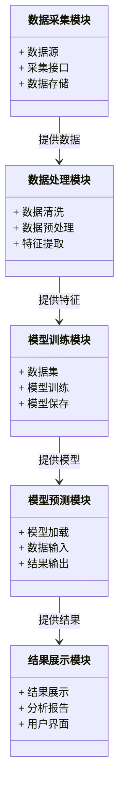
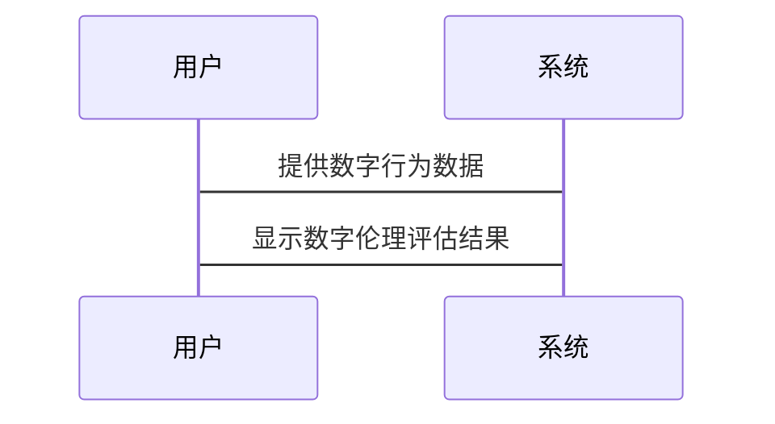

                 


```markdown
# 特价股票投资中的企业数字伦理评估因素考量

---

## 关键词
- 特价股票投资
- 企业数字伦理
- 数字伦理评估
- 投资决策
- 企业合规性

---

## 摘要
在当前数字化转型的背景下，企业数字行为对股价和投资决策的影响日益显著。本文深入探讨了在特价股票投资中如何评估企业的数字伦理表现，分析了数字伦理评估的核心要素，提出了基于机器学习的评估模型，并通过实际案例展示了如何将数字伦理评估应用于投资决策中。文章旨在帮助投资者在追求超额收益的同时，关注企业的社会责任和道德合规性，实现长期稳健的投资回报。

---

## 第一部分: 特价股票投资中的企业数字伦理评估背景介绍

### 第1章: 特价股票投资概述

#### 1.1 特价股票的定义与特点
##### 1.1.1 特价股票的定义
特价股票是指市场价格低于其内在价值，或者相对于市场平均水平处于低位的股票。这类股票通常具有较高的波动性和潜在的高回报率，但同时也伴随着较高的风险。

##### 1.1.2 特价股票的特点
- 价格低廉：相比同类股票，特价股票的价格通常较低。
- 高波动性：市场波动较大，价格波动频繁。
- 高风险：由于价格低廉，可能隐藏着较高的风险，包括财务状况不稳定或行业前景不佳。

##### 1.1.3 特价股票的投资价值
- 高潜在回报：如果企业基本面改善，股价可能快速回升。
- 市场机会：特价股票可能因市场波动或企业重组而产生投资机会。
- 风险与收益并存：投资者需权衡潜在收益与风险。

#### 1.2 数字伦理的基本概念
##### 1.2.1 数字伦理的定义
数字伦理是指在数字技术应用过程中，企业或个人的行为是否符合道德规范和社会责任。它涵盖了数据隐私、算法公平性、数字足迹等多个方面。

##### 1.2.2 数字伦理的核心要素
- 数据隐私：保护个人数据不被滥用。
- 算法公平性：确保算法决策的公平性和透明性。
- 数字足迹：企业在数字空间中的行为对环境和社会的影响。
- 数字包容性：技术应用是否考虑到了不同群体的需求。

##### 1.2.3 数字伦理在企业中的重要性
- 提升企业形象：合规的企业更容易获得投资者的信任。
- 避免法律风险：合规经营可以减少因伦理问题引发的法律纠纷。
- 增强竞争力：良好的数字伦理表现可能成为企业的核心竞争优势。

### 第2章: 特价股票投资中的数字伦理评估必要性

#### 2.1 特价股票投资中的伦理问题
##### 2.1.1 特价股票投资中的道德风险
- 信息不对称：投资者可能基于不完整或虚假信息做出投资决策。
- 短期行为：投资者可能为了追求短期收益而忽视企业的长期发展。
- 企业行为的负面影响：企业可能通过不道德的行为 manipulative the market。

##### 2.1.2 企业数字行为对股价的影响
- 数据泄露：可能导致股价暴跌。
- 算法滥用：操纵市场或误导投资者。
- 数字足迹问题：环境和社会责任问题可能引发股价波动。

##### 2.1.3 投资者的伦理责任
- 投资者有责任关注企业的社会责任。
- 投资者需要避免因追求短期收益而忽视企业的长期发展。
- 投资者有责任推动企业改善数字伦理表现。

#### 2.2 数字伦理评估在特价股票投资中的作用
##### 2.2.1 评估企业数字行为的合规性
- 通过数字伦理评估，投资者可以识别企业的合规性问题。
- 评估企业是否遵守数据隐私和算法公平性等基本伦理准则。

##### 2.2.2 识别企业数字风险
- 通过数字伦理评估，投资者可以识别企业的潜在风险。
- 分析企业是否存在数据滥用、算法不公平等行为。

##### 2.2.3 提升投资决策的透明度
- 数字伦理评估可以提高投资决策的透明度。
- 通过公开企业数字行为的信息，投资者可以做出更明智的投资决策。

#### 2.3 数字伦理评估的维度与方法
##### 2.3.1 数字伦理评估的主要维度
- 数据隐私：评估企业是否保护用户数据。
- 算法公平性：评估算法是否公平。
- 数字足迹：评估企业在数字空间中的行为对环境和社会的影响。
- 数字包容性：评估技术应用是否考虑到了不同群体的需求。

##### 2.3.2 数字伦理评估的指标体系
- 数据隐私保护措施：评估企业是否有完善的数据隐私保护政策。
- 算法透明性：评估算法是否公开透明。
- 数字足迹管理：评估企业在数字空间中的行为是否环保。
- 数字包容性：评估企业是否关注不同群体的需求。

##### 2.3.3 数字伦理评估的方法与工具
- 自我评估：企业可以自行评估其数字伦理表现。
- 第三方评估：通过第三方机构对企业数字伦理表现进行评估。
- 技术工具：使用技术工具对企业数字行为进行实时监控和评估。

---

## 第二部分: 企业数字伦理评估的核心概念与联系

### 第3章: 数字伦理评估的核心概念

#### 3.1 数据隐私与安全
##### 3.1.1 数据隐私的定义与保护
- 数据隐私：指个人数据的私密性和安全性。
- 数据保护：通过技术和法律手段保护数据不被滥用。

##### 3.1.2 数据安全的实现与挑战
- 数据加密：通过加密技术保护数据安全。
- 访问控制：通过权限管理控制数据访问。
- 数据安全的挑战：数据泄露、数据滥用等。

##### 3.1.3 数据隐私与安全对企业的影响
- 提升企业形象：良好的数据保护措施可以提升企业形象。
- 避免法律风险：合规的数据保护可以避免因数据泄露引发的法律纠纷。
- 增强客户信任：良好的数据保护可以增强客户对企业的信任。

#### 3.2 算法公平性与透明性
##### 3.2.1 算法公平性的定义与评估
- 算法公平性：指算法在决策过程中是否公平。
- 算法评估：通过评估算法的公平性，确保算法决策的公正性。

##### 3.2.2 算法透明性：指算法的决策过程是否公开透明。
- 算法透明性：通过公开算法的决策过程，增强算法的可信度。
- 算法透明性的实现：通过公开算法的代码和决策过程，确保算法的透明性。

##### 3.2.3 算法对投资决策的影响
- 算法在投资中的应用：算法可以用于股票交易、市场预测等。
- 算法的公平性与透明性对投资决策的影响：公平和透明的算法可以提高投资决策的准确性和可靠性。

#### 3.3 数字伦理评估的多维度分析
##### 3.3.1 数据隐私与算法公平性的关系
- 数据隐私是算法公平性的基础。
- 算法公平性需要数据隐私的保护。

##### 3.3.2 数字伦理评估的系统性框架
- 系统性框架：包括数据隐私、算法公平性、数字足迹等多个方面。
- 系统性框架的作用：通过系统性框架，可以全面评估企业的数字伦理表现。

##### 3.3.3 数字伦理评估的动态性与适应性
- 数字伦理评估需要动态调整。
- 数字伦理评估需要根据技术和市场的变化进行调整。

### 第4章: 数字伦理评估的核心要素与ER实体关系图

#### 4.1 数字伦理评估的核心要素
- 数据隐私：包括数据加密、访问控制等。
- 算法公平性：包括算法透明性、算法公平性评估等。
- 数字足迹：包括企业在数字空间中的行为对环境和社会的影响。
- 数字包容性：包括技术应用是否考虑到了不同群体的需求。

#### 4.2 数字伦理评估的ER实体关系图
```mermaid
erDiagram
    actor 投资者 {
        <string> id
        <string> 名称
    }
    actor 企业 {
        <string> id
        <string> 名称
    }
    actor 第三方机构 {
        <string> id
        <string> 名称
    }
    entity 数据 {
        <string> id
        <string> 类型
        <string> 内容
    }
    entity 算法 {
        <string> id
        <string> 名称
        <string> 类型
    }
    entity 数字行为 {
        <string> id
        <string> 类型
        <string> 时间
    }
    entity 评估结果 {
        <string> id
        <string> 评估维度
        <string> 评估结果
    }
    投资者 --> 数据 : 提供
    投资者 --> 算法 : 使用
    企业 --> 数据 : 产生
    企业 --> 算法 : 使用
    第三方机构 --> 数据 : 评估
    第三方机构 --> 算法 : 评估
    第三方机构 --> 数字行为 : 监测
    评估结果 --> 数据 : 基于
    评估结果 --> 算法 : 基于
    评估结果 --> 数字行为 : 基于
```

---

## 第三部分: 数字伦理评估的算法原理与数学模型

### 第5章: 数字伦理评估的算法原理

#### 5.1 算法原理概述
##### 5.1.1 算法的基本思路
- 基于机器学习的数字伦理评估模型。
- 通过分析企业的数字行为，评估其数字伦理表现。

##### 5.1.2 算法的核心步骤
1. 数据收集：收集企业的数字行为数据。
2. 数据预处理：清洗数据，提取特征。
3. 模型训练：基于历史数据训练评估模型。
4. 模型预测：使用模型预测企业的数字伦理表现。

##### 5.1.3 算法的关键技术
- 机器学习：用于模型训练和预测。
- 数据挖掘：用于数据收集和特征提取。
- 自然语言处理：用于文本数据的分析和处理。

#### 5.2 数字伦理评估算法的流程图


#### 5.3 算法的数学模型
##### 5.3.1 模型假设
- 假设企业的数字伦理表现可以通过其数字行为数据进行评估。
- 假设历史数据可以用来训练评估模型。

##### 5.3.2 模型的数学公式
$$
\text{评估得分} = \alpha \times \text{数据隐私得分} + \beta \times \text{算法公平性得分} + \gamma \times \text{数字足迹得分}
$$

其中，$\alpha + \beta + \gamma = 1$，表示各项指标的权重。

##### 5.3.3 模型实现步骤
1. 数据收集：收集企业的数字行为数据。
2. 数据预处理：清洗数据，提取特征。
3. 模型训练：基于历史数据训练评估模型。
4. 模型预测：使用模型预测企业的数字伦理表现。

### 第6章: 数字伦理评估的数学模型

#### 6.1 模型的输入与输出
##### 6.1.1 模型的输入
- 数据隐私得分：基于企业的数据隐私保护措施。
- 算法公平性得分：基于算法的公平性和透明性。
- 数字足迹得分：基于企业在数字空间中的行为对环境和社会的影响。

##### 6.1.2 模型的输出
- 数字伦理评估得分：综合考虑各项指标的评估结果。

#### 6.2 模型的参数设置
##### 6.2.1 模型的权重分配
- 数据隐私得分的权重：$\alpha = 0.4$
- 算法公平性得分的权重：$\beta = 0.3$
- 数字足迹得分的权重：$\gamma = 0.3$

##### 6.2.2 模型的训练数据
- 历史数据：包括企业的历史数字行为数据。
- 标签：企业的数字伦理表现标签。

#### 6.3 模型的实现代码
```python
import pandas as pd
from sklearn.model_selection import train_test_split
from sklearn.linear_model import LinearRegression
from sklearn.metrics import mean_squared_error

# 数据加载
data = pd.read_csv('digital_ethics_data.csv')

# 特征提取
X = data[['data_privacy_score', 'algorithm_fairness_score', 'digital_footprint_score']]
y = data['digital_ethics_assessment']

# 数据分割
X_train, X_test, y_train, y_test = train_test_split(X, y, test_size=0.2, random_state=42)

# 模型训练
model = LinearRegression()
model.fit(X_train, y_train)

# 模型预测
y_pred = model.predict(X_test)

# 模型评估
mse = mean_squared_error(y_test, y_pred)
print(f"均方误差: {mse}")
```

#### 6.4 模型的解释与应用
##### 6.4.1 模型的解释
- 通过模型可以预测企业的数字伦理评估得分。
- 模型的权重分配反映了各项指标的重要性和影响力。

##### 6.4.2 模型的应用
- 用于评估企业的数字伦理表现。
- 用于指导投资者在特价股票投资中的决策。

---

## 第四部分: 数字伦理评估的系统分析与架构设计

### 第7章: 数字伦理评估的系统分析

#### 7.1 系统需求分析
##### 7.1.1 系统目标
- 实现对企业数字行为的实时监控和评估。
- 提供数字伦理评估的结果和建议。

##### 7.1.2 系统功能需求
- 数据采集：实时采集企业的数字行为数据。
- 数据处理：清洗和预处理数据。
- 模型训练：训练数字伦理评估模型。
- 模型预测：预测企业的数字伦理表现。
- 结果展示：展示评估结果和建议。

#### 7.2 系统功能设计
##### 7.2.1 功能模块划分
- 数据采集模块：负责数据的采集和存储。
- 数据处理模块：负责数据的清洗和预处理。
- 模型训练模块：负责模型的训练和优化。
- 模型预测模块：负责模型的预测和评估。
- 结果展示模块：负责评估结果的展示和分析。

##### 7.2.2 功能模块的交互流程
1. 数据采集模块采集企业的数字行为数据。
2. 数据处理模块对数据进行清洗和预处理。
3. 模型训练模块基于预处理后的数据训练评估模型。
4. 模型预测模块使用模型预测企业的数字伦理表现。
5. 结果展示模块展示评估结果和建议。

#### 7.3 系统功能的领域模型


### 第8章: 数字伦理评估的系统架构设计

#### 8.1 系统架构概述
##### 8.1.1 系统架构的目标
- 实现系统的模块化设计。
- 提高系统的可扩展性和可维护性。

##### 8.1.2 系统架构的分层设计
- 数据采集层：负责数据的采集和存储。
- 数据处理层：负责数据的清洗和预处理。
- 模型训练层：负责模型的训练和优化。
- 模型预测层：负责模型的预测和评估。
- 结果展示层：负责评估结果的展示和分析。

#### 8.2 系统架构的实现
##### 8.2.1 系统架构的设计


##### 8.2.2 系统架构的实现步骤
1. 数据采集模块：实现数据的采集和存储。
2. 数据处理模块：实现数据的清洗和预处理。
3. 模型训练模块：实现模型的训练和优化。
4. 模型预测模块：实现模型的预测和评估。
5. 结果展示模块：实现评估结果的展示和分析。

#### 8.3 系统接口设计
##### 8.3.1 系统接口的定义
- 数据采集接口：负责数据的采集和存储。
- 数据处理接口：负责数据的清洗和预处理。
- 模型训练接口：负责模型的训练和优化。
- 模型预测接口：负责模型的预测和评估。
- 结果展示接口：负责评估结果的展示和分析。

##### 8.3.2 系统接口的实现
- 数据采集接口：使用API实现数据的采集和存储。
- 数据处理接口：使用数据处理工具实现数据的清洗和预处理。
- 模型训练接口：使用机器学习框架训练模型。
- 模型预测接口：使用训练好的模型进行预测。
- 结果展示接口：使用可视化工具展示评估结果。

### 第9章: 数字伦理评估的系统交互设计

#### 9.1 系统交互概述
##### 9.1.1 系统交互的目标
- 实现系统的用户友好界面。
- 提供便捷的交互方式。

##### 9.1.2 系统交互的流程
1. 用户输入企业的数字行为数据。
2. 系统对数据进行处理和分析。
3. 系统输出数字伦理评估结果。

#### 9.2 系统交互的序列图


#### 9.3 系统交互的优化
##### 9.3.1 界面设计
- 提供用户友好的界面，方便用户输入数据和查看结果。
- 提供数据可视化功能，直观展示评估结果。

##### 9.3.2 交互流程优化
- 简化交互流程，提高系统的响应速度。
- 提供反馈机制，及时通知用户系统处理结果。

---

## 第五部分: 数字伦理评估的项目实战

### 第10章: 数字伦理评估的项目实战

#### 10.1 项目环境安装
##### 10.1.1 环境要求
- 操作系统：Windows/Mac/Linux
- Python版本：Python 3.8+
- 依赖库：pandas、scikit-learn、mermaid、matplotlib

##### 10.1.2 环境安装步骤
1. 安装Python
2. 安装依赖库：
```bash
pip install pandas scikit-learn mermaid matplotlib
```

#### 10.2 项目核心代码实现
##### 10.2.1 数据加载与预处理
```python
import pandas as pd

# 加载数据
data = pd.read_csv('digital_ethics_data.csv')

# 数据预处理
data.dropna(inplace=True)
data = pd.get_dummies(data)
```

##### 10.2.2 模型训练与预测
```python
from sklearn.model_selection import train_test_split
from sklearn.linear_model import LinearRegression
from sklearn.metrics import mean_squared_error

# 数据分割
X = data[['data_privacy_score', 'algorithm_fairness_score', 'digital_footprint_score']]
y = data['digital_ethics_assessment']

X_train, X_test, y_train, y_test = train_test_split(X, y, test_size=0.2, random_state=42)

# 模型训练
model = LinearRegression()
model.fit(X_train, y_train)

# 模型预测
y_pred = model.predict(X_test)

# 模型评估
mse = mean_squared_error(y_test, y_pred)
print(f"均方误差: {mse}")
```

##### 10.2.3 结果展示与分析
```python
import matplotlib.pyplot as plt

plt.scatter(y_test, y_pred)
plt.xlabel('真实值')
plt.ylabel('预测值')
plt.title('数字伦理评估结果')
plt.show()
```

#### 10.3 项目小结
##### 10.3.1 项目实现的关键点
- 数据预处理：清洗和转换数据。
- 模型训练：基于历史数据训练评估模型。
- 模型预测：使用模型预测企业的数字伦理表现。
- 结果展示：可视化展示评估结果。

##### 10.3.2 项目的实际意义
- 通过数字伦理评估，投资者可以更好地评估企业的数字行为。
- 数字伦理评估可以作为投资决策的重要参考。

---

## 第六部分: 数字伦理评估的最佳实践

### 第11章: 数字伦理评估的最佳实践

#### 11.1 最佳实践的小结
##### 11.1.1 小结
- 数字伦理评估是特价股票投资中的重要环节。
- 通过数字伦理评估，投资者可以更好地评估企业的数字行为。

##### 11.1.2 注意事项
- 数据隐私和算法公平性是数字伦理评估的核心。
- 投资者需要关注企业的数字行为对股价的影响。

#### 11.2 数字伦理评估的注意事项
##### 11.2.1 数据隐私保护
- 确保数据的合法性和合规性。
- 避免数据泄露和滥用。

##### 11.2.2 算法公平性
- 确保算法的公平性和透明性。
- 避免算法滥用和不公平决策。

##### 11.2.3 数字包容性
- 关注不同群体的需求。
- 提供包容性的技术解决方案。

#### 11.3 数字伦理评估的拓展阅读
##### 11.3.1 推荐书籍
- 《数字伦理：技术与道德的冲突与融合》
- 《数据隐私与算法公平性》

##### 11.3.2 推荐博客和文章
- 数字伦理相关的技术博客和文章。
- 学术期刊中关于数字伦理的研究论文。

---

## 作者：AI天才研究院/AI Genius Institute & 禅与计算机程序设计艺术 /Zen And The Art of Computer Programming
```

