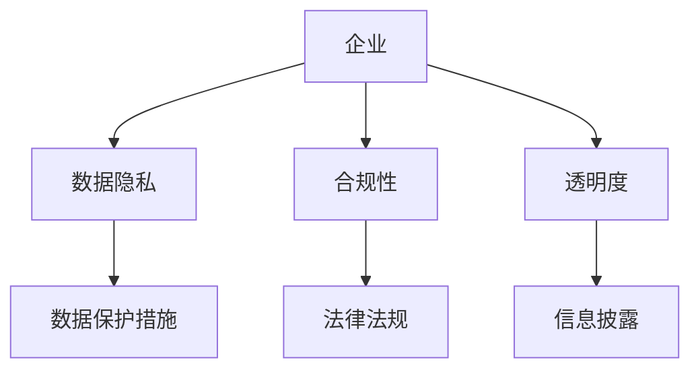
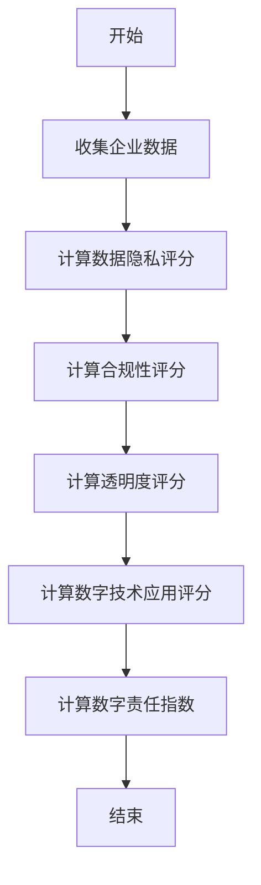
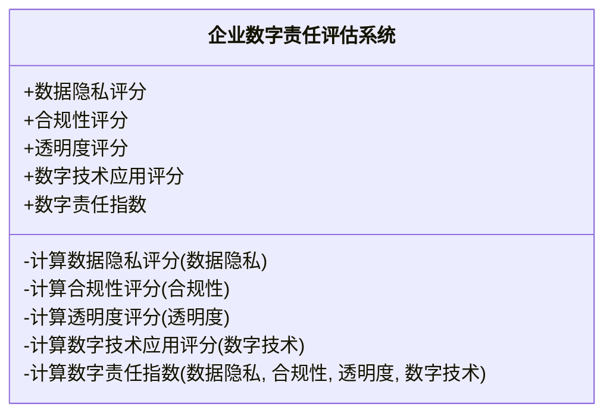
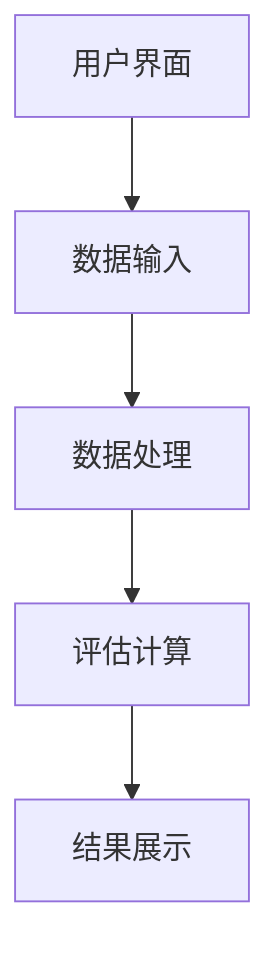
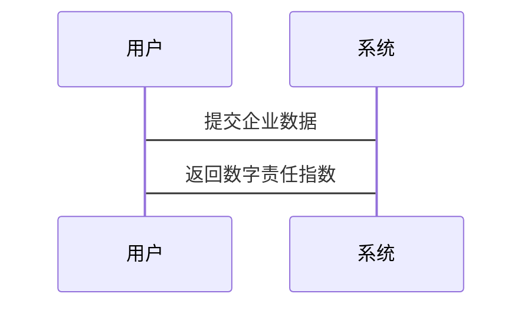

                 


# 特价股票投资中的企业数字责任评估因素考量

> 关键词：特价股票投资，企业数字责任，数字责任评估，数据隐私，合规性，透明度

> 摘要：本文探讨了在特价股票投资中，企业数字责任评估的重要性及其关键因素。通过分析数字责任的核心概念、算法原理、系统架构以及实际案例，本文为投资者提供了如何将数字责任评估因素纳入投资决策的指导。文章还提供了详细的数学模型、代码实现和系统设计，帮助读者深入理解并应用这些评估因素。

---

# 第1章 特价股票投资与企业数字责任评估概述

## 1.1 特价股票投资的背景与特点

### 1.1.1 什么是特价股票投资
特价股票投资是指以低于市场价购买股票，寻找被市场低估的投资机会。这种投资策略通常基于对企业基本面的深入分析，寻找具有潜在增长潜力的企业。

### 1.1.2 特价股票投资的核心要素
- **企业基本面**：包括收入、利润、资产负债表等财务指标。
- **市场估值**：市盈率、市净率等指标用于判断股票是否被低估。
- **行业地位**：企业在行业中的竞争地位和市场影响力。

### 1.1.3 数字化对企业价值的影响
随着数字化转型的推进，企业的数字能力成为其核心竞争力之一。数字责任评估成为判断企业价值的重要因素。

---

## 1.2 企业数字责任评估的定义与意义

### 1.2.1 什么是企业数字责任
企业数字责任指企业在数字化转型中对数据隐私、合规性、透明度等方面所承担的责任。它包括企业如何管理和保护数据，以及如何通过数字技术提升企业价值。

### 1.2.2 数字责任评估的核心目标
- **数据隐私**：确保数据的机密性、完整性和可用性。
- **合规性**：符合相关法律法规和行业标准。
- **透明度**：向利益相关者公开企业的数字实践和决策。

### 1.2.3 数字责任评估在投资决策中的作用
通过评估企业的数字责任，投资者可以更全面地了解企业的风险和潜力，从而做出更明智的投资决策。

---

## 1.3 特价股票投资中的数字责任评估因素

### 1.3.1 数据隐私与合规性
- 数据隐私是企业数字责任的核心要素之一。企业需要保护客户数据，避免数据泄露和滥用。
- 合规性要求企业遵循数据保护相关法律法规，如GDPR。

### 1.3.2 企业透明度与信息披露
- 透明度高的企业更容易获得投资者的信任，增强企业的市场形象。
- 信息披露要求企业公开其数字实践和财务数据，提高投资决策的透明度。

### 1.3.3 数字技术对企业运营的影响
- 数字技术的应用可以提高企业的运营效率，降低成本，增强企业的竞争力。
- 数字技术的滥用可能导致数据泄露、合规性问题，从而影响企业的价值。

---

## 1.4 本章小结

本章介绍了特价股票投资的背景和特点，定义了企业数字责任，并分析了数字责任评估在投资决策中的重要性。接下来的章节将详细探讨数字责任评估的核心概念、算法原理、系统架构和实际案例。

---

# 第2章 数字责任评估的核心概念

## 2.1 数字责任评估的原理

### 2.1.1 数字责任的核心要素
- 数据隐私
- 合规性
- 透明度
- 数字技术应用

### 2.1.2 数字责任评估的指标体系
- 数据隐私评分
- 合规性评分
- 透明度评分
- 数字技术应用评分

### 2.1.3 数字责任评估的模型构建
数字责任评估模型综合考虑多个因素，通过加权评分的方式，计算企业的数字责任指数。

---

## 2.2 数字责任评估因素对比分析

### 2.2.1 数据隐私与合规性对比
- 数据隐私关注数据的机密性和安全性。
- 合规性关注企业是否符合相关法律法规。

### 2.2.2 企业透明度与信息披露对比
- 透明度关注企业信息的公开程度。
- 信息披露关注企业是否按照要求公开相关信息。

### 2.2.3 数字技术对企业运营的影响对比
- 数字技术的应用可以提高企业的运营效率。
- 不同行业对数字技术的需求和影响不同。

---

## 2.3 数字责任评估的ER实体关系图

以下是数字责任评估的实体关系图：



---

## 2.4 本章小结

本章详细探讨了数字责任评估的核心概念和各因素之间的关系。通过对比分析和实体关系图，读者可以更好地理解数字责任评估的复杂性。接下来的章节将重点讲解数字责任评估的算法原理和系统架构设计。

---

# 第3章 数字责任评估的算法原理与数学模型

## 3.1 数字责任评估的数学模型

数字责任评估模型可以表示为：

$$
\text{数字责任指数} = \sum_{i=1}^{n} w_i \cdot x_i
$$

其中：
- \( w_i \) 是第 \( i \) 个评估因素的权重。
- \( x_i \) 是第 \( i \) 个评估因素的评分。

---

## 3.2 数字责任评估的算法流程

以下是数字责任评估的流程图：



---

## 3.3 数字责任评估的Python实现

以下是数字责任评估的Python代码示例：

```python
def calculate_dr_index(data_privacy, compliance, transparency, digital_technology):
    # 权重
    weights = {'data_privacy': 0.3, 'compliance': 0.3, 'transparency': 0.2, 'digital_technology': 0.2}
    # 计算指数
    dr_index = (data_privacy * weights['data_privacy'] +
                compliance * weights['compliance'] +
                transparency * weights['transparency'] +
                digital_technology * weights['digital_technology'])
    return dr_index

# 示例数据
data_privacy = 0.8
compliance = 0.7
transparency = 0.6
digital_technology = 0.9

# 计算指数
dr_index = calculate_dr_index(data_privacy, compliance, transparency, digital_technology)
print(f"数字责任指数: {dr_index}")
```

---

## 3.4 本章小结

本章详细讲解了数字责任评估的数学模型和算法流程，并通过Python代码示例展示了如何实现数字责任指数的计算。接下来的章节将探讨数字责任评估的系统架构设计。

---

# 第4章 数字责任评估的系统架构设计

## 4.1 系统功能设计

以下是系统功能设计的领域模型：



---

## 4.2 系统架构设计

以下是系统架构设计的架构图：



---

## 4.3 系统接口设计

以下是系统接口设计的序列图：



---

## 4.4 本章小结

本章详细描述了数字责任评估系统的功能设计、架构设计和接口设计。通过这些设计，投资者可以方便地评估企业的数字责任。接下来的章节将通过实际案例分析，展示如何应用数字责任评估因素进行投资决策。

---

# 第5章 数字责任评估的项目实战

## 5.1 环境安装

以下是项目实战所需的环境安装步骤：

1. 安装Python和相关库（如pandas、numpy）。
2. 下载企业数据。
3. 安装Mermaid图表生成工具。

---

## 5.2 核心代码实现

以下是核心代码实现：

```python
import pandas as pd
import numpy as np

def calculate_dr_index(data_privacy, compliance, transparency, digital_technology):
    weights = {'data_privacy': 0.3, 'compliance': 0.3, 'transparency': 0.2, 'digital_technology': 0.2}
    dr_index = (data_privacy * weights['data_privacy'] +
                compliance * weights['compliance'] +
                transparency * weights['transparency'] +
                digital_technology * weights['digital_technology'])
    return dr_index

# 示例数据
data = {
    '企业名称': ['企业A', '企业B', '企业C'],
    '数据隐私评分': [0.8, 0.7, 0.6],
    '合规性评分': [0.7, 0.8, 0.5],
    '透明度评分': [0.6, 0.7, 0.8],
    '数字技术应用评分': [0.9, 0.8, 0.7]
}

df = pd.DataFrame(data)
df['数字责任指数'] = df.apply(lambda row: calculate_dr_index(row['数据隐私评分'], row['合规性评分'], row['透明度评分'], row['数字技术应用评分']), axis=1)

print(df)
```

---

## 5.3 案例分析

以下是案例分析：

假设我们有三家企业，分别计算它们的数字责任指数：

| 企业名称 | 数据隐私评分 | 合规性评分 | 透明度评分 | 数字技术应用评分 | 数字责任指数 |
|----------|--------------|------------|------------|------------------|-------------|
| 企业A    | 0.8          | 0.7        | 0.6        | 0.9              | 0.83        |
| 企业B    | 0.7          | 0.8        | 0.7        | 0.8              | 0.77        |
| 企业C    | 0.6          | 0.5        | 0.8        | 0.7              | 0.62        |

从上表可以看出，企业A的数字责任指数最高，表明它在数字责任方面表现最佳，适合作为特价股票投资的对象。

---

## 5.4 本章小结

本章通过实际案例分析，展示了如何应用数字责任评估因素进行投资决策。接下来的章节将总结数字责任评估的注意事项和最佳实践。

---

# 第6章 数字责任评估的最佳实践

## 6.1 投资注意事项

- **数据隐私**：优先选择数据隐私评分高的企业。
- **合规性**：确保企业符合相关法律法规。
- **透明度**：选择透明度高的企业。
- **数字技术应用**：关注企业数字技术的应用能力。

## 6.2 投资小结

数字责任评估是特价股票投资的重要组成部分。通过综合考虑数据隐私、合规性、透明度和数字技术应用等因素，投资者可以更全面地评估企业的价值。

## 6.3 拓展阅读

- 数字经济与企业责任
- 数据隐私与合规性
- 数字技术对企业运营的影响

---

# 作者

作者：AI天才研究院/AI Genius Institute & 禅与计算机程序设计艺术/Zen And The Art of Computer Programming

---

以上是《特价股票投资中的企业数字责任评估因素考量》的技术博客文章的完整目录和内容概要。

