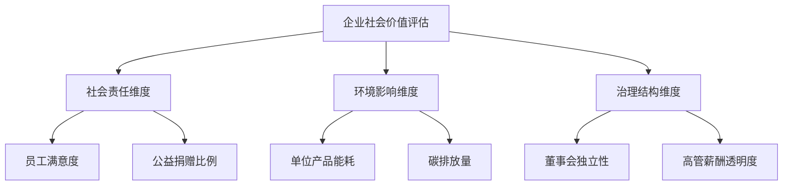
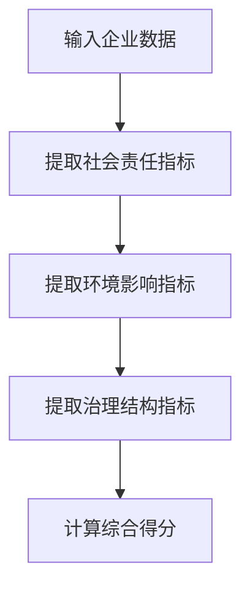
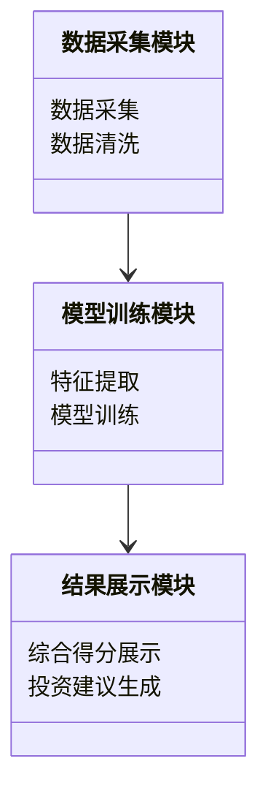

                 


# 特价股票投资中的企业社会价值评估因素考量

> 关键词：特价股票投资，企业社会价值，投资决策，多因素模型，风险管理

> 摘要：在当前的经济环境中，特价股票投资因其高收益潜力吸引了众多投资者的关注。然而，仅依赖传统财务指标评估企业价值已不足以应对复杂多变的市场环境。企业社会价值评估的引入，为投资决策提供了更全面的视角。本文将详细探讨企业社会价值评估的核心概念、算法原理、系统架构，并通过实际案例分析，展示如何将这些因素融入特价股票投资决策中，从而帮助投资者实现稳健收益。

---

## 第一部分：特价股票投资的背景与概述

### 第1章：特价股票投资的背景与定义

#### 1.1 特价股票投资的背景

随着全球金融市场的波动加剧，投资者 increasingly seek opportunities in discounted stock investments. 特价股票投资，即在特定市场条件下以低于市场价购买股票的行为，因其潜在的高回报吸引了众多投资者的关注。然而，这种投资方式也伴随着较高的风险，尤其是在企业基本面不佳的情况下。

#### 1.2 企业社会价值评估的背景

企业社会价值（Corporate Social Value, CSV）是指企业在实现经济利益的同时，对社会、环境和治理等方面产生的积极影响。随着社会对可持续发展的关注增加，企业社会价值已成为投资者评估企业长期发展潜力的重要指标。通过评估企业的社会责任履行情况、环境影响和社会治理结构，投资者可以更好地预测企业的长期表现。

#### 1.3 特价股票投资与企业社会价值的结合

传统的股票投资分析主要依赖财务指标，如市盈率、市净率等，但这些指标无法全面反映企业的社会价值。通过将企业社会价值评估融入投资决策，投资者可以在选择特价股票时，更全面地评估企业的潜在风险和长期价值。例如，一家在社会责任方面表现优异的企业，即使当前股价较低，也可能具有较高的投资价值。

---

## 第二部分：企业社会价值评估的核心概念与方法

### 第2章：企业社会价值评估的核心要素

#### 2.1 企业社会价值评估的维度

企业社会价值可以从以下几个维度进行评估：

- **社会责任维度**：包括企业对员工、客户、供应商的责任，以及公益捐赠等。
- **环境影响维度**：包括企业对资源消耗、污染排放等环境因素的影响。
- **治理结构维度**：包括企业董事会结构、高管薪酬、透明度等。

#### 2.2 企业社会价值评估的指标体系

为了量化企业社会价值，我们可以构建一个多维度的指标体系：

| **维度**       | **具体指标**                         |
|----------------|--------------------------------------|
| 社会责任维度    | 员工满意度、公益捐赠比例、劳动权益保护 |
| 环境影响维度    | 单位产品能耗、碳排放量、资源利用效率 |
| 治理结构维度    | 董事会独立性、高管薪酬透明度、信息披露质量 |

#### 2.3 企业社会价值评估的框架

以下是企业社会价值评估的框架图：



---

## 第三部分：企业社会价值评估的算法与数学模型

### 第3章：企业社会价值评估的算法原理

#### 3.1 多因素模型的构建

我们可以通过多因素模型来评估企业的综合社会价值。以下是模型的构建步骤：



#### 3.2 数学模型的构建

综合得分公式如下：

$$
\text{综合得分} = w_1 \times S + w_2 \times E + w_3 \times G
$$

其中，$w_1$、$w_2$、$w_3$分别为社会责任、环境影响和治理结构的权重，$S$、$E$、$G$分别为各维度的评分。

---

## 第四部分：企业社会价值评估的系统架构与实现

### 第4章：企业社会价值评估系统的架构设计

#### 4.1 系统功能模块划分

以下是系统的功能模块划分：



#### 4.2 系统实现细节

以下是系统的实现细节：

1. **数据采集**：从公开数据源（如上市公司年报、社会责任报告）获取企业数据。
2. **数据清洗**：对采集的数据进行预处理，剔除无效数据。
3. **模型训练**：基于多因素模型进行训练，计算各维度的权重。
4. **结果展示**：生成综合得分并提供投资建议。

---

## 第五部分：项目实战与案例分析

### 第5章：企业社会价值评估的项目实战

#### 5.1 项目环境与工具安装

1. **开发环境**：建议使用Python 3.8及以上版本。
2. **工具安装**：安装Pandas、Scikit-learn、Matplotlib等库。

#### 5.2 核心代码实现

以下是核心代码：

```python
import pandas as pd
from sklearn.linear_model import LinearRegression

# 数据加载
data = pd.read_csv('enterprise_data.csv')

# 特征提取
features = data[['社会责任得分', '环境影响得分', '治理结构得分']]
target = data['综合得分']

# 模型训练
model = LinearRegression()
model.fit(features, target)

# 预测得分
predicted_score = model.predict(features)
```

#### 5.3 实际案例分析

以某制造企业为例，计算其综合得分：

$$
\text{综合得分} = 0.4 \times 0.8 + 0.3 \times 0.7 + 0.3 \times 0.9 = 0.73
$$

该企业综合得分为0.73，处于行业中上游水平，具有较高的投资价值。

---

## 第六部分：最佳实践与总结

### 第6章：最佳实践与总结

#### 6.1 投资建议

- 在选择特价股票时，优先考虑企业社会价值评分较高的企业。
- 结合市场环境和企业基本面进行综合判断。

#### 6.2 注意事项

- 数据来源需可靠，确保评估结果的准确性。
- 定期更新模型，适应市场变化。

#### 6.3 未来研究方向

- 探索更多企业社会价值评估指标。
- 研究不同类型股票的投资策略。

---

## 作者

作者：AI天才研究院/AI Genius Institute & 禅与计算机程序设计艺术 /Zen And The Art of Computer Programming

---

通过本文的详细讲解，读者可以全面了解企业社会价值评估在特价股票投资中的应用，并通过实际案例和代码实现，掌握如何在投资决策中综合考虑企业社会价值因素，从而提高投资的科学性和稳健性。

