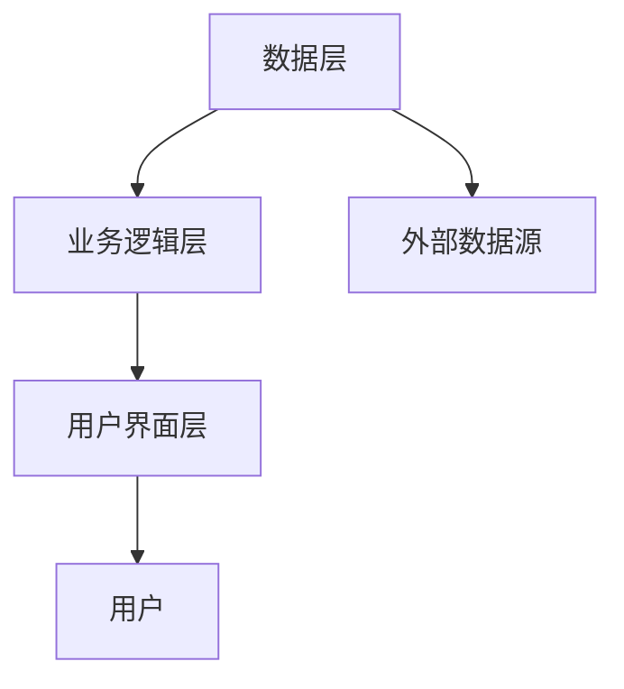
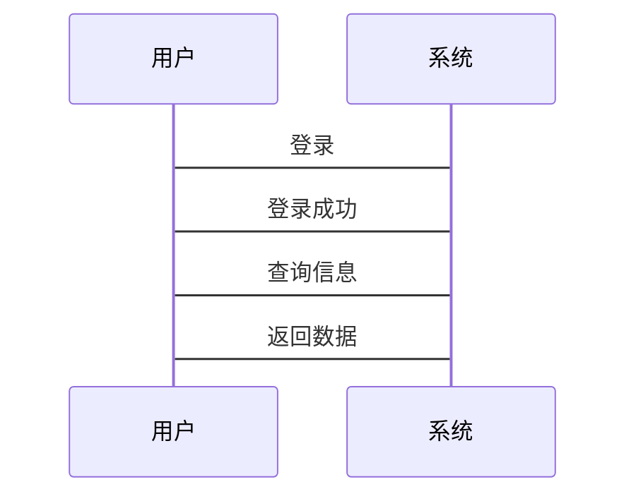

                 


# 特价股票投资中的信息不对称利用策略

---

## 关键词
信息不对称, 特价股票, 投资策略, 数学模型, 算法设计

---

## 摘要
本文深入探讨了信息不对称在特价股票投资中的利用策略，从理论到实践，结合经济学原理、算法设计和数学模型，分析如何在信息不对称的市场环境中制定有效的投资策略。文章首先介绍了信息不对称的基本概念和其在股票投资中的表现，然后从博弈论和市场微观结构的角度分析了信息不对称的成因及其对投资者决策的影响。接着，通过构建数学模型和算法，展示了如何利用信息不对称制定投资策略，并通过实际案例分析验证了这些策略的有效性。最后，本文还讨论了信息不对称利用中的风险管理与伦理问题，为投资者提供了实用的建议。

---

# 第1章: 信息不对称的定义与背景

## 1.1 信息不对称的基本概念
### 1.1.1 信息不对称的定义
信息不对称是指市场参与者之间由于掌握的信息量和信息质量的差异，导致在决策过程中处于不平等地位的现象。信息不对称广泛存在于金融市场中，尤其是股票投资领域。

### 1.1.2 信息不对称的类型
信息不对称可以分为两类：一是事前信息不对称（adverse selection），二是事后信息不对称（moral hazard）。事前信息不对称是指交易前一方掌握的信息多于另一方，导致另一方在交易中处于不利地位；事后信息不对称是指交易后由于信息掌握的不平等，导致一方能够利用信息优势进行策略性行为。

### 1.1.3 信息不对称对股票投资的影响
信息不对称会导致市场定价效率低下，优质资产被低估，劣质资产被高估。此外，信息不对称还可能导致市场参与者的策略性行为，如内幕交易、操纵市场等，进一步加剧市场波动。

## 1.2 特价股票投资的背景与现状
### 1.2.1 特价股票的定义与特点
特价股票是指那些价格相对较低，但具有潜在增长潜力的股票。这类股票通常被市场忽视，但具备一定的投资价值。

### 1.2.2 信息不对称对特价股票投资的影响
由于特价股票通常属于中小型企业或新兴行业，信息不透明的问题更为突出。投资者往往难以获取充分的信息，导致投资决策的不确定性增加。

### 1.2.3 特价股票投资的市场环境
当前市场环境下，信息不对称问题依然存在，但技术进步和数据透明化为投资者提供了更多的工具和方法来应对信息不对称的挑战。

## 1.3 信息不对称的经济影响
### 1.3.1 信息不对称对市场效率的影响
信息不对称会导致市场资源配置效率低下，影响市场公平性和有效性。

### 1.3.2 信息不对称对投资者决策的影响
信息不对称会导致投资者在决策过程中处于劣势，难以做出理性的投资决策。

### 1.3.3 信息不对称的解决机制
市场机制、监管政策和技术创新是解决信息不对称问题的主要途径。例如，监管机构通过强制信息披露、完善法律法规等措施，可以有效减少信息不对称。

## 1.4 本章小结
本章从信息不对称的基本概念出发，分析了其在股票投资中的表现和影响，特别是在特价股票投资中的特殊性。信息不对称是投资者面临的重大挑战，但也为技术创新和监管政策提供了改进的方向。

---

# 第2章: 信息不对称的经济学原理

## 2.1 博弈论与信息不对称
### 2.1.1 博弈论基础
博弈论是研究理性决策者在策略互动中的行为的数学理论。信息不对称下的博弈分析为理解市场参与者的策略行为提供了理论框架。

### 2.1.2 信息不对称下的博弈分析
在信息不对称的博弈中，掌握更多信息的一方可以通过策略性行为影响市场结果。例如，卖方可以通过提供误导性信息来操纵市场。

### 2.1.3 信息不对称与市场均衡
信息不对称会导致市场均衡被打破，影响市场价格的形成和资源配置效率。通过博弈论分析，可以更好地理解信息不对称对市场机制的影响。

## 2.2 市场微观结构理论
### 2.2.1 市场微观结构的定义
市场微观结构是指市场参与者的互动方式和市场机制的运作模式。信息不对称是影响市场微观结构的重要因素。

### 2.2.2 信息流动与市场参与者的行为
信息流动是市场微观结构的核心，信息不对称会导致市场参与者的行为差异。例如， insider trading 内幕交易和短期交易行为。

### 2.2.3 信息不对称与市场深度
市场深度是指市场中可交易的资产数量和交易规模。信息不对称会影响市场深度，降低市场的流动性和稳定性。

## 2.3 信号传递理论
### 2.3.1 信号传递理论的定义
信号传递理论认为，市场参与者通过特定行为传递信息，帮助其他参与者更好地理解市场状况。

### 2.3.2 信息不对称下的信号识别
投资者需要通过分析市场信号来识别信息不对称，从而做出更明智的投资决策。例如，公司发布的财务报告、管理层变动等信息。

### 2.3.3 信号传递与市场效率
有效的信号传递可以提高市场效率，减少信息不对称带来的市场失灵。然而，信号传递本身也存在成本和不确定性。

## 2.4 本章小结
本章从博弈论和市场微观结构的角度，分析了信息不对称的经济学原理。信息不对称是影响市场机制和参与者行为的重要因素，理解这些理论有助于制定有效的投资策略。

---

# 第3章: 信息不对称利用策略的算法与数学模型

## 3.1 信息不对称下的定价模型
### 3.1.1 基于信息不对称的资产定价理论
信息不对称会影响资产定价，导致市场价格偏离其真实价值。通过构建数学模型，可以分析信息不对称对资产定价的影响。

### 3.1.2 信息优势的数学模型
假设存在信息优势的投资者可以通过预测市场价格变化获利。数学模型可以描述信息优势如何转化为投资收益。

### 3.1.3 信息不对称与资产波动性
信息不对称会导致资产价格波动性增加。通过数学模型可以量化信息不对称对资产波动性的影响。

## 3.2 基于博弈论的投资策略模型
### 3.2.1 博弈论模型的构建
通过构建博弈论模型，可以分析市场参与者的策略选择和互动关系。例如，分析卖方和买方在信息不对称情况下的博弈过程。

### 3.2.2 策略互动的数学表达
通过数学公式描述市场参与者的策略互动，例如，纳什均衡（Nash equilibrium）是博弈论中的一个关键概念，用于分析市场均衡状态。

$$
\text{纳什均衡的定义是：每个参与者在给定其他参与者策略的情况下，选择最优策略。}
$$

### 3.2.3 策略互动的案例分析
通过具体案例分析，说明博弈论模型在投资策略中的应用。例如，分析 insider trading 内幕交易如何影响市场均衡。

## 3.3 信号传递模型的应用
### 3.3.1 信号传递模型的构建
通过信号传递模型，可以分析市场参与者如何通过信号传递信息，以及投资者如何解读这些信号。

### 3.3.2 信号传递的数学模型
信号传递模型可以通过概率论和统计学方法进行分析，例如，贝叶斯推理（Bayesian inference）用于估计信号的真实含义。

$$
\text{贝叶斯推理公式：}
$$

$$
P(A|B) = \frac{P(B|A)P(A)}{P(B)}
$$

### 3.3.3 信号传递与投资决策
通过信号传递模型，投资者可以更有效地识别市场信号，制定投资决策。例如，通过分析公司发布的财务报告，识别潜在的投资机会。

## 3.4 本章小结
本章通过构建数学模型和算法，分析了信息不对称对资产定价和投资策略的影响。博弈论和信号传递理论为投资者提供了分析工具和策略选择的依据。

---

# 第4章: 信息不对称利用策略的系统分析与架构设计

## 4.1 系统分析
### 4.1.1 系统目标
构建一个信息不对称分析系统，帮助投资者识别市场中的信息不对称机会和风险。

### 4.1.2 系统功能设计
系统功能包括数据采集、信息处理、策略生成和风险评估。通过模块化设计，确保系统的灵活性和可扩展性。

### 4.1.3 系统架构设计
使用 Mermaid 图展示系统架构，包括数据层、业务逻辑层和用户界面层。系统架构设计需要考虑数据的安全性和系统的稳定性。



### 4.1.4 系统接口设计
系统接口设计需要考虑数据输入和输出的格式，确保系统的可集成性和扩展性。

### 4.1.5 系统交互流程
使用 Mermaid 序列图展示系统交互流程，包括用户登录、数据查询、策略生成等步骤。



## 4.2 项目实战
### 4.2.1 环境安装
需要安装 Python、NumPy、Pandas 等工具，以及相关数据接口。

### 4.2.2 核心实现
通过代码实现信息不对称分析系统的部分功能，例如数据采集和信号处理。

```python
import pandas as pd
import numpy as np

def analyze_signals(data):
    # 数据预处理
    data = data.dropna()
    # 计算信号指标
    signals = data['price'].diff().shift(-1)
    return signals

# 示例数据
data = pd.DataFrame({'price': [100, 90, 80, 70, 60, 50]}, index=range(6))
signals = analyze_signals(data)
print(signals)
```

### 4.2.3 代码应用解读
通过代码实现信息不对称分析系统的功能，帮助投资者识别市场信号和制定投资策略。

### 4.2.4 实际案例分析
通过具体案例分析，验证系统的有效性和实用性。

## 4.3 本章小结
本章通过系统分析和项目实战，展示了如何利用信息不对称制定投资策略。系统设计和代码实现为投资者提供了实用的工具和方法。

---

# 第5章: 信息不对称利用策略的风险管理与伦理考量

## 5.1 风险管理
### 5.1.1 风险来源
信息不对称利用策略的风险主要来自市场波动、信息不准确和策略失效。

### 5.1.2 风险评估与控制
通过建立风险评估模型，识别潜在风险并制定应对策略。例如，通过分散投资降低风险。

### 5.1.3 风险控制的数学模型
通过数学模型量化风险，例如，VaR（Value at Risk）模型用于评估投资组合的风险。

$$
\text{VaR 定义为：在给定置信水平下，投资组合可能遭受的最大损失。}
$$

## 5.2 伦理考量
### 5.2.1 信息不对称利用的道德问题
利用信息不对称进行内幕交易等行为不仅违反道德，还可能触犯法律。

### 5.2.2 合规性与透明度
投资者需要遵守相关法律法规，确保投资行为的合规性和透明度。

### 5.2.3 社会责任
作为市场参与者，投资者应承担社会责任，避免利用信息不对称进行不正当竞争。

## 5.3 本章小结
本章从风险管理和社会责任的角度，分析了信息不对称利用策略的伦理考量。投资者在追求收益的同时，必须遵守道德和法律规范。

---

# 第6章: 总结与展望

## 6.1 本文总结
本文从理论到实践，系统分析了信息不对称在特价股票投资中的利用策略。通过经济学原理、算法设计和数学模型，为投资者提供了有效的工具和方法。

## 6.2 未来展望
随着技术进步和数据透明化的推进，信息不对称问题将逐渐得到解决。未来的研究方向包括更复杂的数学模型和更智能化的投资策略。

## 6.3 本章小结
信息不对称是投资者面临的重大挑战，但也是技术创新和政策改进的重要方向。通过本文的分析，投资者可以更好地应对信息不对称带来的挑战和机遇。

---

# 作者：AI天才研究院/AI Genius Institute & 禅与计算机程序设计艺术 /Zen And The Art of Computer Programming

---

**注：** 由于篇幅限制，上述目录大纲并未详细展开每个部分的具体内容，仅提供了一个结构清晰、逻辑严谨的框架。实际写作时，每个章节和小节需要进一步详细展开，包含更多的理论推导、案例分析和代码实现。

