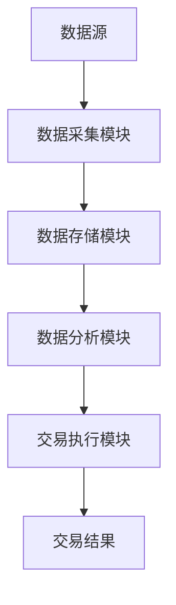

                 

# 特价股票投资中的信息优势如何获取

## 关键词：特价股票，信息优势，投资策略，数据分析，交易系统

## 摘要：本文探讨了如何在特价股票投资中利用信息优势获取超额收益。通过分析信息优势的来源、获取方法、分析框架、交易策略及系统实现，结合实战案例，为投资者提供深度指导。

---

# 第一部分: 特价股票投资中的信息优势概述

## 第1章: 特价股票与信息优势的基本概念

### 1.1 特价股票的定义与特点
#### 1.1.1 特价股票的定义
特价股票是指价格低于其内在价值的股票，通常因市场波动或公司短期问题导致低估。其特点包括低估值、高潜力和高波动性。

#### 1.1.2 特价股票的特点
- 低估值：市盈率、市净率低于行业平均水平。
- 高潜力：存在催化剂事件，如并购、重组或业绩改善。
- 高波动性：价格受市场情绪影响较大，波动性较高。

#### 1.1.3 特价股票与普通股票的区别
- 投资逻辑：价值投资 vs. 技术分析。
- 风险收益：高风险高收益 vs. 稳定收益。

### 1.2 信息优势的定义与重要性
#### 1.2.1 信息优势的定义
信息优势是指投资者比市场其他参与者更早或更准确地获取信息，从而获得投资优势。

#### 1.2.2 信息优势在股票投资中的重要性
信息优势帮助投资者提前预判市场走势，捕捉投资机会，提升收益。

#### 1.2.3 信息优势的来源与边界
信息来源包括内部信息、市场传闻、财务数据等，边界在于信息的真实性和可操作性。

## 第2章: 特价股票投资中的信息优势

### 2.1 信息优势的核心概念
#### 2.1.1 信息优势的构成要素
- 信息源：数据来源的多样性和可靠性。
- 信息处理：数据清洗、分析与建模。
- 信息利用：制定投资策略。

#### 2.1.2 信息优势与投资收益的关系
信息优势通过影响投资决策，直接关系到投资收益的高低。

#### 2.1.3 信息优势的量化指标
- 信息领先时间：信息获取的及时性。
- 信息准确性：数据的正确性。
- 信息影响力：信息对股价的影响程度。

### 2.2 信息优势的分类与应用场景
#### 2.2.1 内部信息与外部信息的分类
- 内部信息：非公开信息，如公司内部消息。
- 外部信息：公开信息，如新闻报道、财报数据。

#### 2.2.2 信息优势在不同市场环境下的应用
- 牛市：利用市场情绪，寻找低估股票。
- 熊市：关注企业基本面，寻找价值洼地。

#### 2.2.3 信息优势的局限性与风险
信息优势受制于信息的真实性和市场反应的不确定性。

---

# 第二部分: 信息优势的获取方法

## 第3章: 主动信息收集与分析

### 3.1 主动信息收集的策略
#### 3.1.1 通过新闻媒体获取信息
- 关注财经新闻，捕捉市场动态。

#### 3.1.2 通过公司财报分析
- 分析财务数据，评估企业价值。

#### 3.1.3 通过行业研究报告获取信息
- 了解行业趋势，发现投资机会。

### 3.2 数据挖掘与信息处理
#### 3.2.1 数据挖掘技术的应用
- 使用Python的pandas库进行数据清洗和处理。

#### 3.2.2 信息处理的流程与方法
1. 数据清洗：去除无效数据。
2. 数据分析：使用统计方法提取特征。
3. 数据可视化：通过图表展示数据。

#### 3.2.3 数据可视化与分析工具的使用
- 使用Matplotlib绘制股价趋势图。

### 3.3 实战案例：利用财报数据寻找低估股票
- 通过分析某公司财报，发现其市净率低于行业平均水平，判断为特价股票。

## 第4章: 被动信息利用与市场情绪分析

### 4.1 市场情绪对股价的影响
#### 4.1.1 市场情绪的定义与分类
- 市场情绪：投资者情绪影响股价走势。

#### 4.1.2 市场情绪与股价波动的关系
- 情绪高涨导致股价上涨，情绪低落导致股价下跌。

#### 4.1.3 市场情绪的测量方法
- 使用VIX指数衡量市场波动性。

### 4.2 资金流动与信息优势
#### 4.2.1 资金流动对股价的影响
- 资金流入推动股价上涨，资金流出导致股价下跌。

#### 4.2.2 资金流动的监测与分析
- 通过分析成交量变化，判断资金流动趋势。

#### 4.2.3 资金流动与信息优势的关系
- 资金流入预示着市场对某股票的看好。

---

# 第三部分: 信息优势的分析框架

## 第5章: 基本面分析与信息优势

### 5.1 基本面分析的核心要素
#### 5.1.1 公司财务状况分析
- 关注净利润、营业收入等财务指标。

#### 5.1.2 行业发展趋势分析
- 分析行业前景，判断公司成长潜力。

#### 5.1.3 宏观经济环境分析
- 考虑宏观经济政策对股市的影响。

### 5.2 基本面分析中的信息优势应用
#### 5.2.1 通过财务数据发现投资机会
- 分析财务报表，识别低估股票。

#### 5.2.2 行业趋势分析
- 通过行业研究报告，判断行业前景。

#### 5.2.3 宏观经济环境分析
- 结合宏观经济数据，制定投资策略。

## 第6章: 技术分析与信息优势

### 6.1 技术分析的核心方法
#### 6.1.1 K线图分析
- 通过K线图识别股价趋势。

#### 6.1.2 技术指标分析
- 使用MACD、RSI等指标判断买卖信号。

#### 6.1.3 股价形态分析
- 分析股价形态，如头肩形、双底形等。

### 6.2 技术分析中的信息优势应用
#### 6.2.1 利用技术指标预测股价走势
- 通过RSI指标判断超买超卖状态。

#### 6.2.2 利用K线图识别买卖信号
- 在K线图中寻找支撑位和阻力位。

#### 6.2.3 结合技术分析制定交易策略
- 结合技术分析和基本面分析，制定综合投资策略。

---

# 第四部分: 信息优势的交易策略

## 第7章: 信息优势驱动的交易策略

### 7.1 信息优势驱动的交易策略
#### 7.1.1 短线交易策略
- 利用市场情绪波动，进行短线交易。

#### 7.1.2 趋势投资策略
- 投资长期向好的股票，捕捉趋势性机会。

#### 7.1.3 事件驱动策略
- 利用公司并购、重组等事件带来的股价波动。

### 7.2 信息优势驱动的交易系统设计

#### 7.2.1 系统框架设计
- 数据采集模块、分析模块、交易执行模块。

#### 7.2.2 数据采集模块
- 采集实时市场数据，包括股价、成交量等。

#### 7.2.3 数据分析模块
- 分析数据，识别投资机会。

#### 7.2.4 交易执行模块
- 根据分析结果，执行买入或卖出指令。

## 第8章: 风险管理与信息优势

### 8.1 风险管理策略
#### 8.1.1 设置止损点
- 限制投资损失，保护投资资金。

#### 8.1.2 分散投资
- 将资金分散投资于不同股票，降低风险。

#### 8.1.3 风险对冲
- 使用衍生品对冲市场风险。

### 8.2 信息优势的稳定性与可持续性
#### 8.2.1 信息优势的稳定性
- 信息优势的持续性取决于信息质量和市场反应。

#### 8.2.2 可持续性分析
- 长期稳定的信息来源，确保信息优势的持续性。

---

# 第五部分: 信息优势的系统实现

## 第9章: 信息优势的系统架构设计

### 9.1 系统功能设计
#### 9.1.1 数据采集模块
- 采集市场数据，包括新闻、财报、交易数据。

#### 9.1.2 数据分析模块
- 分析数据，识别投资机会。

#### 9.1.3 交易执行模块
- 根据分析结果，执行交易指令。

### 9.2 系统架构设计
#### 9.2.1 系统架构图

#### 9.2.2 数据处理流程
1. 数据采集：获取市场数据。
2. 数据清洗：去除无效数据。
3. 数据分析：提取有用信息。
4. 交易执行：根据分析结果执行交易。

---

# 第六部分: 实战案例分析与策略优化

## 第10章: 实战案例分析

### 10.1 案例背景
- 某公司因市场传闻可能被并购，股价出现波动。

### 10.2 数据分析
- 通过分析成交量和股价走势，判断市场情绪。

### 10.3 交易策略
- 在传闻发布前买入，传闻发布后卖出，获取价差收益。

## 第11章: 策略优化与改进

### 11.1 策略优化方向
#### 11.1.1 提高信息获取的及时性
- 使用实时数据源，加快信息处理速度。

#### 11.1.2 改进分析模型
- 引入机器学习算法，提高预测准确性。

#### 11.1.3 完善风险控制
- 设置更严格的止损点，降低投资风险。

---

# 结语

通过系统的分析和实践，我们可以看到信息优势在特价股票投资中的重要性。通过有效的信息收集、分析和策略制定，投资者可以利用信息优势获取超额收益。然而，信息优势并非万能，投资者仍需结合市场实际情况，合理运用信息优势，制定科学的投资策略。

---

## 作者：AI天才研究院/AI Genius Institute & 禅与计算机程序设计艺术 /Zen And The Art of Computer Programming

**版权声明：本文版权归作者所有，转载请注明出处。**

