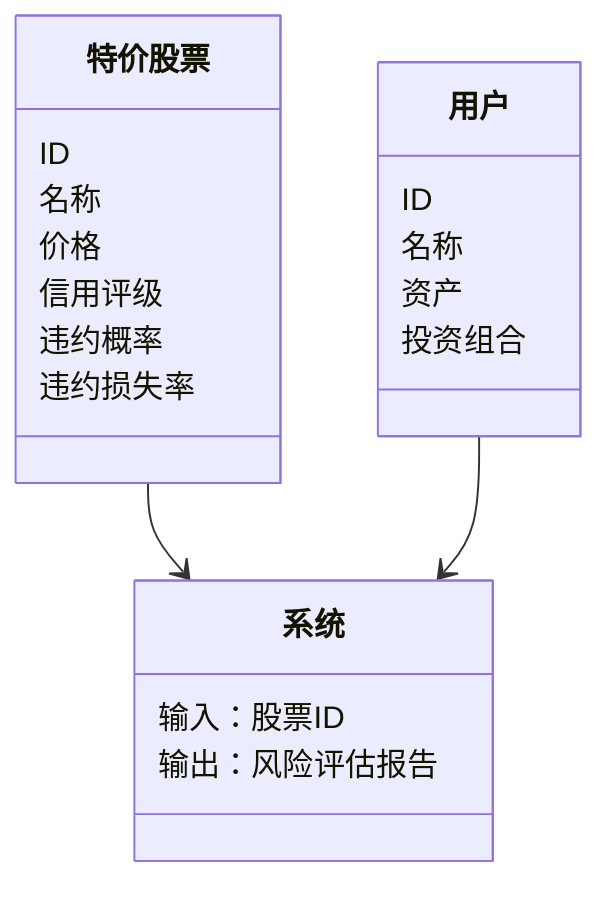
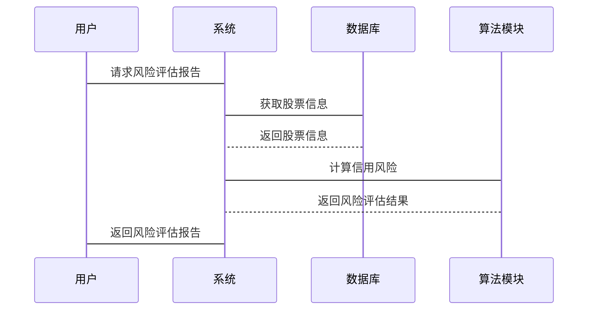

                 


# 特价股票投资中的信用风险评估方法

> 关键词：信用风险评估、特价股票、信用评级、风险指标、金融模型

> 摘要：本文详细探讨了在特价股票投资中进行信用风险评估的方法。首先，我们介绍了特价股票和信用风险的基本概念，然后分析了信用风险评估的核心理论与方法，接着重点讲解了信用风险评估的关键指标与模型，最后通过项目实战展示了如何在实际中应用这些方法。通过本文，读者将能够掌握如何在特价股票投资中有效评估和管理信用风险。

---

## 第一章：背景介绍

### 1.1 特价股票的定义与特点

#### 1.1.1 特价股票的定义
特价股票是指那些价格低于其面值的股票，通常表现为可转换债券或优先股等金融工具。这些股票通常具有较高的风险和潜在的高回报。

#### 1.1.2 特价股票的主要特点
- 价格波动较大
- 高风险高收益并存
- 投资者通常为机构投资者或高净值个人

#### 1.1.3 特价股票的投资价值分析
- 低价买入，高价卖出的机会
- 企业重组或并购的可能性
- 风险与收益的平衡

### 1.2 信用风险的基本概念

#### 1.2.1 信用风险的定义
信用风险是指债券发行人或交易对手无法履行其债务偿还义务，导致投资者损失的风险。

#### 1.2.2 信用风险的主要表现形式
- 债务违约
- 信用评级下降
- 交易对手风险

#### 1.2.3 信用风险与市场风险的区别
- 信用风险是由于债务人或交易对手的信用状况变化引起的
- 市场风险是由于市场整体波动引起的

### 1.3 特价股票投资中的信用风险

#### 1.3.1 特价股票投资中的信用风险来源
- 债务违约风险
- 企业基本面恶化
- 评级下调

#### 1.3.2 信用风险对投资决策的影响
- 影响资产定价
- 影响投资组合的风险敞口
- 影响投资者的收益预期

#### 1.3.3 特价股票信用风险的特殊性
- 特价股票通常涉及复杂的金融工具
- 风险与收益的不对称性
- 市场流动性风险

### 1.4 本章小结
本章通过介绍特价股票和信用风险的基本概念，分析了特价股票投资中的信用风险来源及其对投资决策的影响，为后续的信用风险评估奠定了基础。

---

## 第二章：信用风险评估的核心理论与方法

### 2.1 信用风险评估的理论基础

#### 2.1.1 资产负债表分析法
通过分析企业的财务状况，评估其偿债能力。常用指标包括：
- 资产负债率
- 流动比率
- 速动比率

#### 2.1.2 现金流分析法
通过分析企业的现金流状况，评估其偿还债务的能力。常用指标包括：
- 自由现金流
- 现金流量比率

#### 2.1.3 财务比率分析法
通过分析企业的财务比率，评估其财务健康状况。常用指标包括：
- 利息覆盖倍数
- 负债与所有者权益比率

### 2.2 信用风险评估的主要模型

#### 2.2.1 信用评分模型
通过对企业信用状况进行评分，评估其信用风险。常用模型包括：
- 5C信用分析模型
- CDS模型

#### 2.2.2 信用迁移模型
通过分析信用等级的变化，评估信用风险。常用模型包括：
- Merton模型
- KMV模型

#### 2.2.3 信用风险定价模型
通过定价模型，评估信用风险。常用模型包括：
- Hull-White模型
- Jarrow-Ross模型

### 2.3 信用风险评估的数学基础

#### 2.3.1 概率论与随机过程
信用风险评估中的概率计算和随机过程分析。

#### 2.3.2 统计推断与回归分析
通过统计方法分析信用风险的影响因素。

#### 2.3.3 风险度量的数学方法
- VaR（Value at Risk）
- CVaR（Conditional Value at Risk）

### 2.4 本章小结
本章通过分析信用风险评估的理论基础和主要模型，为后续的具体应用提供了理论支持。

---

## 第三章：特价股票信用风险评估的指标与模型

### 3.1 信用风险评估的关键指标

#### 3.1.1 违约概率（PD）
企业在一定期限内违约的概率。

#### 3.1.2 违约损失率（LGD）
违约发生时，投资者可能遭受的损失比例。

#### 3.1.3 风险敞口
投资者在投资组合中对特定风险的暴露程度。

### 3.2 信用风险指标的计算方法

#### 3.2.1 违约概率的估算
- 历史违约率法
- 评级迁移法
- 环境因素调整法

#### 3.2.2 违约损失率的估算
- 历史平均损失率法
- 行业平均损失率法
- 结构化方法

#### 3.2.3 风险敞口的计算公式
$$ 风险敞口 = 投资金额 × 违约概率 × 违约损失率 $$

### 3.3 指标之间的关系与应用

#### 3.3.1 指标之间的相互影响
- PD与LGD的相互影响
- 风险敞口与其他指标的关系

#### 3.3.2 指标在信用风险评估中的综合应用
- 综合使用PD和LGD评估信用风险
- 使用风险敞口进行投资组合管理

### 3.4 本章小结
本章通过分析信用风险评估的关键指标及其计算方法，为特价股票投资中的信用风险评估提供了具体的指标体系。

---

## 第四章：基于信用评级的特价股票风险评估方法

### 4.1 信用评级方法与应用

#### 4.1.1 信用评级的基本概念
- 信用评级是对企业的信用状况进行等级划分。
- 常见的信用评级机构有穆迪、标普等。

#### 4.1.2 信用评级在特价股票中的应用
- 评级结果与投资决策的关系
- 评级变化对股票价格的影响

### 4.2 信用评级对特价股票的影响

#### 4.2.1 评级变化对股票价格的影响
- 评级上调通常导致股价上涨
- 评级下调通常导致股价下跌

#### 4.2.2 评级变化对风险敞口的影响
- 评级变化影响违约概率和损失率
- 需要根据评级变化调整风险敞口

### 4.3 本章小结
本章通过分析信用评级在特价股票投资中的应用，强调了评级变化对投资决策的重要性。

---

## 第五章：信用风险评估的算法原理与实现

### 5.1 信用风险评估的主要算法

#### 5.1.1 蒙特卡洛模拟
- 通过模拟各种可能的市场情景，评估信用风险。
- 常用的蒙特卡洛方法包括：
  - 均值-方差模拟
  - 资产池模拟

#### 5.1.2 逻辑回归
- 通过统计模型分析信用风险的影响因素。
- 常用的变量包括：
  - 财务比率
  - 宏观经济指标

#### 5.1.3 机器学习模型
- 使用支持向量机（SVM）、随机森林（Random Forest）等机器学习算法进行信用风险分类。

### 5.2 算法原理的数学模型

#### 5.2.1 蒙特卡洛模拟的数学模型
$$ P(\text{违约}) = \frac{\text{违约次数}}{\text{模拟次数}} $$

#### 5.2.2 逻辑回归的数学模型
$$ P(\text{违约}) = \frac{1}{1 + e^{-\beta X}} $$

#### 5.2.3 机器学习模型的实现
- 使用Python的scikit-learn库进行模型训练和预测。

### 5.3 算法实现与应用

#### 5.3.1 蒙特卡洛模拟的实现
```python
import numpy as np

def monte_carlo_simulation(n_simulations):
    np.random.seed(42)
   违约概率 = 0.05
   违约次数 = 0
    for _ in range(n_simulations):
        if np.random.rand() < 违约概率:
            违约次数 += 1
    return 违约次数 / n_simulations

print(monte_carlo_simulation(1000))
```

#### 5.3.2 逻辑回归的实现
```python
from sklearn.linear_model import LogisticRegression

# 假设X是特征向量，y是违约标签
model = LogisticRegression()
model.fit(X, y)
predicted_prob = model.predict_proba(X)[:, 1]
```

### 5.4 本章小结
本章通过分析信用风险评估的主要算法，详细讲解了蒙特卡洛模拟和逻辑回归的实现方法，并通过Python代码展示了具体的实现过程。

---

## 第六章：系统分析与架构设计

### 6.1 问题场景介绍

#### 6.1.1 项目背景
- 投资者需要评估特价股票的信用风险
- 需要一个自动化系统进行信用风险评估

#### 6.1.2 项目目标
- 开发一个信用风险评估系统
- 提供风险评估报告和投资建议

### 6.2 系统功能设计

#### 6.2.1 领域模型设计


#### 6.2.2 系统架构设计


### 6.3 系统接口设计

#### 6.3.1 API接口
- 输入：股票ID
- 输出：风险评估报告

#### 6.3.2 接口实现
```python
from flask import Flask, jsonify

app = Flask(__name__)

@app.route('/risk_assessment/<stock_id>')
def risk_assessment(stock_id):
    # 调用风险评估算法
    result = evaluate_credit_risk(stock_id)
    return jsonify(result)

if __name__ == '__main__':
    app.run(debug=True)
```

### 6.4 系统交互流程

#### 6.4.1 交互流程图


### 6.5 本章小结
本章通过系统设计和架构分析，展示了如何将信用风险评估方法应用于实际系统中，并通过接口设计和交互流程图详细描述了系统的实现过程。

---

## 第七章：项目实战与案例分析

### 7.1 环境安装

#### 7.1.1 安装Python
- 使用Anaconda安装Python 3.8或更高版本。

#### 7.1.2 安装依赖库
- NumPy
- Pandas
- Scikit-learn
- Flask

### 7.2 核心代码实现

#### 7.2.1 风险评估算法实现
```python
from sklearn.linear_model import LogisticRegression
import pandas as pd

# 加载数据
data = pd.read_csv('stock_data.csv')

# 训练模型
model = LogisticRegression()
model.fit(data[['财务比率', '现金流', '信用评级']], data['违约标签'])

# 预测风险
new_stock = pd.DataFrame({'财务比率': [0.3], '现金流': [100], '信用评级': ['BB']})
predicted_prob = model.predict_proba(new_stock)[:, 1]
print(predicted_prob)
```

#### 7.2.2 系统接口实现
```python
from flask import Flask, jsonify

app = Flask(__name__)

@app.route('/evaluate', methods=['POST'])
def evaluate():
    data = request.json
    # 调用风险评估算法
    result = model.predict_proba([[data['财务比率'], data['现金流'], data['信用评级']]])
    return jsonify({'风险概率': result[0][1]})

if __name__ == '__main__':
    app.run(debug=True)
```

### 7.3 案例分析

#### 7.3.1 数据分析
- 历史数据分析
- 当前市场状况分析

#### 7.3.2 投资决策
- 根据风险评估结果调整投资组合
- 设置止损和止盈点

### 7.4 项目总结

#### 7.4.1 项目成果
- 开发了一个信用风险评估系统
- 提供了风险评估报告和投资建议

#### 7.4.2 项目经验
- 系统设计的重要性
- 数据质量和算法选择的影响

### 7.5 本章小结
本章通过项目实战和案例分析，展示了如何将信用风险评估方法应用于实际投资决策中，并总结了项目实施的经验和教训。

---

## 第八章：总结与展望

### 8.1 总结
通过本文的详细分析，我们掌握了特价股票投资中的信用风险评估方法，包括理论基础、指标体系、算法实现和系统设计。这些方法为我们提供了有效的工具和策略，帮助我们在投资中规避风险、优化决策。

### 8.2 展望
未来，随着金融科技的发展，信用风险评估方法将更加智能化和自动化。我们需要继续关注新技术和新方法，不断提升我们的评估能力和投资水平。

### 8.3 注意事项
- 数据质量和准确性对评估结果至关重要
- 需要定期更新模型和算法
- 风险评估结果仅供参考，投资需谨慎

### 8.4 参考资料
- 《信用风险评估方法》
- 《金融工程与风险管理》
- 相关学术论文和研究报告

### 8.5 致谢
感谢读者的耐心阅读，感谢合作伙伴的支持，感谢家人和朋友的理解。

---

## 作者信息

作者：AI天才研究院/AI Genius Institute & 禅与计算机程序设计艺术 /Zen And The Art of Computer Programming

---

以上是《特价股票投资中的信用风险评估方法》的完整目录和文章内容。希望这篇文章能够为读者提供有价值的见解和实用的指导，帮助他们在特价股票投资中更好地管理和评估信用风险。

