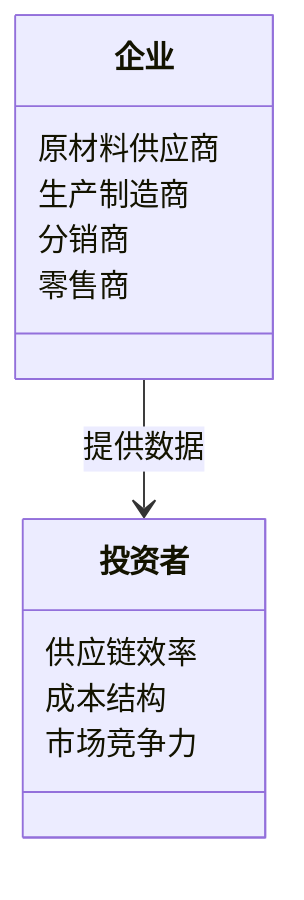
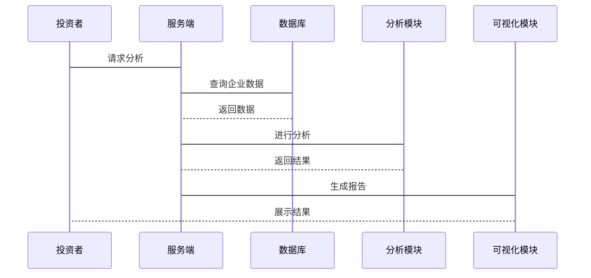

                 


# 特价股票投资中的全球价值链分析方法

## 关键词：全球价值链、特价股票、投资分析、成本结构、供应链效率

## 摘要：本文探讨了如何利用全球价值链分析方法来优化特价股票的投资决策。通过分析全球价值链的成本结构、效率优化和竞争优势，投资者可以更好地识别投资机会和风险，从而提高投资回报。本文结合数学模型和实际案例，详细介绍了分析方法和系统架构设计。

---

# 第1章: 特价股票投资与全球价值链概述

## 1.1 特价股票投资的背景与意义

### 1.1.1 问题背景
特价股票投资是指以低于市场价购买股票，期望在价格回升时获利的投资策略。然而，特价股票往往伴随着较高的风险，投资者需要深入分析企业的基本面和市场环境。全球价值链分析提供了一种从供应链和生产效率角度评估企业价值的方法。

### 1.1.2 问题描述
许多投资者在选择特价股票时仅关注价格因素，忽略了企业的全球价值链布局。这可能导致误判企业的真实价值和潜在风险。例如，一家公司可能因供应链问题导致成本上升，从而影响其盈利能力。

### 1.1.3 问题解决方法
通过全球价值链分析，投资者可以评估企业的供应链效率、成本结构和竞争优势，从而更全面地评估其投资价值。

### 1.1.4 边界与外延
全球价值链分析的边界包括企业的供应链管理、生产成本和市场竞争力。外延则涉及宏观经济环境和行业趋势。

### 1.1.5 核心要素组成
- 供应链效率
- 成本结构
- 市场竞争力

## 1.2 全球价值链分析的基本概念

### 1.2.1 全球价值链的定义
全球价值链是指从原材料采购、生产制造到产品销售的全球性分工体系。企业通过优化全球价值链的各个环节来降低成本和提高效率。

### 1.2.2 全球价值链的核心属性
- 全球化：跨越多个国家和地区的分工体系
- 协作性：不同企业之间的合作与协调
- 效率驱动：通过优化价值链实现成本最小化和利润最大化

### 1.2.3 全球价值链与特价股票投资的联系
投资者可以通过分析企业的全球价值链布局，评估其成本优势和市场竞争力，从而做出更明智的投资决策。

---

# 第2章: 特价股票投资中的全球价值链分析方法

## 2.1 全球价值链分析的核心概念

### 2.1.1 全球价值链的构成要素
- 原材料供应商
- 生产制造商
- 分销商
- 零售商
- 消费者

### 2.1.2 特价股票投资中的价值链分析框架
- 供应链效率：评估企业的采购和生产成本
- 市场竞争力：分析企业在行业中的地位
- 成本结构：优化企业的生产和运营成本

## 2.2 全球价值链分析的原理与模型

### 2.2.1 全球价值链的成本结构分析
企业通过优化供应链和生产流程，降低成本，提高利润率。例如，某制造企业通过全球采购原材料，降低采购成本，从而提升产品竞争力。

### 2.2.2 全球价值链的效率优化模型
效率优化模型通过分析各个环节的效率，找出瓶颈并提出改进措施。例如，某企业通过引入自动化生产技术，提高生产效率，降低成本。

---

# 第3章: 全球价值链分析的数学模型与算法

## 3.1 全球价值链的成本加成定价模型

### 3.1.1 模型定义
成本加成定价模型是一种通过成本加成来确定产品价格的方法。

### 3.1.2 模型公式
$$ 成本加成定价 = 变动成本 + 固定成本 + 利润 $$

### 3.1.3 示例
假设某企业生产一件商品的变动成本为$5，固定成本为$10，利润目标为$15。则成本加成定价为：
$$ 成本加成定价 = 5 + 10 + 15 = $30 $$

## 3.2 全球价值链的边际成本分析

### 3.2.1 边际成本计算公式
$$ 边际成本 = \frac{Δ总成本}{Δ产量} $$

### 3.2.2 示例
如果某企业增加产量1000件，总成本增加$2000，则边际成本为：
$$ 边际成本 = \frac{2000}{1000} = $2 $$

---

# 第4章: 系统分析与架构设计方案

## 4.1 问题场景介绍
投资者需要分析某家企业的全球价值链，以评估其投资价值。系统将提供从数据采集、分析到结果展示的全流程支持。

## 4.2 系统功能设计

### 4.2.1 领域模型类图


### 4.2.2 系统架构图


### 4.2.3 接口设计
- 数据采集接口：从企业获取供应链数据
- 分析接口：提供成本结构和效率分析结果
- 可视化接口：展示分析结果

### 4.2.4 系统交互序列图


---

# 第5章: 项目实战

## 5.1 环境安装
- 数据库：MySQL
- 分析工具：Python
- 可视化工具：Matplotlib

## 5.2 核心实现代码

### 5.2.1 数据采集
```python
import MySQLdb

db = MySQLdb.connect("localhost", "user", "password", " dbname")
cursor = db.cursor()
cursor.execute("SELECT * FROM 供应链数据")
data = cursor.fetchall()
```

### 5.2.2 成本分析
```python
def 计算边际成本(Δ总成本, Δ产量):
    return Δ总成本 / Δ产量

Δ总成本 = 2000
Δ产量 = 1000
边际成本 = 计算边际成本(Δ总成本, Δ产量)
print(边际成本)
```

### 5.2.3 可视化
```python
import matplotlib.pyplot as plt

plt.plot(range(10), [i for i in range(10)])
plt.show()
```

## 5.3 案例分析
以某制造企业为例，分析其供应链效率和成本结构。通过代码计算边际成本，并生成可视化报告，帮助投资者评估其投资价值。

---

# 第6章: 结论与展望

## 6.1 本章小结
本文通过全球价值链分析方法，为投资者提供了评估特价股票的新视角。通过数学模型和系统设计，帮助投资者更好地识别投资机会和风险。

## 6.2 未来展望
未来的研究可以进一步结合人工智能和大数据分析，优化全球价值链分析方法，提高投资决策的准确性。

---

# 作者：AI天才研究院/AI Genius Institute & 禅与计算机程序设计艺术 /Zen And The Art of Computer Programming

