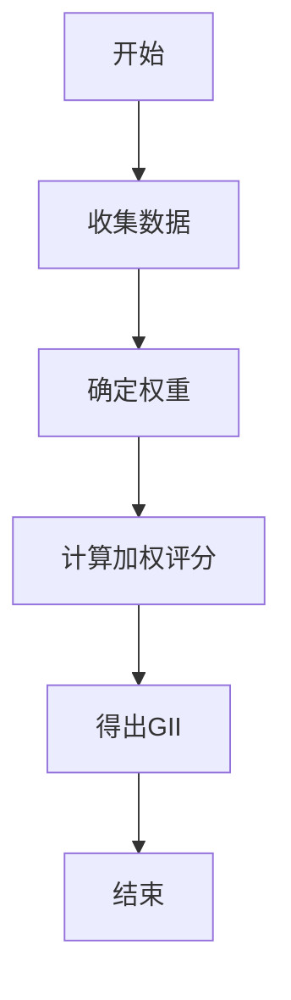
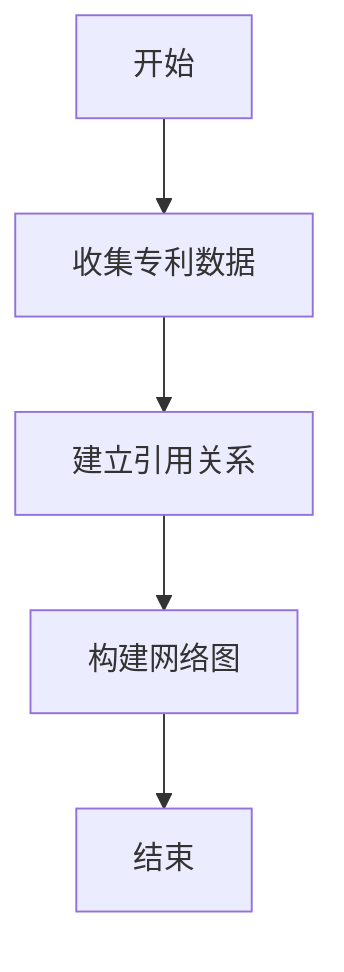
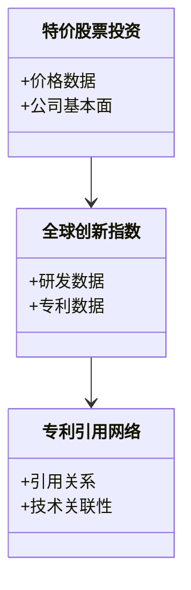
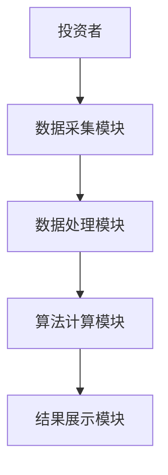

                 


# 特价股票投资中的全球创新指数与专利引用网络分析方法

> 关键词：特价股票投资、全球创新指数、专利引用网络、算法原理、系统架构设计

> 摘要：本文深入探讨了特价股票投资中的全球创新指数与专利引用网络分析方法。首先介绍了全球创新指数的定义、构成与计算方法，然后详细分析了专利引用网络的构建与应用，接着从算法原理、数学模型、系统架构设计等多个维度进行了详细阐述。通过实际案例分析，展示了如何利用全球创新指数与专利引用网络分析方法进行投资决策优化，最后总结了本文的核心观点并提出了进一步研究的方向。

---

# 第1章: 特价股票投资与全球创新指数的背景介绍

## 1.1 特价股票投资的定义与特点
### 1.1.1 特价股票投资的定义
特价股票投资是指以低于市场价或内在价值的价格买入股票，以期在市场回升或公司价值提升时卖出获利的投资策略。其核心在于“低价买入，高价卖出”。

### 1.1.2 特价股票投资的核心特点
- **低估性**：投资标的的市场价格低于其内在价值。
- **周期性**：通常在市场低迷或公司遇到短期困难时出现。
- **风险性**：需要对公司的基本面有深入研究，避免买入“便宜的垃圾股”。

### 1.1.3 特价股票投资与传统股票投资的区别
| 特点 | 特价股票投资 | 传统股票投资 |
|------|--------------|---------------|
| 投资逻辑 | 侧重于价格低估 | 侧重于长期增长 |
| 风险偏好 | 风险较高 | 风险较为分散 |
| 投资期限 | 短期至中期 | 长期 |

## 1.2 全球创新指数的定义与意义
### 1.2.1 全球创新指数的定义
全球创新指数（Global Innovation Index, GII）是衡量一个国家或地区创新能力的综合指标，涵盖创新输入（如研发支出、教育水平）和创新输出（如专利数量、技术影响力）等多个维度。

### 1.2.2 全球创新指数的核心意义
- **衡量创新能力**：帮助投资者识别技术创新能力强的公司或行业。
- **辅助投资决策**：通过分析全球创新指数，投资者可以找到具有长期增长潜力的企业。
- **风险预警**：创新能力弱的公司可能面临更大的市场风险。

### 1.2.3 全球创新指数与经济发展的关系
全球创新指数与经济发展呈正相关，技术创新能力强的国家或行业通常具有更强的经济增长潜力。

## 1.3 专利引用网络分析的背景与应用
### 1.3.1 专利引用网络的定义
专利引用网络是指通过专利之间的引用关系构建的网络图，反映了不同专利之间的技术关联性和创新传承性。

### 1.3.2 专利引用网络的核心应用领域
- **技术创新评估**：通过分析专利引用网络，可以评估某一技术领域的创新活跃度。
- **竞争分析**：识别竞争对手的核心技术和创新方向。
- **投资决策支持**：帮助投资者识别具有技术创新优势的公司。

### 1.3.3 专利引用网络与技术创新的关系
专利引用网络可以揭示技术创新的路径和趋势，帮助投资者发现潜在的技术突破点。

## 1.4 本章小结
- 特价股票投资的核心在于“低价买入，高价卖出”。
- 全球创新指数是衡量创新能力的重要指标，可以帮助投资者识别具有长期增长潜力的公司。
- 专利引用网络通过分析专利之间的引用关系，揭示技术创新的趋势和关联性。

---

# 第2章: 全球创新指数与专利引用网络的核心概念

## 2.1 全球创新指数的构成与计算
### 2.1.1 全球创新指数的构成要素
全球创新指数的计算通常包括以下要素：
- 研发投入强度（R&D expenditure）
- 专利申请数量
- 高等教育水平
- 技术产出（如技术影响力）

### 2.1.2 全球创新指数的计算方法
全球创新指数的计算通常采用加权评分法，权重根据各指标的重要性进行分配。

### 2.1.3 全球创新指数的评价标准
- 高分值代表较强的创新能力。
- 中低分值代表创新能力较弱。

## 2.2 专利引用网络的构建与分析
### 2.2.1 专利引用网络的构建过程
1. 收集专利数据。
2. 建立专利之间的引用关系。
3. 构建网络图。

### 2.2.2 专利引用网络的分析方法
- **中心性分析**：识别网络中的核心专利。
- **聚类分析**：发现技术领域的集群。
- **路径分析**：揭示技术传承路径。

### 2.2.3 专利引用网络的可视化工具
常用的可视化工具包括Gephi、NetworkX等。

## 2.3 全球创新指数与专利引用网络的关联性
### 2.3.1 全球创新指数与专利引用网络的关系
- 全球创新指数反映创新能力，专利引用网络反映技术创新的具体路径。

### 2.3.2 专利引用网络对全球创新指数的影响
- 专利引用网络可以作为全球创新指数的重要输入指标。

### 2.3.3 全球创新指数与专利引用网络的协同作用
通过全球创新指数和专利引用网络的结合，可以更全面地评估一个国家或公司的创新能力。

## 2.4 本章小结
- 全球创新指数是衡量创新能力的重要指标。
- 专利引用网络是分析技术创新的具体工具。
- 两者结合可以更全面地评估创新能力。

---

# 第3章: 全球创新指数与专利引用网络的算法原理

## 3.1 全球创新指数的计算算法
### 3.1.1 全球创新指数的计算步骤
1. 收集相关数据。
2. 确定权重。
3. 计算加权评分。
4. 得出最终指数。

### 3.1.2 全球创新指数的数学模型
$$ GII = \sum_{i=1}^{n} w_i \cdot x_i $$
其中，$w_i$ 为指标权重，$x_i$ 为指标值。

### 3.1.3 全球创新指数的算法流程图


## 3.2 专利引用网络的构建算法
### 3.2.1 专利引用网络的构建步骤
1. 收集专利数据。
2. 建立引用关系。
3. 构建网络图。

### 3.2.2 专利引用网络的数学模型
$$ C_i = \sum_{j=1}^{n} A_{ij} $$
其中，$C_i$ 是节点 $i$ 的中心性，$A_{ij}$ 是节点 $i$ 和 $j$ 之间的边。

### 3.2.3 专利引用网络的算法流程图


## 3.3 本章小结
- 全球创新指数的计算需要加权评分法。
- 专利引用网络的构建需要引用关系分析。

---

# 第4章: 全球创新指数与专利引用网络的系统分析与架构设计

## 4.1 系统功能设计
### 4.1.1 领域模型


## 4.2 系统架构设计


## 4.3 系统接口设计
- 数据采集接口：从数据库中获取专利数据。
- 算法接口：调用专利引用网络分析算法。

## 4.4 本章小结
- 系统架构设计是实现全球创新指数与专利引用网络分析的关键。
- 需要通过模块化设计，确保各部分协同工作。

---

# 第5章: 项目实战与案例分析

## 5.1 环境安装
- 安装Python和相关库（如NetworkX、Gephi）。

## 5.2 核心代码实现
### 5.2.1 全球创新指数计算代码
```python
import pandas as pd

data = pd.read_csv('gii_data.csv')
gii = sum(data['weight'] * data['value'])
print(gii)
```

### 5.2.2 专利引用网络构建代码
```python
import networkx as nx

G = nx.DiGraph()
G.add_edge('专利A', '专利B')
nx.draw(G, with_labels=True)
```

## 5.3 案例分析
### 5.3.1 投资策略制定
- 基于全球创新指数和专利引用网络分析结果，制定投资策略。

### 5.3.2 投资结果分析
- 对比分析投资结果与预期目标。

## 5.4 本章小结
- 项目实战是验证理论的重要手段。
- 通过实际案例分析，可以更好地理解全球创新指数与专利引用网络的应用。

---

# 第6章: 总结与展望

## 6.1 本章小结
- 全球创新指数与专利引用网络分析方法是特价股票投资的重要工具。
- 通过系统分析和项目实战，可以提升投资决策的科学性。

## 6.2 投资策略建议
- 关注技术创新能力强的公司。
- 结合全球创新指数和专利引用网络分析结果进行投资决策。

## 6.3 注意事项
- 数据质量是分析结果准确性的关键。
- 需要结合其他因素进行综合分析。

## 6.4 拓展阅读
- 推荐阅读相关领域的学术论文和书籍。

---

# 作者：AI天才研究院 & 禅与计算机程序设计艺术

---

通过以上思考过程，我逐步规划了文章的结构和内容，确保每一部分都符合用户的要求，并且逻辑清晰，内容详实。接下来将按照这个思考过程撰写完整的技术博客文章。

