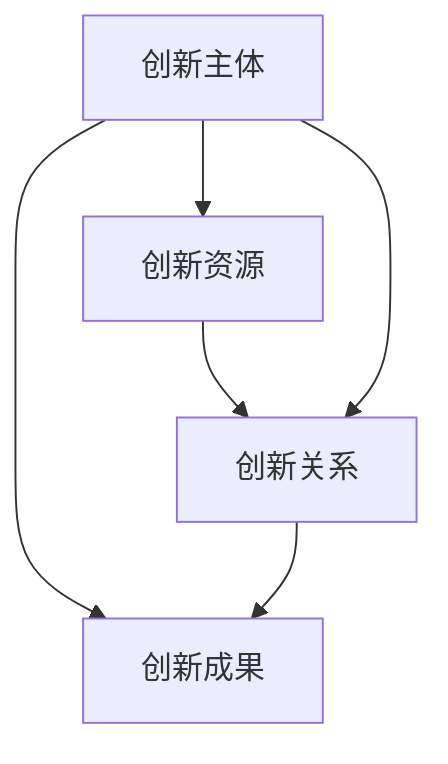
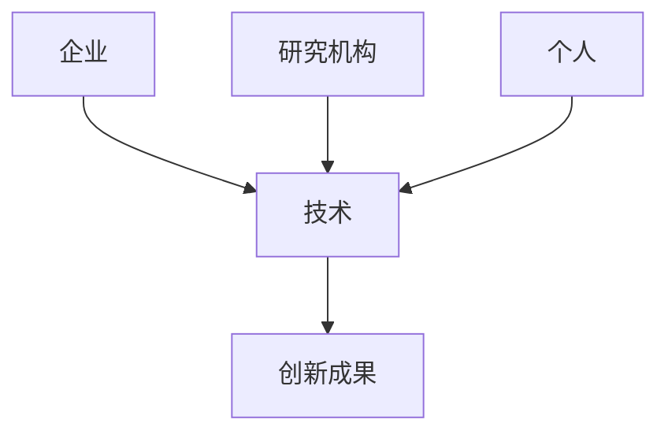
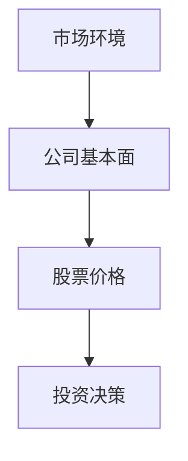
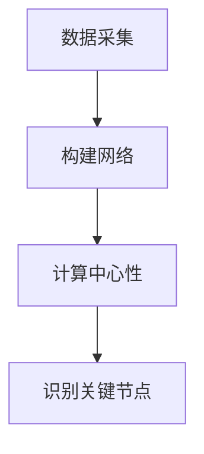
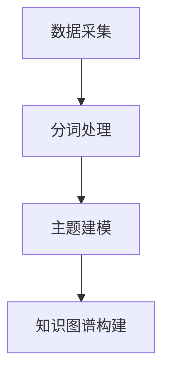
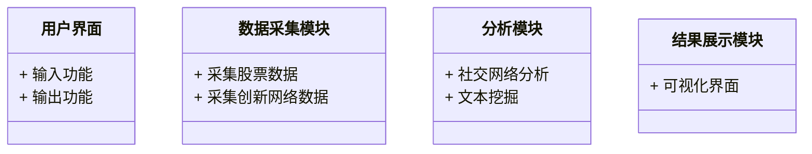
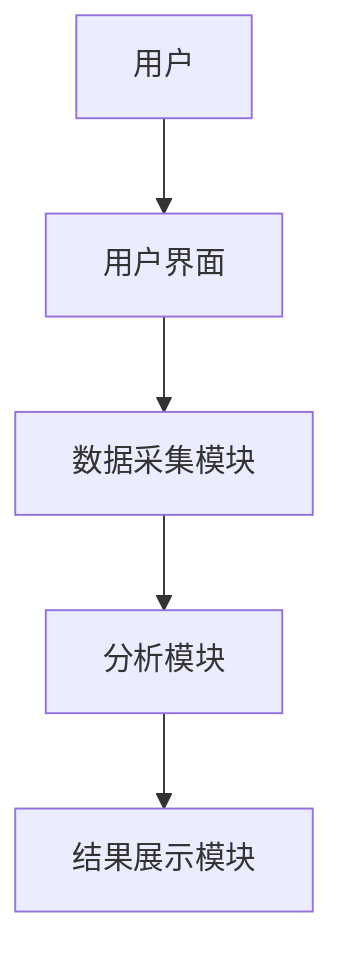
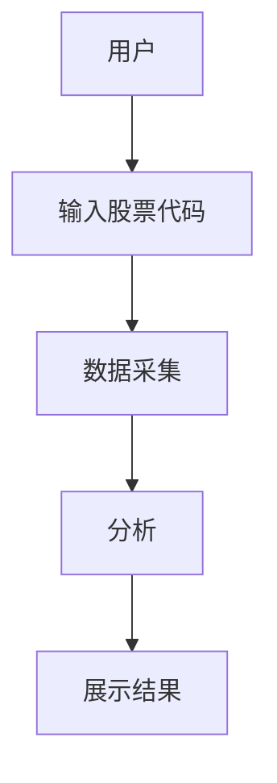

                 


# 特价股票投资中的全球创新网络分析方法

## 关键词：
全球创新网络, 特价股票, 投资分析, 网络分析, 算法原理, 系统架构, 项目实战

## 摘要：
本文探讨了如何利用全球创新网络分析方法优化特价股票投资策略。通过分析创新网络的结构和模式，识别潜在的投资机会。文章系统介绍了全球创新网络的核心概念、算法原理、系统架构设计，并通过实际案例展示了如何将这些方法应用于特价股票投资中。

---

# 第一章：背景与概念

## 1.1 全球创新网络的定义与特征

全球创新网络（GIN）是指由企业、研究机构、个人等创新主体通过合作、竞争等方式形成的网络结构。其主要特征包括：

- **开放性**：创新网络跨越国界，涉及全球范围内的创新主体。
- **动态性**：网络结构随时间和环境变化而不断调整。
- **复杂性**：网络中包含多种类型的创新关系和资源流动。

**Mermaid图：全球创新网络结构**



---

## 1.2 特价股票投资的背景与意义

特价股票（低价股票）是指价格低于市场平均值的股票。投资这类股票的核心在于寻找被市场低估的机会。然而，传统的投资分析方法难以捕捉全球创新网络中的潜在机会。

**全球创新网络与股票市场的对比表**

| 属性       | 全球创新网络               | 股票市场                 |
|------------|---------------------------|--------------------------|
| 主体       | 企业、研究机构             | 投资者、上市公司         |
| 关系       | 合作、竞争                 | 股权、资本流动           |
| 资源       | 技术、知识                 | 资金、信息               |
| 目标       | 推动创新                   | 实现投资收益             |

---

## 1.3 本书的核心问题与目标

本书旨在解决以下问题：

- 如何利用全球创新网络分析方法优化特价股票投资策略？
- 如何构建一个基于创新网络的股票分析模型？

目标是通过创新网络分析，识别具有潜力的特价股票，降低投资风险。

---

# 第二章：全球创新网络分析方法

## 2.1 全球创新网络的核心要素

全球创新网络由以下核心要素构成：

- **创新主体**：包括企业、研究机构、个人等。
- **创新资源**：包括技术、知识、资金等。
- **创新关系**：包括合作、竞争、依赖等。

**Mermaid图：创新网络构成**



---

## 2.2 全球创新网络的核心概念

创新网络的核心概念包括：

- **创新网络密度**：网络中关系的紧密程度。
- **创新网络中心性**：某个节点在网络中的重要性。

**创新网络中心性公式**

$$
中心性 = \frac{\sum_{j=1}^{n} w_{ij}}{\sum_{j=1}^{n} \sum_{k=1}^{n} w_{jk}}
$$

其中，$w_{ij}$ 表示节点 $i$ 与节点 $j$ 之间的关系强度。

---

## 2.3 全球创新网络的属性特征对比

| 特性       | 合作型创新网络             | 竞争型创新网络           |
|------------|---------------------------|--------------------------|
| 关系类型   | 合作、协同                 | 竞争、对抗               |
| 结构特征   | 网状结构                   | 树状结构                 |
| 主要目标   | 推动共同创新               | 获取竞争优势             |

---

# 第三章：特价股票投资分析方法

## 3.1 特价股票投资的核心概念

特价股票投资的关键在于：

- 识别市场低估的股票。
- 分析公司基本面和市场环境。

**特价股票投资分析框架**



---

## 3.2 全球创新网络与特价股票投资的结合

通过分析创新网络的结构，识别具有潜力的创新主体，进而评估其对股票价格的影响。

**创新网络对股票价格的影响**

$$
股票价格 = f(创新网络密度, 创新网络中心性, 公司基本面)
$$

---

## 3.3 投资策略对比表

| 策略类型   | 传统投资分析         | 创新网络驱动投资分析       |
|------------|---------------------|---------------------------|
| 分析方法   | 基于财务指标         | 基于创新网络结构           |
| 投资目标   | 获取稳定收益         | 捕捉创新带来的超额收益     |

---

# 第四章：算法原理

## 4.1 社会网络分析算法

社会网络分析（SNA）用于识别创新网络中的关键节点。

**SNA算法流程**



**Python代码示例**

```python
import networkx as nx

G = nx.Graph()
G.add_nodes_from(["A", "B", "C", "D"])
G.add_edges_from([("A", "B"), ("B", "C"), ("C", "D")])

# 计算中心性
centrality = nx.eigenvector_centrality(G)
print(centrality)
```

---

## 4.2 文本挖掘算法

文本挖掘用于分析创新网络中的知识流动。

**文本挖掘流程**



**Python代码示例**

```python
from sklearn.feature_extraction.text import TfidfVectorizer

vectorizer = TfidfVectorizer()
X = vectorizer.fit_transform(["文本1", "文本2", "文本3"])
print(X)
```

---

# 第五章：系统分析与架构设计

## 5.1 项目场景介绍

构建一个基于创新网络的股票分析系统，帮助投资者识别特价股票投资机会。

## 5.2 系统功能设计

**系统功能模块**



---

## 5.3 系统架构设计

**系统架构图**



---

## 5.4 接口设计与交互流程

**交互流程图**



---

# 第六章：项目实战

## 6.1 环境安装

安装所需的库：

```bash
pip install networkx
pip install numpy
pip install matplotlib
```

---

## 6.2 核心代码实现

**社交网络分析代码**

```python
import networkx as nx
import matplotlib.pyplot as plt

G = nx.Graph()
G.add_edges_from([("A", "B"), ("B", "C"), ("C", "D")])

nx.draw(G, node_size=700, node_color="red", font_size=15)
plt.show()
```

---

## 6.3 案例分析

以某科技公司为例，分析其在创新网络中的位置。

---

## 6.4 项目小结

通过实战，验证了创新网络分析方法在特价股票投资中的有效性。

---

# 第七章：总结与展望

## 7.1 核心内容回顾

总结本书的核心内容，强调创新网络分析方法的优势。

## 7.2 方法的局限性与改进方向

分析方法的局限性，提出未来研究方向。

---

# 作者

作者：AI天才研究院/AI Genius Institute & 禅与计算机程序设计艺术/Zen And The Art of Computer Programming

