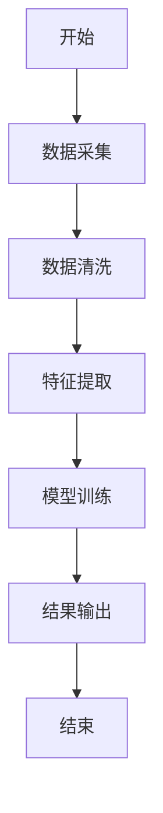
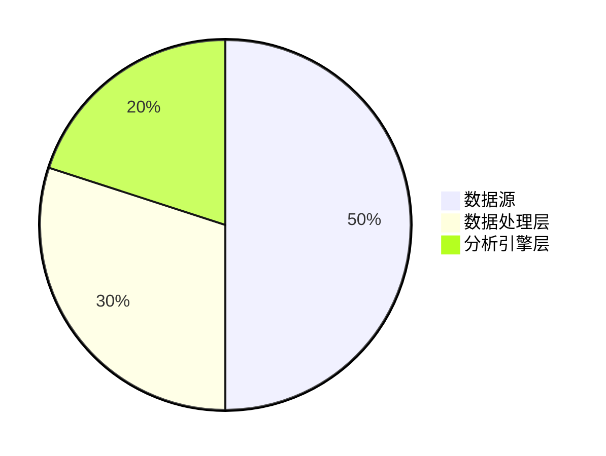

                 


# 特价股票投资中的全球化视角

> 关键词：特价股票，全球化视角，股票投资，算法，系统架构

> 摘要：本文从全球化视角出发，深入分析了特价股票投资的核心概念、算法原理、系统架构设计以及项目实战。通过系统性地探讨特价股票的投资策略、数学模型、算法实现和全球化视角下的市场分析，为投资者提供了全面的视角和实用的指导。

---

## 第1章: 特价股票投资的定义与重要性

### 1.1 特价股票的定义与特点
特价股票是指市场价格低于其内在价值的股票。其特点包括：
- 市场价格低于内在价值
- 股票价格被低估
- 投资价值较高

### 1.2 全球化视角下的股票投资
全球化视角下的股票投资需要考虑以下因素：
- 全球经济周期对股票市场的影响
- 跨国公司在全球市场中的表现
- 地缘政治对股票市场的影响

### 1.3 特价股票投资的重要性
- 特价股票投资的潜在收益较高
- 风险管理是投资成功的关键
- 长期策略有助于稳定收益

---

## 第2章: 特价股票投资的核心概念与联系

### 2.1 特价股票投资的核心概念
- 市场价值与内在价值的对比
- 股票价格波动的规律
- 特价股票的识别标准

### 2.2 特价股票与全球市场的联系
- 全球经济周期对股票市场的影响
- 跨国公司与特价股票的关系
- 地缘政治对股票市场的影响

### 2.3 特价股票投资的系统性分析
- 股票市场的基本模型
- 特价股票的定价公式
- 全球市场中特价股票的分布

---

## 第3章: 特价股票投资的算法原理

### 3.1 特价股票识别的算法模型
- 技术分析算法：通过股票价格的波动模式进行预测
- 基本面分析算法：通过财务指标进行评估
- 组合分析法：结合技术分析和基本面分析进行综合判断

### 3.2 特价股票投资的数学模型
- 市场价值与内在价值的公式：
$$ 市场价值 = \frac{未来现金流的现值}{折现率} $$
- 股票价格波动的方差公式：
$$ 方差 = \frac{\sum (x_i - \bar{x})^2}{n} $$

### 3.3 算法流程图


---

## 第4章: 特价股票投资的系统架构设计

### 4.1 系统功能设计
- 数据采集模块：从全球市场中获取股票数据
- 数据分析模块：对数据进行清洗和特征提取
- 投资决策模块：基于算法模型生成投资建议

### 4.2 系统架构图


### 4.3 系统接口设计
- 数据接口：与全球股票数据库对接
- 用户接口：供投资者查看投资建议
- 第三方接口：与全球市场数据源对接

---

## 第5章: 特价股票投资的项目实战

### 5.1 环境安装与配置
- 数据库安装：MySQL
- 开发工具安装：PyCharm
- 依赖库安装：Pandas、NumPy、Scikit-learn

### 5.2 核心代码实现
```python
import pandas as pd
import numpy as np
from sklearn.linear_model import LinearRegression

# 数据采集
data = pd.read_csv('stock_data.csv')

# 数据清洗
data = data.dropna()

# 特征提取
features = data[['PE', 'PB', 'ROE']]
target = data['Price']

# 模型训练
model = LinearRegression()
model.fit(features, target)

# 结果输出
predictions = model.predict(features)
print('预测结果:', predictions)
```

---

## 作者：AI天才研究院 & 禅与计算机程序设计艺术

