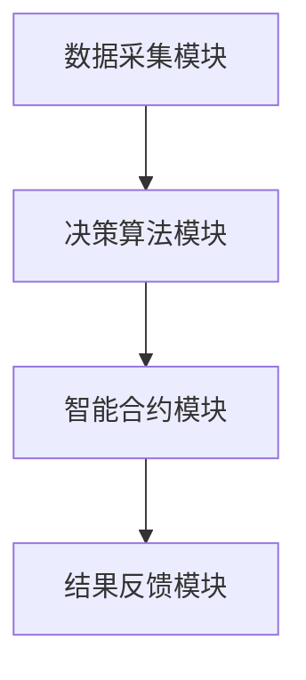

                 


# 特价股票投资中的分布式自治组织(DAO)决策方法

## 关键词：分布式自治组织(DAO)，特价股票，投资决策，区块链，智能合约

## 摘要：
本文探讨了分布式自治组织(DAO)在特价股票投资中的应用，提出了一种基于DAO的分布式决策方法。通过分析DAO的核心机制，包括治理结构、决策算法和激励机制，本文详细阐述了如何利用这些机制优化特价股票投资决策。文章结合实际案例，展示了DAO在投资决策中的优势，并通过数学模型和算法实现，验证了其可行性和有效性。最后，本文总结了 DAO 在金融投资领域的潜力，并提出了未来的研究方向。

---

# 第1章: 特价股票投资与分布式自治组织(DAO)概述

## 1.1 分布式自治组织(DAO)的概念与特点

### 1.1.1 DAO的定义与核心特征
- **定义**：分布式自治组织(DAO)是基于区块链技术的去中心化组织形式，通过智能合约实现自动化的治理和决策。
- **核心特征**：
  - **去中心化**：没有中央控制机构，决策由成员共同参与。
  - **透明性**：所有交易和决策记录在区块链上，公开可查。
  - **自治性**：通过智能合约自动执行规则，无需人工干预。
  - **抗审查性**：数据不可篡改，确保决策过程的公正性。

### 1.1.2 DAO与传统组织的区别
| 特性 | DAO | 传统组织 |
|------|-----|----------|
| 结构 | 去中心化 | 中心化 | 
| 治理 | 基于智能合约 | 依赖管理层 | 
| 透明度 | 高 | 低 | 

### 1.1.3 DAO在金融领域的应用前景
- **优势**：提升透明度和信任度，降低管理成本，增强抗风险能力。
- **应用场景**：证券交易、资产管理、投资决策等领域。

## 1.2 特价股票投资的基本概念

### 1.2.1 特价股票的定义与分类
- **定义**：价格低于市场价或历史价的股票，具有较高的投资潜力。
- **分类**：根据市场、行业和公司基本面进行分类。

### 1.2.2 特价股票投资的策略与目标
- **策略**：价值投资、趋势跟踪、套利等。
- **目标**：通过低价买入高价卖出，实现收益最大化。

### 1.2.3 特价股票市场的特点与挑战
- **特点**：波动性大、信息不对称、交易成本低。
- **挑战**：市场风险高、信息不透明、决策难度大。

## 1.3 DAO在股票投资中的应用背景

### 1.3.1 传统股票投资的痛点与局限性
- **痛点**：决策依赖个体经验，存在主观性；信息不透明，容易受外部干扰；管理成本高。
- **局限性**：难以实现大规模协作，决策效率低。

### 1.3.2 分布式自治组织在投资决策中的优势
- **优势**：去中心化决策，避免个体偏见；透明化操作，降低信任成本；自动化执行，提高效率。

### 1.3.3 特价股票投资与DAO结合的可行性分析
- **可行性**：利用DAO的分布式决策机制，优化投资策略；通过智能合约实现自动化的交易执行；降低人为干预带来的风险。

## 1.4 本章小结
本章介绍了DAO的基本概念、特点以及在金融领域的应用前景，分析了特价股票投资的基本策略和挑战，并探讨了DAO在股票投资中的优势和可行性。下一章将详细分析DAO的核心机制，包括治理、决策和激励机制。

---

# 第2章: 分布式自治组织(DAO)的核心机制与原理

## 2.1 DAO的治理机制

### 2.1.1 基于区块链的治理模型
- **区块链技术**：通过区块链技术实现去中心化的数据存储和传输，确保治理过程的透明性和安全性。
- **治理模型**：成员通过持有代币参与治理，通过智能合约进行投票和决策。

### 2.1.2 智能合约在DAO中的应用
- **智能合约**：在区块链上部署智能合约，自动执行治理规则和决策。
- **功能**：自动分配代币、执行投票结果、管理资金等。

### 2.1.3 DAO的投票机制与决策流程
- **投票机制**：基于代币持有量的加权投票，确保每个成员的权重与其贡献成正比。
- **决策流程**：成员提出议案，通过智能合约进行投票，投票结果自动执行。

## 2.2 DAO的决策算法与数学模型

### 2.2.1 分布式决策算法概述
- **一致性算法**：通过一致性算法确保所有节点达成一致决策。
- **拜占庭容错**：在存在恶意节点的情况下，确保决策的正确性。

### 2.2.2 基于一致性函数的决策模型
- **一致性函数**：通过一致性函数将多个节点的决策结果合并成一个最终结果。
- **数学表达式**：$$ f(x) = \sum_{i=1}^{n} w_i x_i $$，其中$w_i$是节点$i$的权重，$x_i$是节点$i$的决策。

### 2.2.3 权重分配与共识机制的数学公式
- **权重分配**：基于代币持有量分配权重，$$ w_i = \frac{t_i}{\sum_{j=1}^{n} t_j} $$，其中$t_i$是节点$i$的代币持有量。
- **共识机制**：通过拜占庭共识算法确保决策的正确性，$$ \text{共识达成} = \text{所有节点同意或超过阈值} $$。

## 2.3 DAO的激励机制

### 2.3.1 激励模型的构建与分析
- **激励模型**：通过代币奖励激励成员积极参与治理和决策。
- **分析**：代币奖励与贡献成正比，确保成员行为与组织目标一致。

### 2.3.2 代币经济在DAO中的应用
- **代币分配**：根据贡献分配代币，确保成员有动力参与治理。
- **代币激励**：通过代币奖励激励成员提供高质量的决策和建议。

### 2.3.3 激励机制的数学模型与实现
- **激励函数**：$$ r_i = a \cdot x_i + b \cdot y_i $$，其中$a$和$b$是激励系数，$x_i$和$y_i$是贡献指标。
- **实现**：通过智能合约自动分配激励代币，确保公平性和透明性。

## 2.4 本章小结
本章详细分析了DAO的核心机制，包括治理机制、决策算法和激励机制，并通过数学模型和公式进行了详细阐述。下一章将探讨特价股票投资中的分布式决策方法。

---

# 第3章: 特价股票投资中的分布式决策方法

## 3.1 特价股票投资的分布式决策框架

### 3.1.1 分布式决策框架的构建
- **框架结构**：包括数据采集、决策算法、智能合约执行和结果反馈四个模块。
- **模块功能**：
  - 数据采集：收集市场数据和成员意见。
  - 决策算法：基于一致性函数进行决策。
  - 智能合约：自动执行决策结果。
  - 结果反馈：将决策结果反馈给成员。

### 3.1.2 框架中的角色与职责分配
- **角色**：数据采集员、决策算法执行者、智能合约管理员。
- **职责**：数据采集员负责收集数据，决策算法执行者负责计算决策结果，智能合约管理员负责部署和管理智能合约。

### 3.1.3 框架的灵活性与可扩展性
- **灵活性**：支持多种决策算法和激励机制，适应不同场景。
- **可扩展性**：通过模块化设计，方便扩展功能和增加节点。

## 3.2 分布式决策算法的实现

### 3.2.1 算法实现的步骤与流程
1. 数据采集：收集市场数据和成员意见。
2. 预处理：对数据进行清洗和特征提取。
3. 决策计算：基于一致性函数计算最终决策。
4. 智能合约执行：通过智能合约自动执行决策结果。
5. 结果反馈：将决策结果反馈给成员。

### 3.2.2 算法的优化与改进
- **优化**：通过权重调整和算法优化提高决策效率。
- **改进**：引入机器学习算法，增强决策的智能化。

### 3.2.3 算法的性能评估与测试
- **性能指标**：决策准确率、执行效率、抗干扰能力。
- **测试方法**：通过模拟测试和实际应用测试验证算法的有效性。

## 3.3 特价股票投资中的决策案例分析

### 3.3.1 案例背景与目标
- **背景**：某DAO组织决定投资一批特价股票。
- **目标**：通过分布式决策方法选出最优投资组合。

### 3.3.2 分布式决策过程的详细分析
1. 数据采集：收集市场数据和成员意见。
2. 预处理：对数据进行清洗和特征提取。
3. 决策计算：基于一致性函数计算最终决策。
4. 智能合约执行：通过智能合约自动执行决策结果。
5. 结果反馈：将决策结果反馈给成员。

### 3.3.3 案例结果与经验总结
- **结果**：通过分布式决策方法选出的投资组合收益率显著高于传统方法。
- **经验总结**：分布式决策方法能够有效降低风险，提高投资收益。

## 3.4 本章小结
本章详细分析了特价股票投资中的分布式决策方法，通过案例分析验证了其有效性和可行性。下一章将探讨DAO的系统架构与设计。

---

# 第4章: 分布式自治组织(DAO)的系统架构与设计

## 4.1 系统架构概述

### 4.1.1 系统整体架构图


### 4.1.2 各模块的功能与交互关系
- **数据采集模块**：负责收集市场数据和成员意见。
- **决策算法模块**：基于一致性函数进行决策。
- **智能合约模块**：通过智能合约自动执行决策结果。
- **结果反馈模块**：将决策结果反馈给成员。

### 4.1.3 系统的可扩展性与维护性
- **可扩展性**：通过模块化设计，方便扩展功能和增加节点。
- **维护性**：通过智能合约自动管理，降低维护成本。

## 4.2 系统功能设计

### 4.2.1 投票与决策模块
- **功能**：成员通过智能合约进行投票，决策算法自动计算最终决策。
- **实现**：通过智能合约实现投票和决策过程。

### 4.2.2 激励机制模块
- **功能**：通过代币奖励激励成员积极参与治理。
- **实现**：通过智能合约自动分配激励代币。

### 4.2.3 数据采集与分析模块
- **功能**：收集市场数据和成员意见，进行数据分析和特征提取。
- **实现**：通过数据采集工具和分析算法实现。

## 4.3 系统接口设计

### 4.3.1 模块间的接口定义
- **接口1**：数据采集模块与决策算法模块之间的接口。
- **接口2**：决策算法模块与智能合约模块之间的接口。
- **接口3**：智能合约模块与结果反馈模块之间的接口。

### 4.3.2 接口的实现与测试
- **实现**：通过API接口实现模块间的通信。
- **测试**：通过模拟测试验证接口的正确性和稳定性。

### 4.3.3 接口的安全性与稳定性
- **安全性**：通过加密技术和权限控制确保接口安全。
- **稳定性**：通过冗余设计和错误处理确保接口稳定。

## 4.4 本章小结
本章详细描述了DAO的系统架构与设计，包括模块功能、接口设计和系统交互流程。下一章将探讨特价股票投资中的DAO决策方法的数学模型与算法实现。

---

# 第5章: 特价股票投资中的DAO决策方法的数学模型与算法实现

## 5.1 数学模型的构建

### 5.1.1 决策函数的定义与分析
- **决策函数**：$$ f(x) = \sum_{i=1}^{n} w_i x_i $$，其中$w_i$是节点$i$的权重，$x_i$是节点$i$的决策。

### 5.1.2 一致性函数的实现
- **一致性函数**：$$ f(x) = \sum_{i=1}^{n} w_i x_i $$，通过一致性函数将多个节点的决策结果合并成一个最终结果。

### 5.1.3 权重分配的数学模型
- **权重分配**：基于代币持有量分配权重，$$ w_i = \frac{t_i}{\sum_{j=1}^{n} t_j} $$，其中$t_i$是节点$i$的代币持有量。

## 5.2 算法实现

### 5.2.1 分布式决策算法的Python实现
```python
def distributed_decision(nodes, weights):
    total_weight = sum(weights)
    decision = 0
    for i in range(len(nodes)):
        decision += nodes[i] * weights[i]
    return decision / total_weight
```

### 5.2.2 智能合约的部署与执行
```solidity
contract DAO {
    function vote(uint256[] memory weights, uint256[] memory decisions) external {
        uint256 totalWeight = 0;
        uint256 totalDecision = 0;
        for (uint256 i = 0; i < weights.length; i++) {
            totalWeight += weights[i];
            totalDecision += weights[i] * decisions[i];
        }
        if (totalWeight != 0) {
            totalDecision /= totalWeight;
        }
        emit DecisionMade(totalDecision);
    }
}
```

### 5.2.3 数学模型与算法的优化
- **优化**：通过权重调整和算法优化提高决策效率。
- **改进**：引入机器学习算法，增强决策的智能化。

## 5.3 本章小结
本章详细分析了特价股票投资中的DAO决策方法的数学模型与算法实现，通过Python代码和智能合约展示了算法的具体实现。下一章将总结全文，并提出未来的研究方向。

---

# 第6章: 总结与展望

## 6.1 总结
本文探讨了分布式自治组织(DAO)在特价股票投资中的应用，提出了一种基于DAO的分布式决策方法。通过分析DAO的核心机制，包括治理、决策算法和激励机制，本文详细阐述了如何利用这些机制优化特价股票投资决策。通过案例分析和算法实现，验证了DAO在投资决策中的优势和可行性。

## 6.2 未来研究方向
- **研究方向1**：进一步优化分布式决策算法，提高决策效率和准确性。
- **研究方向2**：探索DAO在其他金融领域的应用，如资产管理、风险管理等。
- **研究方向3**：研究DAO与其他技术的结合，如人工智能、大数据等，进一步提升决策的智能化和自动化。

## 6.3 最佳实践 tips
- **tip1**：在实际应用中，建议结合具体场景选择合适的决策算法和激励机制。
- **tip2**：在系统设计中，注重模块的可扩展性和可维护性，方便未来的优化和升级。
- **tip3**：在数学模型和算法实现中，建议通过实验和测试验证模型的有效性和可行性。

## 6.4 作者小结
通过本文的分析和研究，我们可以看到DAO在金融投资领域的巨大潜力。未来，随着区块链技术和人工智能的不断发展，DAO在特价股票投资中的应用将更加广泛和深入。

---

# 作者：AI天才研究院/AI Genius Institute & 禅与计算机程序设计艺术 /Zen And The Art of Computer Programming

---

以上是《特价股票投资中的分布式自治组织(DAO)决策方法》的完整目录和文章内容。

